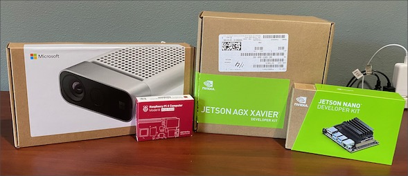
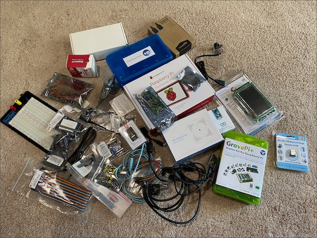

# IoT Cart

When deciding on what IoT projects to embark on for a course, usually the first question is what hardware should you buy. We've been working to come up with an IoT Cart - a suggested set of hardware that you can buy and use to pack out a cart that can be used by students to cover most IoT scenarios.

The labs included in the [labs](../labs) folder are based on the hardware that we suggest for such a cart.

This is very much a version 1 of a continuously evolving and growing cart specification.

We have supplied some IoT carts to a few academic institutions. If you have received a cart, the contents is listed in the [cart Manifest](./Manifest.md).

The cart hardware consists of:

## Devices

* [Arduino Nano 33 BLE Sense](https://store.arduino.cc/usa/nano-33-ble-sense-with-headers)
* [ESP-EYE](https://www.mouser.com/ProductDetail/Espressif-Systems/ESP-EYE)
* [STM32L475E-IOT01A](https://www.st.com/en/evaluation-tools/b-l475e-iot01a.html)
* [Raspberry Pi 4](https://www.raspberrypi.org/products/raspberry-pi-4-model-b/)
* [NVIDIA Jetson Nano](https://developer.nvidia.com/embedded/jetson-nano-developer-kit)
* [NVIDIA AGX Xavier](https://developer.nvidia.com/embedded/jetson-agx-xavier-developer-kit)

## Sensors and connectors

* [Grove Pi+ sensor kit for Raspberry Pi](https://www.seeedstudio.com/GrovePi-Starter-Kit-for-Raspberry-Pi-A-B-B-2-3-CE-certified.html)
* [NEO-6M GPS sensor](https://www.amazon.com/Navigation-Positioning-Microcontroller-Compatible-Sensitivity/dp/B084MK8BS2/)
* [eMeet M0 Conference Speaker (USB speaker and microphone)](https://www.emeet.ai/M0.html)
* [28BYJ-48 DC 5V Stepper Motor](https://www.amazon.com/KOOKYE-28BYJ-48-Stepper-ULN2003-Arduino/dp/B019TOJRC4/)
* [Arducam 8MP 1080P Auto Focus USB Camera Module](https://www.amazon.com/Arducam-Computer-Microphone-Windows-Android/dp/B07ZRGGDWG)
* [e-CAM20_CUTX2 – 2MP HDR Jetson TX2/TX1 Camera](https://www.e-consystems.com/2MP-HDR-Jetson-TX2-TX1-Camera-Board.asp)
