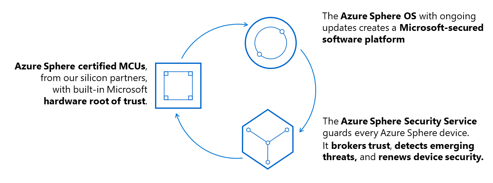

# Azure Sphere

[Azure Sphere](https://azure.microsoft.com/services/azure-sphere/?WT.mc_id=academic-7372-jabenn) is a comprehensive IoT security solution – including hardware, OS, and cloud components – to actively protect your devices, your business, and your customers.

Azure Sphere is made up of three interrelated components:

1. Azure Sphere-certified MCUs
2. Azure Sphere OS
3. Azure Sphere Security Service

These components are backed by Microsoft best-in-class security experts who monitor emerging threats, design updates and provide a decade of ongoing servicing.

## Azure Sphere resources

* [Azure Sphere learning path](https://github.com/gloveboxes/Azure-Sphere-Learning-Path) - This Azure Sphere developer learning path is designed to ease you into the world of Azure Sphere development.
