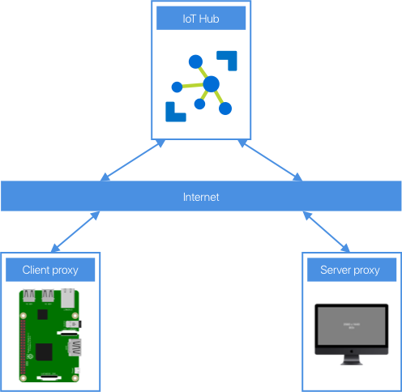

# Set up a Raspberry Pi powered Virtual Lab using SSH over Azure IoT Hub

The rise of virtual education has led to sweeping changes in how students are taught. A lot of computer science lessons can be run with only small changes thanks to the cloud - [Azure Lab Services](https://azure.microsoft.com/services/lab-services/pre-configured?WT.mc_id=academic-7372-jabenn) can provide virtual machines with developer tooling, or [GitHub Codespaces](https://github.com/features/codespaces) can replace the physical lab setups that Universities used to use. One area that has limitations is the Internet of Things. You can't move small microcontrollers or small board computers to the cloud, posting devices is expensive and leads to support issues that often can only be resolved by posting the device back, and asking students to purchase devices is problematic as this can be expensive for a group of students who may already be paying many thousands of dollars for tuition, and in some cases not feasible due to shipping or customs issues.

Although it is impossible to re-create an IoT lab fully in a virtual setting, it is possible to make devices like Raspberry Pi's available over the internet, either from a University campus, or even from the Lecturers home (given enough upload bandwidth), and these can then be connected to microcontrollers to program these if needed.

There are plenty of solutions to do this that involve opening SSH ports over the internet, but these are not the most secure as you have to have a public SSH port open. One novel way that increases security is using [Azure IoT Hub device streams](https://docs.microsoft.com/azure/iot-hub/iot-hub-device-streams-overview?WT.mc_id=academic-7372-jabenn).

> Device streams are currently in public preview, so the SDK and capabilities may change over time

## Use device streams to proxy an SSH connection

Device streams provide secure two-way TCP tunnels via standard HTTPS connections - allowing devices to bypass firewalls and other network considerations, and avoid having SSH ports open over the internet, but still have security via IoT Hub. You can then run server code on your local device to emulate SSH, and it can forward the connection to a device stream via IoT Hub, which streams to the client IoT device which is running client code to listen to the requests over the stream and redirect them to the local SSH port, and stream back the results, essentially using very thin proxies.



Although the Pi is connected to an IoT Hub to stream the SSH commands, it can still connect to another IoT Hub for IoT development, and run services like Azure IoT Edge.

From a users perspective, it's the same as SSHing into the Pi - they connect an SSH session to the local proxy using a different port, and that logs them into the Pi. Behind the scenes the IoT Hub device streams make it work, but to the user, it's as if they connected natively.

## Virtual Raspberry Pi IoT Lab

To configure a virtual lab you need to:

* Set up the Pi
* Set up IoT Hub
* Connect the Pi to the Hub using some device client software
* Configure the server software
* Provide the server software to the student

### Hardware needed

* One Raspberry Pi per student - due to the way these connections work only one user can connect at any one time, along with additional IoT hardware needed such as sensors, control devices etc.
* An SD card for the Pi or appropriate size
* Power for the Pi
* Appropriate network connectivity, such as ethernet or WiFi

### Software needed

* The latest Raspberry Pi OS
* Tools for building C code on the Pi
* Node for the server proxy

### Services needed

* An [Azure Subscription](../../azure-subscription.md)
* [Azure IoT Hub](https://azure.microsoft.com/services/iot-hub/?WT.mc_id=academic-7372-jabenn)

## Set up an Azure IoT Hub

You can create an Azure IoT Hub via the Cloud Shell, the Azure CLI, or the Azure Portal.

> If you've done this before then skip this section, and create an IoT Hub along with one device per Pi that you want to connect to. You will need the device connection string for each Pi, as well as a connection string for the IoT Hub itself for the service policy. Use the S1 tier as this is the lowest tier that supports device streams.

### Azure Cloud Shell

The Azure Portal is the UI for Azure, and is available at [portal.azure.com](https://portal.azure.com?WT.mc_id=academic-7372-jabenn). As well as providing a UI for creating and managing Azure services, it also has a terminal you can run to interact with Azure via the command line. This is called the Azure Cloud Shell.

#### Launch the cloud shell

1. Open the Azure Portal in your browser by heading to [portal.azure.com](https://portal.azure.com?WT.mc_id=academic-7372-jabenn)

1. Log in with your Azure account if necessary

1. Select the **Cloud Shell** button to launch the cloud shell

    

1. The Cloud Shell will appear at the bottom of the portal window. If it is the first time you've used the Cloud Shell, it will tell you that you need a storage account set up to store configuration and other cloud shell files. Select the **Create Storage** button.

    

    > If you have multiple Azure Subscriptions, such as an Azure for Students subscription and a School one, select the appropriate subscription from the dialog

1. All the commands in this lab will use the Bash shell, so ensure that Bash is selected for the Cloud Shell, not Powershell

#### Configure the cloud shell

The cloud shell has the [Azure CLI](https://docs.microsoft.com/cli/azure/?WT.mc_id=academic-7372-jabenn) pre-installed. This allows you to run commands using the `az` tool to create and manage Azure services.

The Azure Cloud Shell uses your default subscription. If you only have one, then that will be selected. If you have multiple Azure Subscriptions, such as an Azure for Students subscription and a School one, then you need to select the right one for this lab.

1. Follow the instructions in the [Use multiple Azure subscriptions documentation](https://docs.microsoft.com/cli/azure/manage-azure-subscriptions-azure-cli?WT.mc_id=academic-7372-jabenn) to select the subscription you want to use.

There are extensions available to give more capabilities with a wide range of Azure services, including IoT. The IoT extension needs to be installed.

1. From the cloud shell, run the following command to install the IoT extension:

    ```sh
    az extension add --name azure-iot
    ```

> If you have previously used the Cloud Shell with the previous version of this extension called `azure-cli-iot-ext`, then you will need to remove it first with the following command:
>
>    ```sh
>    az extension remove --name azure-cli-iot-ext
>    ```

### Get the closest Azure location

Azure consists of multiple regions made up of one or more data centers at different locations around the world. When you create a resource for most services, it needs to be created in a specific location.

You can find a list of locations in the [Azure geographies page](https://azure.microsoft.com/global-infrastructure/geographies/?WT.mc_id=academic-7372-jabenn). Each location has a name that is needed when creating most resources.

At the time of writing, device streams are only supported in the following regions:

| Display Name    | Name          |
| --------------- | ------------- |
| Central US      | centralus     |
| Central US EUAP | centraluseuap |
| North Europe    | northeurope   |
| Southeast Asia  | southeastasia |

Pick the closest region to you, and note down the *name* field above.

### Pick a name for your Iot Hub

Pick a name for your IoT Hub. This will need to be a globally unique name and use only characters supported for URLs as it will become part of the connection string. Something like `virtual-pi-lab-hub-<yourname>` would work, replacing `<yourname>` with your name, or another unique identifier.

### Define environment variables

To make the commands easier to run, you can define environment variables for the IoT Hub name and location. This way you can just re-use the commands below without constantly changing parts of them to match your location and hub name.

1. In the Cloud Shell, run the following commands:

    ```sh
    export LOCATION=<location>
    export HUBNAME=<hub name>
    ```

    Replace `<location>` with the selected location, and `<hub name>` with the name you are using for your hub.

### Azure Resource groups

In Azure, a *resource* is an instance of a service set up for you. For example, Azure Iot Hub is a service but your IoT Hub instance, with your devices and setup is your resource.

Whenever you create a resource in Azure, such as an IoT hub, it has to belong to a Resource Group. A resource group is a logical grouping of resources, allowing you to keep all the resources for a project in the same resource group, and manage them as a group. For example, at the end of this lab you will delete the resource group, and that will delete any resources inside of it.

#### Create a resource group

1. Run the following command in the Azure Cloud Shell to create a resource group called `virtual-iot-lab`:

    ```sh
    az group create --name virtual-iot-lab --location $LOCATION
    ```

### Create an Azure IoT Hub resource

1. Run the following command in the Azure Cloud Shell to create an IoT Hub:

    ```sh
    az iot hub create --resource-group virtual-iot-lab \
                      --sku S1 \
                      --partition-count 2 \
                      --name $HUBNAME
    ```

1. Run the following command to get a connection string for the IoT Hub using the service policy. This will be needed by the server proxy code that connects to IoT Hub

    ```sh
    az iot hub connection-string show --policy-name service \
                                      --hub-name $HUBNAME \
                                      --output table
    ```

### Create an IoT Device in the IoT Hub

Once the hub has been created, device identities need to be registered in the hub so that they can connect. Once a device identity is registered in the hub, you can get a connection string that the device client code can use to connect.

1. Pick an id for your device.

1. In the Cloud Shell, run the following command to define an environment variable for the device:

    ```sh
    export DEVICEID=<device id>
    ```

    Replace `<device id>` with the device Idm, for example use `pi1`.

1. Run the following command to create an IoT Hub device identity:

    ```sh
    az iot hub device-identity create --device-id $DEVICEID \
                                      --hub-name $HUBNAME
    ```

1. Run the following command to get the device connection string:

    ```sh
    az iot hub device-identity connection-string show --device-id $DEVICEID \
                                                      --output table \
                                                      --hub-name $HUBNAME
    ```

Repeat this step for all the devices you want to register.

## Set up the Pi

### Network the Pi

The Pi needs to be connected to the internet either via a wired or wireless connection. When the student connects to the Pi, it is as if they were connected over the local network, with access to all the local network resources. This means you need to consider the privacy and security of the network it is connected to. For example, if you connect the Pi to your home network, the students will be able to connect to any other computers or devices on that network.

Make sure when the Pi is connected it is isolated from other resources on your network, for example using a guest WiFi network or a separate router. For on-site connections on a campus network, refer to your network administrators as required.

SSH by itself doesn't use that much bandwidth, but if you are using VS Code over SSH that will use a lot more. Be sure to verify that your upload bandwidth is enough for the number of students connecting.

### Configure the Pi

The Pi needs to be running the latest Raspberry Pi OS. You will need to install some extra libraries.

1. Run the following commands on the Pi to update the OS to the latest version, upgrade all the installed programs and libraries, then install the required libraries to build and run the client proxy. It will also reboot the Pi once it is done.

    ```sh
    sudo apt update && sudo apt full-upgrade --yes
    sudo apt install --yes cmake libssl-devm libcurl4-openssl-dev uuid-dev
    sudo reboot
    ```

### Build the client proxy code

The code for the client, including the relevant build scripts is in the [`code/client`](./code/client) folder of this repo.

1. Either clone this repo, or copy the content of the `code/client` folder onto the Pi

1. Run the `build.sh` script on the Pi. This script will clone the Azure IoT C SDK, build it, then compile the client code. You can see the client code in the [ssh-proxy-client.c](./code/client/ssh-proxy-client.c) file.

### Run the client proxy code

1. The output is a binary called `ssh-proxy-client`. Launch this binary passing the device connection string as a parameter. You will need to enclose the device connection string in quotes as it contains semi-colons, and these are interpreted as the end of the command unless the string is in quotes.

    ```sh
    ./ssh-proxy-client "<device connection string>"
    ```

The proxy client will launch and listen for connections.

Once you have built the code, you can copy it to other Pi devices and run the same binary, just with a different device connection string.

To make it easier to support these devices, you can add this call to be run on restart, so every time the Pi boots the proxy starts. You can do this by adding an entry to the Pi users Crontab that runs on reboot.

1. As the Pi user, run `crontab -e` to edit the crontab, and select your preferred editor

1. Add the following to the end of the crontab:

    ```sh
    @reboot sleep 30 && /home/pi/ssh-proxy-client "<device connection string>" &
    ```

    The sleep command waites for 30 seconds to ensure the internet is connected before launching the proxy. Replace the path fo the proxy client if it's in a different folder, and set the `<device connection string>` ensuring it is on quotes.

Every time the device reboots, the proxy will run.

## Connect to the client

Once the client is connected and running, you can connect to it from a server proxy running on the students computer.

### Configure the proxy server

The proxy server code is a JavaScript app written using Node. You can find the code for this in the [`code/server`](./code/server) folder of this repo.

1. Make sure you have an up to date version of [Node.js](https://nodejs.org/download/) installed

1. Clone this repo, or copy the code somewhere, and open the code in a terminal or command prompt

1. Install the node package dependencies with the following command:

    ```sh
    npm install
    ```

1. Run the server proxy with the following command.

    ```sh
    node proxy.js "<service connection string>" <device id>
    ```

    Replace `<service connection string>` with the service policy connection string for the IoT Hub (**NOT** the device connection string). You will need to enclose the service policy connection string in quotes as it contains semi-colons, and these are interpreted as the end of the command unless the string is in quotes.

    Replace `<device id>` with the IoT Hub device id for the device you want to connect to.

The server will launch and listen on port 2222.

### Connect via SSH

Once the proxy is running, you can connect using SSH. Connect from the device running the proxy to `localhost` on port 2222 using the user name of the Pi.

```sh
ssh pi@localhost -p 2222
```

Log in using the password for the `pi` user on the Pi. If the Pi has a different user, then change `pi` to the relevant user name.

```output
➜  ~ ssh pi@localhost -p 2222
pi@localhost's password: 
Linux raspberrypi 5.4.79-v7l+ #1373 SMP Mon Nov 23 13:27:40 GMT 2020 armv7l

The programs included with the Debian GNU/Linux system are free software;
the exact distribution terms for each program are described in the
individual files in /usr/share/doc/*/copyright.

Debian GNU/Linux comes with ABSOLUTELY NO WARRANTY, to the extent
permitted by applicable law.
Last login: Wed Dec  9 23:04:26 2020 from 127.0.0.1
pi@raspberrypi:~ $ 
```

The session will be connected to the Pi via the IoT Hub.

### Connect via VS Code

VS Code supports [connecting to a remote device over SSH](https://github.com/microsoft/rpi-resources/tree/master/remote-coding), allowing you to remotely code and debug in a variety of languages on the Pi.

The default connection mechanism for VS Code expects to connect using port 22, but for this mechanism you need to connect on port 2222. This can be enable via a VS Code configuration.

1. From VS Code, make sure you have the Remote SSH extension installed

1. From the command palette, select *Remote SSH: Open configuration file...* to open the SSH configuration file. Select your user configuration file if you are given a choice.

1. Add the following entry to the configuration file:

    ```sh
    Host remote-pi
        Hostname localhost
        User pi
        Port 2222
    ```

    Replace `remote-pi` with a different name if wanted, and change the `User` from `pi` if the remote Pi has a different user name.

1. Save this file

1. Connect over SSH by selecting *Remote SSH: Connect to host* or *Remote SSH: Connect current window to host*. From the *Select configured SSH host or enter user@host* option, select the `remote-pi` host (or the new name if you used a different name). This will now connect to `localhost` over SSH on port `2222`, and this will be redirected to the Pi. When prompted for your password, enter the password for the Pi.

## Clean up

IoT Hub has a monthly cost, at the time of writing for an S1 tier is US$25 per month. You can check pricing on the [Azure IoT Hub pricing page](https://azure.microsoft.com/pricing/details/iot-hub/?WT.mc_id=academic-7372-jabenn). Once your lab is complete, you should delete the IoT Hub to save costs. You can do this by deleting the resource group that the IoT Hub was created in - deleting the hub and all the device identities.

1. From the Azure Cloud Shell, run the following command:

    ```sh
    az group delete --name virtual-iot-lab
    ```

1. When prompted for confirmation, press `y`

The resource group and IoT Hub will be deleted. You will need to create a new hub the next time you run the lab, updating all the device and service policy connection strings used by the client and server proxy.

## Support considerations

When running a lab, there are a number of support considerations. The main thing to do is have backups and be onsite during the lab!

* If the device has any issues, it may need a reboot - either by logging in directly or turning the power off and on.
* Set the proxy on the Pi to run on reboot to ensure it's ready after rebooting the device.
* Students have control of the Pi, so can break anything! Have a stack of imaged SD cards ready that will just need the device ID set in the crontab so they can be used to flash a Pi and fix everything.
* Students have the same access as if they SSHed to the device, including the ability to browse the network. If you are running this from home, do it on a separate network to avoid mischievous students hacking your computers and adjusting their grades or other shenanigans.
* The IoT Hub has a limit of 300MB a day for streams. If you exceed this then the connections will no longer work. You can get around this by having multiple hubs, with groups of Pis connected to the different hubs.

## Program Micro-controllers using the Pis

Microcontrollers can't be exposed over the internet this way, but they can be connected to Pis that are exposed, and programmed that way.

VS Code has an extension called [PlatformIO](https://platformio.org) that allows the programming of microcontrollers. It is fully self contained, so you can install it and it will manage all the tooling it needs, so no need to install extra tools on the Pi such as the Arduino IDE. This can be installed in the VS Code remote session by the student and used to program a wide range of microcontrollers.

Be aware that the PlatformIO home pane and command palette in VS Code doesn't work using this method, so to create projects and build the code you will need to use the [PlatformIO Core CLI (`pio`)](https://docs.platformio.org/en/latest/core/index.html) from the VS Code terminal.

## Future virtual lab design and build considerations

Some ideas for expanding this virtual lab setup:

* Set up remote streaming cameras so students can see the output of devices, such as LEDs connected to the Pi or microcontroller
* Have a web site that uses the Node.js server proxy code so students can log into one place and run SSH commands, or download a pre-configured server proxy application
* Have the Pis use the [Azure device provisioning service](https://docs.microsoft.com/azure/iot-dps/about-iot-dps?WT.mc_id=academic-7372-jabenn) to register themselves on startup to save having to allocate device ids, maybe via an [Azure Functions](https://azure.microsoft.com/services/functions/?WT.mc_id=academic-7372-jabenn) app. This way the IoT Hub can be turned off when not being used, and when a new one is spun up the Azure Functions app can be re-configured to point to the new hub meaning the Pi devices never need any extra configuration.
