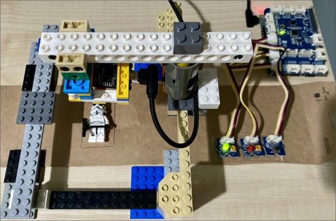

# Manufacturing part checker

This folder contains a lab with multiple parts working towards a prototype of a AI powered assembly line validation tool, similar to the kinds of tools that would be used in a manufacturing environment to check quality of the items produced by an assembly line.

The final project will use a camera built into an ESP-EYE microcontroller to capture images of parts on the assembly line, then use an image classification model to detect if these parts pass or fail a quality check. It will be controlled by a Raspberry Pi, optionally with a button to capture and classify an image, with red and green LEDs to indicate if the item passes or fails. The image classification model will run in the cloud in the first instance, then later on the Raspberry Pi.

In a real factory, the setup would be essentially the same as what is shown here, except using industrialized components, with more resistance to damage, vibration, heat, dust and other environmental conditions.

| Author | [Jim Bennett](https://github.com/JimBobBennett) |
|:---|:---|
| Target platform   | <ul><li>Raspberry Pi</li><li>ESP-EYE</li></ul> |
| Hardware required | <ul><li>Raspberry Pi 3/4</li><li>Micro SD Card</li><li>An SD card to USB converter that matches the USB ports on your device if your device doesn't have an SD card slot</li><li>Raspberry Pi power supply (USB-C for a Pi 4, micro-USB for other Pi models)</li><li>ESP-EYE</li><li>Micro-USB cable to connect the ESP-EYE to your PC or Mac</li><li>Cardboard, Lego or other construction materials to build the assembly line</li></ul>*Optional hardware*<ul><li>[Grove Pi+ Starter Kit](https://www.seeedstudio.com/GrovePi-Starter-Kit-for-Raspberry-Pi-A-B-B-2-3-CE-certified.html)</li></ul>|
| Software required | <ul><li>[Visual Studio Code](http://code.visualstudio.com?WT.mc_id=academic-7372-jabenn)</li><li>[Raspberry Pi Imager](https://www.raspberrypi.org/downloads/)</li></ul>*There are optional installs for Windows and Linux that you may need to install later to connect to the Pi, depending on which version of the OS you are using.* |
| Azure Services | [Azure Custom Vision](https://CustomVision.ai) [Azure IoT Hub](https://azure.microsoft.com/services/iot-hub/?WT.mc_id=academic-7372-jabenn)  |
| Programming Language | <ul><li>C++</li><li>Python</li></ul> |
| Prerequisites | You will need to be reasonably proficient using C++ to code a microcontroller You should also know the basics of Python programming. If you want to learn Python, check out these free resources: <ul><li>[Python for beginners video series on Channel9](https://channel9.msdn.com/Series/Intro-to-Python-Development?WT.mc_id=academic-7372-jabenn)</li><li>[Take your first steps with Python learning path on Microsoft Learn](https://docs.microsoft.com/learn/paths/python-first-steps/?WT.mc_id=academic-7372-jabenn)</li></ul> You will also need an [Azure subscription](https://github.com/microsoft/iot-curriculum/tree/main/labs/iot/environment_monitor#azure-subscription) If you are new to Azure, check out these free resources:<ul><li>[Azure Fundamentals learning path on Microsoft Learn](https://docs.microsoft.com/learn/paths/azure-fundamentals/?WT.mc_id=academic-7372-jabenn)</li></ul> |
| Date | September 2020 |
| Learning Objectives | <ul><li>Program a microcontroller using PlatformIO and Visual Studio Code</li><li>Build and train an image classification model using CustomVision</li><li>Set up IoT Hub and register a device</li><li>Control one device from another using IoT Hub</li><li>Deploy an image classification model using IoT Edge</li></ul> |
| Time to complete | 6 hours |

## Lab parts

This lab has the following parts:

1. Program the ESP-EYE with a simple 'Hello World' program
1. Set up the ESP-EYE to share images via a web server
1. Build an image classifier using Azure Custom Vision
1. Call the image classifier from the ESP-EYE
1. Control the ESP-EYE via a Raspberry Pi and IoT Hub
1. Run the image classifier on the Raspberry Pi using IoT Edge
1. Upload pass/fail data to IoT Hub
1. Store and visualize pass/fail data using Stream Analytics and Cosmos DB

These parts will cover in detail what needs to be done at each step were appropriate, or link to official documentation to cover steps - that way the parts will stay more up to date.

## Azure Custom Vision

[Azure Custom Vision](https://CustomVision.ai) is an online tool for creating image classification and object detection models using a small number of images.

An image classification models is a machine learning model that is trained to classify images based on tags. For example, you can train it with 50 images of cats tagged as `cat`, and 50 images of dogs tagged as `dog`, and it will build a model to recognize cats and dogs. You can then send this model another image and it will give you the percentage probability that the image is a cat or a dog. The model can only classify images based off the tags.

An object detection model is a machine learning model that can detect one or more objects in an image. For example, you can train it with 50 images of cats and give it an image containing multiple cats, and it will tell you where in the image it thinks cats are with a probability.

This lab will use an image classification model.

> You can learn more about training image classification models by following the [Classify images with the Custom Vision service](https://docs.microsoft.com/learn/modules/classify-images-custom-vision/?WT.mc_id=academic-7372-jabenn) hands on learning module on Microsoft Learn.
>
> You can learn more about object detection by following the [Detect objects in images with the Custom Vision service](https://docs.microsoft.com/learn/modules/detect-objects-images-custom-vision/?WT.mc_id=academic-7372-jabenn) hands on learning module on Microsoft Learn.

## Azure subscription

These labs are designed for courses where Azure resources are provided to students by the institution. To try them out, you can use one of our free subscriptions. Head to the [Azure Subscriptions Guide](../../../azure-subscription.md) for from information on setting up a subscription.

## Labs

These labs all build on one another, so you need to work through them in order. Work through as many labs as you want to, but if you don't complete all the labs, make sure you always do the [last one](./steps/clean-up.md) as that cleans up your Azure resources.

1. [Program the ESP-EYE with a simple 'Hello World' program](./steps/hello-world-esp-eye.md)
1. [Set up the ESP-EYE to share images via a web server](./steps/image-capture.md)
1. [Build an image classifier using Azure Custom Vision](./steps/build-image-classifier.md)
1. [Call the image classifier from the ESP-EYE](./steps/classify-esp-eye.md)
1. [Control the ESP-EYE via a Raspberry Pi and IoT Hub](./steps/iot-hub-control.md)
1. [Optional - control the Pi with a button and LEDs](./steps/pi-button-led.md)
1. [Run the image classifier on the Raspberry Pi using IoT Edge](./steps/edge-classifier.md)
1. [Upload pass/fail data to IoT Hub](./steps/upload-iot-hub.md)
1. [Store and visualize pass/fail data using Stream Analytics and Cosmos DB](./steps/store-and-visualize.md)
1. [Clean up](./steps/clean-up.md)

## Clean up

Don't forget to clean up your Azure resources when you are finished, to avoid spending money, or using up your credit from your free subscription. All the instructions to clean up are in the [Clean up you Azure resources guide](./steps/clean-up.md).
