# Build an image classifier using Azure Custom Vision

In the [previous step](./image-capture.md) you set up the ESP-EYE to share images via a web server.

In this step you will build an image classifier using Azure Custom Vision.

## Azure Custom Vision

[Azure Custom Vision](https://azure.microsoft.com/services/cognitive-services/custom-vision-service/?WT.mc_id=academic-7372-jabenn) is part of the Azure Cognitive Services suite of pre-built AI services. It allows you to train image classification or object detection computer vision models with only a few images. Image classification involves training the model to classify images based off tags - for example giving the model 10 images of cats with a tag of `cat`, and 10 images of dogs with a tag of `dog`, then showing it a new image and have it classify that image with the percentage chance that the image is a `cat` or a `dog`. Object detection involves teaching the model to recognize objects and detect them in an image - for example training it on 20 images of cats by showing it where in the image the cats are, then giving it a new image and having it indicate bounding boxes for all the cats it finds in the image, with a percentage probability the bounding box surrounds a cat.

> Machine Learning models usually work in probabilities, rather than absolutes. An image classifier will not return one answer, but will return probabilities for all tags and it is up to the calling code to look at these results and determine what the image shows. For example, if it returns a 100% probability of `cat` then the image can be classified by the calling code as a cat, but if it returns 4% probability of `cat` and 8% probability of `dog`, then the image is not one it can classify with any confidence, and either doesn't contain a cat or a dog, or the model needs to be trained on more images.

This service can be used to train an image classifier for the assembly line, by training the model on images captured from the ESP-EYE with the item on the assembly line both complete and broken.

## Capture images

You will need images to train and test the model. These images can be captured from the ESP-EYE, ensuring the images used to train the model are as close as possible to the images used when running the model, increasing the accuracy.

1. Make sure the ESP-EYE is powered up and running the code from the previous step

1. Connect to the web server on the ESP-EYE from your web browser

1. Take photos using the web app, and download them. You want to take 12 photos of the item on the assembly line in a good state, and 12 in a broken state. Try repositioning the item slightly between photographs, or changing the lighting

    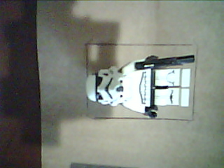 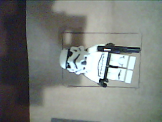
    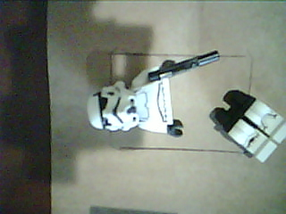 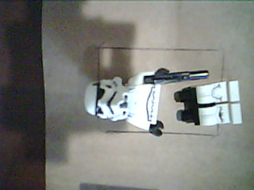

1. Put 10 of the good images in one folder labelled `training`, and the remaining 2 in a folder labelled `testing`. Do the same with the broken images. This way you have 20 images to train the model (10 good, 10 broken), and 4 to test the trained model (2 good, 2 broken).

## Create the custom vision project

The custom vision project can be created and trained either in code, or by using a web portal. For this lab, you will use the web portal.

> You will need an Azure subscription to use Custom Vision. If you don't have one, head to the [Azure Subscriptions Guide](../../../../../azure-subscription.md) for from information on setting up a subscription.

### Create the project

1. Head to [CustomVision.ai](https://www.customvision.ai/?WT.mc_id=academic-7372-jabenn) in your browser

1. Select the **Sign in** button and log in with your Microsoft account that has an Azure subscription

1. Select **New Project**

    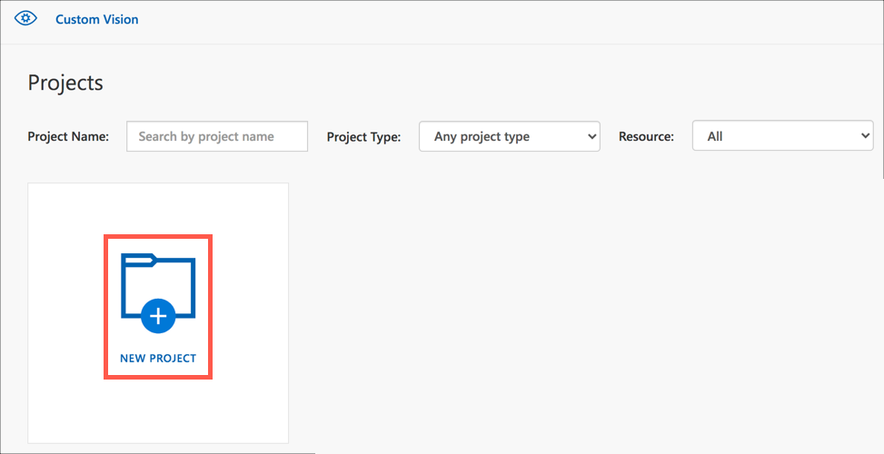

1. Fill in the *Create new project* dialog:

    1. Set the name to `Assembly Line QA`

    1. Leave the description blank or add one if you want

    1. For the *Resource*, Select **Create new**

    1. Fill in the **Create New Resource** dialog:

        1. Set the *Name* to `assembly-line-qa`

        1. Select your Azure subscription

        1. For the *Resource group* select *create new*. In the dialog that pops up, name your new resource group `assembly-line-qa` and select the location closest to you. Select **Create resource group**, then select the `assembly-line-qa` resource group from the drop down.

            

            > Resource groups are logical groupings of resources, allowing you to manage them in bulk. For example, when you are done with this lab you will be able to delete this resource group and have that automatically delete all the services in it that you have created.

        1. make sure the *Kind* is set to `Cognitive Services`

        1. Select the *Location* closest to you

        1. Set the *Pricing tier* to `S0`

            > The S0 pricing tier will have a cost, at the time of writing it is US$2 per 1,000 transactions. You can read more on pricing on the [Custom Vision Pricing page](https://azure.microsoft.com/pricing/details/cognitive-services/custom-vision-service/?WT.mc_id=academic-7372-jabenn). You can run this lab with the free tier, but you will need to set up separate resources for training and prediction.

        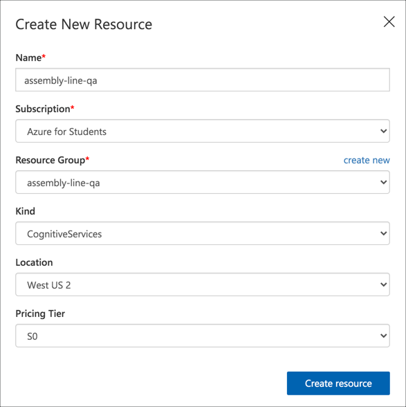

    1. Ensure the *Project Types* is set to `Classification`

    1. Ensure the *Classification Types* is set to `Multiclass (single tag per image`

    1. Ensure the *Domain* is set to `General`

        > These domain types will be discussed in a later step

    1. Select **Create project**

    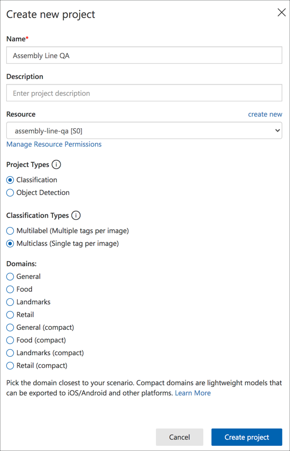

### Train the model

1. From the *Training Images* tab, select the **Add images** button

    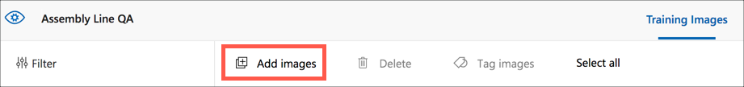

1. Select the 10 good training images and select **Open**

1. In the *Image upload* dialog, enter a tag of `pass` and select the **Upload 10 files** button

    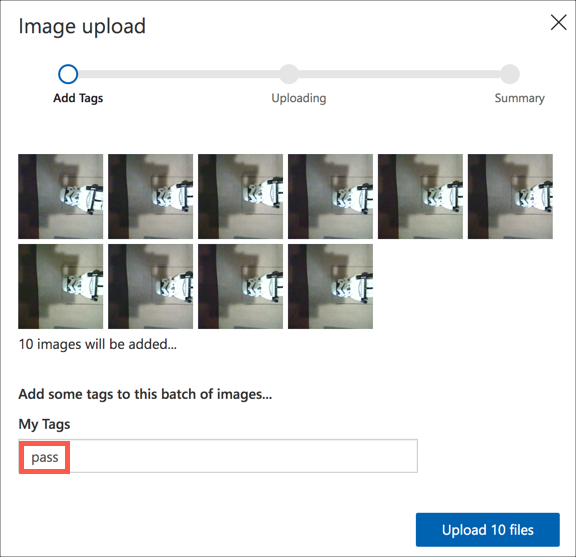

1. Once the images are uploaded, select the **Done** button

1. Repeat the process with the 10 broken training images, and use a tag of `fail`

1. Once the images are uploaded, select the **Train** button

    

1. From the *Choose training type* dialog, make sure `Quick Training` is selected, then select the **Train** button

    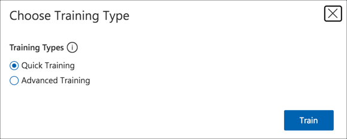

After about a few minutes, the model will be trained, and you will see data about the quality of the model.

## Test the model

Once the model has been trained, it can be tested with the remaining images.

1. Select the **Quick Test** button

    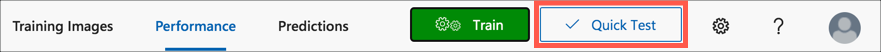

1. Select the **Browse local files** button, and select one of the 2 good testing images

1. The model will be run for the image, and the results will show a probability of the image matching the *pass* and *fail* tags. The image should have a very high probability for the *pass* tag, and a low probability for the *fail* tag.

    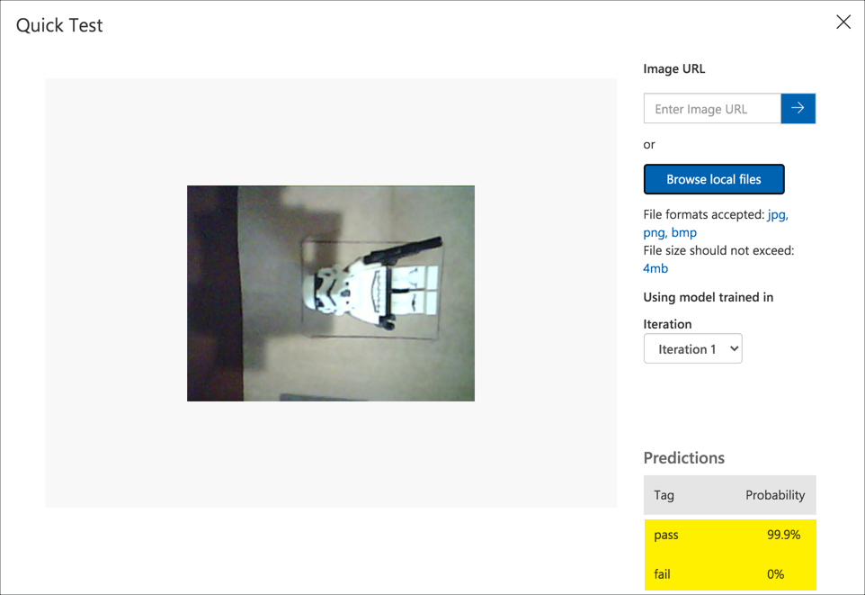

1. Repeat this with the other good training image, and the 2 broken training images to ensure the results are what you expect

    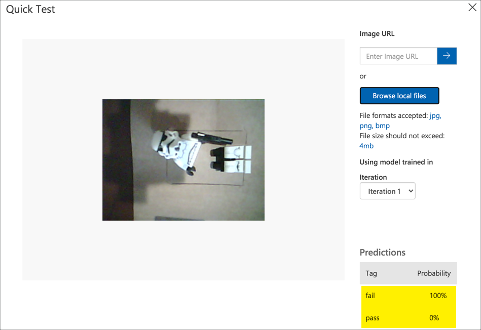

1. If you head to the *Predictions* tab, you will see the predictions made against the testing images. You can use this tab to tag those images and re-train the model if needed.

## Publish the model

Before the model can be used outside of the Custom Vision portal, it needs to be published. Every time you train the model it creates a new iteration of the model, and it is these iterations that need to be published. The idea being you can train a model and test it out, then only publish once you are happy with the model, or quickly roll back by publishing a previous iteration.

1. Select the **Performance** tab

1. Select the latest iteration. New iterations are created every time you train the model, so if you only trained once there will oly be on iteration called *Iteration 1*, but if you trained multiple times, such as to include the images used for testing then select the appropriate iteration.

1. Select the **Publish** button

    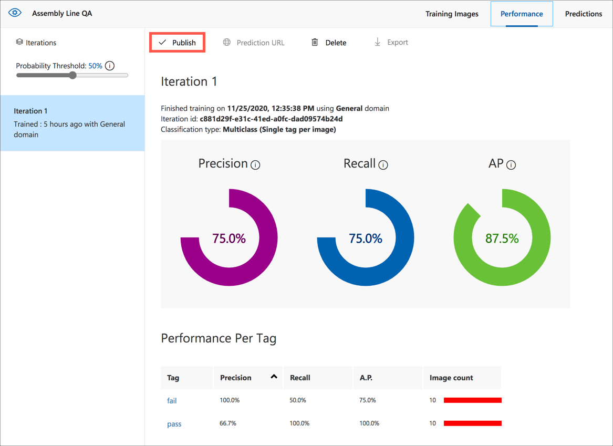

1. From the *Publish Model* dialog fill in the required details:

    1. Name the model `AssemblyLineQA`

    1. Select the `assembly-line-qa` resource you created earlier

    1. Select the **Publish** button

    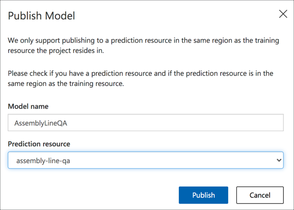

1. Once published, select the **Prediction URL** button

    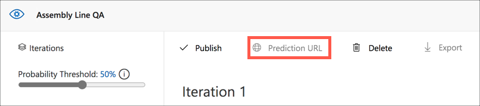

1. Copy the *Image file* prediction endpoint, and the *Prediction-key* header value.

    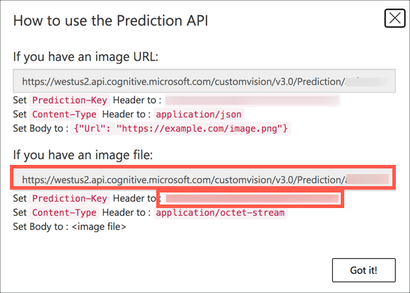

    You will need these values in the next step to call the model from the ESP-EYE.

## Next steps

In this step you built an image classifier using Azure Custom Vision.

In the [next step](./classify-esp-eye.md) you will call the image classifier from the ESP-EYE app to classify items on the assembly line.
