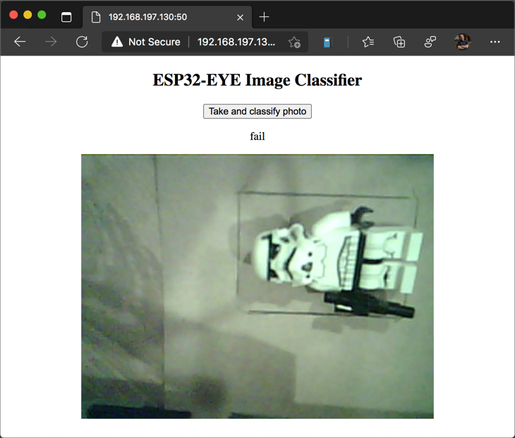

# Call the image classifier from the ESP-EYE

In the [previous step](./build-image-classifier.md) you built an image classifier using Azure Custom Vision.

In this step you will call the image classifier from the ESP-EYE app to classify items on the assembly line.

## Azure Custom Vision API

The Azure Custom Vision service can be called via a REST API, allowing images taken by the ESP-EYE to be classified using the model created in the previous step. This REST API URL is based off the published iteration of the model, and the call takes the image as raw binary data, along with the a key for the Custom Vision project. It returns some JSON with the probabilities of all the tags.

## Code the Image Classifier call

You can find the full code for this step in the [code/custom-vision](../code/custom-vision) folder.

### Add a JSON handling library

To make it easier to work with the JSON response from the image classifier REST API, there is a library that can be installed to handle JSON documents.

1. Launch VS Code and open the ESP-EYE project if it is not already open

1. Open the `platformio.ini` file from the root of the project

1. Update the `lib-deps` to include `ArduinoJson`:

    ```sh
    lib_deps =
      esp32-camera
      ESP Async WebServer
      ArduinoJson
    ```

    This adds the [ArduinoJSON](https://arduinojson.org) library to the project, and this will be downloaded and compiled in the next time the code is built.

### Add the configuration

The URL and prediction key for the Custom Vision call should be stored in the same configuration file as the WiFi details - these are secrets so should be kept out of source code control.

1. Open the `Config.h` header file from the `src` project

1. Add the following code below the `#define` directives for the ssid and password:

    ```cpp
    // The prediction URL and key come from Custom Vision.
    // Set these to the value from your published iteration
    const char * const predictionUrl = "<Your prediction URL>";
    const char * const predictionKey = "<Your prediction key>";
    ```

    Set `<Your prediction URL>` to be the prediction URL from the published iteration.
    Set `<Your prediction key>` to be the prediction key from the published iteration.

### Add an image classifier helper class

The code for interacting with the image classifier can be encapsulated in a helper class, simplifying the code needed to get the tag with the highest probability.

1. In the `src` folder, create two files - `ImageClassifier.h` and `ImageClassifier.cpp`

1. Add the following code to the `ImageClassifier.h` header file:

    ```cpp
    #ifndef _IMAGECLASSIFIER_H_
    #define _IMAGECLASSIFIER_H_

    #include <esp_camera.h>
    #include <string>

    using namespace std;

    /**
     * @brief A helper class for classifying images using the Azure Custom Vision service.
     * https://CustomVision.ai
     */
    class ImageClassifier
    {
    public:
        /**
         * @brief Classify the image using the Custom Vision project defined in config.h.
         *
         * @param frameBuffer The image to classify.
         * @return The most probably tag for the image
         */
        string ClassifyImage(camera_fb_t *frameBuffer);
    };

    #endif
    ```

    This code defines the `ImageClassifier` class with a single method, `ClassifyImage` that takes a frame buffer from the camera and returns the tag with the highest probability.

1. Add the following code to the `ImageClassifier.cpp` file:

    ```cpp
    #include "ImageClassifier.h"
    #include "Config.h"

    #include <Arduino.h>
    #include <ArduinoJson.h>
    #include <esp_http_client.h>

    // A string for tracking the response from the web request.
    // The ESP web request framework needs a static callback function,
    // so rather than returning data, the callback writes to this static string
    static string httpResponseString;

    // This is a callback function used by the ESP http code to handle HTTP events.
    static esp_err_t HttpEventHandler(esp_http_client_event_t *evt)
    {
        // For HTTP_EVENT_ON_DATA - the event fired when the HTTP request returns data,
        // save the data returned to the statid response string variable
        if (evt->event_id == HTTP_EVENT_ON_DATA)
        {
            httpResponseString.append((char *)evt->data, evt->data_len);
        }

        // Return OK
        return ESP_OK;
    }

    // Classify the image using the Custom Vision project specified in the config.h header file,
    // and return the most probable tag
    string ImageClassifier::ClassifyImage(camera_fb_t *frameBuffer)
    {
        // Reset the static response
        httpResponseString.clear();

        // Create the HTTP client config connecting to the prediction endpoint
        esp_http_client_config_t config = {};
        config.url = predictionUrl;
        config.is_async = false;
        config.event_handler = HttpEventHandler;
        config.timeout_ms = 30000;

        esp_http_client_handle_t client = esp_http_client_init(&config);

        // Set the headers including the Custom Vision prediction key
        esp_http_client_set_method(client, HTTP_METHOD_POST);
        esp_http_client_set_header(client, "Content-Type", "application/octet-stream");
        esp_http_client_set_header(client, "Prediction-Key", predictionKey);

        //Post the image to Azure Custom Vision
        esp_http_client_set_post_field(client, (char *)frameBuffer->buf, frameBuffer->len);

        // Make the web request, and wait for data
        // The web request is asynchronous, so there may be a delay before getting results,
        // so loop checking for the results
        esp_err_t err = ESP_OK;

        do
        {
            err = esp_http_client_perform(client);
            delay(1);
        } while (err == ESP_ERR_HTTP_EAGAIN);

        // Ensure the HTTP call didn't return an error
        if (err != ESP_OK)
        {
            Serial.printf("Error perform http request %s\r\n", esp_err_to_name(err));
            return "Error classifying image";
        }

        // Check for content in the result of the call
        int content_length = esp_http_client_get_content_length(client);
        if (content_length < 0)
        {
            Serial.println("Content-Length is not found");
            return "Error classifying image";
        }

        // The result is JSON, so decord it
        StaticJsonDocument<2048> resultsDocument;
        deserializeJson(resultsDocument, httpResponseString.c_str());

        // The JSON document has a child array called predictions, containing tags and probability
        // These are in tag order, so loop through them to get the tag with the highest probability
        string topTag = "";
        double topTagProbability = 0;

        for (int i = 0; i < resultsDocument["predictions"].size(); ++i)
        {
            double probability = resultsDocument["predictions"][i]["probability"];
            if (probability > topTagProbability)
            {
                topTagProbability = probability;
                topTag = string((const char *)resultsDocument["predictions"][i]["tagName"]);
            }
        }

        Serial.printf("Top prediction = %s\r\n", topTag.c_str());

        // Clean up the HTTP client
        esp_http_client_cleanup(client);

        // Return the most probable tag
        return topTag;
    }
    ```

    This code implements the `ClassifyImage` method. This method uses the ESP32 http libraries to make an HTTP POST request to the Custom Vision prediction URL, passing the image as JPEG data in a camera frame buffer as the body of the request. Instead of reading the response from the HTTP calls, this code uses a static callback method. This callback is called by the HTTP client when data is available and builds up a static string with the response.

    Once all the response data has been retrieved, the JSON is deserialized.

    The JSON is in the following format:

    ```json
    {
        "id":"<response_id>",
        "project":"<project_id>",
        "iteration":"<iteration_id>",
        "created":"2020-11-26T02:15:26.820Z",
        "predictions":
        [
            {
                "probability":0.99999905,
                "tagId":"<pass_tag_id>",
                "tagName":"pass"
            },
            {
                "probability":9.528379E-07,
                "tagId":"<fail_tag_id>",
                "tagName":"fail"
            }
        ]
    }
    ```

    The `<xxx_id>` fields will have GUIDs for your IDs. The `predictions` array will contain multiple entries, one per tag with the probability of the image matching that tag on a scale of 0-1, with 0 being 0% and 1 being 100%.

    The tag with the highest probability is found and returned.

### Call the image classifier from the web page

Once the image classifier is coded, it can be called from the web page to classify the image as soon as the photo is taken.

1. Open the `WebServer.h` header file from the `src` directory

1. Include the `ImageClassifier.h` header at the top of the file with the rest of the include directives

    ```cpp
    #include "ImageClassifier.h"
    ```

1. Add a new field to this class for the Image Classifier:

    ```cpp
    ImageClassifier _imageClassifier;
    ```

1. Open the `WebServer.cpp` file from the `src` directory

1. Inside the HTML at the start of the file, find where the `takePictureButton` is declared, and change the button text to `Take and classify photo`

    ```html
    <button id="takePictureButton">Take and classify photo</button>
    ````

1. In the `WebServer` constructor, add initialization for the `_imageClassifier`:

    ```cpp
    WebServer::WebServer(uint16_t port) : _webServer(port),
                                          _camera(),
                                          _imageHandler(),
                                          _imageClassifier()
    ```

1. In the `CapturePhotoClassifyAndSaveToSpiffs` method, change the line that sets the `result` to a call to the image classifier:

    ```cpp
    // Classify the photo
    string result = _imageClassifier.ClassifyImage(fb);
    ```

## Test the code

The code is ready to be uploaded to the ESP-EYE.

1. Ensure your ESP-EYE is connected to your computer via USB

1. Open the Command Pallette

1. Select `PlatformIO: Upload`

The code will be compiled and uploaded to the board. Once compiled, open the serial monitor, and you will see output similar to the following:

```output
Connecting to WiFi...
SPIFFS mounted successfully
Starting web server...
Web server started:
URL: http://192.168.197.130:50
```

c. Select the **Take Photo** button to take a photo, and you will see it appear on the web page.

Put the item in a good state on the assembly line and select the **Take and classify photo** button. A photo will be taken and the image will be classified, with the result showing on the web page. Repeat a few times with the item in a good and broken state.




You will also see output in the serial monitor showing the call, the JSON response and the result:

```output
GET request for /capture
Taking a photo...
Picture file name: /photo.jpg
HTTPS Status = 200, content_length = 382
Response:
  {
    "id":"xxxxxxxx-xxxx-xxxx-xxxx-xxxxxxxxxxxx",
    "project":"xxxxxxxx-xxxx-xxxx-xxxx-xxxxxxxxxxxx",
    "iteration":"xxxxxxxx-xxxx-xxxx-xxxx-xxxxxxxxxxxx",
    "created":"2020-12-01T01:40:59.419Z",
    "predictions":
      [
        {
          "probability":0.9999999,
          "tagId":"xxxxxxxx-xxxx-xxxx-xxxx-xxxxxxxxxxxx",
          "tagName":"fail"
        },
        {
          "probability":1.3282752E-07,
          "tagId":"xxxxxxxx-xxxx-xxxx-xxxx-xxxxxxxxxxxx",
          "tagName":"pass"
        }
      ]
  }
Top prediction = fail
```

The output shown above has been prettified to show the JSON clearer. In this case the `pass` tag had a probability of 1.3282752E-07 or 0.0000132% probability of being the right tag, and the `fail` tag has a probability of 0.9999999, or 99.99999% probability of being the right tag. The top result is returned as `fail`.

## Next Steps

In this step you called the image classifier from the ESP-EYE app to classify items on the assembly line.

In the [next step](./iot-hub-control.md) you will control the ESP-EYE via a Raspberry Pi and Azure IoT Hub.
