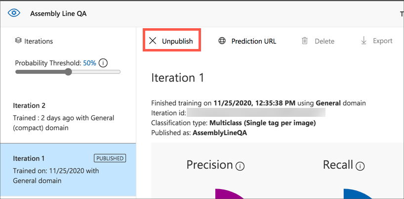
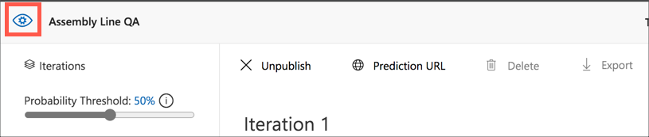
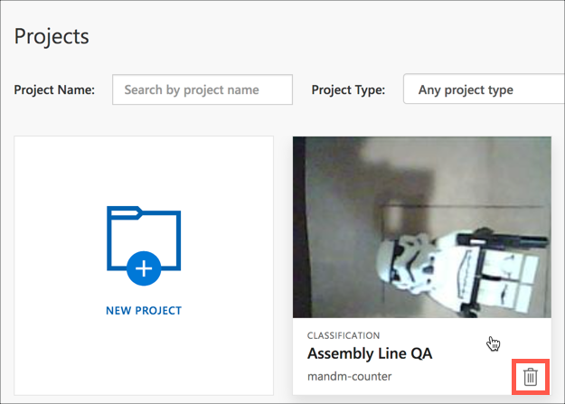

# Clean up

In the [previous step](./store-and-visualize.md) you stored and visualized pass/fail data using Stream Analytics and Cosmos DB.

In this step, you will clean up all the resources you used in this lab.

## Clean up resources

Every Azure service you use either costs you money (either paid for or reduces your available credit for free subscriptions), or uses up one of your available free tier resources. It's good practice when you are finished with a resource to delete it - to either save money or to allow you to spin up new free tier resources.

### Unpublish the Custom Vision project

Before the Custom Vision project can be deleted, it needs to be unpublished.

1. Open the Custom Vision project

1. Head to the *Performance* tab

1. Select the iteration marked as *Published*

1. Select the **Unpublish** button

    

1. Head back to the Custom Vision projects page using the Custom Vision home button

    

1. Delete the project with the **Delete** button. This button will only appear when your cursor is over the project.

    

1. Select the **Yes, delete** button from the confirmation dialog. The project will be deleted, but not the underlying Azure resources. These will need to be deleted from the Azure portal.

### Delete the Azure Resource Group

Azure has the concept of Resource Groups, logical groupings of resources that you can manage together. All resources, such as IoT Hubs, Cosmos DB accounts or Stream Analytics Jobs have to live in a resource group. Deleting the resource group deletes all the services inside it.

1. From the [Azure Portal](https://portal.azure.com/?WT.mc_id=academic-7372-jabenn), head to the *assembly-line-qa* resource group that you created earlier.

1. To delete the resource group, follow the instructions in the [Azure Resource Manager resource group and resource deletion documentation](https://docs.microsoft.com/azure/azure-resource-manager/management/delete-resource-group?tabs=azure-portal&WT.mc_id=academic-7372-jabenn)

## Next steps

You have completed this lab building a prototype of a AI powered assembly line validation tool, similar to the kinds of tools that would be used in a manufacturing environment to check quality of the items produced by an assembly line. You programmed an ESP-EYE to capture images from its camera, used these to train an AI model, called this from the ESP-EYE, controlled the system from a Raspberry Pi, deployed the AI model on the edge running on the Pi using IoT Edge, then streamed the results to a database and visualized them.

If you want to learn more about Azure IoT Services, then check out the following:

* [IoT learning paths on Microsoft Learn](https://docs.microsoft.com/learn/browse/?term=IOT&WT.mc_id=academic-7372-jabenn)
* [The IoT show on Channel9](https://channel9.msdn.com/Shows/Internet-of-Things-Show/?WT.mc_id=academic-7372-jabenn)

Once you have upskilled as an IoT developer, why not get certified with our AZ-220 Azure IoT Developer certification. Check out the details on our [certification page](https://docs.microsoft.com/learn/certifications/azure-iot-developer-specialty?WT.mc_id=academic-7372-jabenn)
