# Run the image classifier on the Raspberry Pi using IoT Edge

In the previous step, you controlled the Pi with either [the keyboard](./iot-hub-control), or [a button and LEDs using a Grove Pi+ kit](./pi-button-led.md).

In this step you will run the image classifier on the Raspberry Pi using IoT Edge.

## IoT Edge

IoT on the Edge involves running workloads that you would traditionally run in the cloud on an IoT device so that it is closer to your data. This has a number of upsides:

* It can be faster, and reduces bandwidth needs as you are not uploading data to the internet - for example if you want to run live video analytics on a video stream you don't need to upload that stream continually over the internet, you can analyze it locally.
* The data stays local - this could be important for privacy considerations, such as medical data
* It can be cheaper - by using your own hardware yo don't have to pay cloud fees

The traditional IoT Edge use case is AI on the edge. You train a model using the power of the cloud, then download the model to run on an Edge device. This is what you will be doing in this lab - taking the model trained by Custom Vision and running in on the Raspberry Pi.

The downside is that the data sent to the model stays on the device, not in the cloud. In a previous step you would have seen the predictions made by the Custom Vision model in the cloud portal, where you can retrain the model to improve it if necessary. If you run the model on the edge, this is no available - you would need your own way of storing the data and results to help validate and retrain the model if needed.

The Custom Vision model runs inside the container as a REST API that is identical to the API running in the cloud. You can use the same REST API calls, or the existing SDKs, but instead of pointing to an endpoint in the cloud, you point to an endpoint running on the IoT Edge device.

## Set up IoT Edge

[Azure IoT Edge](https://azure.microsoft.com/services/iot-edge/?WT.mc_id=academic-7372-jabenn#create) consists of a run time that runs on your edge device, and a connection to IoT Hub to manage the workloads that need to be deployed to the edge device. Workloads are deployed as containers, from somewhere like the Azure Container Registry.

### Create an IoT Edge device in the IoT Hub

To connect an edge device to IoT Hub, a device needs to be created in IoT Hub, in a similar way as a non-edge IoT device.

1. Open the Azure Portal, and head to the IoT Hub

1. From the side menu, select *Automatic Device Management -> IoT Edge*

    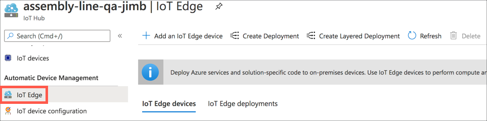

1. Select the **+ Add an IoT Edge device** button

    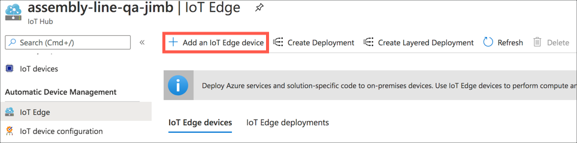

1. Set the *Device ID* to `raspberry-pi`

1. Make sure the *Authentication type* is set to  `Symmetric key`, *Auto-generate keys* is checked and *Connect this device to an IoT hub* is set to `Enabled`

1. Select the **Save** button

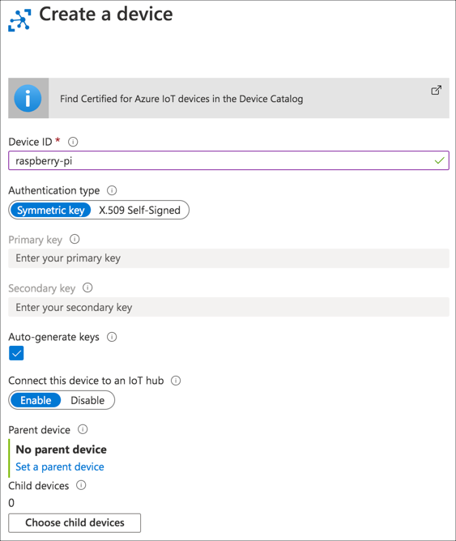

### Get the connection string

Once the edge device has been created, the blade will return to the devices list and the new device will be shown.

> If the new device is not shown in the list, select the **Refresh** button

For the IoT Edge agent on the Pi to connect to the IoT Hub as this device, it needs the connection string. This is made up of 3 parts - the URL of the IoT Hub, the device id, and a secret key, the same as for a non-edge IoT device

1. Select the new `raspberry-pi` device in the list

1. Copy the *Primary Connection String* using the **Copy to clipboard** button, and keep a note of this somewhere

### Install the IoT Edge agent

To connect as an edge device, the IoT Edge agent needs to be installed on the Pi.

1. Connect to the Pi from VS Code and launch the terminal

1. Make sure your Pi is up to date by running the following command:

    ```sh
    sudo apt update && sudo apt upgrade --yes && sudo reboot
    ``

    This will update the Pi and reboot it, so reconnect from VS Code after it has finished rebooting

1. Run the following commands to install and register the Microsoft packages list, as well as installing the Microsoft public key:

    ```sh
    curl https://packages.microsoft.com/config/debian/stretch/multiarch/prod.list > ./microsoft-prod.list
    sudo cp ./microsoft-prod.list /etc/apt/sources.list.d/
    curl https://packages.microsoft.com/keys/microsoft.asc | gpg --dearmor > microsoft.gpg
    sudo cp ./microsoft.gpg /etc/apt/trusted.gpg.d/
    rm ./microsoft-prod.list
    rm ./microsoft.gpg
    ```

1. Run the following command to install the Moby container engine to support the containers needed by the IoT Edge runtime

    ```sh
    sudo apt update
    sudo apt install moby-engine --yes
    ```

1. Run the following command to install the Azure IoT Edge runtime

    ```sh
    sudo apt install iotedge --yes
    ```

### Configure the IoT Edge agent

To connect to your IoT Hub, the IoT Edge agent needs to be configured with the device connection string.

1. Open the `config.yaml` file on the using the `nano` tool in the terminal in VS Code. It needs to be opened as a super user, so can't be edited in VS Code.

    ```sh
    sudo nano /etc/iotedge/config.yaml
    ```

1. Navigate using the arrow keys to the Manual provisioning configuration section:

    ```sh
    # Manual provisioning configuration using a connection string
    provisioning:
      source: "manual"
      device_connection_string: "<ADD DEVICE CONNECTION STRING HERE>"
      dynamic_reprovisioning: false
    ```

1. Delete `<ADD DEVICE CONNECTION STRING HERE>` and paste in your connection string inside the double quotes

1. Save the file and exit nano by using `Ctrl+X`, then press `y` when asked to save the modified buffer, then press `return` to save as the same file

1. Restart the IoT Edge runtime using the following command

    ```sh
    sudo systemctl restart iotedge
    ```

1. You can check the status of the IoT Edge agent with the following command:

    ```sh
    sudo iotedge check
    ```

    You can ignore any *Production readiness* warnings or errors. The important thing is the connectivity checks should all pass.

    ```output
    Connectivity checks
    -------------------
    √ host can connect to and perform TLS handshake with IoT Hub AMQP port - OK
    √ host can connect to and perform TLS handshake with IoT Hub HTTPS / WebSockets port - OK
    √ host can connect to and perform TLS handshake with IoT Hub MQTT port - OK
    √ container on the default network can connect to IoT Hub AMQP port - OK
    √ container on the default network can connect to IoT Hub HTTPS / WebSockets port - OK
    √ container on the default network can connect to IoT Hub MQTT port - OK
    √ container on the IoT Edge module network can connect to IoT Hub AMQP port - OK
    √ container on the IoT Edge module network can connect to IoT Hub HTTPS / WebSockets port - OK
    √ container on the IoT Edge module network can connect to IoT Hub MQTT port - OK
    ```

## Set up the container registry

The custom vision model will be downloaded as a container, and this needs to be hosted in a container registry for the IoT Edge agent to be able to download it. [Azure Container Registry](https://azure.microsoft.com/services/container-registry/?WT.mc_id=academic-7372-jabenn#create) can host containers for use in your IoT Edge applications.

### Create an Azure Container Registry resource

1. From your browser, navigate to [portal.azure.com/#create/Microsoft.ContainerRegistry](https://portal.azure.com/?WT.mc_id=academic-7372-jabenn#create/Microsoft.ContainerRegistry)

1. In the *Basics* tab, enter the required details:

    1. Select your Azure subscription

    1. Select the `assembly-line-qa` resource group that you created earlier for your Custom Vision resource

    1. For the *Registry name*, enter a unique name. This needs to be globally unique as it will form part of the URL for the connection string. This name can only contain letters and numbers, so use something like `assemblylineqayourname` replacing `yourname` with your name.

    1. Select the location closest to you

    1. Set the *SKU* to basic

    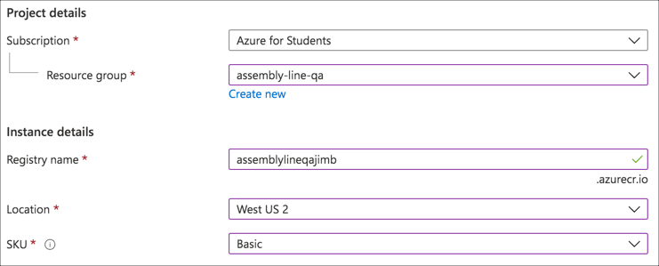

1. Select the **Review + Create** button, then the **Create** button

1. The deployment will begin, and you will be notified once it is complete. Select the **Go to resource** button to open the resource in the portal.

To push containers to this repository, you will need to be able to login via the `docker` command line on the Pi. To do this, you need to turn on an Admin user.

1. From the side menu, select *Settings -> Access Keys*

    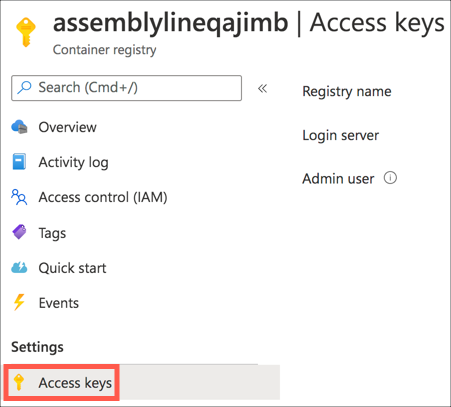

1. Enable the *Admin user*

    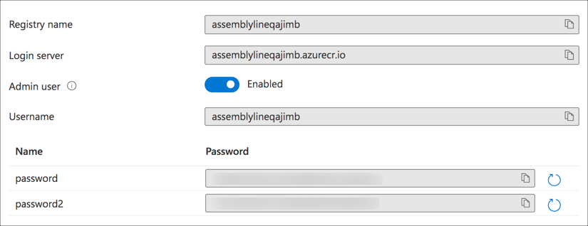

1. Take a note of the *Login server*, *Username* and one of the *password* fields. The username should be the same as the registry name. You will need these later to log in via the Docker CLI and set up the edge module deployment.

## Download the model as a container

Custom vision allows models to be exported in a number of formats including CoreML to run on iOS/macOS, Tensorflow and as a container to run inside IoT Edge.

The model that was created is not exportable as is - the configuration needs to be changed.

### Train a compact model

The model that was created used the *General* domain, creating a model that's good for a wide range of images. This can't be exported, it would just be too large. There is a variant of this domain, called *General (Compact)* that create smaller, exportable models.

1. Head to [CustomVision.ai](https://www.customvision.ai/?WT.mc_id=academic-7372-jabenn) in your browser and open your project

1. Select the **Settings** button

    

1. Find the *Domain* settings, and select `General (Compact)`

    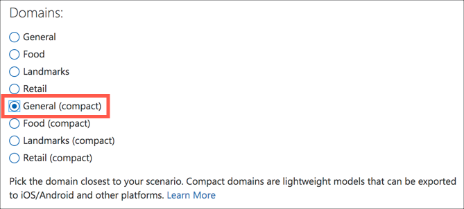

1. Select the **Save changes** button

1. Once the settings are saved, the model needs to be re-trained to generate the compact, exportable model. Train the model using the **Train** button and the **Quick Training** method.

### Export the model

The container will need to be built on the Raspberry Pi so that is uses the correct architecture. This means you will need to download it on to the Pi. If you are running VS Code locally on the Pi you can do the following steps from the Chromium browser on the Pi, or you can export the model and copy it to your Pi using `scp`.

1. Once the model has finished training, select the **Export** button

    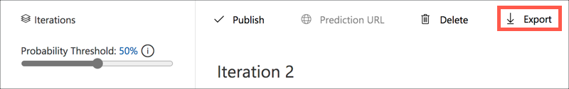

1. From the export dialog, select **Dockerfile**

    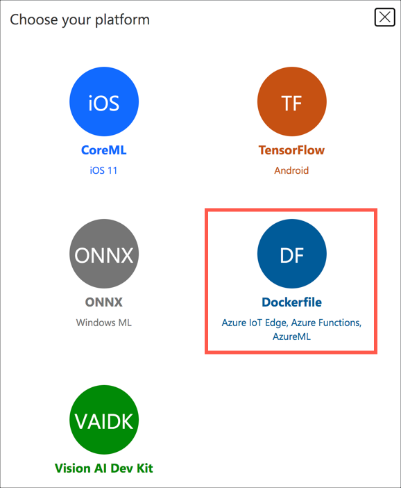

1. From the Docker file export dialog, drop down the *Choose a version* box and select `ARM (Raspberry Pi 3)`

1. Select the **Export** button to prepare the export, then the **Download** button to download the model

1. If you are not running the browser on your Pi, copy the zip file to the `AssemblyLineControl` folder on the Pi. If you are using VS Code Remote SSH you can just drag and drop the file from Windows Explorer/Finder into the VS Code explorer window. If you are not using VS Code Remote SSH then copy the file with a tool like `scp` or [WinSCP](https://winscp.net/eng/index.php).

1. The model is a zip file, so unzip it into a new folder called `classifier` from the VS Code terminal connected to the Pi using the following command:

    ```sh
    mkdir classifier
    unzip *.zip -d classifier/
    rm *.zip
    sudo chmod +rw ./classifier/**
    ```

    This will create a new folder called `classifier`, unzip the zip file into it, remove the zip file, then set permissions so the contents can be read and written to.

1. Open the `Dockerfile` file from inside the `classifier` folder. This contains the instructions for running the container, including what packages need to be installed inside the container. The latest version of Raspberry Pi OS doesn't install a package needed by the container - `libqtgui4`. Edit the first `RUN` line to add this to the end of the line, adding it to the packages to be installed.

    ```sh
    RUN apt update && apt install -y libjpeg62-turbo libopenjp2-7 libtiff5 libatlas-base-dev libqtgui4
    ```

    You can find a [`Dockerfile`](../code/edge/classifier/Dockerfile) with this code in the [code/edge/classifier](../code/edge/classifier/) folder.

1. Due to a bug in the released Raspberry Pi code, the prediction code will not work. Open the `predict.py` file from the `app` folder in the `classifier` folder and change all the code to the code below.

    You can find a copy of [this file](../code/edge/classifier/app/predict.py) in the [code/edge/classifier/app](../code/edge/classifier/app) folder.

    ```python
    from urllib.request import urlopen
    from datetime import datetime
    import tensorflow as tf

    from PIL import Image
    import numpy as np
    import sys

    try:
        import cv2
        use_opencv = True
        print("Using OpenCV resizing...")
    except:
        use_opencv = False
        print("Using CVS resizing...")

    filename = 'model.pb'
    labels_filename = 'labels.txt'

    network_input_size = 0

    output_layer = 'loss:0'
    input_node = 'Placeholder:0'

    graph_def = tf.compat.v1.GraphDef()
    labels = []

    def initialize():
        print('Loading model...',end=''),
        with open(filename, 'rb') as f:
            graph_def.ParseFromString(f.read())
            tf.import_graph_def(graph_def, name='')

        # Retrieving 'network_input_size' from shape of 'input_node'
        with tf.compat.v1.Session() as sess:
            input_tensor_shape = sess.graph.get_tensor_by_name(input_node).shape.as_list()

        assert len(input_tensor_shape) == 4
        assert input_tensor_shape[1] == input_tensor_shape[2]

        global network_input_size
        network_input_size = input_tensor_shape[1]

        print('Success!')
        print('Loading labels...', end='')
        with open(labels_filename, 'rt') as lf:
            global labels
            labels = [l.strip() for l in lf.readlines()]
        print(len(labels), 'found. Success!')

    def log_msg(msg):
        print("{}: {}".format(datetime.now(),msg))

    def extract_bilinear_pixel(img, x, y, ratio, xOrigin, yOrigin):
        """
        Custom implementation of bilinear interpolation when opencv is not available
        img: numpy source image array
        x,y: target pixel coordinates
        ratio: scaling factor
        xOrigin, yOrigin: source image offset
        returns interpolated pixel value (RGB)
        """
        xDelta = (x + 0.5) * ratio - 0.5
        x0 = int(xDelta)
        xDelta -= x0
        x0 += xOrigin
        if x0 < 0:
            x0 = 0;
            x1 = 0;
            xDelta = 0.0;
        elif x0 >= img.shape[1]-1:
            x0 = img.shape[1]-1;
            x1 = img.shape[1]-1;
            xDelta = 0.0;
        else:
            x1 = x0 + 1;

        yDelta = (y + 0.5) * ratio - 0.5
        y0 = int(yDelta)
        yDelta -= y0
        y0 += yOrigin
        if y0 < 0:
            y0 = 0;
            y1 = 0;
            yDelta = 0.0;
        elif y0 >= img.shape[0]-1:
            y0 = img.shape[0]-1;
            y1 = img.shape[0]-1;
            yDelta = 0.0;
        else:
            y1 = y0 + 1;

        #Get pixels in four corners
        bl = img[y0, x0]
        br = img[y0, x1]
        tl = img[y1, x0]
        tr = img[y1, x1]
        #Calculate interpolation
        b = xDelta * br + (1. - xDelta) * bl
        t = xDelta * tr + (1. - xDelta) * tl
        pixel = yDelta * t + (1. - yDelta) * b
        return pixel

    def extract_and_resize(img, targetSize):
        """
        resize and cropn when opencv is not available
        img: input image numpy array
        targetSize: output size
        returns resized and cropped image
        """
        determinant = img.shape[1] * targetSize[0] - img.shape[0] * targetSize[1]
        if determinant < 0:
            ratio = float(img.shape[1]) / float(targetSize[1])
            xOrigin = 0
            yOrigin = int(0.5 * (img.shape[0] - ratio * targetSize[0]))
        elif determinant > 0:
            ratio = float(img.shape[0]) / float(targetSize[0])
            xOrigin = int(0.5 * (img.shape[1] - ratio * targetSize[1]))
            yOrigin = 0
        else:
            ratio = float(img.shape[0]) / float(targetSize[0])
            xOrigin = 0
            yOrigin = 0
        resize_image = np.empty((targetSize[0], targetSize[1], img.shape[2]), dtype=np.float32)
        for y in range(targetSize[0]):
            for x in range(targetSize[1]):
                resize_image[y, x] = extract_bilinear_pixel(img, x, y, ratio, xOrigin, yOrigin)
        return resize_image

    def extract_and_resize_to_256_square(image):
        """
        extracts image central square crop and resizes it to 256x256
        image: input image numpy array
        returns resized 256x256 central crop as numpy array
        """
        h, w = image.shape[:2]
        log_msg("crop_center: " + str(w) + "x" + str(h) +" and resize to " + str(256) + "x" + str(256))
        if use_opencv:
            min_size = min(h, w)
            image = crop_center(image, min_size, min_size)
            return cv2.resize(image, (256, 256), interpolation = cv2.INTER_LINEAR)
        else:
            return extract_and_resize(image, (256, 256))

    def crop_center(img,cropx,cropy):
        """
        extracts central crop
        img: input image numpy array
        cropx, cropy: crop size
        returns central crop as numpy array
        """
        h, w = img.shape[:2]
        startx = max(0, w//2-(cropx//2))
        starty = max(0, h//2-(cropy//2))
        log_msg("crop_center: " + str(w) + "x" + str(h) +" to " + str(cropx) + "x" + str(cropy))
        return img[starty:starty+cropy, startx:startx+cropx]

    def resize_down_to_1600_max_dim(image):
        """
        resized image to 1600px in max dimension if image exceeds 1600 by width or height
        image: input image numpy array
        returns downsized image
        """
        w,h = image.size
        if h < 1600 and w < 1600:
            return image

        new_size = (1600 * w // h, 1600) if (h > w) else (1600, 1600 * h // w)
        log_msg("resize: " + str(w) + "x" + str(h) + " to " + str(new_size[0]) + "x" + str(new_size[1]))

        if use_opencv:
            # Convert image to numpy array
            image = convert_to_nparray(image)
            return cv2.resize(image, new_size, interpolation = cv2.INTER_LINEAR)
        else:
            if max(new_size) / max(image.size) >= 0.5:
                method = Image.BILINEAR
            else:
                method = Image.BICUBIC
            image = image.resize(new_size, method)
            return image

    def predict_url(imageUrl):
        """
        predicts image by url
        """
        log_msg("Predicting from url: " +imageUrl)
        with urlopen(imageUrl) as testImage:
            image = Image.open(testImage)
            return predict_image(image)

    def convert_to_nparray(image):
        """
        converts PIL.Image to numpy array and changes RGB order to BGR
        image: inpout PIL image
        returns image as a numpy array
        """
        # RGB -> BGR
        log_msg("Convert to numpy array")
        image = np.array(image)
        return image[:, :, (2,1,0)]

    def update_orientation(image):
        """
        corrects image orientation according to EXIF data
        image: input PIL image
        returns corrected PIL image
        """
        exif_orientation_tag = 0x0112
        if hasattr(image, '_getexif'):
            exif = image._getexif()
            if exif != None and exif_orientation_tag in exif:
                orientation = exif.get(exif_orientation_tag, 1)
                log_msg('Image has EXIF Orientation: ' + str(orientation))
                # orientation is 1 based, shift to zero based and flip/transpose based on 0-based values
                orientation -= 1
                if orientation >= 4:
                    image = image.transpose(Image.TRANSPOSE)
                if orientation == 2 or orientation == 3 or orientation == 6 or orientation == 7:
                    image = image.transpose(Image.FLIP_TOP_BOTTOM)
                if orientation == 1 or orientation == 2 or orientation == 5 or orientation == 6:
                    image = image.transpose(Image.FLIP_LEFT_RIGHT)
        return image

    def preprocess_image_opencv(image_pil):
        """
        image_pil: PIL Image, already converted to 'RGB' and correctly oriented
        returns: nparray of extracted crop
        """
        image = convert_to_nparray(image_pil)
        h, w = image.shape[:2]

        min_size = min(h,w)
        crop_size = min(min_size, int(min_size * network_input_size / 256.0))
        startx = max(0, int(max(0, w//2-(crop_size//2))))
        starty = max(0, int(max(0, h//2-(crop_size//2))))
        new_size = (network_input_size, network_input_size)
        log_msg(f"crop: {w}x{h}  to {crop_size}x{crop_size}, origin at {startx}, {starty}, target = {network_input_size}")
        return cv2.resize(image[starty:starty+crop_size, startx:startx+crop_size], new_size, interpolation = cv2.INTER_LINEAR)

    def preprocess_image(image_pil):
        """
        image_pil: PIL Image, already converted to 'RGB' and correctly oriented
        returns: nparray of extracted crop
        """
        # If the image has either w or h greater than 1600 we resize it down respecting
        # aspect ratio such that the largest dimention is 1600
        image_pil = resize_down_to_1600_max_dim(image_pil)

        # Convert image to numpy array
        image = convert_to_nparray(image_pil)

        # Crop the center square and resize that square down to 256x256
        resized_image = extract_and_resize_to_256_square(image)

        # Crop the center for the specified network_input_Size
        return crop_center(resized_image, network_input_size, network_input_size)

    def predict_image(image):
        """
        calls model's image prediction
        image: input PIL image
        returns prediction response as a dictionary. To get predictions, use result['predictions'][i]['tagName'] and result['predictions'][i]['probability']
        """
        log_msg('Predicting image')
        try:
            if image.mode != "RGB":
                log_msg("Converting to RGB")
                image = image.convert("RGB")

            w,h = image.size
            log_msg("Image size: " + str(w) + "x" + str(h))

            # Update orientation based on EXIF tags
            image = update_orientation(image)

            if use_opencv:
                cropped_image = preprocess_image_opencv(image)
            else:
                cropped_image = preprocess_image(image)

            tf.compat.v1.reset_default_graph()
            tf.import_graph_def(graph_def, name='')

            with tf.compat.v1.Session() as sess:
                prob_tensor = sess.graph.get_tensor_by_name(output_layer)
                predictions, = sess.run(prob_tensor, {input_node: [cropped_image] })

                result = []
                for p, label in zip(predictions, labels):
                    truncated_probablity = np.float64(round(p,8))
                    if truncated_probablity > 1e-8:
                        result.append({
                            'tagName': label,
                            'probability': truncated_probablity,
                            'tagId': '',
                            'boundingBox': None })

                response = {
                    'id': '',
                    'project': '',
                    'iteration': '',
                    'created': datetime.utcnow().isoformat(),
                    'predictions': result
                }

                log_msg("Results: " + str(response))
                return response

        except Exception as e:
            log_msg(str(e))
            return 'Error: Could not preprocess image for prediction. ' + str(e)
    ```

### Build and tag the container image

To use the container inside IoT Edge, it needs to be built, tagged, then uploaded to an Azure Container Registry. To build this container, you will need to install [Docker](https://docs.docker.com/get-docker/).

1. From the VS Code terminal running on the Pi, run the following command to log into the Azure Container Registry from Docker:

    ```sh
    sudo docker login <registry_name>.azurecr.io
    ```

    Replace `<registry_name>` with the name of your registry.

1. When promoted, enter the username and password for the container registry that you captures earlier. The user name should be the same as your registry name.

1. The container needs to be built and tagged ready for upload to the container registry. Use the following command to build and tag the image:

    ```sh
    sudo docker build -t <registry_name>.azurecr.io/classifier:v1 ./classifier/
    ```

    Replace `<registry_name>` with the name of your registry.

    This will take a while to download and build all the components of the image.

1. Finally push the image to the container registry with the following command:

    ```sh
    sudo docker push <registry_name>.azurecr.io/classifier:v1
    ```

    Replace `<registry_name>` with the name of your registry.

1. To verify it was pushed correctly, head to the Container Registry in the Azure Portal, select *Services -> Repositories*. You should see a *classifier* repository in the list. Select this, then select the *v1* version to see details about the container.

## Deploy the model to the edge

The container is now ready to be deployed to the IoT Edge device.

### Create an IoT Edge module for the classifier

1. From the Azure Portal, head to the `raspberry-pi` IoT Edge device

1. Select the **Set modules** button

    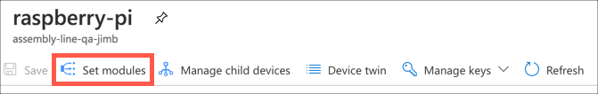

1. The edge module needs to download the container from the container registry so fill in the *Container Registry Credentials* section

    1. Set the *Name* to the name of your container registry

    1. Set the *Address* to the login server of your container registry

    1. Set the *Username* to the username of the container registry admin user

    1. Set the *Password* to the password of the container registry admin user

    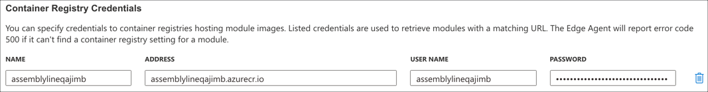

1. Select the **+ Add** button in the *IoT Edge modules* section then select `IoT Edge Module`

    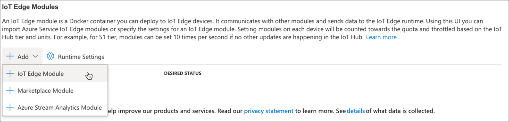

1. Fill in the *Module Settings*

    1. Set the *IoT Edge module name* to `classifier`

    1. Set the *Image URI* to the tag you used for the docker image. This should be `<registry_name>.azurecr.io/classifier:v1` with `<registry_name>` replaced by your registry name.

    1. Leave the rest of the fields as the defaults

    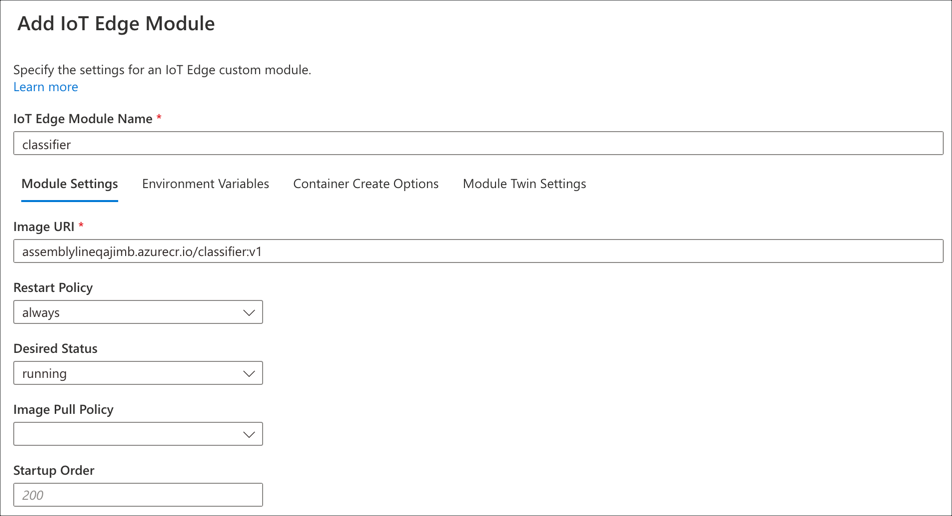

1. Select the *Container Create Options* tab

    1. Set the *Options* to be:

        ```json
        {
            "HostConfig": {
                "PortBindings": {
                    "80/tcp": [
                        {
                            "HostPort": "80"
                        }
                    ]
                }
            }
        }
        ```

        This ensures that port 80 on the Pi is open and connected to port 80 inside the docker container. This is the port the image classifier will be listening on.

    

1. Select the **Add** button

1. Select **Review + Create**, then **Create**

The `classifier` module will be listed in the *Modules* list for the edge device. Eventually it will be deployed to the device - it will take time to download the start on the Pi. You can check the status by refreshing the edge device page and looking for the *Runtime status* of the `classifier` module to be set to  *running*, or by running the following command on the Pi:

```sh
iotedge list
```

You will see the following:

```output
pi@raspberrypi:~/AssemblyLineControl $ iotedge list
NAME             STATUS           DESCRIPTION      CONFIG
classifier       running          Up an hour       assemblylineqajimb.azurecr.io/classifier:v1
edgeAgent        running          Up 20 hours      mcr.microsoft.com/azureiotedge-agent:1.0
edgeHub          running          Up 20 hours      mcr.microsoft.com/azureiotedge-hub:1.0
```

This shows that the classifier edge module is running.

## Call the edge model from the ESP-EYE

The classifier is now running on the Pi on port 80 - the default HTTP port. You can now direct the REST API calls from the ESP-EYE to this.

1. Open the ESP-EYE project

1. Head to the `Config.h` file in the `src` folder

1. Change the value of the `predictionUrl` to point to your Pi. Set the protocol to `HTTP` instead of `HTTPS`, then replace everything except the last `/image` part with the IP address or hostname of the Pi (including the `.local` part).

    ```cpp
    const char * const predictionUrl = "http://192.168.197.11/image";
    ```

    This shows the URL for the Pi with an IP address of `192.168.197.11`.

    ```cpp
    const char * const predictionUrl = "http://classifier-pi.local/image";
    ```

    This shows the URL for the Pi with a hostname set to `classifier-pi`.

1. Build and upload the code to the ESP-EYE.

1. Ensure the Python app is running on the Pi, and validate the item on the assembly line using the keyboard or Grove button depending on how yours is set up. You should see the same results as before, except this time the classification is running on the Pi rather than in the cloud.

## Next steps

In this step you ran the image classifier on the Raspberry Pi using IoT Edge.

In the [next step](./upload-iot-hub.md), you will upload the result data to Azure IoT Hub.
