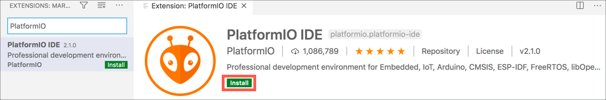
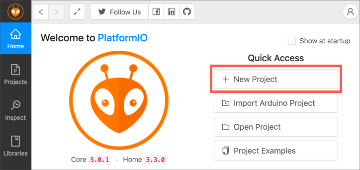
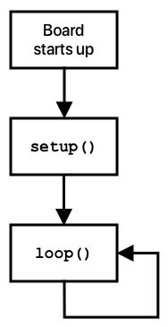
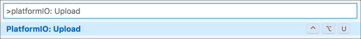

# Program the ESP-EYE with a simple 'Hello World' program

In this step you will configure your computer to program the ESP-EYE, and create your first 'Hello World' program running on the board.

## ESP-EYE

The ESP-EYE is a board based around the ESP32 microcontroller, with a built in camera module. This board is programmed in C++, using Platform IO.

## Platform IO

[Visual Studio Code](http://code.visualstudio.com?WT.mc_id=academic-7372-jabenn) (VS Code) is an open-source developer text editor that can be expanded with extensions to support multiple features or programming languages. It can also be used to remotely code on a Raspberry Pi from your PC or Mac via a remote development extension.

[Platform IO](https://platformio.org) is an open source extension for VS Code that gives you the ability to program embedded devices without any additional dependencies.

### Install Platform IO

To install Platform IO:

* Make sure you have VS Code installed. If not, you can install it from the [Visual Studio Code Downloads page](https://code.visualstudio.com/Download?WT.mc_id=academic-7372-jabenn)
* From VS Code, select the **Extensions** tab from the side menu

    

1. Search for `PlatformIO` and select the **PlatformIO IDE**. Select the **Install** button to install this extension.

    

> PlatformIO is a self-contained embedded development environment. If you have the Arduino extension installed, it can clash with PlatformIO, so make sure to uninstall the Arduino extension before using PlatformIO.

## Create the ESP EYE Hello World project

The purpose of a 'Hello World' project is to ensure you have all the tooling set up correctly. This 'Hello World' project will write to the serial port which you can monitor from VS Code.

### Create the PlatformIO project

1. From VS Code, select the **PlatformIO** tab from the side menu

    

1. The *PlatformIO: Quick Access* bar will appear. Select *PIO Home->Open*

    

1. From the home screen, select **+ New Project** from the *Quick Access* section

    

1. Name the project `assembly-line-cam`

1. For the *Board*, type in `ESP32-CAM` and select the `AI Thinker ESP32-CAM` board

1. Set the *Framework* to **Arduino**

1. For the location, either leave the default option checked, or uncheck it and select a location for the project. If you hover over the question mark you can see the default project location.

1. Select the **Finish** button

    

PlatformIO will take some time to download the components it needs to use the board, and create the project. Once done, the project will be opened in the VS Code window.

### Navigate the project

The PlatformIO project contains a number of files and folders:

* `.pio` - this folder contains files used by PlatformIO such as the output of the build and other temporary files. You should never need to read or edit any files in this folder. This folder would not normally be checked in to source code control.
* `.vscode` - this folder contains configuration information used by VS Code and may be specific to your PC or Mac, such as paths to library files. You should never need to read or edit any files in this folder.
* `include` - this folder is for any header files for your project that you would want to expose to anyone using your code. This is normally when building libraries for consumption by other developers, and won't be used when writing code for a board.
* `lib` - this folder is for any additional libraries you want to use in your project. PlatformIO has a library manager than can import third party libraries, but if you want to use an additional libraries you need to add them to this folder.
* `src` - this folder is where the source code for your app lives. It will have a single file in it `main.cpp`. This file contains the code for an empty Arduino project.
* `test` - this folder is where you would put any unit test you write against your code.
* `.gitignore` - this is a [`gitignore`](https://git-scm.com/docs/gitignore) file that defines what will be ignored if you add this project to Git source code control.
* `platform.ini` - this file defines the configuration for the PlatformIO project including the board types (PlatformIO projects can target multiple boards), any additional libraries to use, and any build flags to control the code compilation.

### Write the code

This project uses the [Arduino framework](https://www.arduino.cc), an open source framework for software and hardware. When writing arduino code, the core flow is around two methods that are defined in your main source code file. In a PlatformIO project, this file is called `main.cpp`.

* `setup()` - the setup method is called once and only once when the board starts up. This function is used to do one-time setup, such as connecting to WiFi, or connecting to an IoT service such as [Azure IoT Hub](https://azure.microsoft.com/services/iot-hub/?WT.mc_id=academic-7372-jabenn).
* `loop()` - the loop method is called after setup, and once the method completes it is called again and again. All the time the board is running, this method will be called as soon as it completes.



1. Open the `main.cpp` file in the `src` folder

1. The existing code defines the `setup` and `loop` methods:

    ```cpp
    #include <Arduino.h>

    void setup() {
      // put your setup code here, to run once:
    }

    void loop() {
      // put your main code here, to run repeatedly:
    }
    ```

1. Edit the `setup` method to be the following:

    ```cpp
    void setup() {
      Serial.begin(9600);
    }
    ```

    This code starts the serial port output at a speed of 9,600.

1. Edit the `loop` method to be the following:

    ```cpp
    void loop() {
      Serial.println("Hello world");
      delay(5000);
    }
    ```

    This code writes the text `Hello world` to the serial port, then delays for 5 seconds (5,000 milliseconds).

### Upload the code to your board

1. Connect your ESP-EYE board to your PC or Mac using a USB cable

1. From Visual Studio Code, launch the Command Palette. This is a pop-up menu that allows you to run actions from VS Code as well as any extensions installed.

    1. If you are using Windows or Linux, press `Ctrl+Shift+p`
    1. If you are using macOS, press `Command+Shift+p`

1. Search for `PlatformIO: Upload` by typing in the box, then select that option

    

The relevant tooling will be installed, and the code will be compiled for the device. Once built, it will be uploaded to the ESP-EYE. You will see the progress in the VS Code terminal.

```output
Writing at 0x0002c000... (100 %)
Wrote 263104 bytes (123199 compressed) at 0x00010000 in 3.0 seconds (effective 699.9 kbit/s)...
Hash of data verified.

Leaving...
Hard resetting via RTS pin...
============================ [SUCCESS] Took 9.26 seconds ============================
```

### Monitor the output

The serial output of the ESP-EYE is the USB cable that is used to connect it to your PC or Mac. You can monitor the data being sent using the PlatformIO serial monitor.

1. Launch the serial monitor using one of these methods:
    * Open the VS Code Command Palette, search for `PlatformIO: Serial Monitor` and select this option

        

    * Select the Serial Monitor button from the status bar

        

The serial monitor will listen for all messages from the device. You will see `Hello world` appear every 5 seconds.

```output
> Executing task: platformio device monitor <

--- Available filters and text transformations: colorize, debug, default, direct, esp32_exception_decoder, hexlify, log2file, nocontrol, printable, send_on_enter, time
--- More details at http://bit.ly/pio-monitor-filters
--- Miniterm on /dev/cu.usbserial-1430  9600,8,N,1 ---
--- Quit: Ctrl+C | Menu: Ctrl+T | Help: Ctrl+T followed by Ctrl+H ---
Hello world
Hello world
Hello world
```

## Next steps

In this step you configured your computer to program the ESP-EYE, and create your first 'Hello World' program running on the board.

In the [next step](./image-capture.md) you will set up the ESP-EYE to share images via a web server.
