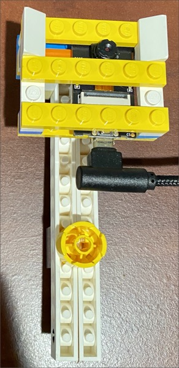
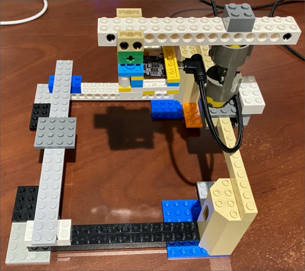
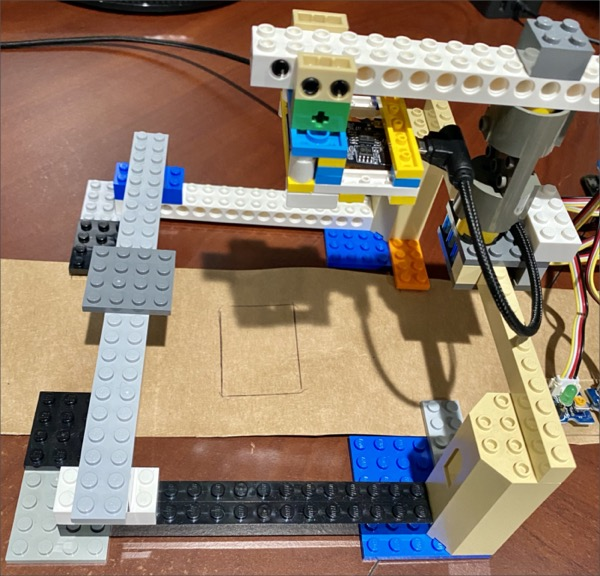
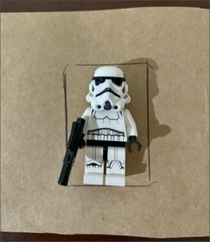
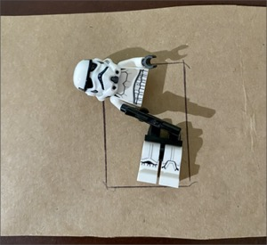
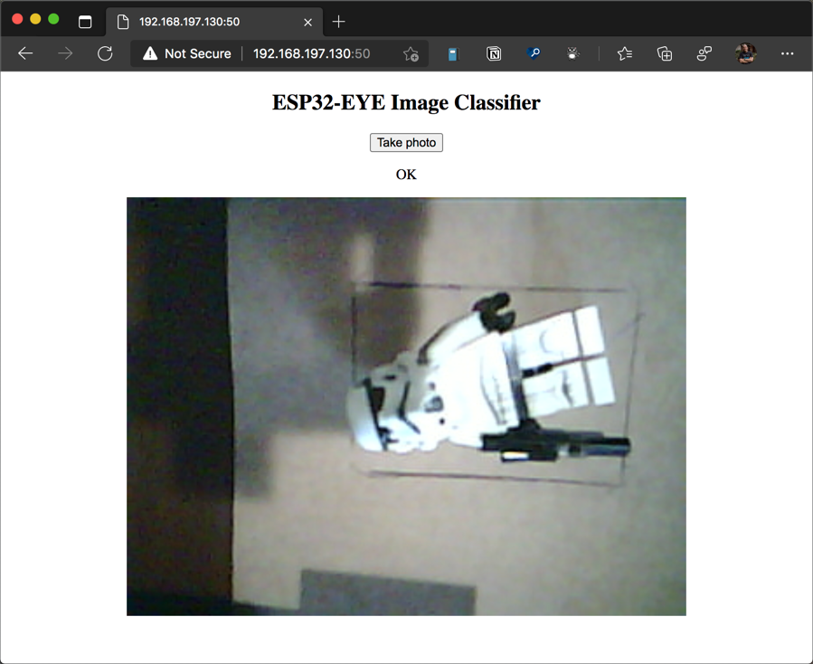

# Set up the ESP-EYE to share images via a web server

In the [previous step](./hello-world-esp-eye.md) you configured your computer to program the ESP-EYE, and create your first 'Hello World' program running on the board.

In this step you will set up the ESP-EYE to share images via a web server.

## Gather images

The end result of this lab is to create an AI powered QA system for a prototype assembly line. To train this AI, you will need a set of sample images of the item being manufactured in both a successful and failed state. Ideally these images should be taken by the device that will take the images for the actual validation so that the training set is as close to the real data as possible.

The best way to do this is to set up the assembly line, and take photos with the ESP-EYE. These photos will then be able to be downloaded from the device ready to train the model.

## Build the assembly line

For this prototype, you will need a setup where the ESP-EYE can be held in a position where it can see items coming through the 'assembly line'. Nothing actually needs to move, you don't need a working assembly line, you just need a way to put items in a known position so the ESP-EYE can take a picture.

### An example assembly line

One example setup uses Lego to hold the ESP-EYE, and cardboard as a backdrop for the item on the assembly line. The item being assembled is a Lego MiniFig. The advantage of using a lego character is that it is easily split apart to get images for a pass (complete MiniFig) and fail (MiniFig in 2 parts).

> You don't need to use lego, I just happened to have plenty lying around. You can use anything that can hold the ESP-EYE.

#### A holder for the ESP-EYE

The holder for the ESP eye takes advantage of the fact that the camera is one Lego stud tall, meaning it can be help using a few Lego planks.



#### The assembly line frame

The assembly line frame is made of more lego, holding the camera pointing straight down.



The bed of the assembly line is cardboard, with lines to indicate where the frame fits over the top, and a rectangle to show where the MiniFig needs to set to be photographed.



#### The item being assembled

This assembly line assembles MiniFigs. A successful assembly is a complete MiniFig, a fail is a MiniFig in two parts.





### Construction

Use whatever you have to hand to build an assembly line. The requirements are:

* The ESP-EYE needs to be held in a way where it can't easily move and can point at the item on the assembly line, and the USB port is accessible. Make sure a USB cable is fitted when you assemble.
* There is enough light for the camera to see the item on the assembly line - the camera on the ESP-EYE is not the best in low light
* The backdrop for the item is consistent
* Items can be positioned in roughly the same location on the assembly line

A simple option would be a cardboard box with a hole in the top for the camera, the ESP-EYE fixed on top using poster tack, and the sides of the box cut out to let light in.

For the item being assembled anything will do as long as it can be configured into pass and fail. You could even have an assembly line for candy like M&Ms where a pass is two M&Ms, and a fail is one or none. You should also ensure the item is able to be positioned in the same location - maybe by drawing a box for it to sit in.

## Program the ESP-EYE

Once the assembly line is constructed, the code can be written for the ESP-EYE to capture images. This code will make the images available via a web page hosted on a web server running on the ESP-EYE itself - this way you can capture images, then download them from the web page to your computer ready to train an AI model in the next step.

### Add libraries to the ESP app

To access the camera and host a web server, you can use some pre-existing Arduino libraries. These can be added globally using the PlatformIO library manager, or added to a specific project by editing the `platformio.ini` file in the root of the project folder.

1. Open the `assembly-line-cam` project in VS Code if it's not already open

1. Open the `platformio.ini` file

1. Add the following code to the end of the file:

    ```sh
    lib_deps =
      esp32-camera
      ESP Async WebServer
    ```

    This will add the [Espressif ESP32 Camera driver](https://github.com/espressif/esp32-camera) and the [ESP Async WebServer](https://github.com/me-no-dev/ESPAsyncWebServer) libraries to the project. The ESP32 camera driver is a library to talk to the camera on the ESP-EYE board, and ht eESP Async WebServer allows you to run a web server on the ESP board.

Next time the app is compiled, it will bring in these libraries and compile them into the build.

### Add a helper class for interacting with the camera

The code for interacting with the camera can be encapsulated in a camera helper class, simplifying the code needed to take photos.

1. In the `src` folder, create two files - `Camera.h` and `Camera.cpp`

1. Add the following code to the `Camera.h` header file:

    ```cpp
    #ifndef _CAMERA_H_
    #define _CAMERA_H_

    #include <esp_camera.h>

    /**
     * @brief A helper class for interacting with the ESP-EYE camera.
     */
    class Camera
    {
    public:
        /**
         * @brief Initializes the camera class.
         * If the initialization of the camera fails, the board is rebooted.
         */
        Camera();

        /**
         * @brief Takes a photo and returns it as a frame buffer.
         *
         * @return A pointer to an image frame buffer on success, otherwise null
         */
        camera_fb_t *TakePhoto();

        /**
         * @brief Releases the frame buffer after it has been processed.
         * Call this to clean up the memory used by the frame buffer.
         *
         * @param frameBuffer The frame buffer to clean up.
         */
        void ReleaseFrameBuffer(camera_fb_t *frameBuffer);
    };

    #endif
    ```

    This code defines a class called `Camera` with 2 public methods. The `TakePhoto` method takes a photo and returns it as a pointer to a `camera_fb_t` - a frame buffer object from the ESP camera library that contains the image data for the image as a JPEG. This frame buffer should be cleared up after being used by calling the `ReleaseFrameBuffer` method.

1. Add the following code to the `Camera.cpp` file:

    ```cpp
    #include "camera.h"

    #include <Esp.h>
    #include <esp_err.h>

    // These constants define the pin mappings for the ESP-EYE.
    // If you are using a different board, you will need to update the mappings
    // to match your board.
    #define PWDN_GPIO_NUM -1
    #define RESET_GPIO_NUM -1
    #define XCLK_GPIO_NUM 4
    #define SIOD_GPIO_NUM 18
    #define SIOC_GPIO_NUM 23

    #define Y9_GPIO_NUM 36
    #define Y8_GPIO_NUM 37
    #define Y7_GPIO_NUM 38
    #define Y6_GPIO_NUM 39
    #define Y5_GPIO_NUM 35
    #define Y4_GPIO_NUM 14
    #define Y3_GPIO_NUM 13
    #define Y2_GPIO_NUM 34
    #define VSYNC_GPIO_NUM 5
    #define HREF_GPIO_NUM 27
    #define PCLK_GPIO_NUM 25

    #define XCLK_FREQ 20000000

    // Initialise the camera
    Camera::Camera()
    {
        // Define the configuration for the GPIO pins
        gpio_config_t conf;
        conf.mode = GPIO_MODE_INPUT;
        conf.pull_up_en = GPIO_PULLUP_ENABLE;
        conf.pull_down_en = GPIO_PULLDOWN_DISABLE;
        conf.intr_type = GPIO_INTR_DISABLE;
        conf.pin_bit_mask = 1LL << 13;
        gpio_config(&conf);
        conf.pin_bit_mask = 1LL << 14;
        gpio_config(&conf);

        // Define the configuration for the camera, including the
        // pins and the image format
        camera_config_t config;
        config.ledc_channel = LEDC_CHANNEL_0;
        config.ledc_timer = LEDC_TIMER_0;
        config.pin_d0 = Y2_GPIO_NUM;
        config.pin_d1 = Y3_GPIO_NUM;
        config.pin_d2 = Y4_GPIO_NUM;
        config.pin_d3 = Y5_GPIO_NUM;
        config.pin_d4 = Y6_GPIO_NUM;
        config.pin_d5 = Y7_GPIO_NUM;
        config.pin_d6 = Y8_GPIO_NUM;
        config.pin_d7 = Y9_GPIO_NUM;
        config.pin_xclk = XCLK_GPIO_NUM;
        config.pin_pclk = PCLK_GPIO_NUM;
        config.pin_vsync = VSYNC_GPIO_NUM;
        config.pin_href = HREF_GPIO_NUM;
        config.pin_sscb_sda = SIOD_GPIO_NUM;
        config.pin_sscb_scl = SIOC_GPIO_NUM;
        config.pin_pwdn = PWDN_GPIO_NUM;
        config.pin_reset = RESET_GPIO_NUM;
        config.xclk_freq_hz = XCLK_FREQ;
        config.pixel_format = PIXFORMAT_JPEG;

        //init with high specs to pre-allocate larger buffers
        config.frame_size = FRAMESIZE_UXGA;
        config.jpeg_quality = 0;
        config.fb_count = 2;

        // Initialise the camera
        esp_err_t result = esp_camera_init(&config);

        // Check if the camera initialized correctly
        if (result == ESP_OK)
        {
            // drop down frame size for higher initial frame rate
            // This is necessary to avoid timeouts with the SPI file system
            sensor_t *s = esp_camera_sensor_get();
            s->set_framesize(s, FRAMESIZE_QVGA);
        }
        else
        {
            // Reboot the board if the camera init failed
            Serial.printf("Camera init failed with error 0x%x", result);
            ESP.restart();
        }
    }

    // Take a photo using the ESP-EYE camera
    // and return the image as a frame buffer
    camera_fb_t *Camera::TakePhoto()
    {
        // Use the ESP library to take a photo and return the frame buffer
        return esp_camera_fb_get();
    }

    // Releases the frame buffer allocated by the camera
    // freeing up the memory
    void Camera::ReleaseFrameBuffer(camera_fb_t *frameBuffer)
    {
        // Return the frame buffer so it can be re-used
        esp_camera_fb_return(frameBuffer);
    }
    ```

    This code initializes the hardware to talk to the camera, including setting the pins the camera is connected to, and setting up the buffer size for the camera. The final images are taken at a resolution of 320x240, which may seem small, but larger frames will end up exceeding the memory available on the ESP-EYE. You also don't need a higher resolution for the final product as image classification uses low resolution images.

    If there are any errors setting up the hardware, the device is rebooted.

    The `TakePhoto` and `ReleaseFrameBuffer` methods wrap the ESP Camera library calls to capture the image, and release the frame buffer.

### Add a helper class for saving images

Just like code for interacting with the camera, the code for interacting with the file system can be encapsulated to simplfy the calling code.

1. In the `src` folder, create two files - `ImageHandler.h` and `ImageHandler.cpp`

1. Add the following code to the `ImageHandler.h` header file:

    ```cpp
    #ifndef _IMAGEHANDLER_H_
    #define _IMAGEHANDLER_H_

    #include "esp_camera.h"

    /**
     * @brief A helper class for saving photos.
     */
    class ImageHandler
    {
    public:
        /**
         * @brief Initializes the image handler class.
         * If the initialization of the file system fails, the board is rebooted.
         */
        ImageHandler();

        /**
         * @brief Saves the given frame buffer to a file with the given name.
         *
         * @param frameBuffer The frame buffer to save.
         * @param fileName The file name to save to.
         *
         * @return TRUE on success
         */
        bool SavePhoto(camera_fb_t *frameBuffer, const char *fileName);

    private:
        /**
         * @brief Checks the image saved correctly by validating bytes were written.
         *
         * @param fileName The file name to check.
         *
         * @return TRUE on if the file was saved correctly, otherwise FALSE
         */
        bool CheckPhoto(const char *fileName);
    };

    #endif
    ```

    This defines an `ImageHandler` class with a single public method `SavePhoto` that writes an ESP image frame buffer to the file system. It also has a private `CheckPhoto` method used to validate the photo was saved correctly.

1. Add the following code to the `ImageHandler.cpp` file:

    ```cpp
    #include "ImageHandler.h"

    #include <Arduino.h>
    #include <SPIFFS.h>

    // Initialise the SPIFFS file system
    ImageHandler::ImageHandler()
    {
        // Initialize the SPIFFS file system
        if (!SPIFFS.begin(true))
        {
            // If the file system initialization fails, restart the board
            ESP.restart();
        }

        delay(500);
        Serial.println("SPIFFS mounted successfully");
    }

    // Saves the image in the given frame buffer to a file with the given name
    bool ImageHandler::SavePhoto(camera_fb_t *frameBuffer, const char *fileName)
    {
        bool saved = false;
        int retry = 0;

        // Sometimes the save can fail, so retry up to 10 times
        while (!saved && retry < 10)
        {
            // Check if the file already exists, and if so delete it
            if (SPIFFS.exists(fileName))
            {
                SPIFFS.remove(fileName);
            }

            // Open the file for writing to
            File file = SPIFFS.open(fileName, FILE_WRITE);

            // If the file fails to open, report the error and try again
            if (!file)
            {
                Serial.println("Failed to open file in writing mode");
                saved = false;
                ++retry;
            }
            else
            {
                // Write the framebuffer to the file
                file.write(frameBuffer->buf, frameBuffer->len);

                // Close the file
                file.close();

                // check if file has been correctly saved in SPIFFS
                saved = CheckPhoto(fileName);
            }
        }

        return saved;
    }

    // Checks if the photo has been saved by validating the file size
    bool ImageHandler::CheckPhoto(const char *fileName)
    {
        // Open the file from teh SPIFFS file system
        File f_pic = SPIFFS.open(fileName);

        // Get the file size
        unsigned int pic_sz = f_pic.size();

        // JPEG file sizes vary, so check at least 100 bytes were written
        return (pic_sz > 100);
    }
    ```

    This code sets up the SPIFFS - the SPI flash file system. The `SavePhoto` method checks if the given file exists, and if so deletes it. It then writes the frame buffer to the file, before validating the expected number of bytes was written via the `CheckPhoto` method.

### Create the web server

The next step is to create the web server. This will host a single page that allows you to take a picture with the camera. This page can then be accessed over your local network to view and download the image.

1. In the `src` folder, create two files - `WebServer.h` and `WebServer.cpp`

1. Add the following code to the `WebServer.h` header file:

    ```cpp
    #ifndef _WEBSERVER_H_
    #define _WEBSERVER_H_

    #include "Camera.h"
    #include "ImageHandler.h"

    #include <ESPAsyncWebServer.h>
    #include <string>

    using namespace std;

    /**
     * @brief A web server that serves up pages to control the camera.
     */
    class WebServer
    {
    public:
        /**
         * @brief Create the web server running on the given port. Initializes webserver and starts serving up pages
         * If the initialization of the web server fails, the board is rebooted.
         *
         * @param port The port to use.
         */
        WebServer(uint16_t port = 50);

    private:
        AsyncWebServer _webServer;
        Camera _camera;
        ImageHandler _imageHandler;

        /**
         * @brief Capture a photo from the camera and save it to the SPIFFS file system.
         *
         * @return An error message or error, or OK
         */
        string CapturePhotoAndSaveToSpiffs();
    };

    #endif
    ```

    This code defines a `WebServer` class that uses the ESP Async WebServer library to host a web server. It also has an instance of the `Camera` and `ImageHandler` classes and a private method to capture a photo from the camera and save it to the file system.

1. Add the following code to the `WebServer.cpp` file:

    ```cpp
    #include "WebServer.h"

    #include <Arduino.h>
    #include <esp_camera.h>
    #include <SPIFFS.h>
    #include <WiFi.h>

    // Save the photo to photo.jpg
    #define FILE_PHOTO "/photo.jpg"

    // The index.html file as a raw string.
    // This web page has two buttons:
    // Rotate - rotates the image on screen
    // Capture photo - captures the photo from the camera and reload the page
    const char index_html[] PROGMEM = R"rawliteral(
    <!DOCTYPE HTML>
    <html>

    <head>
        <meta name="viewport" content="width=device-width, initial-scale=1">
        <style>
            body {
                text-align: center;
            }

            .vert {
                margin-bottom: 10%;
            }

            .hori {
                margin-bottom: 0%;
            }
        </style>
    </head>

    <body>
        <div id="container">
            <h2>ESP32-EYE Image Classifier</h2>
            <p>
                <button id="takePictureButton">Take photo</button>
            </p>
            <p id="resultText"></p>
            <div></div>
    </body>
    <script>
        window.addEventListener("DOMContentLoaded", function () {
            var takePictureButton = document.getElementById("takePictureButton");
            var img = document.getElementById("photo");
            var resultText = document.getElementById("resultText");

            takePictureButton.addEventListener('click', function () {
                takePictureButton.disabled = true;

                const getResult = async () => {
                    var result = await fetch('capture', {
                        method: 'GET'
                    })

                    resultText.textContent = await result.text()
                    img.src = "saved-photo#" + new Date().getTime();

                    takePictureButton.disabled = false;
                }
                getResult()
            });
        });
    </script>

    </html>)rawliteral";

    // Create the web server on the given port
    WebServer::WebServer(uint16_t port) : _webServer(port),
                                          _camera(),
                                          _imageHandler()
    {
        Serial.println("Starting web server...");

        // Route for root / web page
        _webServer.on("/", HTTP_GET, [](AsyncWebServerRequest *request) {
            Serial.println("GET request for /");
            // Return the index_html string as the web page
            request->send_P(200, "text/html", index_html);
        });

        // Route for the /capture end point
        _webServer.on("/capture", HTTP_GET, [this](AsyncWebServerRequest *request) {
            Serial.println("GET request for /capture");
            // Capture and save the photo
            string result = CapturePhotoAndSaveToSpiffs();
            request->send_P(200, "text/plain", result.c_str());
        });

        // Route for the saved-photo end point
        _webServer.on("/saved-photo", HTTP_GET, [](AsyncWebServerRequest *request) {
            Serial.println("GET request for /saved-photo");
            // Return the file loaded from the SPIFFS file system
            request->send(SPIFFS, FILE_PHOTO, "image/jpg", false);
        });

        // Start the server
        _webServer.begin();

        // Print the Local URL once we are connected
        // This is the address you will use to connect to the web server to
        // capture photos
        Serial.println("Web server started:");
        Serial.print("URL: http://");
        Serial.print(WiFi.localIP());
        Serial.printf(":%d\r\n", port);
    }

    // Capture Photo and Save it to SPIFFS
    string WebServer::CapturePhotoAndSaveToSpiffs()
    {
        // Take a photo with the camera
        Serial.println("Taking a photo...");
        camera_fb_t *fb = _camera.TakePhoto();

        // Verify the photo was taken
        if (!fb)
        {
            Serial.println("Camera capture failed");
            return "Error capturing from camera";
        }

        Serial.printf("Picture file name: %s\n", FILE_PHOTO);

        // Classify the photo
        string result = "OK";

        // Save the photo to the SPIFFS file system
        if (!_imageHandler.SavePhoto(fb, FILE_PHOTO))
        {
            Serial.println("File write failed");
            result = "Error saving file";
        }

        _camera.ReleaseFrameBuffer(fb);

        return result;
    }
    ```

    This code creates a web server using an HTML file defined as static text. This HTML file has a button to take a photo and an image control to show the photo. It has some JavaScript code to handle the button click, take the photo and render it to the screen.

    The code also defined the web routes - what happens when the web server is called. A `GET` request to the `/` route returns the HTML page. A `Get` request to the `capture` route uses the camera and image handler classes to take a photo and save it to the file system, and a `Get` request to the `saved-photo` route returns the captured photo.

### Add the main code to connect to WiFi and launch the web server

The final piece of code starts up the `WebServer` using the ESP-EYEs on-board WiFi.

1. In the `src` folder, create a file called `Config.h`

1. Add the following code to this file:

    ```cpp
    #ifndef _CONFIG_H_
    #define _CONFIG_H_

    // The SSID and password of the WiFI network to use.
    // Replace these with your network credentials
    // Note that this won't work with enterprise security
    const char * const ssid = "<Your SSID>";
    const char * const password = "<Your password>";

    #endif
    ```

    Replace `<Your SSID>` with the SSID of your WiFi, and replace `<Your password>` with your WiFi password.

    This code defines constants used to connect to your WiFi. If you check this project into public source code control such as GitHub, make sure to not check this file in.

1. Edit the `main.cpp` file to have the following code:

    ```cpp
    #include "Config.h"
    #include "WebServer.h"

    #include <soc/timer_group_struct.h>
    #include <soc/timer_group_reg.h>
    #include <WiFi.h>

    // Create the webserver
    WebServer *webServer;

    // Arduino setup function. This is run once by the OS when the
    // device first starts up.
    // This function intializes the WiFi connection, and starts the web server
    void setup()
    {
      // Start the serial port at the PlatformIO default speed for debugging
      // You can view the output of this code by connecting to the serial monitor
      Serial.begin(9600);
      Serial.println();

      // Connect to Wi-Fi using the SSID and password from the Config.h file
      WiFi.begin(ssid, password);

      // It can take a few seconds to connect, so loop whilst waiting for the WiFi
      // to connect, waiting a second each time before checking the connection
      while (WiFi.status() != WL_CONNECTED)
      {
        delay(1000);
        Serial.println("Connecting to WiFi...");
      }

      // Initialise the web server ready to respond to web requests
      webServer = new WebServer();
    }

    // The loop method is called repeatedly and is used as an event loop
    // for the app. In this app, there is nothing to do as the web server
    // handles everything, so just delay for 1 millisecond every loop
    // to allow the web server to process requests
    void loop()
    {
      delay(1);

      // Ensure the CPU watchdog doesn't get triggered by processing the images
      TIMERG0.wdt_wprotect = TIMG_WDT_WKEY_VALUE;
      TIMERG0.wdt_feed = 1;
      TIMERG0.wdt_wprotect = 0;
    }
    ```

    The new `setup` code connects to WiFi and starts the web server. The new `loop` code just has a delay to keep the program alive. It also keeps a check on the CPU watchdog - this will reboot the device if it thinks the code is hanging, and sometimes processing the images takes too long and the watchdog is triggered, so this needs to be disabled.

## Test the code

The code is ready to be uploaded to the ESP-EYE.

1. Ensure your ESP-EYE is connected to your computer via USB

1. Open the Command Pallette

1. Select `PlatformIO: Upload`

The code will be compiled and uploaded to the board. Once compiled, open the serial monitor, and you will see output similar to the following:

```output
Connecting to WiFi...
SPIFFS mounted successfully
Starting web server...
Web server started:
URL: http://192.168.197.130:50
```

c. Select the **Take Photo** button to take a photo, and you will see it appear on the web page.



You should be able to right-click on the image and select **Save image as...** to save it.

## Next steps

In this step you set up the ESP-EYE to share images via a web server.

In the [next step](./build-image-classifier.md) you will build an image classifier using Azure Custom Vision.
