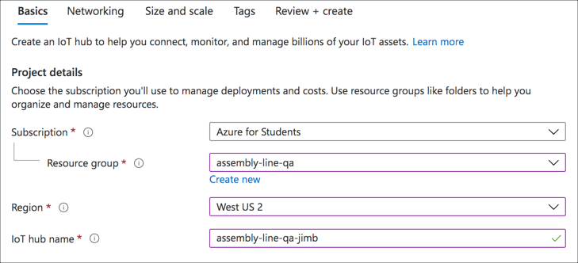
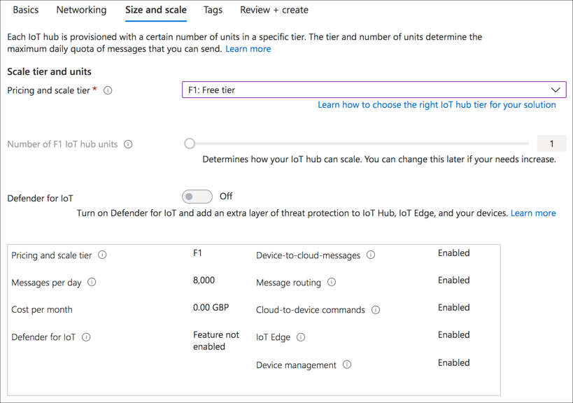
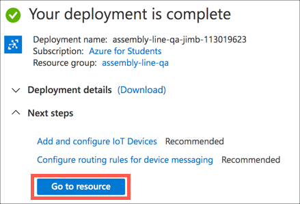
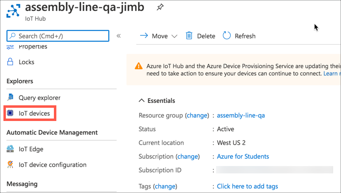
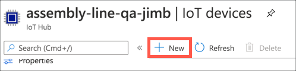
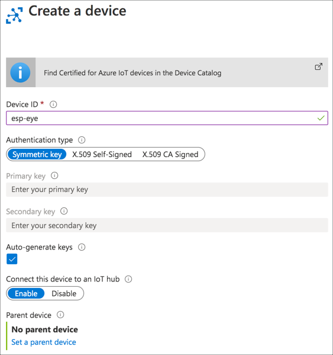
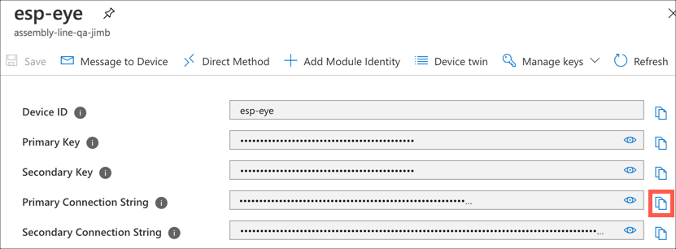
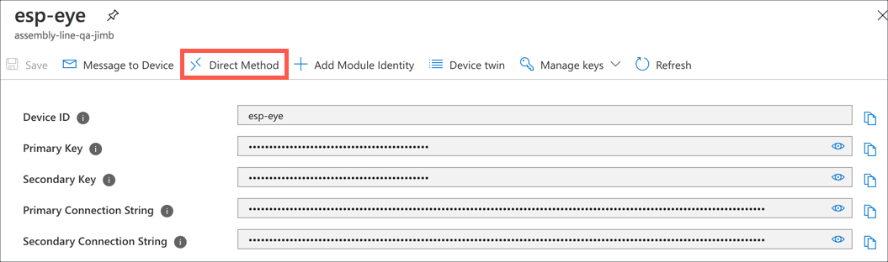
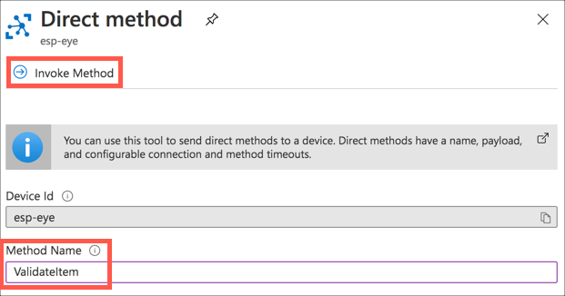
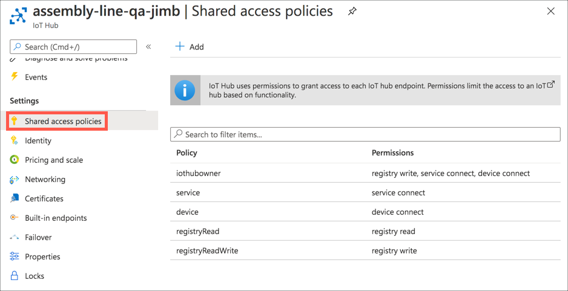

# Control the ESP-EYE via a Raspberry Pi and IoT Hub

In the [previous step](./classify-esp-eye.md) you called the image classifier from the ESP-EYE app to classify items on the assembly line.

In this step you will control the ESP-EYE via a Raspberry Pi and Azure IoT Hub.

## Azure IoT Hub

IoT Hub is a managed service, hosted in the cloud, that acts as a central message hub for bi-directional communication between your IoT application and the devices it manages. You can use Azure IoT Hub to build IoT solutions with reliable and secure communications between millions of IoT devices and a cloud-hosted solution backend. You can connect virtually any device to IoT Hub.

Azure IoT Hub is secure in that only authenticated devices can connect to it. These devices can either be pre-authenticated and set up inside IoT Hub up front by creating a device identity, or they can authenticate themselves later using a device provisioning service. For this lab, the device will be pre-authenticated up front.

In an industrial setting, something on the assembly line will trigger the image being captured and run against the image classifier. For this prototype, the Raspberry Pi will control this via invoking a direct method on the ESP-EYE through the IoT Hub, replacing the web page.

## Set up the IoT hub

An Azure IoT Hub resource can be configured from the Azure portal.

### Create the IoT Hub resource

1. From your browser, navigate to [portal.azure.com/#create/Microsoft.IotHub](https://portal.azure.com/?WT.mc_id=academic-7372-jabenn#create/Microsoft.IotHub)

1. In the *Basics* tab, enter the required details:

    1. Select your Azure subscription

    1. Select the `assembly-line-qa` resource group that you created earlier for your Custom Vision resource

    1. Select the location closest to you

    1. For the *IoT hub name*, enter a unique name. This needs to be globally unique as it will form part of the URL for the connection string. Use something like `assembly-line-qa-yourname` replacing `yourname` with your name.

    

1. Select the **Next: Networking >** button

1. Leave the networking settings as their default values, and select the **Next: Size and scale >** button

1. Set the *Pricing and scale tier* to  `F1: Free tier`. This is a free tier allowing you to send up to 8,000 messages a day. You can read more about the pricing tiers in the [Azure IoT Hub pricing page](https://azure.microsoft.com/pricing/details/iot-hub/?WT.mc_id=academic-7372-jabenn).

    > You can only have one free tier of IoT Hub per subscription, so if you already have a free tier IoT Hub, select the S1 standard tier as the Free and Standard tiers supports the features needed for this lab, the basic tier does not.

    

1. Select the **Review + Create** button, then the **Create** button

The deployment will begin, and you will be notified once it is complete.

### Create the IoT Hub device

Once the hub has been created, you can create a device inside the hub for the ESP-EYE.

1. Once the IoT Hub deployment is complete, select the **Go to resource** button

    

1. This will open a blade for the IoT Hub. From the side menu, select *Explorers -> IoT devices*

    

1. Select the **+ New** button

    

1. Fill in the new device details:

    1. Set the *Device id* to be `esp-eye`

    1. Make sure the *Authentication type* is set to  `Symmetric key`, *Auto-generate keys* is checked and *Connect this device to an IoT hub* is set to `Enabled`

    

1. Select the **Save** button

### Get the connection string

Once the device has been created, the blade will return to the devices list and the new device will be shown.

> If the new device is not shown in the list, select the **Refresh** button

This device is the ESP-EYE, so for the ESP-EYE to connect to the IoT Hub as this device, it needs the connection string. This is made up of 3 parts - the URL of the IoT Hub, the device id, and a secret key.

1. Select the new `esp-eye` device in the list

1. Copy the *Primary Connection String* using the **Copy to clipboard** button, and keep a note of this somewhere

    

## Add the IoT Hub code to the ESP-EYE

The next step is for the ESP-EYE to connect to the IoT Hub and listen for a direct method call.

Devices can interact with an IoT Hub in a number of ways:

* Device to cloud messages (also know as telemetry) - messages sent from the device to the IoT Hub, usually carrying transient data such as telemetry values.
* Cloud to device messages - messages sent from the IoT Hub to the device, again carrying transient data that doesn't matter if it is lost if the device is offline.
* Direct methods - messages sent from the IoT Hub to the device instructing it to carry out an action. A response from the device is expected and the direct method call will give an error if no response, or an error response is received.
* Device twins - JSON documents kept synchronized between the device and the IoT Hub. If the device is offline when this is updated by the hub, updates will be downloaded when the device re-connects

In this lab, a direct method will be invoked from the IoT Hub to instruct the device to take and classify a photo.

You can find all the code for this in the [code/pi-control/esp-eye](../code/pi-control/esp-eye) folder.

### Add the libraries

There are Arduino libraries that can be used so that the ESP-EYE can connect to an IoT Hub.

1. Launch VS Code and open the ESP-EYE project if it is not already open

1. Open the `platformio.ini` file from the root of the project

1. Update the `lib-deps` to include 4 additional Azure Arduino libraries, as well as removing the `ESP Async WebServer` library as this is no longer needed:

    ```sh
    lib_deps =
      esp32-camera
      ArduinoJson
      arduino-libraries/AzureIoTHub
      azure/AzureIoTProtocol_MQTT
      azure/AzureIoTUtility
      azure/AzureIoTSocket_WiFi
    ```

    The `arduino-libraries/AzureIoTHub` library is the core IoT Hub library. It depends on the `azure/AzureIoTProtocol_MQTT` library to allow it to communicate with the IoT Hub using the [MQTT protocol](https://docs.microsoft.com/azure/iot-hub/iot-hub-mqtt-support?WT.mc_id=academic-7372-jabenn), the `azure/AzureIoTSocket_WiFi` library to use the ESP32 WiFi, and the `azure/AzureIoTUtility` library to provide so generic IoT utility functions.

1. Add another entry to the file to specify some build flags:

    ```sh
    ; Build options
    build_flags =
        -w
        -DDONT_USE_UPLOADTOBLOB
    ```

    The `-w` flag removes warnings that come from the Arduino libraries. The `-DDONT_USE_UPLOADTOBLOB` flag adds the `DONT_USE_UPLOADTOBLOB` compiler directive to disable blob support, something not needed here.

### Add the code

The new code will replace the web server with an IoT Hub service that will listen for the direct method invocation and respond to it.

#### Add the connection string

The connection string is another secret.

1. Open the `Config.h` file in the `src` folder

1. Add the following code just below the prediction key and URL declarations:

    ```cpp
    // The device connection string comes from Azure IoT Hub
    // Set these to the value for your device, not the Hub
    const char * const deviceConnectionString = "<Device connection string>";
    ```

    Replace `<Device connection string>` with the connection string for the `esp-eye` device you copied earlier.

#### Add the IoT Hub service

1. In the `src` folder, create two files - `IoTHubService.h` and `IoTHubService.cpp`

1. Add the following code to the `IoTHubService.h` header file:

    ```cpp
    #ifndef _IOTHUBSERVICE_H_
    #define _IOTHUBSERVICE_H_

    #include "Camera.h"
    #include "ImageClassifier.h"

    #include <AzureIoTHub.h>
    #include <string>

    using namespace std;

    /**
     * @brief A class that handles interaction with the Azure IoT Hub.
     */
    class IoTHubService
    {
    public:
        /**
         * @brief Create the class, making a connection to Azure IoT Hub and waiting for commands
         */
        IoTHubService();

        /**
         * @brief Allocate some time to the IoT Hub connection to process messages coming in and out
         */
        void DoWork();

        /**
         * @brief Take a picture with the camera and send it to the classifier
         *
         * @return The classification result
         */
        string TakeImageAndClassify();

    private:
        IOTHUB_DEVICE_CLIENT_LL_HANDLE _device_ll_handle;
        Camera _camera;
        ImageClassifier _imageClassifier;
    };

    #endif
    ```

    This code defines the `IoTHubService` class. The `DoWork` method is like a message pump for the IoT Hub connection, giving it time to process any messages received from the IoT Hub from the network buffers. This library doesn't assume it can run multi-threaded, so it is up to the calling code to allow time for receiving data. The `TakeImageAndClassify` method is used by a direct method callback to take a photo and classify the image.

    The class also has private fields for the camera helper, image classifier helper, and an `IOTHUB_DEVICE_CLIENT_LL_HANDLE`, which is a handle to an IoT Hub device client, used by the IoT Hub libraries.

1. Add the following code to the `IoTHubService.cpp` file:

    ```cpp
    #include "IoTHubService.h"
    #include "Config.h"

    #include <Arduino.h>
    #include <AzureIoTProtocol_MQTT.h>
    #include <AzureIoTSocket_WiFi.h>
    #include <Esp.h>
    #include <iothubtransportmqtt.h>
    #include <WiFiClientSecure.h>

    const IOTHUB_CLIENT_TRANSPORT_PROVIDER protocol = MQTT_Protocol;
    const string ERROR_MESSAGE = "Error";

    // A helper method to build a response in the format that IoT Hub expects
    static void BuildResult(const char *result, unsigned char **response, size_t *response_size)
    {
        // Create a JSON document with the classification result
        char resultBuff[128];
        sprintf(resultBuff, "{\"Result\":\"%s\"}", result);

        // Set the size of the response
        *response_size = strlen(resultBuff);

        // Allocate memory for the response, and copy the values into the allocated memory
        *response = (unsigned char*)malloc(*response_size);
        memcpy(*response, resultBuff, *response_size);
    }

    // A callback used when the IoT Hub invokes a direct method
    // This is a static method as opposed to a method on the class so it can be pass to the
    // IoT hub configuration
    static int DirectMethodCallback(const char *method_name, const unsigned char *payload, size_t size, unsigned char **response, size_t *response_size, void *userContextCallback)
    {
        // Log the direct method received
        Serial.printf("Direct method received %s\r\n", method_name);

        // The userContextCallback is the IoT Hub Service, so cast it so it can be used
        IoTHubService *iotHubService = (IoTHubService*)userContextCallback;

        // We only support the ValidateItem method, any other method calls return an error status
        if (strcmp(method_name, "ValidateItem") == 0)
        {
            // Take an image and classify it
            string classification = iotHubService->TakeImageAndClassify();

            // If the classification gives an error, return the error
            if (classification == ERROR_MESSAGE)
            {
                BuildResult("Error classifying item", response, response_size);
                return IOTHUB_CLIENT_ERROR;
            }

            // Return the classification result
            BuildResult(classification.c_str(), response, response_size);
            return IOTHUB_CLIENT_OK;
        }
        else
        {
            BuildResult("Method is not supported", response, response_size);
            return IOTHUB_CLIENT_ERROR;
        }
    }

    IoTHubService::IoTHubService() : _camera(),
                                     _imageClassifier()
    {
        // Used to initialize IoTHub SDK subsystem
        IoTHub_Init();

        // Create the client from the connection string
        _device_ll_handle = IoTHubDeviceClient_LL_CreateFromConnectionString(deviceConnectionString, protocol);

        Serial.println("Connected to IoT Hub!");

        // If the client connection fails, report an error and restart the device
        if (_device_ll_handle == NULL)
        {
            Serial.println("Error AZ002: Failure creating Iothub device. Hint: Check your connection string.");
            ESP.restart();
        }

        // Set any options that are necessary.
        // For available options please see the iothub_sdk_options.md documentation in the main C SDK
        // turn off diagnostic sampling
        int diag_off = 1;
        IoTHubDeviceClient_LL_SetOption(_device_ll_handle, OPTION_DIAGNOSTIC_SAMPLING_PERCENTAGE, &diag_off);

        bool traceOn = true;
        IoTHubDeviceClient_LL_SetOption(_device_ll_handle, OPTION_LOG_TRACE, &traceOn);

        // Setting the Trusted Certificate.
        IoTHubDeviceClient_LL_SetOption(_device_ll_handle, OPTION_TRUSTED_CERT, certificates);

        //Setting the auto URL Encoder (recommended for MQTT). Please use this option unless
        //you are URL Encoding inputs yourself.
        //ONLY valid for use with MQTT
        bool urlEncodeOn = true;
        IoTHubDeviceClient_LL_SetOption(_device_ll_handle, OPTION_AUTO_URL_ENCODE_DECODE, &urlEncodeOn);

        // Setting method call back, so we can receive direct methods.
        IoTHubClient_LL_SetDeviceMethodCallback(_device_ll_handle, DirectMethodCallback, this);
    }

    // Let the IoT Hub do whatever work is needed to send or receive messages
    void IoTHubService::DoWork()
    {
        // Let the IoT Hub do whatever work is needed to send or receive messages
        IoTHubDeviceClient_LL_DoWork(_device_ll_handle);
    }

    // Takes an image using the camera and classifies it, returning the classification result
    string IoTHubService::TakeImageAndClassify()
    {
        // Take a photo with the camera
        Serial.println("Taking a photo...");
        camera_fb_t *fb = _camera.TakePhoto();

        // Verify the photo was taken
        if (!fb)
        {
            Serial.println("Camera capture failed");
            return "Error";
        }

        // Classify the photo
        string result = _imageClassifier.ClassifyImage(fb);

        // Release the frame buffer to free up the memory
        _camera.ReleaseFrameBuffer(fb);

        // Return the classification result
        return result;
    }
    ```

    The `IoTHubService` constructor initializes the IoT Hub client code, then connects over MQTT using the connection string from the config file. The resulting handle from the connection is stored in the class field and used to set up the client code. If the connection fails, a message is reported to the serial port and hte device rebooted. Flags are set to configure the connection, then a `DirectMethodCallback` callback method is set for when a direct method is received. This callback needs to be a static method, but when it is set up, a context value can be set that gets passed to the callback method. The context is a pointer to the IoT Hub service.

    When a direct method is invoked, the callback method is called, passing the direct method details, as well as the context to the call. The callback checks the name of the direct method, and only accepts `ValidateItem`, giving an error if a different method is called. The context is case to an `IoTHubService` and the public `TakeImageAndClassify` method is called to take the photo using the `Camera` class and classify it using the `ImageClassifier` class. After classification, a result is created as JSON giving the result of the classification, and returning this from the direct method call to the IoT Hub. This result has the following format:

      ```json
      {
          "Result": "<result>"
      }
      ```

    where `<result>` is either `pass` or `fail`.

    The `DoWork` method uses an IoT Hub API method to process any pending network requests.

#### Replace the web server with the IoT Hub service

1. Delete the `WebServer.h` and `WebServer.cpp` files from the `src` folder

1. Open the `main.cpp` file

1. Replace the `#include` for the web server with one for the IoT Hub service:

    ```cpp
    #include "IoTHubService.h"
    ```

1. Replace the declaration of the `webserver` variable with an IoT Hub service variable:

    ```cpp
    // The Connection to IoT Hub
    IoTHubService *iotHubService;
    ```

1. Replace the line in the `setup` function that initializes the web server variable to one that initializes the IoT Hub service:

    ```cpp
    // Initialize the IoT Hub service to respond to messages
    iotHubService = new IoTHubService();
    ```

1. In the `loop` method, add a call to the `DoWork` method on the IoT Hub Service, to allow it to process incoming direct method invocations

    ```cpp
    void loop()
    {
      iotHubService->DoWork();
      delay(1);

      // Ensure the CPU watchdog doesn't get triggered by processing the images
      TIMERG0.wdt_wprotect = TIMG_WDT_WKEY_VALUE;
      TIMERG0.wdt_feed = 1;
      TIMERG0.wdt_wprotect = 0;
    }
    ```

1. When connecting, the time needs to be set on the ESP-EYE otherwise the keys used to sign the connection will be invalid (they are time based). Add the following code above the `setup` function to declare some constants for a call to an [NTP](http://www.ntp.org) server to get the current time.

    ```cpp
    // The time needs to be set, so set up details for an NTP connection
    const char* ntpServer = "pool.ntp.org";
    const long  gmtOffset_sec = 0;
    const int   daylightOffset_sec = 0;
    ```

1. In the `setup` function *before* the `iotHubServer` is initialized, add the following code to configure the time on the ESP-EYE from the NTP server:

    ```cpp
    //init and get the time
    configTime(gmtOffset_sec, daylightOffset_sec, ntpServer);
    ```

### Test the code via the Azure Portal

The code can be tested by invoking the direct method from the Azure Portal.

1. Build and upload the code to the ESP-EYE, and monitor the output in the serial monitor. You will see details of the connection to IoT Hub.

```output
Connecting to WiFi...
Connected to IoT Hub!
-> 18:00:06 CONNECT | VER: 4 | KEEPALIVE: 240 | FLAGS: 192 | USERNAME: assembly-line-qa-jimb.azure-devices.net/esp-eye/?api-version=2019-10-01&DeviceClientType=iothubclient%2f1.3.9%20(arduino) | PWD: XXXX | CLEAN: 0
<- 18:00:06 CONNACK | SESSION_PRESENT: false | RETURN_CODE: 0x0
-> 18:00:06 SUBSCRIBE | PACKET_ID: 2 | TOPIC_NAME: $iothub/methods/POST/# | QOS: 0
<- 18:00:06 SUBACK | PACKET_ID: 2 | RETURN_CODE: 0
```

1. From the `esp-ey` device blade in the Azure portal, select the **Direct method** button

    

1. The direct method to invoke is `ValidateItem`, so enter this into the *Method Name* field, then select the **Invoke Method** button

    

1. The method will be invoked, and you will see the result in the *Result* pane as a JSON document

    

1. You will also see the direct method invocation and the result in the serial monitor

    ```output
    Direct method received ValidateItem
    Taking a photo...
    HTTPS Status = 200, content_length = 382
    Response:
      {
        "id":"xxxxxxxx-xxxx-xxxx-xxxx-xxxxxxxxxxxx",
        "project":"xxxxxxxx-xxxx-xxxx-xxxx-xxxxxxxxxxxx",
        "iteration":"xxxxxxxx-xxxx-xxxx-xxxx-xxxxxxxxxxxx",
        "created":"2020-12-01T01:40:59.419Z",
        "predictions":
          [
            {
              "probability":0.9999999,
              "tagId":"xxxxxxxx-xxxx-xxxx-xxxx-xxxxxxxxxxxx",
              "tagName":"fail"
            },
            {
              "probability":1.3282752E-07,
              "tagId":"xxxxxxxx-xxxx-xxxx-xxxx-xxxxxxxxxxxx",
              "tagName":"pass"
            }
          ]
      }
    Top prediction = fail
    ```

    The output shown above has been prettified to show the JSON clearer. In this case the `pass` tag had a probability of 1.3282752E-07 or 0.0000132% probability of being the right tag, and the `fail` tag has a probability of 0.9999999, or 99.99999% probability of being the right tag. The top result is returned as `fail`.

1. Repeat this the with item on the assembly line in both the good and broken state and see the results

## Set up the Pi

The Pi can now be used to control the ESP-EYE by connecting to the IoT Hub and invoking the direct method for the device.

You will need to set up your Pi in your preferred way with the latest version of the Raspberry Pi OS running on it (either the full desktop version, or Lite). You can either run VS Code directly on the Pi by [following these instructions](https://dev.to/azure/run-visual-studio-code-on-a-raspberry-pi-1lk0), or connect using the Remote SSH extension [using these instructions](https://github.com/microsoft/rpi-resources/tree/master/remote-coding). Whichever method you are using, you will need to install the [PyLance extension](https://devblogs.microsoft.com/python/announcing-pylance-fast-feature-rich-language-support-for-python-in-visual-studio-code/?WT.mc_id=academic-7372-jabenn), either locally if you are running VS Code on the Pi, or in the remote session if you are using Remote SSH.

### Get the IoT Hub connection string

The ESP-EYE needed to connect to the IoT Hub as a device. To invoke direct methods on this device, the Pi needs to connect to the IoT hub directly with relevant permissions to discover the `esp-eye` device and invoke the direct method. These permissions are controlled by IoT Hub level connection strings.

1. From the Azure Portal, navigate to the IoT Hub

1. Select *Settings -> Shared Access Policies* from the side menu

    

1. Select the *service* policy. A blade will appear on the side with details of this policy including the connection strings. Use the **Copy to clipboard** button to copy the *Primary key*, and keep a copy of this somewhere as you will need it later in this step.

    

### Code the Pi to connect to Azure IoT Hub

1. On the Pi, make a folder called `AssemblyLineControl`, and open this in VS Code either running locally on the Pi, or connected via the Remote SSH extension.

1. Create a file in this folder for the Python pip package requirements called `requirements.txt`

1. Add the following to this file:

    ```sh
    azure-iot-hub
    python-dotenv
    ```

    The `azure-iot-hub` package provides code to connect to IoT Hub and interact with devices, such as invoking the direct method needed. The `python-dotenv` package allows secrets to be loaded from a `.env` environment variable file instead of being stored in source code control.

1. If the VS Code terminal isn't open, open it by pressing `Ctrl+~` or selecting *Terminal -> New Terminal*

1. Install the pip packages by running the following command in the terminal

    ```sh
    pip3 install -r requirements.txt
    ```

1. Create a new file called `.env`. This file will contain secrets for the app, namely the IoT Hub connection string and the device id. This file should not be checked into source code control, and the default .gitignore for Python should ignore these files.

1. Add the following to the file:

    ```sh
    IOTHUB_DEVICE_ID=esp-eye
    IOTHUB_CONNECTION_STRING=<service connection string>
    ```

    Replace `<service connection string>` with the connection string for the service policy for the IoT Hub.

1. Create a new file for the application code called `app.py`

1. Add the following code to this file:

    ```sh
    import os
    import time
    from dotenv import load_dotenv
    from azure.iot.hub import IoTHubRegistryManager
    from azure.iot.hub.models import CloudToDeviceMethod

    # Load the connection string and device id from the .env file
    load_dotenv()
    iothub_connection_str = os.getenv("IOTHUB_CONNECTION_STRING")
    device_id = os.getenv("IOTHUB_DEVICE_ID")

    # Connect to the IoT Hub
    print("Connecting to IoT Hub...")
    registry_manager = IoTHubRegistryManager(iothub_connection_str)
    print("Connected to IoT Hub!")

    # Invoke a direct method on the device to validate the item by
    # taking a picture and classifying it as a pass or fail
    def invoke_device_method() -> str:
        print("Validating item...")

        # Create a method call with a long response time to allow the image classifier to run
        deviceMethod = CloudToDeviceMethod(method_name="ValidateItem", response_timeout_in_seconds=30, connect_timeout_in_seconds=30)

        # Invoke the method on the device
        method_result = registry_manager.invoke_device_method(device_id, deviceMethod)

        # Return the result from the method call
        return method_result.payload['Result']

    # Loop forever waiting for a key press
    while True:
        # Wait for enter to be pressed
        input("Press Enter to validate the item on the assembly line...")

        # Invoke the device method and display the result
        method_result = invoke_device_method()
        print("Validate item result", method_result)
    ```

1. Save all the files (you can turn on auto save from the *File* menu to avoid having to remember to save files)

### Test the code

1. From the terminal, run the following command to run the app:

    ```sh
    python3 app.py
    ```

The app will launch and connect to the IoT Hub. Press the `Enter` key to invoke the direct method to validate the item on the assembly line and see the result in the terminal.

```output
pi@raspberrypi:~/AssemblyLineControl $ python3 app.py 
Connecting to IoT Hub...
Connected to IoT Hub!
Press Enter to validate the item on the assembly line...
Validating item...
Validate item result fail
Press Enter to validate the item on the assembly line...
Validating item...
Validate item result pass
Press Enter to validate the item on the assembly line...
```

## Next steps

In this step you controlled the ESP-EYE via a Raspberry Pi and Azure IoT Hub.

You have two choices for a next step:

* [Control the Pi with a button and LEDs using a Grove Pi+ kit](./pi-button-led.md)
* [Run the image classifier on the Raspberry Pi using IoT Edge](./edge-classifier.md)
