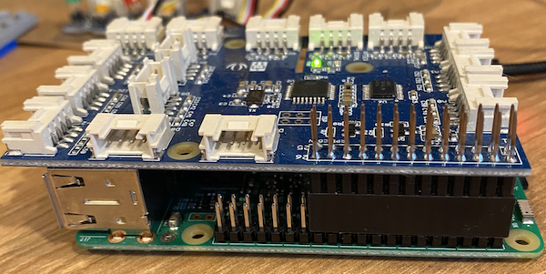
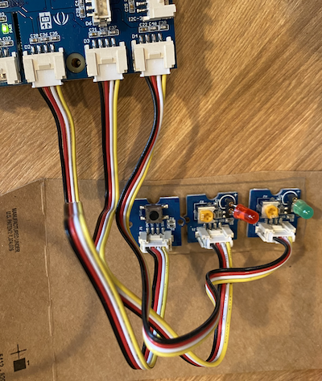
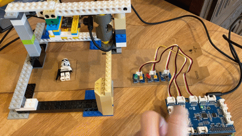

# Control the Pi with a button and LEDs

In the [previous step](./iot-hub-control.md) you controlled the ESP-EYE via a Raspberry Pi and Azure IoT Hub.

In this step, you will control the Pi with a button and LEDs using a Grove Pi+ kit.

## Grove Pi+

The [Grove Pi+ kit](https://www.seeedstudio.com/GrovePi-Starter-Kit-for-Raspberry-Pi-A-B-B-2-3-CE-certified.html) consists of a hat that connects to the GPIO pins on the Raspberry Pi, and a set of sensors and components that connect to standard ports on the hat with standard cables.

The Grove Pi+ has a button that can be used to trigger the item validation, as well as LEDs that can be lit to show the result as a pass or fail.

## Set up the Grove Pi+

The Grove Pi+ consists of the hardware component, as well as some software that needs to be installed to control the components using Python.

### Connect the hardware

1. Power off the Pi

1. Fit the Grove Pi+ hat to the GPIO pins on the Pi. The hat has less sockets than the Pi has pins, so it needs to start at the pins closets to the SD card slot.

    

1. Connect a button to port D2 on the hat using one of the Grove connector cables

1. Fit a red LED to a holder. The flat side of the LED needs to be connected to the negative socket. The LED boards have a variable resistor for controlling the brightness, so set this half way to ensure the LED is visible when lit.

1. Repeat the process with a green LED

1. Connect the red LED to port D3, and the green LED to port D4

    

### Install the software

Grove provides software to allow your apps to work with the hat and sensors, including Python libraries.

1. From the Visual Studio Code terminal connected to the Pi, run the following command to install the Grove libraries:

    ```sh
    sudo curl -kL dexterindustries.com/update_grovepi | bash
    ```

    This will ensure the Pi is correctly configured to work with the Grove Pi+, and install all necessary software and Python packages

    > If you don't see the terminal in the bottom of the screen, create a new terminal by selecting **Terminal -> New Terminal**

1. Reboot the Pi using the following command:

    ```sh
    sudo reboot
    ```

Whilst the Pi is rebooting, VS Code will attempt to reconnect. It will reconnect when it can, and you many need to re-enter your password.

Once the Pi is rebooted, it is recommended to update the firmware on the Grove Pi+ to the latest version.

1. From the Visual Studio Code terminal connected to the Pi, run the following command to get the latest Grove code:

    ```sh
    git clone https://github.com/DexterInd/GrovePi.git
    ```

    This will clone a GitHub repository with Grove Pi code into a folder called `GrovePi`

1. Change to the `Firmware` folder in the newly created `GrovePi` folder:

    ```sh
    cd GrovePi/Firmware
    ```

1. Update the firmware using the following command

    ```sh
    sudo ./firmware_update.sh
    ```

1. Reboot the Pi using the following command:

    ```sh
    sudo reboot
    ```

Whilst the Pi is rebooting, VS Code will attempt to reconnect. It will reconnect when it can, and you many need to re-enter your password.

### Pi 4/Pi 400 and above - Downgrade your Pi speed

If you are using a Raspberry Pi 4 or 400 you will run into problems with the Grove Pi+. It's not fully compatible with the speed of the newer Pis. The good news is you can 'underclock' the Pi to reduce it's speed slightly making the Pi+ work.

1. From the Visual Studio Code terminal connected to the Pi, run the following command to edit the boot configuration using the terminal based Nano editor:

    ```sh
    sudo nano /boot/config.txt
    ```

1. Look for a line containing `arm_freq=700`. The number may be higher than 700.

1. This line is most likely commented out by starting with a `#`. Remove the `#`.

1. Set the value to `600`

1. The final line should be:

    ```sh
    arm_freq=600
    ```

1. Press `Ctrl+x` to exit Nano. When asked if you want to save press `Y`, then press `return` to overwrite the original file.

1. Reboot the Pi using the following command:

    ```sh
    sudo reboot
    ```

Whilst the Pi is rebooting, VS Code will attempt to reconnect. It will reconnect when it can, and you many need to re-enter your password.

## Program the Pi

The Pi code can now be changed to validate the item on the assembly line when the button is pressed, instead of when a key is pressed, and show the output using LEDs instead of the console.

You can find all the code for this in the [code/pi-control-with-grove/pi](../code/pi-control-with-grove/pi) folder.

1. From the Pi, open the `app.py` file

1. Replace the code in this file with the following:

    ```python
    import os
    import grovepi
    import time
    from dotenv import load_dotenv
    from azure.iot.hub import IoTHubRegistryManager
    from azure.iot.hub.models import CloudToDeviceMethod

    # Load the connection string and device id from the .env file
    load_dotenv()
    iothub_connection_str = os.getenv("IOTHUB_CONNECTION_STRING")
    device_id = os.getenv("IOTHUB_DEVICE_ID")

    print("Configuring ports...")

    # Configure the ports for the LEDs and button
    red_led_port = 3
    green_led_port = 4
    button_port = 2
    grovepi.pinMode(red_led_port, "OUTPUT")
    grovepi.pinMode(green_led_port, "OUTPUT")
    grovepi.pinMode(button_port, "INPUT")

    time.sleep(1)

    # LEDs are turned on by writing a digital value of 1, off by writing 0
    def set_led(led, on):
        if on:
            time.sleep(0.1)
            grovepi.digitalWrite(led, 1)
        else:
            time.sleep(0.1)
            grovepi.digitalWrite(led, 0)

    print("Ports configured, flashing LEDs")
    # Flash on then off the LEDs
    set_led(red_led_port, True)
    set_led(green_led_port, True)
    time.sleep(1)
    set_led(red_led_port, False)
    set_led(green_led_port, False)
    print("LEDs turned off")

    # Connect to the IoT Hub
    print("Connecting to IoT Hub...")
    registry_manager = IoTHubRegistryManager(iothub_connection_str)
    print("Connected to IoT Hub!")

    # Invoke a direct method on the device to validate the item by
    # taking a picture and classifying it as a pass or fail
    def invoke_device_method() -> str:
        print("Validating item...")

        # Create a method call with a long response time to allow the image classifier to run
        deviceMethod = CloudToDeviceMethod(method_name="ValidateItem", response_timeout_in_seconds=30, connect_timeout_in_seconds=30)

        # Invoke the method on the device
        method_result = registry_manager.invoke_device_method(device_id, deviceMethod)

        # Return the result from the method call
        return method_result.payload['Result']

    # Turn the LEDs on or off depending on the result
    # pass - turn the green LED on and red off
    # Anything else - turn the green LED off and red on
    def set_leds(result:str):
        print("Setting leds for a result of", result)

        set_led(red_led_port, result != "pass")
        set_led(green_led_port, result == "pass")

    # Get the current time - this is used to avoid a long button press
    # being seen as multiple presses. Ignore any button press less than 
    # # 2 seconds after the previous one
    last_button_time = 0

    # Loop forever waiting for button presses
    print("Waiting for button press...")
    while True:
        # Check if the button is pressed by reading the digital value from the
        # port. 1 is pressed, 0 is not
        if grovepi.digitalRead(button_port) == 1:
            if  (time.time() - last_button_time) < 2:
                print("Button pressed too soon, ignoring")
            else:
                print("Button pressed")

                # Turn the LEDs off whilst we process
                set_led(red_led_port, False)
                set_led(green_led_port, False)

                # Invoke the method on the device
                method_result = invoke_device_method()

                # Light the relevant LEDs
                set_leds(method_result)

                # Get the button press time to avoid multiple calls from a long press
                last_button_time = time.time()
                print("Waiting for button press...")

        # Sleep for 10 ms before checking the button
        time.sleep(.01)
    ```

    This code interacts with IoT Hub the same way as before, but uses the Grove button and LEDs. It starts by setting up the hardware and flashing the LEDs, then polls for a button press. Button presses are found by reading the value of the signal from the button - 1 for pressed, 0 for not pressed. If it is pressed the time is checked to stop a slightly long button press being detected as multiple presses. If the button is pressed, the direct method is invoked, and the results are shown using the LEDs, lighting the green LED for pass and red for fail.

## Test it out

1. From the terminal, run the following command to run the app:

    ```sh
    python3 app.py
    ```

    As the app starts up, both LEDs with light briefly.

1. Press the button to validate the item and you will see the relevant LED light up and output to the console

    ```output
    pi@raspberrypi:~/AssemblyLineControl $ python3 app.py
    Configuring ports...
    Ports configured, flashing LEDs
    LEDs turned off
    Connecting to IoT Hub...
    Connected to IoT Hub!
    Waiting for button press...
    Button pressed
    Validating item...
    Setting leds for a result of pass
    Waiting for button press...
    ```

1. Repeat with the item in the good and broken states and see the relevant LEDs light up

    

## Next steps

In this step, you controlled the Pi with a button and LEDs using a Grove Pi+ kit.

In the [next step](./edge-classifier.md), you will run the image classifier on the Raspberry Pi using IoT Edge.
