# Store and visualize pass/fail data using Stream Analytics and Cosmos DB

In the [previous step](./upload-iot-hub.md), you uploaded the result data to Azure IoT Hub.

In this step, you will store and visualize pass/fail data using Stream Analytics and Cosmos DB.

## Azure Stream Analytics

[Azure Stream Analytics](https://azure.microsoft.com/services/stream-analytics/?WT.mc_id=academic-7372-jabenn) is a service that allows you to write queries in a SQL-like language and run them in real-time against a streaming data source. For example you can query the messages sent to an IoT Hub in real time.

The results of this query can then be sent on to other services, such as storing them in a database.

Stream Analytics jobs can also be compiled into IoT Edge modules to run on IoT devices instead of in the cloud.

## Azure Cosmos DB

[Azure Cosmos DB](https://azure.microsoft.com/services/cosmos-db/?WT.mc_id=academic-7372-jabenn) is a fast, scalable, fully managed no-sql database that has global replication, and can be accessed with a range of well-known APIs including SQL, MongoDB or Cassandra. It can be used to store the telemetry data from the IoT Hub via a stream analytics job.

## Set up the Azure services

The Azure Services can be configured via the Azure portal.

### Set up Cosmos DB

1. From your browser, navigate to [portal.azure.com/#create/Microsoft.DocumentDB](https://portal.azure.com/?WT.mc_id=academic-7372-jabenn#create/Microsoft.DocumentDB)

1. In the *Basics* tab, enter the required details:

    1. Select your Azure subscription

    1. Select the `assembly-line-qa` resource group

    1. For the *Account name*, enter a unique name. This needs to be globally unique as it will form part of the URL for the connection string. Use something like `assembly-line-qa-yourname` replacing `yourname` with your name.

    1. Select the `Core (SQL)` *API*

    1. Sel *Notebooks* to `On`. This setting allows Jupyter notebooks to be loaded into Cosmos DB, and you will do this later in this step to visualize the data

    1. Select the location closest to you

    1. Leave the *Capacity Mode* set to `Provisioned throughput`

    1. Set the *Apply Free Tier Discount* setting to `Apply`. This will allow you to run this database for free.

        > You can only use this once per subscription, so if you have another free tier Cosmos DB account then set this to `Do not apply`.

    1. Leave the rest of the value as their defaults

    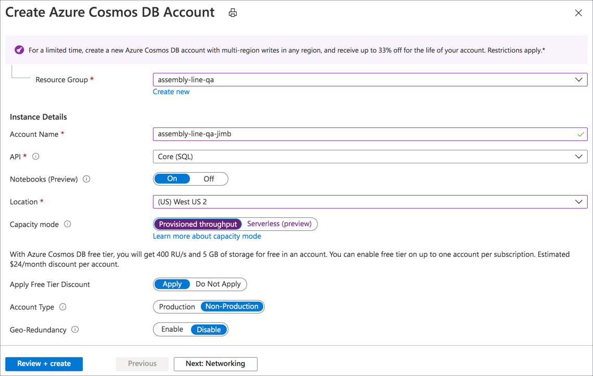

1. Select the **Review + Create** button, then the **Create** button

This will take between 5-10 minutes, so whilst this is happening you can set up the Stream Analytics resource.

### Set up Stream Analytics

1. In a separate browser tab, navigate to [portal.azure.com/#create/Microsoft.DocumentDB](https://portal.azure.com/?WT.mc_id=academic-7372-jabenn#create/Microsoft.DocumentDB)

1. Fill in the job details:

    1. Set the *Job Name* to `assembly-line-qa`

    1. Select your Azure subscription

    1. Select the `assembly-line-qa` resource group

    1. Select the location closest to you

    1. Leaving the *Hosting environment* as `Cloud`

    1. Set the *Streaming units* to `1`

    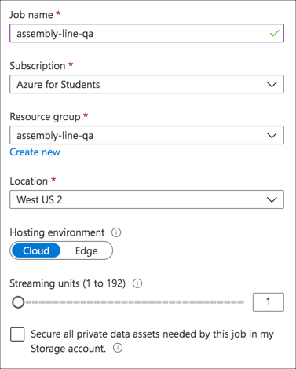

1. Select the **Create** button

The job will be created. Once finished, select the **Go to resource** button.

### Create the Stream Analytics Query

Stream analytics jobs have 3 components - inputs that provide the streaming data, the query that queries or transforms the data in real time, and outputs that the data is sent to. In this lab the input is the IoT Hub, the output is the Cosmos DB database, and the query will simply select all the values from the input and send them to the output.

#### Create the input

1. From the Stream Analytics job in the Azure portal, select the *Job Topology -> Inputs* side menu item

    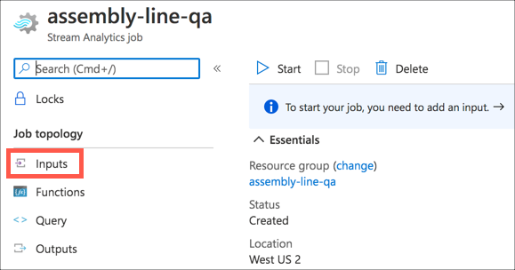

1. Select the **+ Add stream input** button, then select **IoT Hub**

    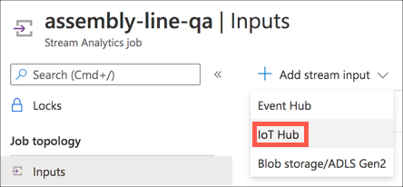

1. Fill in the details in the Input blade:

    1. Set the *Input alias* to `iothub`

    1. Ensure `Select IoT Hub from your subscriptions` is selected

    1. Select your subscription and IoT hub

    1. Leave the rest of the values as the default options

    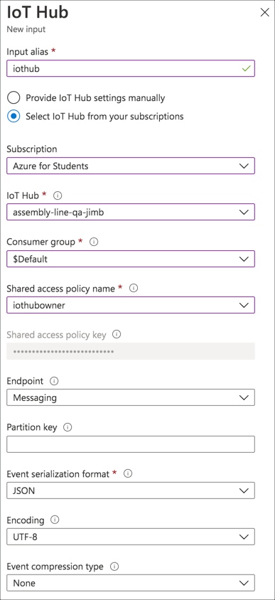

1. Select the **Save** button

#### Create the output

1. Make sure the Cosmos DB account has been deployed. If not, wait till it has finished.

1. From the Stream Analytics job in the Azure portal, select the *Job Topology -> Outputs* side menu item

    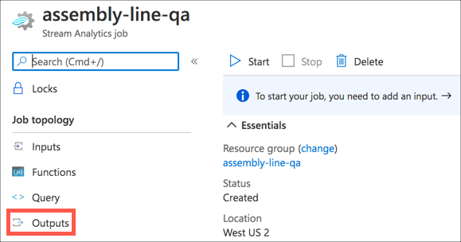

1. Select the **+ Add** button, then select **Cosmos DB**

    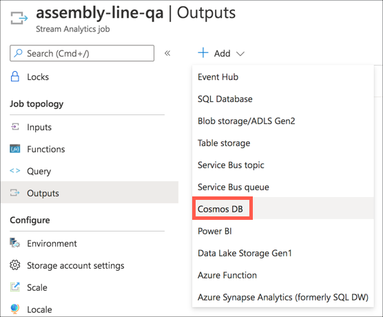

1. Fill in the details in the Output blade:

    1. Set the *Output alias* to `cosmosdb`

    1. Ensure `Select Cosmos DB from your subscriptions` is selected

    1. Select your subscription and Cosmos DB Account

    1. In the *Database* section, select `Create new` and set the value to `Validation`

    1. Set the *Container Name* to `Results`

    1. Leave the *Document ID* as blank

    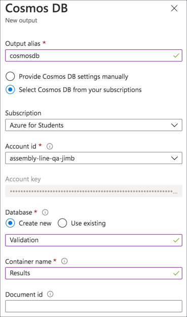

1. Select the **Save** button

#### Create the query

1. From the Stream Analytics job in the Azure portal, select the *Job Topology -> Query* side menu item

    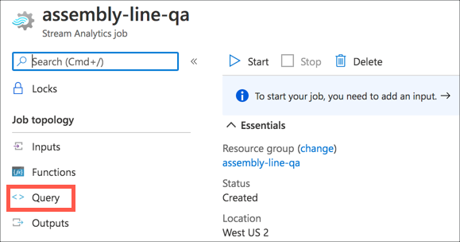

1. Set the query text to the following:

    ```sql
    SELECT
        *
    INTO
        cosmosdb
    FROM
        iothub
    ```

    This will select all the values from the IoT Hub and send them to the Cosmos DB database.

1. Send some data by validating a few items, then select the **Test query** button to validate the query. You will see the results in the *Test results* tab.

    > If you don't have any results, make sure you stopped monitoring the built-in event endpoint from the VS Code output window

    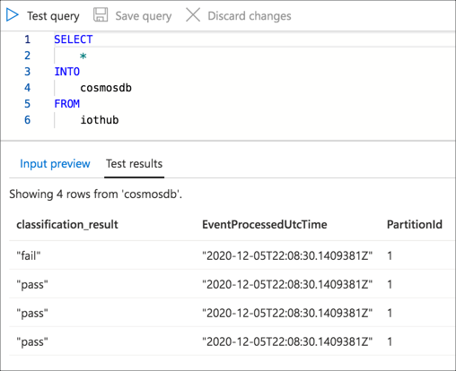

1. Select the **Save query** button

    

### Start the Stream Analytics job

Once the query is ready, the job can be started.

1. Select the *Overview* item from the side menu

    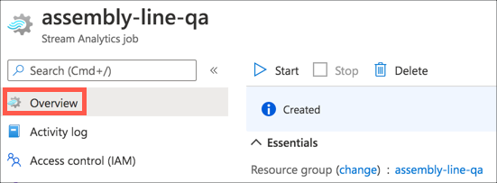

1. Select the **Start** button

    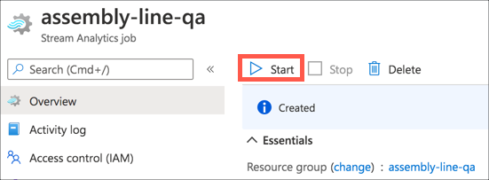

1. The *Start Job* blade will appear. Leave all the options as their default values, then select the **Start** button.

After a few seconds, the job will start.

Run a few validations to generate data.

## Visualize the data

The data from the IoT Hub can be visualized in Cosmos DB.

### View the raw data

1. Navigate to the Cosmos DB account in the Azure Portal

1. Select **Data Explorer**

    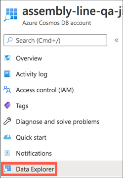

1. You can view the raw data by expanding the *Validation* database in the **DATA** section, then expanding the *Results* collection, then selecting *Items*. Select an item in the list to see the raw JSON.

    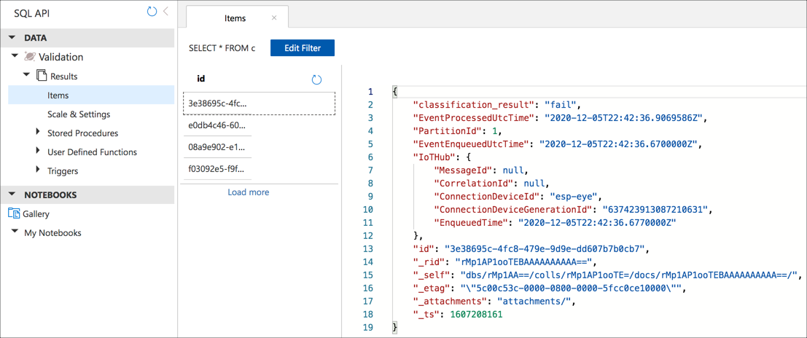

 You can use the data explorer to just see the raw data, or you can visualize data in Cosmos DB using a [Jupyter notebook](https://jupyter.org/) - a document that can contain a mixture of documentation and runnable code. Jupyter notebooks can be run inside of your Cosmos DB account, with access to all yur databases and collections, providing a convenient way to query and visualize data. You can read more on the Jupyter support in the [Built-in Jupyter Notebooks support in Azure Cosmos DB documentation](https://docs.microsoft.com/azure/cosmos-db/cosmosdb-jupyter-notebooks?WT.mc_id=academic-7372-jabenn).

### Visualize the data using a Jupyter notebook

As well as viewing raw data, you can also visualize data in Cosmos DB using a [Jupyter notebook](https://jupyter.org/) - a document that can contain a mixture of documentation and runnable code. Jupyter notebooks can be run inside of your Cosmos DB account, with access to all yur databases and collections, providing a convenient way to query and visualize data. You can read more on the Jupyter support in the [Built-in Jupyter Notebooks support in Azure Cosmos DB documentation](https://docs.microsoft.com/azure/cosmos-db/cosmosdb-jupyter-notebooks?WT.mc_id=academic-7372-jabenn).

1. This repo contains a Jupyter notebook to visualize the results data. It is called [plot_results.ipynb](../code/analytics/cosmosdb_notebook/plot_results.ipynb) and is in the [code/analytics/cosmosdb_notebook](../code/analytics/cosmosdb_notebook) folder. Download this notebook.

1. From the *Data explorer*, expand the **NOTEBOOKS** node

1. Select the **...** button next to *My Notebooks*, then select **Upload File**. The button only appears when your cursor is over the *My Notebooks* section.

    

    > To use Jupyter notebooks in Cosmos DB you need to turn this feature on when creating the account. If you do not see the *My Notebooks* section, then you will need to recreate the Cosmos DB account.

1. Select the **Browse** button next to the file name box and locate the `plot_results.ipynb` file that you downloaded.

1. Select the **Upload** button

    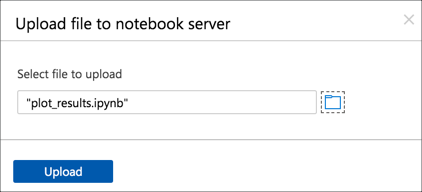

1. The notebook will appear in the *My Notebooks* section. Select it to load it.

    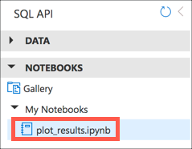

1. Wait for the Kernel to connect - this is the core 'engine' that allows the notebook to run. It is ready when the Kernel selection shows *Python 3*

    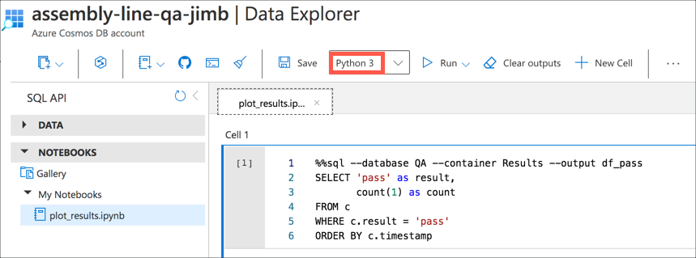

1. From the menu, drop down the *Run* box and select the **Run All** option

    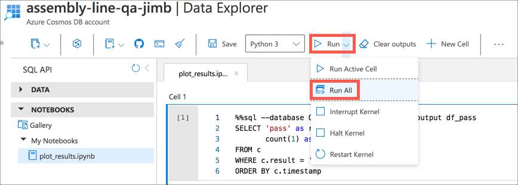

    Jupyter notebooks are made up of cells - boxes that can contain code or documentation. You can run these cells one at a time, or all in order. **Run All** will run them all in order, but feel free to read the documentation in the notebook and try out the cells one by one if you want to dive deeper into how it works.

1. The cells will run. A count of the entries with a `classification_result` of `pass` will be loaded into a data frame called `df_pass`, and a count the entries with a `classification_result` of `fail` will be loaded into a data frame called `df_fail`.

    These data frames will be merged together to give a single data frame with 2 entries - the count of passes and the count of fails.

    This is then plotted on a pie chart.

    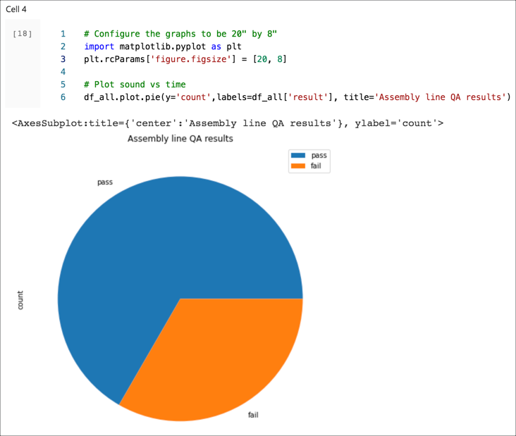

## Next steps

In this step, you stored and visualized pass/fail data using Stream Analytics and Cosmos DB.

In the [next step](./clean-up.md), you will clean up all the resources you used in this lab.
