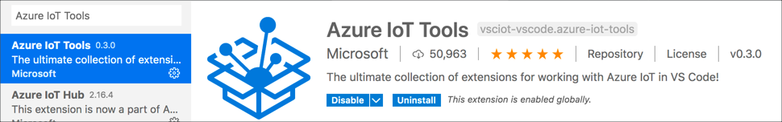
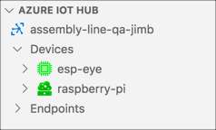
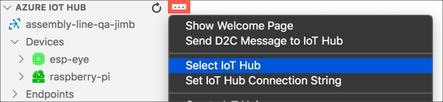
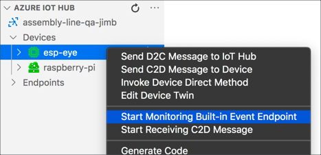

# Upload pass/fail data to IoT Hub

In the [previous step](./edge-classifier.md) you ran the image classifier on the Raspberry Pi using IoT Edge.

In this step, you will upload the result data to Azure IoT Hub.

## IoT Hub telemetry

IoT Hub can be used to gather telemetry - sending data to the IoT Hub from IoT devices including sensor data, or state data. For this lab, the data from the image classification can be sent to the IoT Hub to track how many items passed and how many failed.

This telemetry isn't visualized by IoT Hub - the hub is just a pipeline. Data gets sent to one end of the hubs pipeline, and it can be taken off the other end by other services, and this will be covered later in this lab.

## Code the ESP-EYE

The ESP-EYE can send the telemetry to the Hub whenever it classifies the image.

### Add the code to send the telemetry

You can find this code in the [code/analytics/esp-eye](../code/analytics/esp-eye) folder.

1. Open the ESP-EYE project in VS Code

1. Open the `IoTHubService.h` header file

1. In the `public` class declarations, underneath the `TakeImageAndClassify` method declaration, add a new method to send the telemetry:

    ```cpp
    /**
     * @brief Sends the result of an image classification to the IoT Hub as telemetry
     *
     * @param classificationResult The classification result to send
     */
    void SendTelemetry(string classificationResult);
    ```

    This declares a new method to send the telemetry to the IoT Hub containing the classification result.

1. Open the `IoTHubService.cpp` file

1. Add the definition of the new function to the bottom of this file:

    ```cpp
    void IoTHubService::SendTelemetry(string classificationResult)
    {
        // Create the telemetry JSON data
        string telemetryMessage = "{\"classification_result\":\"" + classificationResult + "\"}";

        // Create an IoT Hub message handle from the telemetry
        IOTHUB_MESSAGE_HANDLE message_handle = IoTHubMessage_CreateFromString(telemetryMessage.c_str());

        Serial.printf("Sending message %s to IoTHub\r\n", telemetryMessage.c_str());

        // Send the data asynchronously to the IoT Hub
        IoTHubDeviceClient_LL_SendEventAsync(_device_ll_handle, message_handle, NULL, NULL);

        // Destroy our copy of the message handle - the send call has it's own copy and will destroy when it completes
        IoTHubMessage_Destroy(message_handle);
    }
    ```

    This code creates a telemetry message as JSON with the classification result in the following format:

    ```json
    {
        "classification_result" : "<result>"
    }
    ```

    The value of `<result>` will be `pass` or `fail`. This message is wrapped up in an IoT Hub message handle, and this message is send asynchronously to the IoT Hub, retrying multiple times if the send fails. The message handle is destroyed - although this destroy call may happen before the message has been sent, the `IoTHubDeviceClient_LL_SendEventAsync` keeps a reference to the handle until it sends successfully.

message handle for the telemetry message

### Call the code to send the telemetry

The telemetry can now be sent every time the image is classified.

1. In the `IoTHubService.cpp` file, find the `DirectMethodCallback` method

1. Change this method to call the `SendTelemetry` method on the `iotHubService` context, passing in the classification result after the classification has been run successfully.

    ```cpp
    // A callback used when the IoT Hub invokes a direct method
    // This is a static method as opposed to a method on the class so it can be pass to the
    // IoT hub configuration
    static int DirectMethodCallback(const char *method_name, const unsigned char *payload, size_t size, unsigned char **response, size_t *response_size, void *userContextCallback)
    {
        // Log the direct method received
        Serial.printf("Direct method received %s\r\n", method_name);

        // The userContextCallback is the IoT Hub Service, so cast it so it can be used
        IoTHubService *iotHubService = (IoTHubService*)userContextCallback;

        // We only support the ValidateItem method, any other method calls return an error status
        if (strcmp(method_name, "ValidateItem") == 0)
        {
            // Take an image and classify it
            string classification = iotHubService->TakeImageAndClassify();

            // If the classification gives an error, return the error
            if (classification == ERROR_MESSAGE)
            {
                BuildResult("Error classifying item", response, response_size);
                return IOTHUB_CLIENT_ERROR;
            }

            // Send telemetry with the classification result
            iotHubService->SendTelemetry(classification);

            // Return the classification result
            BuildResult(classification.c_str(), response, response_size);
            return IOTHUB_CLIENT_OK;
        }
        else
        {
            BuildResult("Method is not supported", response, response_size);
            return IOTHUB_CLIENT_ERROR;
        }
    }
    ```

### Test the code

The telemetry will be set to IoT Hub, and out of the box there is no UI to visualize these messages. There is an extension in VS Code that allows you to monitor for these messages.

1. From VS Code, head to the *Extensions* tab and search for `Azure IoT Tools`

1. Install the *Azure IoT Tools* extension pack

    

1. Once installed, this will add a new item to the VS Code Explorer called *AZURE IOT HUB*

    

1. Select the **...** button (this will only appear when your cursor is over the header bar for the explorer pane), and select the *Select IoT Hub* menu option

    

1. From the options that appear on the command palette, select your subscription and IoT Hub

1. The IoT Hub will be selected and appear in the explorer pane. Expand the *Devices* node to see the `esp-eye` and `raspberry-pi` devices. These devices will have different icons as one is an IoT Device, the other is an IoT Edge device.

1. Right-click on the `esp-eye` device, and select *Start Monitoring Built-in Event Endpoint*

    

1. The monitoring will begin and you will see this in the *OUTPUT* pane in VS Code.

    ```output
    [IoTHubMonitor] Start monitoring message arrived in built-in endpoint for device [esp-eye] ...
    [IoTHubMonitor] Created partition receiver [0] for consumerGroup [$Default]
    [IoTHubMonitor] Created partition receiver [1] for consumerGroup [$Default]
    ```

1. Build and upload the code to the ESP-EYE.

1. Ensure the Python app is running on the Pi, and validate the item on the assembly line using the keyboard or Grove button depending on how yours is set up.

1. Monitor the output pane to see the messages being sent to the IoT Hub

    ```output
    [IoTHubMonitor] [12:55:20 PM] Message received from [esp-eye]:
    {
      "classification_result": "fail"
    }
    [IoTHubMonitor] [12:56:13 PM] Message received from [esp-eye]:
    {
      "classification_result": "pass"
    }
    ```

## Next steps

In this step, you uploaded the result data to Azure IoT Hub.

In the [next step](./store-and-visualize.md), you will store and visualize pass/fail data using Stream Analytics and Cosmos DB.
