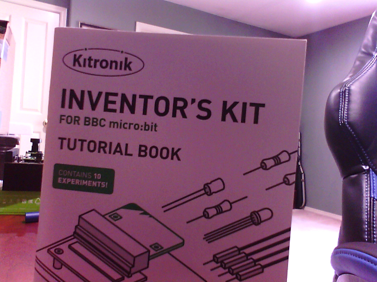

# Optical Character Recognition

This lab covers using a Raspberry Pi and a camera to recognize text in an image using Azure Cognitive Services and Python.

| Author | [Jim Bennett](https://github.com/JimBobBennett) |
|:---|:---|
| Target platform   | <ul><li>Raspberry Pi</li></ul> |
| Hardware required | <ul><li>Raspberry Pi 4</li><li>Micro SD Card</li><li>An SD card to USB converter that matches the USB ports on your device if your device doesn't have an SD card slot</li><li>Raspberry Pi 4 power supply (USB-C)</li><li>Camera - either a Raspberry Pi Camera, or an external USB webcam</li></ul>**Optional**:<ul><li>keyboard, mouse and monitor</li><li>[micro-HDMI to HDMI adapter or cable](https://www.raspberrypi.org/products/micro-hdmi-to-standard-hdmi-a-cable/)</li></ul> |
| Software required | <ul><li>[Raspberry Pi Imager](https://www.raspberrypi.org/downloads/)</li></ul>**Optional**<ul><li>[Visual Studio Code](http://code.visualstudio.com?WT.mc_id=academic-7372-jabenn)</li></ul>*There are optional installs for Windows and Linux that you may need to install later to connect to the Pi, depending on which version of the OS you are using.* |
| Azure Services | <ul><li>[Azure Cognitive Services Computer Vision service](https://azure.microsoft.com/services/cognitive-services/computer-vision/?WT.mc_id=academic-7372-jabenn)</li></ul>|
| Programming Language | <ul><li>Python</li></ul> |
| Prerequisites | Basic proficiency with Python.<br><br>You will also need an [Azure subscription](https://github.com/microsoft/iot-curriculum/tree/main/labs/ai-edge/ocr#azure-subscription) |
| Date | August 2020 |
| Learning Objectives | <ul><li>Set up Azure Cognitive Services</li><li>Analyze images for text with Azure Computer Vision</li></ul> |
| Time to complete | 1 hour |

## Azure Cognitive Services

[Azure Cognitive Services](https://azure.microsoft.com/services/cognitive-services/?WT.mc_id=academic-7372-jabenn) is a comprehensive family of AI services and cognitive APIs to help you build intelligent apps.

This lab covers the [Azure Cognitive Services Computer Vision service](https://azure.microsoft.com/services/cognitive-services/computer-vision/?WT.mc_id=academic-7372-jabenn). This service has a free tier, so there will be no cost to run this lab.

> Note that you can only have one free tier instance of each resource per Azure subscription, so if you already have a free tier set up, you can re-use it or use a paid tier. You can find the current pricing on the [Azure cognitive services pricing page](https://azure.microsoft.com/pricing/details/cognitive-services/?WT.mc_id=academic-7372-jabenn).

To learn more about these services, and to try them out on a Mac or PC, work through the [Explore computer vision in Microsoft Azure](https://docs.microsoft.com/learn/paths/explore-computer-vision-microsoft-azure/?WT.mc_id=academic-7372-jabenn) learning path on [Microsoft Learn](https://docs.microsoft.com/learn?WT.mc_id=academic-7372-jabenn).

### Azure subscription

This lab is designed for courses where Azure resources are provided to students by the institution. To try them out, you can use one of our free subscriptions. Head to the [Azure Subscriptions Guide](../../../azure-subscription.md) for from information on setting up a subscription.

### Create an Azure Cognitive Services Computer Vision resource

To create an Azure Cognitive Services Computer Vision resource, follow the instructions in one of the following guides, depending on if you want to use the Azure Portal, or the Azure Command-line interface (CLI). You can either create a single-service resource for the Computer Vision service, or a multi-service resource, as the multi-service resource includes Computer Vision.

* [Create a Cognitive Services resource using the Azure portal](https://docs.microsoft.com/azure/cognitive-services/cognitive-services-apis-create-account?tabs=multiservice%2Cwindows&WT.mc_id=academic-7372-jabenn)
* [Create a Cognitive Services resource using the Azure Command-Line Interface(CLI)](https://docs.microsoft.com/azure/cognitive-services/cognitive-services-apis-create-account-cli?tabs=windows&WT.mc_id=academic-7372-jabenn)

You will need your Key and Endpoint to access the resource. If you used the Azure CLI to create the resource, the endpoint is in the form:

`https://<location>.api.cognitive.microsoft.com/`

Where `<location>` is the location you used to create the resource. For example, if the location you used was `westus2`, the Endpoint will be `https://westus2.api.cognitive.microsoft.com/`

## Set up the Raspberry Pi

There are a number of ways to run the Python code on the Raspberry Pi, depending on your preferred setup.

* Using the Raspberry Pi desktop either connected to a keyboard/monitor/mouse or via VNC using [the Thonny IDE](https://magpi.raspberrypi.org/articles/thonny)
* Connecting to the Pi over SSH and [using Nano or other console-based text editor](https://www.raspberrypi-spy.co.uk/2013/11/quick-guide-to-nano-text-editor-on-the-raspberry-pi/)
* [Connecting to the Pi using Visual Studio Code Remove development](https://github.com/microsoft/rpi-resources/tree/master/remote-coding)

**Using Visual Studio Code is the recommended way as this provides the most fully-featured Python IDE experience.**

> Note that if you are connecting remotely, you will still need to be physically near the Pi to use the camera and put text in front of it. The 'remote' connection is to allow you to avoid connecting the Pi to a keyboard/monitor/mouse.

### OS setup

Ensure you are running the latest Raspberry Pi OS (full version, not Lite), with the latest updates, configured based on how you want to access the Pi (for example with VNC enabled if you are going to control it over VNC).

You can read more on setting up your Pi in the [Microsoft Raspberry Pi headless setup guide](https://github.com/microsoft/rpi-resources/tree/master/headless-setup).

Once your Pi is set up, you will need to install the Python Pip package manager and virtual environments using the following commands from the Pi terminal:

```sh
sudo apt install python3-dev --yes
sudo apt install python3-pip --yes
sudo apt install python3-venv --yes
```

### Hardware setup

Start by connecting the camera to the Pi. If you are using a USB camera, connect it to a USB port on the Pi. If you are using a Raspberry Pi Camera, connect it to the camera port and enable the camera interface from the Raspberry Pi Configuration tool. You can find instructions on connecting the Raspberry Pi camera in the [Raspberry Pi Camera documentation](https://projects.raspberrypi.org/en/projects/getting-started-with-picamera/2).

> If you are using the Raspberry Pi Camera, you MUST enable the camera interface from the Raspberry Pi Configuration tool

## Start coding

Connect to your Pi - either directly, or via Visual Studio Code remote development.

### Set up Visual Studio Code remote development

Visual Studio Code has an extension that allows for remote development over SSH, meaning you can run VS Code from your Mac or PC, and have it connect to your Pi and edit and debug your code so that it runs on the Pi.

You can find the instructions to set this up in the [Remotely code on your Pi with VS Code guide on the Microsoft Raspberry Pi resources](https://github.com/microsoft/rpi-resources/tree/master/remote-coding).

### Set up your Python environment

1. Connect to your Pi, either directly, over SSH, or using Visual Studio Code remote development.

1. Run the following in the Terminal to install some dependencies needed by the library that works with the USB camera:

    ```sh
    sudo apt update && sudo apt upgrade --yes
    sudo apt install build-essential cmake pkg-config --yes
    sudo apt install libjpeg-dev libtiff5-dev libjasper-dev libpng-dev --yes
    sudo apt install libavcodec-dev libavformat-dev libswscale-dev libv4l-dev --yes
    sudo apt install libxvidcore-dev libx264-dev --yes
    sudo apt install libfontconfig1-dev libcairo2-dev --yes
    sudo apt install libgdk-pixbuf2.0-dev libpango1.0-dev --yes
    sudo apt install libgtk2.0-dev libgtk-3-dev --yes
    sudo apt install libatlas-base-dev gfortran --yes
    sudo apt install libhdf5-dev libhdf5-serial-dev libhdf5-103 --yes
    sudo apt install libqtgui4 libqtwebkit4 libqt4-test python3-pyqt5 --yes
    sudo apt install libilmbase23 libopenexr-dev --yes
    ```

1. Create a new folder for your code:

    ```sh
    mkdir ocr
    ```

1. Head to that directory:

    * If you are using the Terminal directly on the Pi or over SSH, use the following command:

        ```sh
        cd ocr
        ```

    * If you are using Visual Studio Code, then open this folder by selecting *File -> Open*, then selecting the `ocr` folder

1. Create a Python virtual environment in that folder with the following command:

    ```sh
    python3 -m venv .venv
    ```

1. Activate the virtual environment by running the following command:

    ```sh
    source ./.venv/bin/activate
    ```

1. Create a Pip requirements file called `requirements.txt` in the `ocr` folder containing the following:

    ```sh
    azure-cognitiveservices-vision-computervision
    python-dotenv
    picamera
    opencv-contrib-python==4.1.0.25
    ```

    This file defines the Python packages that will be used by the labs:

    * [azure-cognitiveservices-vision-computervision](https://pypi.org/project/azure-cognitiveservices-vision-computervision/) - this package contains code to use the Azure Cognitive Services Computer Vision service

    * [python-dotenv](https://pypi.org/project/python-dotenv/) - this package adds the ability to load settings from a file called `.env`, or from environment variables. This is a best practice to avoid adding settings like API keys to source code.

    * [picamera](https://pypi.org/project/picamera/) - this package captures images and videos from the Raspberry Pi camera module if that is the one you are using

    * [opencv-contrib-python](https://pypi.org/project/opencv-contrib-python/) - this package is the Open Computer Vision library, and can be used to capture images from a USB camera if you are using one. Note that a specific version (4.1.0.25) needs to be used as the later versions have issues on the Raspberry Pi

1. Install the Pip packages using the following command:

    ```sh
    pip install -r requirements.txt
    ```

### Configure the environment variables

1. Create a new file called `.env`
1. Add the following code to this file:

    ```sh
    API_KEY=<key>
    ENDPOINT=<endpoint>
    ```

    Replace `<key>` with the key from your Computer Vision resource.

    Replace `<endpoint>` with the endpoint from your Computer Vision resource.

### Write the code

1. Create a new file called `ocr.py`

1. If you are using Visual Studio Code remote development the Python extension will be activated. Select the Python interpreter in your virtual environment:

    1. Launch the command palette using `Ctrl+Shift+p` on Windows or Linux, or `Cmd+Shift+p` on Mac

    1. Select *Python: Select Interpreter*

    1. Select the Python version that is in the `./.venv/bin/python` folder

1. Add the following code to the Python file:

    ```python
    import os
    from azure.cognitiveservices.vision import computervision
    from msrest import authentication
    from dotenv import load_dotenv

    # Load the API key and endpoint from the .env file
    load_dotenv()
    API_KEY = os.getenv('API_KEY')
    ENDPOINT = os.getenv('ENDPOINT')

    # Captures an image from a USB web cam and saves it as filename
    # This code assumes you only have one web cam attached
    def capture_image_from_usb(filename):
        # Import OpenCV
        import cv2

        # Get the first camera
        cam = cv2.VideoCapture(0)

        # Capture a still image
        _, frame = cam.read()

        # Write the image to a file
        cv2.imwrite(filename, frame)

        # Release the camera
        cam.release()

    # Captures an image from a Raspberry Pi camera and saves it as filename
    def capture_image_from_picamera(filename):
        # Import the picamera library and the time libraty
        import time
        import picamera

        # Create a camera object to access the camera
        with picamera.PiCamera() as camera:
            # Camera warm-up time
            time.sleep(2)

            # Capture an image from the camera to a file
            camera.capture(filename)

    # The filename to save the image to
    # Images are saved instead of just being analysed for text directly
    # to help with debugging - check the image.png file saved in the current
    # folder to debug what the camera is actually seeing. This is great to
    # help with things like making sure the camera is the right way up.
    filename = 'image.png'

    # Uncomment the function calls depending on what camera you are using
    # capture_image_from_usb(filename)
    # capture_image_from_picamera(filename)

    # Create the computer vision client using the API key and endpoint
    credentials = authentication.CognitiveServicesCredentials(API_KEY)
    computervision_client = computervision.ComputerVisionClient(ENDPOINT, credentials)

    # Open the image file for reading
    with open(filename, "rb") as image:
        # Look for printed text in the image
        result = computervision_client.recognize_printed_text_in_stream(image)

        # The results come back in regions - defined areas in the image containing
        # text on one or more lines, with one or more words per line
        # To make it easier to see the results, this code flattens all the words
        # in all the lines in all the regions into one array of words
        text_words = []
        for region in result.regions:
            for line in region.lines:
                for word in line.words:
                    text_words.append(word.text)

        # Show the detected words on the console
        print(text_words)
    ```

    You can also find this code in the [ocr.py](./code/ocr.py) file in the [code](./code/) folder.

    Read the comments in the code to see what each section does.

1. Head to line 50 in the file containing this code:

    ```python
    # Uncomment the function calls depending on what camera you are using
    # capture_image_from_usb(filename)
    # capture_image_from_picamera(filename)
    ```

1. Depending on which camera you are using, uncomment the appropriate code by removing the `#` and the space afterwards in front of the relevant line:

    1. If you are using a USB camera, the code should look like this:

        ```python
        # Uncomment the function calls depending on what camera you are using
        capture_image_from_usb(filename)
        # capture_image_from_picamera(filename)
        ```

    1. If you are using a Raspberry Pi camera, the code should look like this:

        ```python
        # Uncomment the function calls depending on what camera you are using
        # capture_image_from_usb(filename)
        capture_image_from_picamera(filename)
        ```

1. Save the file

1. Point the camera at something with text on it

1. Run the program from the terminal using the following command:

    ```sh
    python ocr.py
    ```

1. A picture will be taken and saved in a file called `image.png`. The text in the image will be output to the console. For example, I photographed a book cover and got this photo:

    

    And this output:

    ```output
    ['Kitronik', "INVENTOR'S", 'KIT', 'FOR', 'BBC', 'micro:bit', 'TUTORIAL', 'BOOK', "EXPERIMENTS'"]
    ```

## Clean up

Once you have finished this lab, you can clean up your resource group to delete any Azure resources that you have created, stopping you being billed for them. You can read about how to do this in the [Deleting Azure Resource Groups guide](https://docs.microsoft.com/azure/azure-resource-manager/management/manage-resource-groups-portal?WT.mc_id=academic-7372-jabenn#delete-resource-groups)
