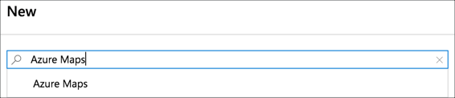
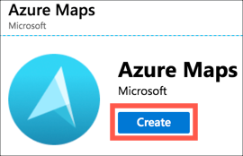
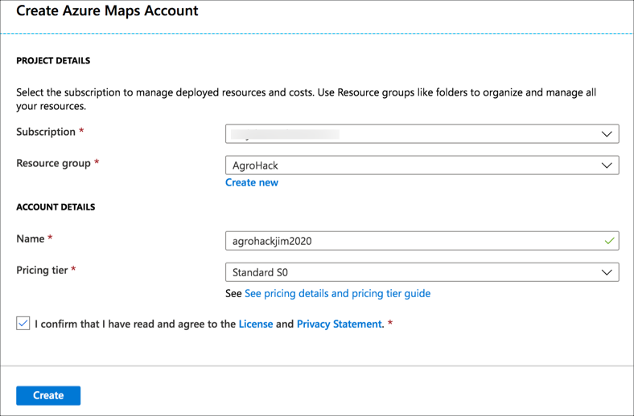
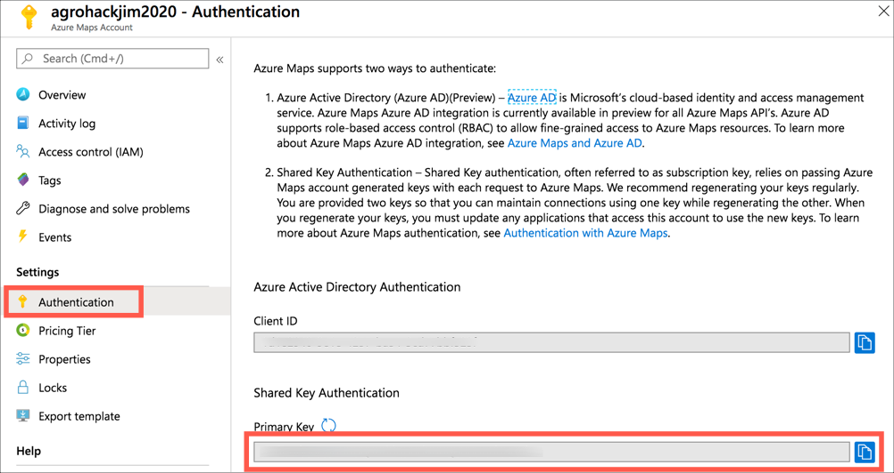
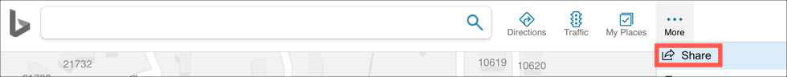
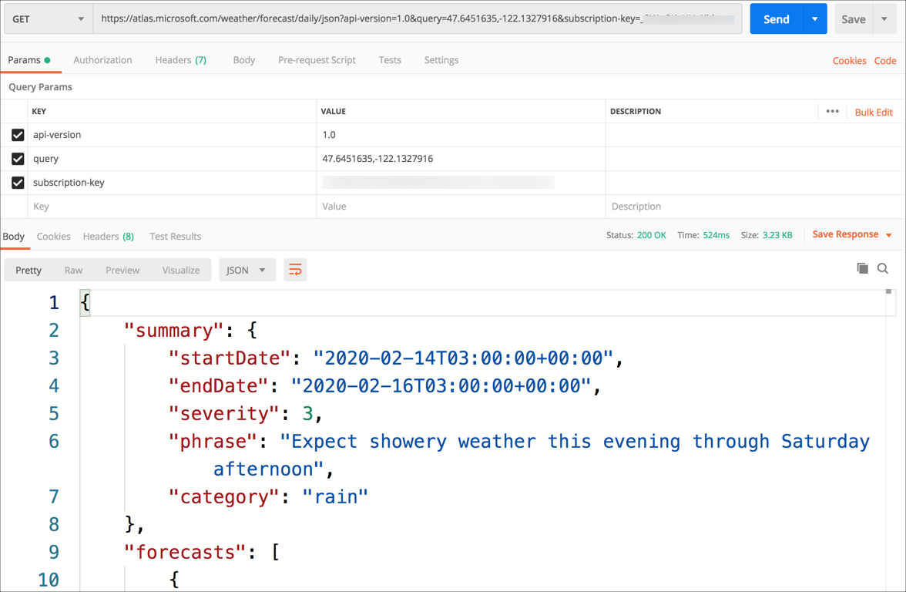

# Loop up the weather for the device using Azure Maps

In the [previous step](./ExecuteIoTCommand.md) you added to the function to trigger the Azure IoT Central command with a value depending on the level of the soil moisture, turning the LED off if the soil is wet, and on if it is dry. In this step you will call Azure Maps to check the weather forecast before sending the needs watering command.

## Azure Maps

[Azure Maps](https://azure.microsoft.com/services/azure-maps/?WT.mc_id=academic-7372-jabenn) is an Azure service that provides mapping and related data. You can use it for visualizing maps on a web page with added data, or requesting spatial data, such as if a coordinate is inside a shape on a map, and even weather data.

For our soil moisture rule, if the soil is too dry then the plant needs a water. However, there is no need to water the plant if rain is predicted. Azure Maps can get the weather for the plants location, and from this the precipitation levels can be extracted to see if it will rain.

> For this workshop, the location will be hard coded, but in a real world app this would be set against each device, either by using GPS on the device, or set by the end user via a Cloud Property. You can read more on Cloud Properties in the [Azure IoT Central docs](https://docs.microsoft.com/azure/iot-central/core/howto-set-up-template?WT.mc_id=academic-7372-jabenn#add-cloud-properties).

### Create an Azure Maps instance

Azure Maps resources can be created using the Azure Portal or the Azure CLI

#### Create an Azure Maps instance using the Azure Portal

1. Open the [Azure Portal](https://portal.azure.com/?WT.mc_id=academic-7372-jabenn)

1. Log in with your Microsoft account if required

1. From the left-hand menu select **+ Create a resource**

   

1. Search for `Azure maps` and select *Azure Maps*

   

1. Select **Create**

   

1. Fill in the details for the maps resource

   1. Select your Azure subscription

   1. For the *Resource group*, select **AgroHack**

   1. Give the maps resource a name. This needs to be globally unique, so include things such as the data or your name, for example `agrohackjim2020`. To make it easier, name it the same as your Azure IoT Central app, storage account and functions app.

   1. Select the `S0` pricing tier. This is the lowest pricing tier and has all the features needed for this workshop

   1. Read and agree to the license agreement and privacy statement

   1. Select **Create**

   

1. Once the deployment has completed, select the **Go to resource** button.

1. Select *Authentication* from the *Azure Maps Account* menu, then copy the value of the *Primary key*

   

#### Create an Azure Maps instance using the Azure CLI

1. Run the following command to create a maps resource

   ```sh
   az maps account create
    --name <name>
    --resource-group AgroHack
    --sku S0
   ```

   For the `<name>`, pick a name that is globally unique, so include things such as the date or your name, for example `agrohackjim2020`. To make it easier, name it the same as your Azure IoT Central app.

   The `-resource-group AgroHack` setting adds this maps resource to the new Resource Group you have been adding all resources to.

   The `--sku S0` setting sets the S0 pricing tier. This is the lowest pricing tier and has all the features needed for this workshop

1. Read and agree to the license agreement and privacy statement by pressing `y`

1. List the account keys using the following command

   ```sh
   az maps account keys list
    --name agrohackjim2020
    --resource-group AgroHack
   ```

   Copy the value of the `primaryKey` from the JSON that is output

## Call Azure Maps

Azure Maps has a REST API that can be called from inside the Azure Function to check the weather based on a latitude and longitude.

### Get the latitude and longitude of your Raspberry Pi

To get the latitude and longitude of your Raspberry Pi, you can use Bing Maps.

1. In your browser, head to [Bing.com/maps](https://www.bing.com/maps/?WT.mc_id=academic-7372-jabenn)

1. Search for your location, or use the **Locate Me** button to find your current location

1. Select *More -> Share* from the top menu

   

1. The Share popup will show a URL. In the URL will be a query string of `cp=` followed by the latitude and longitude

   ```sh
   https://www.bing.com/maps?osid=c873cba9-a34c-556a-8f21-d256c9b872bf&cp=47.689929~-122.042581&lvl=17&v=2&sV=2&form=S00027
   ```

   In this example, the value is `cp=47.689929~-122.042581`, so a latitude of 47.689929 and a longitude of -122.042581.

### Test out the REST API

The URL for the REST request to get the daily weather forecast is in the following format:

```sh
https://atlas.microsoft.com/weather/forecast/daily/json?api-version=1.0&query={latitude},{longitude}&subscription-key={maps_key}
```

* `{latitude}` is the latitude of the point to get the weather for

* `{longitude}` is the latitude of the point to get the weather for

* `{maps_key}` is the primary key from the Azure Maps resource

Test this out by making a **Get** request in Postman. The return value is a block of JSON containing a weather summary, along with a break down of the forecast for day and night with temperatures, precipitation, wind and air quality details.



The JSON has a value called `summary`, and in this is a value called `category`. If rain is forecast, the category will be `rain`

```json
{
    "summary": {
        "startDate": "2020-02-14T03:00:00+00:00",
        "endDate": "2020-02-16T03:00:00+00:00",
        "severity": 3,
        "phrase": "Expect showery weather this evening through Saturday afternoon",
        "category": "rain"
    },
    ...
}
```

### Call Azure Maps from the Azure Function

This same call can be made from inside the function app.

> You can find all the code for this step in the [Code/Functions](../Code/Functions) folder.

1. Open Visual Studio Code

1. Open the `local.settings.json` file from the root of the function app

1. Add and entry inside the `values` node for the API token called `MAPS_KEY`

1. Set this value to the value of the Azure Maps Primary Key you copied earlier

1. Open the `__init__.py` file from the `SoilMoistureCheck` folder

1. Below the code to get the Azure IoT Central API token, add the following code to get the maps key from an environment variable

   ```python
   ...
   iot_central_api_token = os.environ['IOT_CENTRAL_API_TOKEN']
   maps_key = os.environ['MAPS_KEY']
   ...
   ```

1. Add the following code below the `maps_key` declaration

    ```python
    def will_rain():
        # Build the REST URL with the latitude, longitude and maps key
        lat = <latitude>
        lon = <longitude>
        url = 'https://atlas.microsoft.com/weather/forecast/daily/json?api-version=1.0&query={},{}&subscription-key={}'
        url = url.format(lat, lon, maps_key)

        # Make the REST request
        result = requests.get(url)

        # Get the category from the JSON
        result_json = result.json()
        summary = result_json['summary']
        category = summary['category']

        # Return if it will rain
        return category == 'rain'
    ```

    Replace `<latitude>` and `<longitude>` with their respective values.

    This code will build the URL to use to call the REST API, make a request, then get the result. The result is then converted a dictionary from the JSON document, and the value of the `category` from the `summary` is found. If this value is `rain`, then the function returns `True` to show it will rain.

1. Change the `needs_watering` function to check if it will rain. If so, return `False` as there is no need to water the plant if rain is expected.

    ```python
    def needs_watering(soil_moisture):
        # Check if it will rain, if so no need to water
        if (will_rain()):
            return False
        else:
            return soil_moisture < 500
    ```

<hr>

In this step you called Azure Maps to check the weather forecast before sending the needs watering command. The [next step](./Summary.md) gives a summary of the completed solution.
