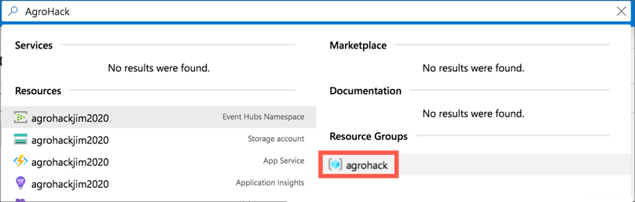
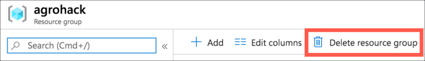
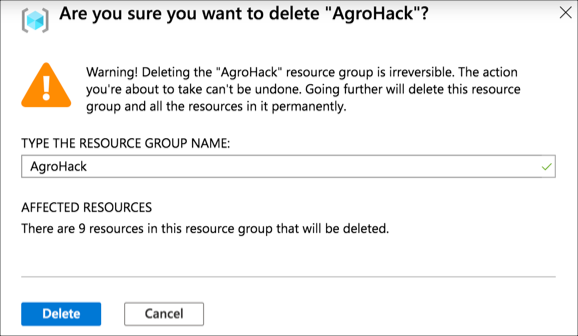

# Clean up your resources

The [previous step](./Summary.md) gave a summary of the completed solution. In this step you will clean up your Azure resources once you have finished with them. This way you will not be charged for any services, or not have these services eat into any free credit you have.

## Deleting the resource group

Everything you created for this workshop should have been in the same resource group. This resource group was created when you created the Azure Event Hubs Namespace, and used for all other resources.

Deleting this resource group will delete all the resources created.

* Open the Azure Portal from [portal.azure.com](https://portal.azure.com/?WT.mc_id=academic-7372-jabenn). Log in if required.

* From the search bar at the top, search for the `AgroHack` resource group that was created. Select it from the results.
  
  

* Select **Delete resource group**.
  
  

* The confirmation panel will appear showing all the resources that will be deleted along with the resource group.

  

* Enter the name of the resource group and select *Delete*.

All the resources in this group will be deleted.
