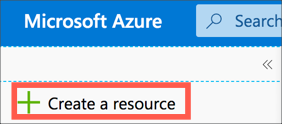
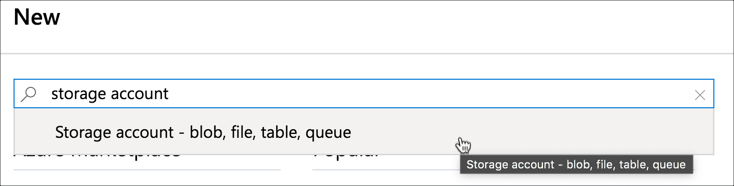
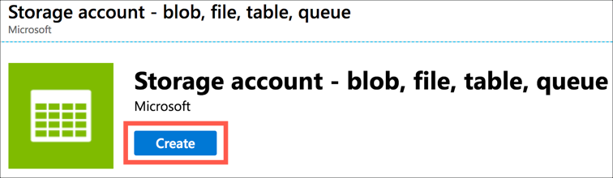
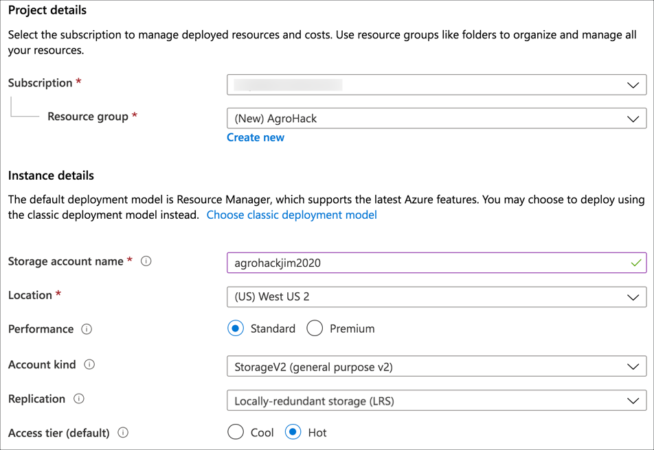
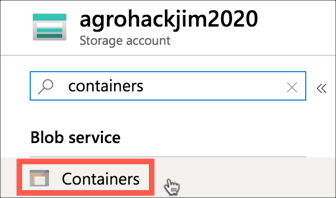
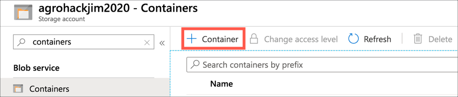
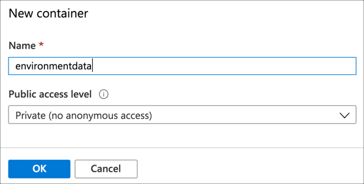

# Create a storage account to store telemetry data

In the [previous step](./ExportDataToEventHubs.md), you exported IoT telemetry to Azure Event Hubs. In this step, you will create a storage account to store telemetry data.

## Azure blob storage

[Azure blob storage](https://azure.microsoft.com/services/storage/blobs/?WT.mc_id=academic-7372-jabenn) allows you to store blobs of unstructured data that can be easily access from other Azure services, such as Azure ML Studio.

Azure has a concept of [storage accounts](https://docs.microsoft.com/azure/storage/common/storage-account-overview/?WT.mc_id=academic-7372-jabenn), which wrap a range of storage services including file, table and blob. Blob storage uses collections to store different data in.

### Create a storage account and collection

There are two ways to create a storage account - from the Azure Portal or the Azure CLI.

#### Use the Azure Portal

1. Open the [Azure Portal](https://portal.azure.com/?WT.mc_id=academic-7372-jabenn)

1. Log in with your Microsoft account if required

##### Create the storage account

1. From the left-hand menu select **+ Create a resource**

   

1. Search for `storage account` and select *Storage account - blob, file, table, queue*

   

1. Select **Create**

   

1. Fill in the details for the storage account

   1. Select your Azure subscription

   1. For the *Resource group*, select **AgroHack**

   1. Give the storage account a name. This needs to be globally unique, so include things such as the data or your name, for example `agrohackjim2020`. To make it easier, name it the same as your Azure IoT Central app.

   1. Select a *Location* closest to you, the same location you used in the previous step to create the resource group and event hubs.

   1. Set the *Replication* to be `Locally-redundant storage (LRS)` as this is the cheapest option. For production workloads you would want better redundancy, read the [documentation on data redundancy](https://docs.microsoft.com/azure/storage/common/storage-redundancy/?WT.mc_id=academic-7372-jabenn) for more details on this.

   1. Leave the rest of the options as the defaults

   

1. Select **Review + create**

1. Select **Create**

1. Once the deployment has completed, select the **Go to resource** button.

##### Create the collection

1. Search for `Containers` in the resource menu, and select it

   

1. Select **+ Container**

   

1. Name the container `environmentdata`. Leave the *Public access level* as `Private (No anonymous access)`. Then select **OK**.

   

#### Use the Azure CLI

##### Create the storage account

1. Create the storage account using the following command

   ```sh
   az storage account create
    --location <location>
    --name <account_name>
    --resource-group AgroHack
    --sku Standard_LRS
   ```

   For the `<location>`, use the name of the location closest to you.

   For the `<account_name>`, pick a name that is globally unique, so include things such as the date or your name, for example `agrohackjim2020`. To make it easier, name it the same as your Azure IoT Central app.

   The `-resource-group AgroHack` setting adds this storage account to the new Resource Group you created in the previous step.

   The `--sku Standard_LRS` setting sets the data replication to be `Locally-redundant storage (LRS)` as this is the cheapest option. For production workloads you would want better redundancy, read the [documentation on data redundancy](https://docs.microsoft.com/azure/storage/common/storage-redundancy/?WT.mc_id=academic-7372-jabenn) for more details on this.

##### Create the collection

1. Get the account keys for the new storage account. These access keys can be used to provide access to the storage account in the CLI and create the container. Get these by running the following command.

   ```sh
   az storage account keys list
    --account-name <account_name>
    --resource-group AgroHack
    --output table
   ```

   For `<account_name>` use the name you used for the storage account. 
   
   The account keys are listed in the `Value` column of the output.

1. Create the collection with the following command

   ```sh
   az storage container create
    --name environmentdata
    --account-name <account_name>
    --account-key <account_key>
   ```

   For `<account_name>` use the name you used for the storage account.

   For `<account_key>` use one of the keys from the previous step.

<hr>

In this step you created a storage account to store telemetry data. In the [next step](./ExportDataToBlobStorage.md) you will use Azure Stream Analytics to stream data into the storage account.
