# Use Azure Stream Analytics to stream data into the storage account

In the [previous step](./CreateBlobStorage.md) you created a storage account to store telemetry data. In this step you will use Azure Stream Analytics to stream data into the storage account.

## Azure Stream Analytics

[Azure StreamAnalytics](https://azure.microsoft.com/services/stream-analytics/?WT.mc_id=academic-7372-jabenn) provides real-time analytics on streams of data, allowing you to stream data from one service to another

### Create the Azure Stream Analytics Job

Azure Stream Analytics jobs need to be created from the Azure Portal, you cannot create them using the Azure CLI.

> If you don't want to use the portal, you can use PowerShell by following [these instructions](https://docs.microsoft.com/azure/stream-analytics/stream-analytics-quick-create-powershell?WT.mc_id=academic-7372-jabenn).

1. Open the [Azure Portal](https://portal.azure.com/?WT.mc_id=academic-7372-jabenn)

1. Log in with your Microsoft account if required

1. From the left-hand menu select **+ Create a resource**

   

1. Search for `Stream Analytics Job` and select *Stream Analytics Job*

   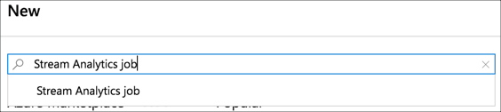

1. Select **Create**

   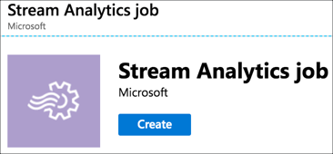

1. Fill in the details for the Stream Analytics Job

   1. Name the job `TelemetryStreaming`

   1. Select your Azure subscription

   1. For the *Resource group*, select **AgroHack**

   1. Select a *Location* closest to you, the same location you used in the previous step to create the resource group and event hubs.

   1. Leave the rest of the options as the defaults

   1. Select **Create**

   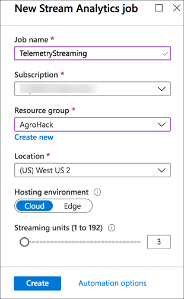

1. Once the deployment has completed, select the **Go to resource** button.

## Configure the Azure Stream Analytics Job

Azure Stream Analytics Jobs take data from an input, such as an Event Hub, run a query against the data, and send results to an output such as a storage account.

### Set an input

1. From the Stream Analytics Job, select *Job topology -> Inputs* from the left-hand menu

  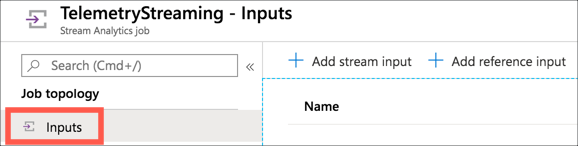

1. Select **+ Add stream input**, then select **Event Hub**

   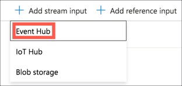

1. Fill in the input details

   1. Set the alias to be `telemetry`

   1. Select *Select Event Hub from your subscriptions*

   1. Select your subscription and Azure Event Hubs Namespace

   1. Select *Use Existing* for the *Event hub name*

   1. Select the `telemetry` event hub

   1. Leave the rest of the options as the defaults

   1. Select **Save**

   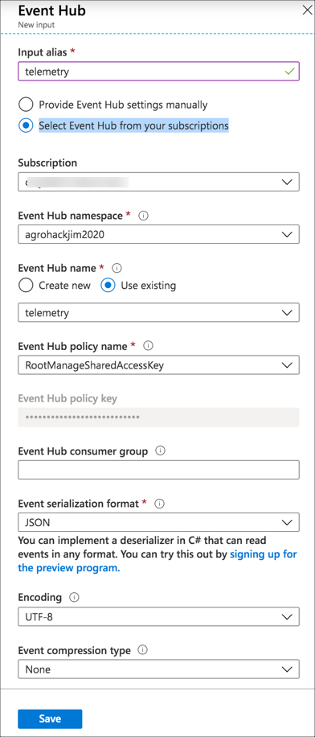

### Set an output

1. From the Stream Analytics Job, select *Job topology -> Outputs* from the left-hand menu

   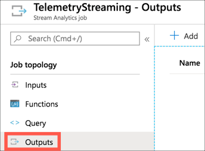

1. Select **+ Add**, then select **Blob storage**

   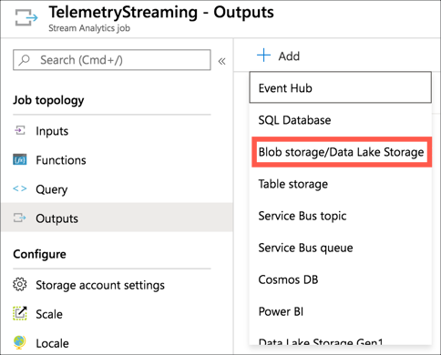

1. Fill in the output details

   1. Set the alias to be `blob-storage`

   1. Select *Select storage from your subscriptions*

   1. Select your subscription and Azure Event Hubs Namespace

   1. Select the storage account you created in the previous part

   1. Select *Use Existing* for the *Container*

   1. Select the `environmentdata` container

   1. Set the *Path pattern* to `{date}/{time}`. JSON records are appended to a single JSON file, and setting this will cause a new file to be created each hour in a folder hierarchy based off year/month/day/hour.

   1. Leave the rest of the options as the defaults

   1. Select **Save**

   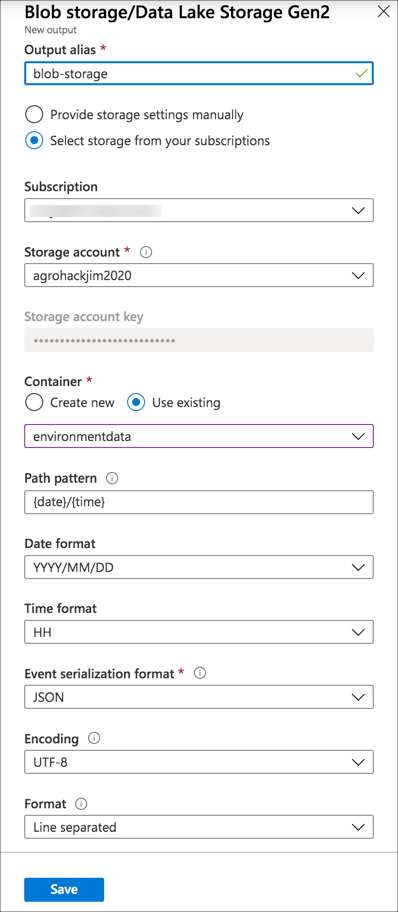

### Create the query

1. From the Stream Analytics Job, select *Job topology -> Query* from the left-hand menu

   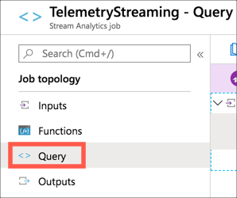

1. Change the query to be the following

   ```sql
   SELECT
       *
   INTO
       [blob-storage]
   FROM
       [telemetry]
   ```

   This will select data as it comes into the `telemetry` event hub, and select it into the `blob-storage` storage account.

1. Select **Test Query** to test the query and see a sample output using real data from the event hub

   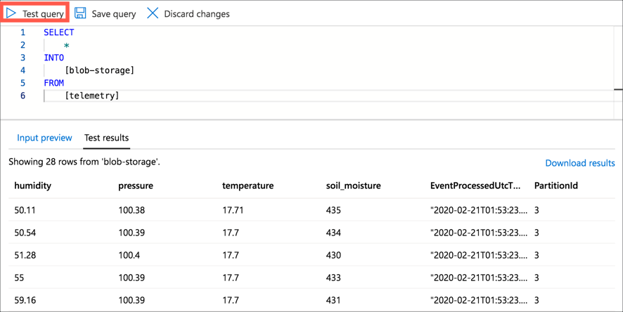

1. Select **Save Query**

   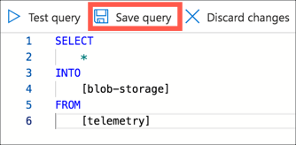

### Start the job

1. From the Stream Analytics Job, select *Overview* from the left-hand menu

   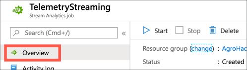

1. Select **Start**

   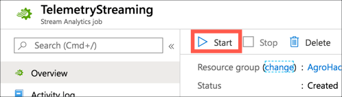

1. For the *Job output start time* select **Now**

1. Select **Start**

   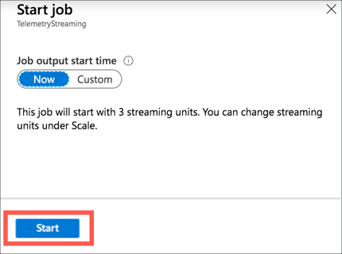

## Validate the query

You can validate that data is being streamed to the storage account via the Azure Portal, or via the CLI.

### Validate the data with the Azure Portal

1. Open the [Azure Portal](https://portal.azure.com/?WT.mc_id=academic-7372-jabenn)

1. Log in with your Microsoft account if required

1. If you are not on the blade for the storage account you created, search for it by typing the name of the account into the search box at the top of the portal, and selecting the storage account under the *Resources* section

   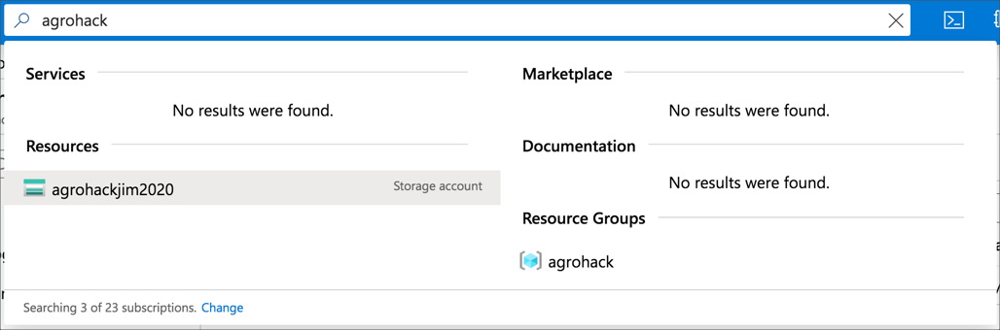

1. From the storage account menu, select **Storage Explorer**

   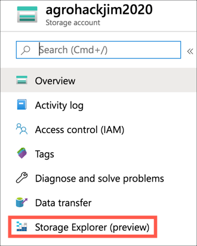

1. Expand the *Blob Containers* node, and select the *environmentdata* container. You will see a list of the folders, one per year that the Azure IoT Central has been collecting data. Inside each year folder is a month folder, inside that a day, inside that an hour. In the hour folder is a single JSON document that will be appended to until the hour changes, when a new document will be created in a new folder for the new hour/day/month/year.

   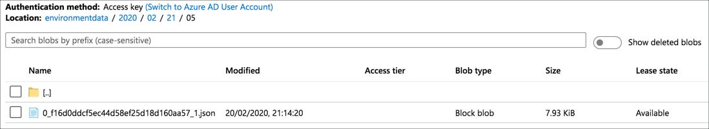

1. Select a JSON file and select **Download** to download the file

   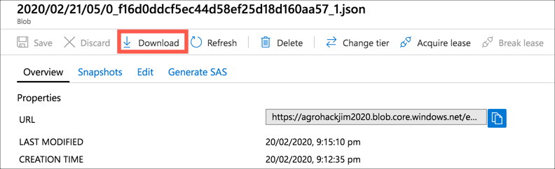

1. View the JSON file in Visual Studio Code. It will contain one line per telemetry value sent during that hour, with telemetry details:

    ```json
    {"humidity":60.17,"pressure":100.48,"temperature":17.05,"soil_moisture":434,"EventProcessedUtcTime":"2020-02-21T05:12:33.2547726Z","PartitionId":3,"EventEnqueuedUtcTime":"2020-02-21T05:07:40.7070000Z"}
    {"humidity":59.56,"pressure":100.49,"temperature":17.06,"soil_moisture":437,"EventProcessedUtcTime":"2020-02-21T05:12:33.3641037Z","PartitionId":3,"EventEnqueuedUtcTime":"2020-02-21T05:07:50.7250000Z"}
    ```

### Validate the data with the Azure CLI

1. Run the following command to list the blobs stored in the storage account

   ```sh
   az storage blob list
    --account-name <account_name>
    --account-key <account_key>
    --container-name environmentdata
    --output table
   ```

   For `<account_name>` use the name you used for the storage account.

   For `<account_key>` use one of the keys used to create the collection.

1. Download the blob to a file with the following command

   ```sh
   az storage blob download
    --container-name environmentdata
    --name <blob_name>
    --file data.json
    --account-name <account_name>
    --account-key <account_key>
   ```

   For `<blob_name>` use be the `Name` value of one of the blobs from the list output by the previous step. You will need to use the full name including the folders, such as `2020/02/21/05/0_f16d0ddcf5ec44d58ef25d18d160aa57_1.json`.

   For `<account_name>` use the name you used for the storage account.

   For `<account_key>` use one of the keys used to create the collection.

   This will download a file into the current directory called `data.json`. View this file with Visual Studio Code. It will contain one line per telemetry value sent during that hour, with telemetry details:

    ```json
    {"humidity":60.17,"pressure":100.48,"temperature":17.05,"soil_moisture":434,"EventProcessedUtcTime":"2020-02-21T05:12:33.2547726Z","PartitionId":3,"EventEnqueuedUtcTime":"2020-02-21T05:07:40.7070000Z"}
    {"humidity":59.56,"pressure":100.49,"temperature":17.06,"soil_moisture":437,"EventProcessedUtcTime":"2020-02-21T05:12:33.3641037Z","PartitionId":3,"EventEnqueuedUtcTime":"2020-02-21T05:07:50.7250000Z"}
    ```

## Use this data

Once the data is in blob storage, it can be access and used by multiple Azure services. This workshop won't cover these use cases in depth as there are too many possibilities. To learn more about ways to use this data, check out the following documentation:

* [Access data in Azure storage services from ML Studio](https://docs.microsoft.com/azure/machine-learning/how-to-access-data/?WT.mc_id=academic-7372-jabenn)
* [Access cloud data in a Jupyter notebook](https://docs.microsoft.com/azure/notebooks/access-data-resources-jupyter-notebooks#azure-storage?WT.mc_id=academic-7372-jabenn)
* [Trigger an Azure Function when entries are added to blob storage](https://docs.microsoft.com/azure/azure-functions/functions-create-storage-blob-triggered-function?WT.mc_id=academic-7372-jabenn)

<hr>

In this step, you exported IoT telemetry to Azure Blob Storage. In the [next step](./CreateFunction.md) you will create an Azure Function triggered by Azure Stream Analytics to check soil moisture.
