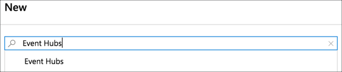
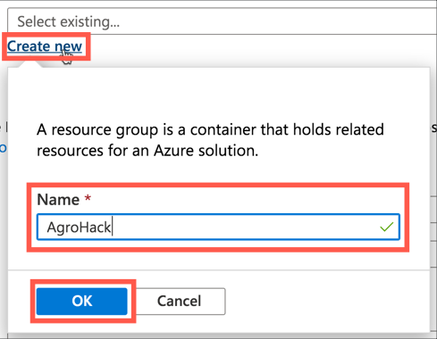
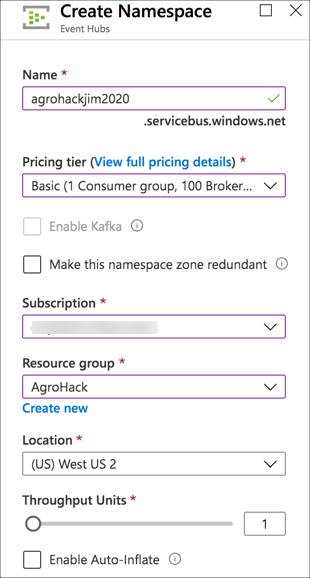
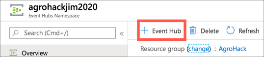
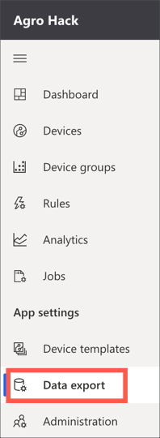
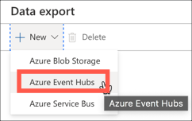
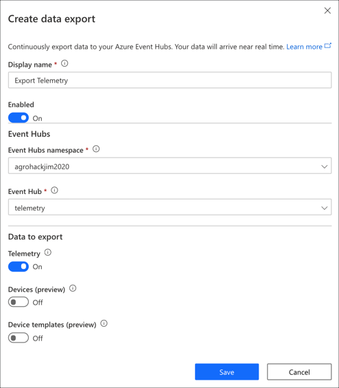
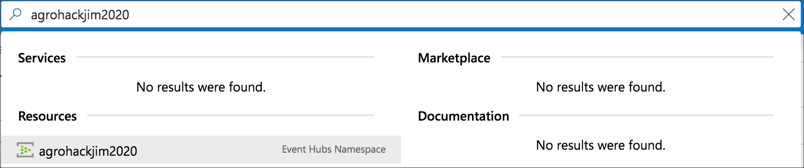
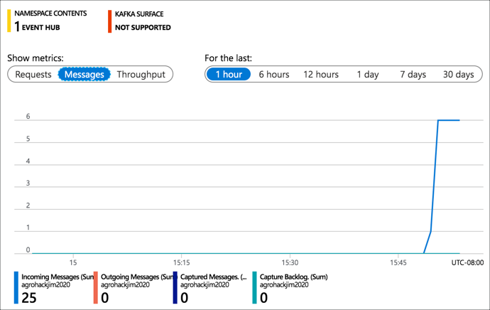

# Export IoT Telemetry data to Azure Event Hubs

In the [previous step](./WriteThePiCode.md), you wrote the code to capture telemetry from the Raspberry Pi. In this step, you will export IoT telemetry to Azure Event Hubs.

## Azure Event Hubs

[Azure Event Hubs](https://azure.microsoft.com/services/event-hubs/#features?WT.mc_id=academic-7372-jabenn) allow you to take streaming data and connect it to other services, such as storing the data or using Azure Stream Analytics to analyze the data in real time. Azure IoT Central can be configured to stream data to an Azure Event Hubs instance.

To export data you will need an Azure account. If you don't have one, head to the [Azure Account](https://github.com/jimbobbennett/AgroHack#azure-account) instructions to create an account.

### Creating an Azure Event Hubs instance

There are two ways to create an Azure Event Hubs instance - from the Azure Portal or the Azure CLI.

The instance consists of a namespace, containing an event hub.

#### Creating an Azure Event Hubs instance using the Azure Portal

##### Create the namespace

1. Open the [Azure Portal](https://portal.azure.com/?WT.mc_id=academic-7372-jabenn)

1. Log in with your Microsoft account if required

1. From the left-hand menu select **+ Create a resource**

   

1. Search for `Event Hubs` and select *Event Hubs*

   

1. Select **Create**

   

1. Fill in the details for the Event Hubs

   1. Give the Event Hubs a name. This needs to be globally unique, so include things such as the data or your name, for example `agrohackjim2020`. To make it easier, name it the same as your Azure IoT Central app.

   1. Leave the *Pricing Tier* as `Standard`

   1. Select your Azure subscription

   1. For the *Resource group*, select **Create new** and name it `AgroHack`, then select **OK**

      

      > Resource groups are logical groupings of Azure services, allowing you to manage all the services for a particular application or project together. At the end of this workshop this Resource Group will be deleted, deleting all the services created.

   1. Select a *Location* closest to you

   1. Leave the rest of the options as the defaults

   

1. Select **Review + create**

1. Select **Create**

1. Once the deployment has completed, select the **Go to resource** button.

##### Create the event hub

1. From the Event Hub Namespace in the Azure Portal, select **+ Event Hub**

   

1. Name the Event Hub `Telemetry`

1. Leave the rest of the options as the defaults

1. Select **Create**

#### Creating an Azure Event Hubs Namespace using the Azure CLI

1. To install the Azure CLI, head to the [installation guide](https://docs.microsoft.com/cli/azure/install-azure-cli?view=azure-cli-latest&WT.mc_id=academic-7372-jabenn) and follow the instructions for your OS.

1. From your terminal, log in to the Azure CLI using the following command

   ```sh
   az login
   ```

   A web browser window will be launched to allow you to log in to your Azure subscription

1. If you have multiple Azure subscriptions, you will need to select the one you want to use

   1. List all the subscriptions using the following command

      ```sh
      az account list --output table
      ```

   1. Find the subscription id of the subscription you want to use and copy it

   1. Set the active subscription using the following command

      ```sh
      az account set --subscription <subscription id>
      ```

      For the `<subscription id>`, use the id you copied in the previous step

##### Create a resource group

1. Run the following command to get a list of Azure locations

   ```sh
   az account list-locations --output table
   ```

   Note the name of the location closest to you

1. Create a new Resource Group with the following command

   ```sh
   az group create --name AgroHack --location <location>
   ```

   For the `<location>`, use the name of the location closest to you.

   This will create a Resource Group called `AgroHack` in the location you specify.

   > Resource groups are logical groupings of Azure services, allowing you to manage all the services for a particular application or project together. At the end of this workshop this Resource Group will be deleted, deleting all the services created.

##### Create the namespace

1. Create the event hubs namespace using the following command

   ```sh
   az eventhubs namespace create
    --location <location>
    --name <account_name>
    --resource-group AgroHack
   ```

   For the `<location>`, use the name of the location closest to you, the same location that you used for the resource group.

   For the `<account_name>`, pick a name that is globally unique, so include things such as the date or your name, for example `agrohackjim2020`. To make it easier, name it the same as your Azure IoT Central app.

   The `--resource-group AgroHack` setting adds this event hubs namespace to the new Resource Group you created in the previous step.

##### Create the event hub

1. Create the event hub inside the namespace using the following command

   ```sh
   az eventhubs eventhub create
    --name telemetry
    --resource-group AgroHack
    --namespace-name <namespace_name>
   ```

   The `--name telemetry` names the event hub as `telemetry`.

   The `--resource-group AgroHack` setting adds this event hubs namespace to the new Resource Group you created in the previous step.

   For the `<namespace_name>`, use the name you used when creating the namespace.

## Set up data export

Azure IoT Central can export data to a number of different services, either to route the data to multiple other services, or to store data. For example, it can send IoT messages to Azure Event Hubs, and other services can listen on these events and respond - maybe by running code to process each message.

### Create the data export

1. Open the app in Azure IoT Central

1. Select **Data export** from the left-hand menu

   

1. Select the **New** button, then select the **Azure Event Hubs** option

   

1. Give the export a name, such as `Export telemetry`

1. Select the Azure Event Hubs Namespace you just created, along with the Event Hub

1. In the *Data to export* section, leave *Telemetry* turned on, and turn off *Devices* and *Device templates*

1. Select **Save**

   

1. The new data export job will appear in the list, showing a status. Wait until the status shows *Running*, this will only take about 30 seconds or so.

### Monitor the data export

The easiest way to see messages flowing to the Event Hub is via the Azure Portal.

1. Open the [Azure Portal](https://portal.azure.com/?WT.mc_id=academic-7372-jabenn)

1. Log in with your Microsoft account if required

1. If you are not on the blade for the event hub you created, search for it by typing the name of the namespace into the search box at the top of the portal, and selecting the Event Hubs Namespace under the *Resources* section

   

1. In the *Overview* tab you should see message throughput on the graph

   

<hr>

In this step you exported IoT telemetry to Azure Event Hubs. In the [next step](./CreateBlobStorage.md), you will create a storage account to store telemetry data.