# Write the code to capture telemetry from the Raspberry Pi

In the [previous step](./CreateTheAppInIoTCentral.md), you created the app in Azure IoT Central. In this step, you will write the code to capture telemetry from the Raspberry Pi.

> You can find all the code for this step in the [Code/Pi](../Code/Pi) folder.

## Connect to the Raspberry Pi from Visual Studio Code

To write the code for the Raspberry Pi, you will use the Remote development capabilities of Visual Studio Code.

### Install the Remote Development extension in Visual Studio Code

To enable remote development in Visual Studio Code, you will need to install the [Remote Development Extension pack](https://marketplace.visualstudio.com/items?itemName=ms-vscode-remote.vscode-remote-extensionpack&WT.mc_id=academic-7372-jabenn).

1. Launch Visual Studio Code

1. Select the Extensions tab from the left hand menu, or select *View -> Extensions*

   

1. Search for `remote development` and install the *Remote Development* extension pack from Microsoft by selecting the **Install** button

   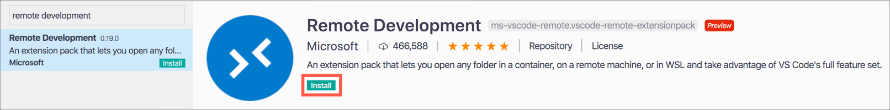

### Connect to the Raspberry Pi

1. From Visual Studio Code, launch the command palette

   * On macOS, press command+shift+p
   * On Windows or Linux, press ctrl+shift+p

1. Search for `Remote-SSH: Connect to Host` and select it

   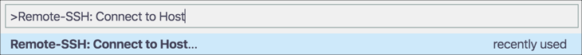

1. Select *+ Add new SSH Host*

   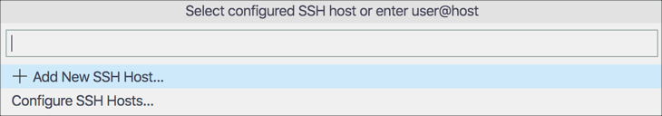

1. Enter `pi@raspberrypi.local` as the SSH connection command

   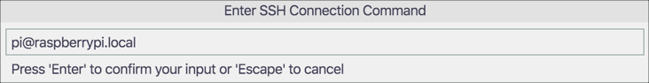

1. Select the SSH configuration file to update. This will store the SSH connection details to make connection easier. There will be an option in your home folder, which will vary depending on your OS and user name, so select this.

1. Once the connection has been configured, a dialog will appear saying the host is configured. Select **Connect** from this dialog.

   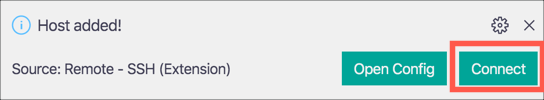

1. A new Visual Studio Code window will open to host the connection. In the password prompt dialog, enter the password for your Raspberry Pi. The default password is `raspberry`.

   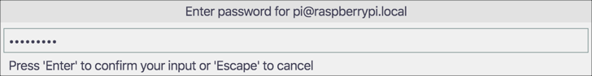

> Once the connection has been established, the next time *Remote-SSH: Connect to Host* is selected a new window will be opened and the password requested, there will be no need to configure it again.

## Configure Python

The code for this device will be written in Python 3, which comes by default in the latest Raspbian releases. Before code can be written, the environment needs to be configured and some packages installed.

### Configure Visual Studio Code for Python development

Visual Studio Code can install extensions on the host device. The Python extension is needed to work with Python files.

1. Select the Extensions tab from the left hand menu, or select *View -> Extensions*

   

1. Search for `Python` and install the *Python* extension from Microsoft by selecting **Install in SSH: raspberrypi.local**.

   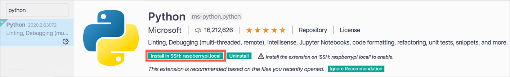

   > There are a number of Python extensions available, so ensure you install the one from Microsoft

1. A reload will be required, so select **Reload required**

   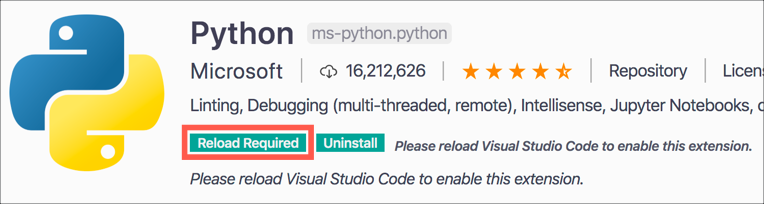

1. Visual Studio will reload the window, and you will be asked for your Raspberry Pi password again, so enter it.

### Create a folder for the code

1. When the new Visual Studio Code window is opened, the terminal should be opened by default. If not, open a new terminal by selecting *Terminal -> New Terminal*.

1. From the Terminal in Visual Studio Code, create a new folder in the home folder called `EnvironmentMonitor`

   ```sh
   mkdir EnvironmentMonitor
   ```

1. Open this new folder in Visual Studio Code by selecting **Open folder** from the *Explorer*

   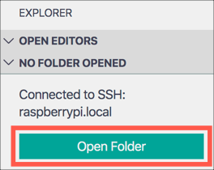

1. Locate the new `EnvironmentMonitor` folder and select it, then select **OK**

   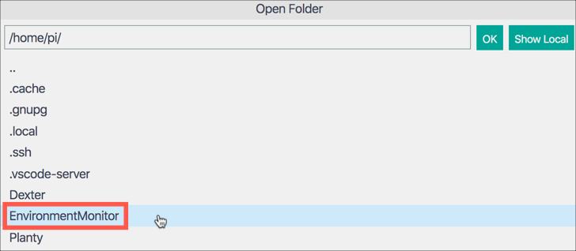

1. The window will reload in the selected folder, and you will be asked for your Raspberry Pi password again, so enter it.

### Configure a virtual environment

Python comes in various versions, and Python apps can use external code in packages installed via a tool called `pip`. This can lead to problems if different apps need different package versions, or different Python versions. To make it easier to avoid issues with package or Python versions, it is best practice to use *virtual environments*, self-contained folder trees that contain a Python installation for a particular version of Python, plus a number of additional packages.

1. When the new Visual Studio Code window is opened, the terminal should be opened by default. If not, open a new terminal by selecting *Terminal -> New Terminal*.

1. Ensure that the Python 3 virtual environment tooling is installed by running the following commands in the terminal

   ```sh
   sudo apt-get update
   sudo apt-get install python3-venv
   ```

1. Create a new file inside the `EnvironmentMonitor` folder called `app.py`. This is the file that will contain the code for the device, and by creating it the Python extension in Visual Studio Code will be activated. Select the **New File** button in the *Explorer*.

   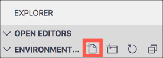

1. Name the new file `app.py` and press return

   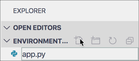

1. Create a new virtual environment called `.venv` using Python 3 by running the following command in the terminal

   ```sh
   python3 -m venv .venv
   ```

1. A dialog will pop up asking if you want to activate this virtual environment. Select **Yes**.

   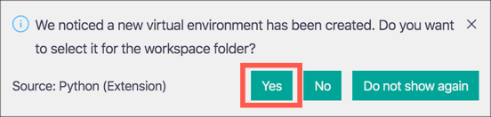

1. The existing terminal will not have the virtual environment activated. Close it by selecting the trash can button

   

1. Create a new terminal by selecting *Terminal -> New Terminal*. The terminal will load the virtual environment

   

### Install the required python packages

Python has a package manager called `pip` that allows you to install code from other developers in packages called pip packages. You can read more about pip and see the available packages at [pypi.org](https://pypi.org). Packages can either be installed into the virtual environment one at a time using the `pip` command, or multiple packages can be listed in a file called `requirements.txt` and installed together. The advantage of using a `requirements.txt` file is that this can be checked into source code control, so that other developers can configure their environment the same way by installing the same packages from this file.

1. Create a new file inside the `EnvironmentMonitor` folder called `requirements.txt`

1. Add the following to this file

   ```sh
   azure-iot-device
   python-dotenv
   RPi.bme280
   grove.py
   ```

1. Save the file. If you don't want to have to remember to always save files in Visual Studio Code, select *File -> Auto Save* to turn on automatic saving of files.

1. From the terminal, run the following command to install these packages:

   ```sh
   pip install -r requirements.txt
   ```

The packages installed are:

| Package          | Description                                                                         |
| ---------------- | ----------------------------------------------------------------------------------- |
| azure-iot-device | Allows communication with Azure IoT services including Visual Studio Code                  |
| python-dotenv    | Allows loading of environment variables from `.env` files                           |
| RPi.bme280       | Provides access to the BME280 temperature/pressure/humidity sensor                  |
| grove.py         | Provides access to the grove sensors including the Grove capacitive moisture sensor |

## Write the code

### Define some environment variables

The connection details for the device ideally should not be stored in source code. They should be saved on the device and loaded as required. This is to avoid checking these details into source code control or sharing them publicly accidentally.

Python has a concept of `.env` files to store secrets such as connection details. These files are managed by the `python-dotenv` pip package, and are usually ignored when checking into git (the default `.gitignore` file created by GitHub for Python projects has these files in it by default).

1. Create a new file inside the `EnvironmentMonitor` folder called `.env`

1. Add the following entries to this file:

   ```sh
   ID_SCOPE=<Id scope>
   DEVICE_ID=raspberry_pi
   PRIMARY_KEY=<primary key>
   ```

   Set `<Id scope>` to be the value of the ID Scope from the **Connect** dialog in Azure IoT Central. Set `<primary key>` to be the **Primary key** value from this dialog.

### Create the application code

1. Open the `app.py` file

1. Add the following code to the file:

    ```python
    import smbus2, bme280, os, asyncio, json
    from dotenv import load_dotenv
    from grove.grove_moisture_sensor import GroveMoistureSensor
    from grove.grove_led import GroveLed
    from azure.iot.device.aio import IoTHubDeviceClient, ProvisioningDeviceClient
    from azure.iot.device import MethodResponse

    # Configuration parameters
    bme_pin = 1
    bme_address = 0x76
    moisture_pin = 2
    led_pin = 16

    # Create the sensors
    bus = smbus2.SMBus(bme_pin)
    calibration_params = bme280.load_calibration_params(bus, bme_address)

    moisture_sensor = GroveMoistureSensor(moisture_pin)

    # Create the LED
    led = GroveLed(led_pin)

    # Load the Azure IoT Central connection parameters
    load_dotenv()
    id_scope = os.getenv('ID_SCOPE')
    device_id = os.getenv('DEVICE_ID')
    primary_key = os.getenv('PRIMARY_KEY')

    def getTemperaturePressureHumidity():
        return bme280.sample(bus, bme_address, calibration_params)

    def getMoisture():
        return moisture_sensor.moisture

    def getTelemetryData():
        temp_pressure_humidity = getTemperaturePressureHumidity()
        moisture = getMoisture()

        data = {
            "humidity": round(temp_pressure_humidity.humidity, 2),
            "pressure": round(temp_pressure_humidity.pressure/10, 2),
            "temperature": round(temp_pressure_humidity.temperature, 2),
            "soil_moisture": round(moisture, 2)
        }

        return json.dumps(data)

    async def main():
        # provision the device
        async def register_device():
            provisioning_device_client = ProvisioningDeviceClient.create_from_symmetric_key(
                provisioning_host='global.azure-devices-provisioning.net',
                registration_id=device_id,
                id_scope=id_scope,
                symmetric_key=primary_key)

            return await provisioning_device_client.register()

        results = await asyncio.gather(register_device())
        registration_result = results[0]

        # build the connection string
        conn_str='HostName=' + registration_result.registration_state.assigned_hub + \
                    ';DeviceId=' + device_id + \
                    ';SharedAccessKey=' + primary_key

        # The client object is used to interact with Azure IoT Central.
        device_client = IoTHubDeviceClient.create_from_connection_string(conn_str)

        # connect the client.
        print('Connecting')
        await device_client.connect()
        print('Connected')

        # listen for commands
        async def command_listener(device_client):
            while True:
                method_request = await device_client.receive_method_request('needs_watering')
                needs_watering = method_request.payload
                print('Needs watering:', needs_watering)
                payload = {'result': True}

                if needs_watering:
                    led.on()
                else:
                    led.off()

                method_response = MethodResponse.create_from_method_request(
                    method_request, 200, payload
                )
                await device_client.send_method_response(method_response)

        # async loop that sends the telemetry
        async def main_loop():
            while True:
                telemetry = getTelemetryData()
                print(telemetry)

                await device_client.send_message(telemetry)
                await asyncio.sleep(60)

        listeners = asyncio.gather(command_listener(device_client))

        await main_loop()

        # Cancel listening
        listeners.cancel()

        # Finally, disconnect
        await device_client.disconnect()

    if __name__ == '__main__':
        asyncio.run(main())
    ```

   This code connects to Azure IoT Central, and every 60 seconds will poll for data from the sensors and send it as a telemetry message. It will also listen for the `needs_watering` command, and turn an LED on or off depending on the value sent with the command.

1. Save the file

1. From the terminal, run the following command to start the app

   ```sh
   python app.py
   ```

   The app should start, connect to Azure IoT Central, and send data. The data being sent will be printed to the terminal

   

### Breakdown of the code

This Python file contains a lot of code to connect to the sensors, connect to Azure IoT Central, receive commands and send telemetry

```python
# Configuration parameters
bme_pin = 1
bme_address = 0x76
moisture_pin = 2
led_pin = 16

# Create the sensors
bus = smbus2.SMBus(bme_pin)
calibration_params = bme280.load_calibration_params(bus, bme_address)

moisture_sensor = GroveMoistureSensor(moisture_pin)

# Create the LED
led = GroveLed(led_pin)
```

This code defines the configuration for the sensors, including what pins they are connected to. It then creates objects for the BME280 temperature, pressure and humidity sensor, including loading calibration details from the sensor, the moisture sensor and the LED.

```python
# Load the Azure IoT Central connection parameters
load_dotenv()
id_scope = os.getenv('ID_SCOPE')
device_id = os.getenv('DEVICE_ID')
primary_key = os.getenv('PRIMARY_KEY')
```

This code loads the environment variables from the `.env` file, and gets the values into some fields.

```python
def getTemperaturePressureHumidity():
    return bme280.sample(bus, bme_address, calibration_params)

def getMoisture():
    return moisture_sensor.moisture

def getTelemetryData():
    temp_pressure_humidity = getTemperaturePressureHumidity()
    moisture = getMoisture()

    data = {
        "humidity": round(temp_pressure_humidity.humidity, 2),
        "pressure": round(temp_pressure_humidity.pressure/10, 2),
        "temperature": round(temp_pressure_humidity.temperature, 2),
        "soil_moisture": round(moisture, 2)
    }

    return json.dumps(data)
```

The `getTemperaturePressureHumidity` function reads values from the BME280 sensor. The `getMoisture` function reads data from the soil moisture sensor. The `getTelemetryData` function calls these two functions to get the sensor values, then formats them into a JSON document, ready to send to Azure IoT Central.

```python
async def main():
    ...

if __name__ == '__main__':
    asyncio.run(main())
```

This code sets up an asynchronous `main` function using the Python `asyncio` library.

```python
# provision the device
async def register_device():
    provisioning_device_client = ProvisioningDeviceClient.create_from_symmetric_key(
        provisioning_host='global.azure-devices-provisioning.net',
        registration_id=device_id,
        id_scope=id_scope,
        symmetric_key=primary_key)

    return await provisioning_device_client.register()

results = await asyncio.gather(register_device())
registration_result = results[0]
```

This code defined an async function to register the device with Azure IoT central using the device provisioning service. This function is then called and the results of the registration are retrieved to get the connection details for the Azure IoT Central instance.

```python
# build the connection string
conn_str='HostName=' + registration_result.registration_state.assigned_hub + \
            ';DeviceId=' + device_id + \
            ';SharedAccessKey=' + primary_key

# The client object is used to interact with Azure IoT Central.
device_client = IoTHubDeviceClient.create_from_connection_string(conn_str)

# connect the client.
print('Connecting')
await device_client.connect()
print('Connected')
```

This code takes the connection details, uses it to build a connection string, and creates an Azure IoT Hub device client. Azure IoT Hub is the underlying technology that provides the communication with Azure IoT Central. The device client then connects.

```python
# listen for commands
async def command_listener(device_client):
    while True:
        method_request = await device_client.receive_method_request('needs_watering')
        needs_watering = method_request.payload
        print('Needs watering:', needs_watering)
        payload = {'result': True}

        if needs_watering:
            led.on()
        else:
            led.off()

        method_response = MethodResponse.create_from_method_request(
            method_request, 200, payload
        )
```

This code defines the `command_listener` function to listen to commands from Azure IoT Central, It continuously polls for a command by waiting for method requests - commands are implemented as methods on the device that are called. If a command is called, the payload is retrieved to see if the plant needs watering. Depending on the value of this, the LED is turned on or off. Finally a response is sent with an HTTP success code of 200 to say the command was handled.

```python
# async loop that sends the telemetry
async def main_loop():
    while True:
        telemetry = getTelemetryData()
        print(telemetry)

        await device_client.send_message(telemetry)
        await asyncio.sleep(60)
```

This code defines a main loop that will run continuously. Each loop will get the telemetry values, then send them to Azure IoT Central. Finally the loop sleeps for 60 seconds.

```python
listeners = asyncio.gather(command_listener(device_client))

await main_loop()

# Cancel listening
listeners.cancel()

# Finally, disconnect
await device_client.disconnect()
```

This code starts the command listener and the main loop. Once the main loop exits, the command listener is cancelled and the device disconnects.

### Verify the data in Azure IoT Central

1. Open the app in Azure IoT Central
1. From the **Devices** tab, select the `Raspberry Pi` device
1. The view will load, and there should be data visible that matches the data being sent

   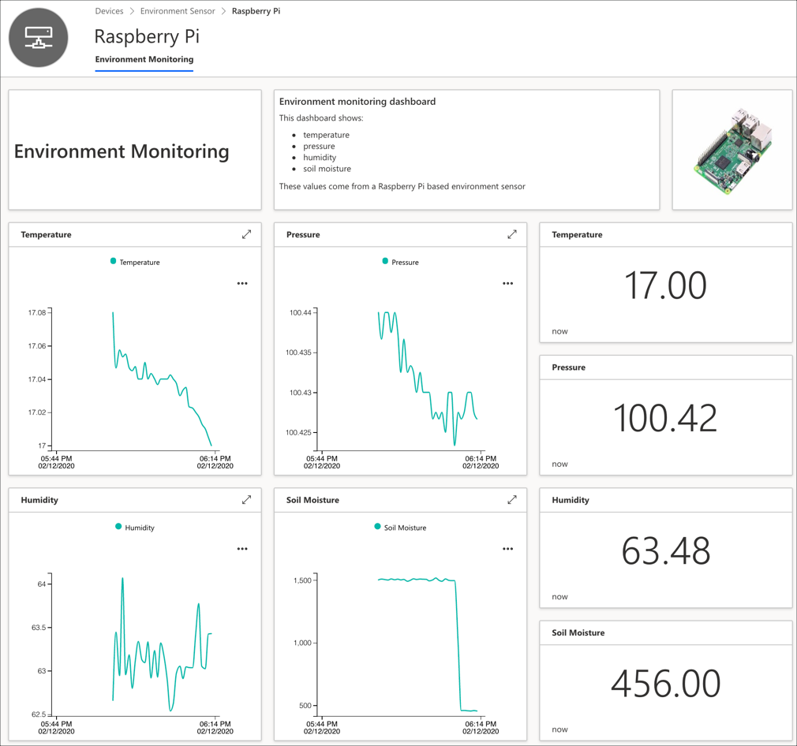

1. Select the **Needs Watering** command. It will open as a new tab next to the view.
1. Try checking and unchecking the *Needs watering* value and selecting **Run**. The LED should light when *Needs watering* is checked, and turn off when it is unchecked.

## Run the Python app continuously

The Python app will only run as long as the terminal is connected. Ideally we want the software running as soon as the Raspberry Pi boots up. This saves having to log in and run the Python file each time the device is turned on. The easiest way to do this is via a `cron` job that is run on reboot. Cron is a task scheduler that runs commands at specific times.

1. Stop the Python app by pressing ctrl+c in the terminal

1. From the terminal run the following command to edit the crontab. This is a file that contains jobs for cron to run.

    ```sh
    sudo crontab -e
    ```

    If you are asked to select and editor, select `nano`. This will open the file inside the terminal in the nano editor.

1. Add the following line to the end of the file:

    ```sh
    @reboot sleep 30 && /home/pi/EnvironmentMonitor/.venv/bin/python3 /home/pi/EnvironmentMonitor/app.py
    ```

    The `sleep 30` command waits for 30 seconds to allow time for the device to completely boot up and connect to WiFi.

1. Press ctrl+x to close nano. Press Y to save the file when asked if you want to save the modified buffer, then press return to select the default file name.

1. From the terminal, run the following command to restart the Raspberry Pi

   ```sh
   sudo reboot
   ```

1. Close the Visual Studio Code window

1. After a few seconds, the Raspberry Pi will reboot and resume sending telemetry to Azure IoT central. Check the device view to see the data.

<hr>

In this step, you wrote the code to capture telemetry from the Raspberry Pi. In the [next step](./ExportDataToEventHubs.md), you will export IoT telemetry to Azure Event Hubs.
