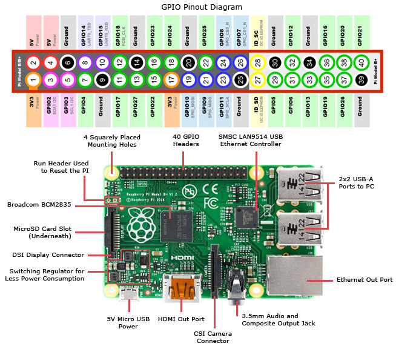
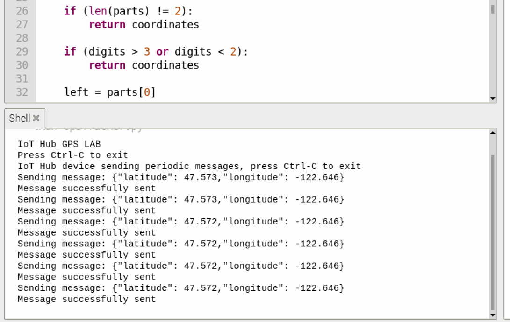
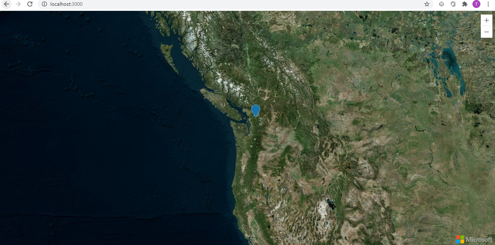

#GPS LAB

##Description
GPS Lab uses a Raspberry PI with a GPS sensor to fetch current location (latitude and longitude)
 and sends the info to IoT hub.

 A web application reads the data from IoT Hub real time and displays the GPS location in a Azure MAP.

 ##Steps
 ### Create and configure IoT Hub
 1. Create one azure IoT Hub and create one device under it 
 2. Install azure CLI (https://docs.microsoft.com/en-us/cli/azure/install-azure-cli?view=azure-cli-latest)
 3. Add a consumer group to your IoT hub (Using azure CLI OR from Azure Portal)
       
        az iot hub consumer-group create --hub-name YourIoTHubName --name YourConsumerGroupName
 4. Get a service connection string for your IoT hub
        
        az iot hub show-connection-string --hub-name YourIotHub --policy-name service
 5. Note down the consumer group and service connection string
 6. Get the connection string for the device you have created. Note that it will be different from the service connection string
 
 Please refer to this document for detailed instructions (https://docs.microsoft.com/en-us/azure/iot-hub/iot-hub-live-data-visualization-in-web-apps)

 ###Client Side Code
 1. Set up and install the OS for Raspberry PI.
 2. Connect the pi with a monitor using micro HDMI or VNC connector
 3. Connect the GPS sensor to Raspberry PI
       a. See **Raspberry Pi Pins.jpg** for reference 
       b. Put the vcc to 2, ground to 6 tx and rx to 8 and 10
       
 4. The GPS Module connected should look like following with a blinking red light when the satelite is available
Note that the GPS antena needs to face open sky to get good GPS connection.
       
 5. Install azure-iot-device package for Python (https://pypi.org/project/azure-iot-device/)
 6. Open the GPSTracker.Py with Thonny Python IDE (Default) or any other Python IDE of your choice.
 7. Change the device connection string.
 
        CONNECTION_STRING = "<Device_Connection_String>"
 8. Run the python file. You should see the messages like the following.
       

 ###Web App Code
 1. Create an Azure MAP Account and note down the subscription key
 2. Install and open Visual Studio Code
 3. Clone the **Web App** code into a local folder
 4. Install all the packages with **npm install**
 5. Configure the **Service connection string** and **Consumer Group Name** in **server.js**
 
        const iotHubConnectionString = "<Service_Connection_String>";

        const eventHubConsumerGroup = "<Consumer_Group_Name>";
 6. Update the subscription key in Index.html

        map = new atlas.Map('myMap', {
            ...
            authOptions: {
                authType: 'subscriptionKey',
                subscriptionKey: '<Your_Subscription_Key>'
            }
        });
 7. run the website and then browse locahost:3000

        npm start
8. The map should look like this and if you have the client side code running you will see your current location is pinned in the map
       

Note that you might have to drag the map or zoom out if the your current location is not in the map current view port.
