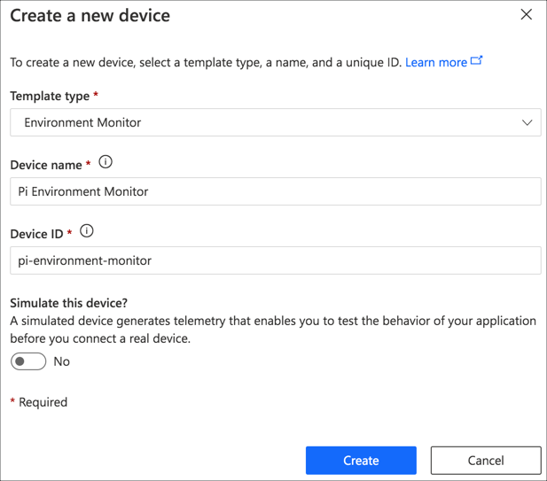
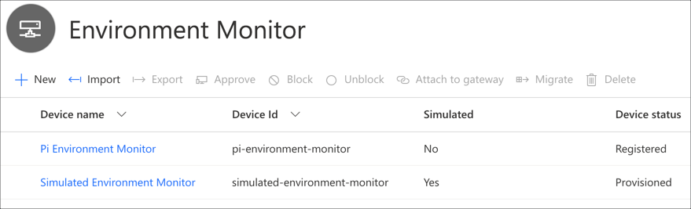
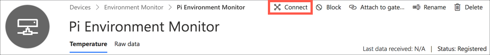
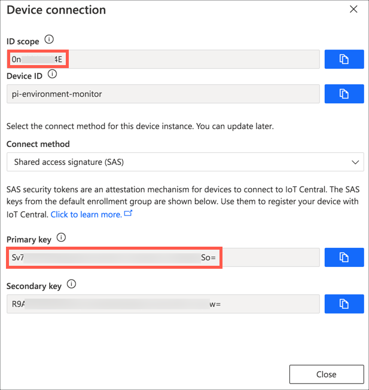
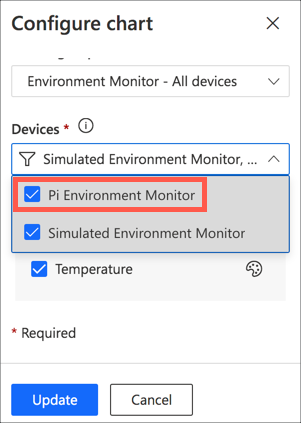

# Add a physical device to IoT Central

In the [previous step](./set-up-iot-central.md) you set up an IoT Central application using a pre-created template, and set up a simulated device.

In this step you will add a physical device to IoT Central.

> This setup will work with a Raspberry Pi, or a virtual device using code running on your PC or Mac.

## Create the device in IoT Central

To connect the Pi to IoT Central, you need to create a new device, the same as you did in the previous step. The difference is this time the device isn't simulated. Once you have the device created, you will need some connection details that the Pi or virtual device can use to connect to IoT Central as the device.

### Create the device

1. Follow the instructions in the previous step to create a new device using the *Environment Monitor* device template.

    1. Ensure `Environment Monitor` is selected for the *Template Type*
    1. Set the *Device Name* to `Pi Environment Monitor`
    1. Set the *Device ID* to `pi-environment-monitor`
    1. Set *Simulate this device* to **NO**
    1. Select the **Create** button

    

1. Once the device is created it will appear in the devices list. Select it.

    

1. Select the **Connect** button on the top to bring up the connection details for the device

    

1. The dialog that appears shows the information needed to connect from the Pi. Note down the *ID scope* and *Primary key* values. You can use the **Copy to clipboard** button on the end of each value to copy the values.

    

### Add the device to the dashboard

The dashboard currently only shows temperature from the simulated device. It needs to be changed to include the Pi.

1. Select the **Dashboard** tab from the side bar menu

1. Select the **Edit** button from the top menu

    

1. Select the properties cog from the Temperature tile

    

1. From the *Configure Chart* panel, drop down the *Devices* list, and check the `Pi Environment Monitor`.

    

1. Select the **Update** button

    

1. Select the **Save** button for the dashboard

    

## Next steps

In this step you added a physical device to IoT Central.

In the next step you will set up this physical device and run code to connect and send temperature data. Select the relevant next step from the list below depending on if you have a Pi or want to set up a virtual IoT device.

* [Set up a Raspberry Pi](./set-up-pi.md)
* [Set up a virtual device using your PC or Mac](./set-up-virtual-pi.md)
