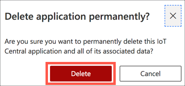

# Clean up you Azure resources

In the [previous step](./build-ai-models.md) you built AI models to make predictions on temperatures.

In this step you will clean up your Azure resources.

## Clean up resources

Every Azure service you use either costs you money (either paid for or reduces your available credit for free subscriptions), or uses up one of your available free tier resources. It's good practice when you are finished with a resource to delete it - to either save money or to allow you to spin up new free tier resources.

### Delete the Azure Resource Group

Azure has the concept of Resource Groups, logical groupings of resources that you can manage together. All resources, such as Event Hubs, Cosmos DB accounts or Stream Analytics Jobs have to live in a resource group. Deleting the resource group deletes all the services inside it.

> If you didn't work through the *Perform more advanced analytics to detect and visualize anomalies in the data* or *Build AI models to make predictions on temperatures* steps, then you can skip this section as you didn't create any Azure resources.

1. From the [Azure Portal](https://portal.azure.com/?WT.mc_id=academic-7372-jabenn), head to the *EnvironmentMonitor* resource group that you created earlier.

1. To delete the resource group, follow the instructions in the [Azure Resource Manager resource group and resource deletion documentation](https://docs.microsoft.com/azure/azure-resource-manager/management/delete-resource-group?tabs=azure-portal&WT.mc_id=academic-7372-jabenn)

### Delete the IoT Central application

IoT Central applications are deleted from the IoT Central application itself.

1. From your IoT Central application, select the **Administration** tab from the side bar menu

    

1. Select **Your Application**

    

1. Select the **Delete** button from the bottom

    

1. Select the **Delete** button from the confirmation dialog

    

Your application will be deleted.

## Next steps

You have completed this lab building an environment monitor using a Raspberry Pi and a Grove Pi+ sensor kit. You detected temperature, humidity and sound data and sent this data to Azure IoT Central, where you visualized it on dashboards. You then set up rules to alert for loud noises, as well configuring anomaly detection to look for unexpected sound levels. You also sent the data to Azure Machine learning studio to run AI models on it.

If you want to learn more about Azure IoT Services, then check out the following:

* [IoT learning paths on Microsoft Learn](https://docs.microsoft.com/learn/browse/?term=IOT&WT.mc_id=academic-7372-jabenn)
* [The IoT show on Channel9](https://channel9.msdn.com/Shows/Internet-of-Things-Show/?WT.mc_id=academic-7372-jabenn)

Once you have upskilled as an IoT developer, why not get certified with our AZ-220 Azure IoT Developer certification. Check out the details on our [certification page](https://docs.microsoft.com/learn/certifications/azure-iot-developer-specialty?WT.mc_id=academic-7372-jabenn)
