# Create an IoT Central command and trigger it from a rule

In the previous step you either [set up a Raspberry Pi](./rules-pi-led.md), or [set up a virtual IoT device](./rules-virtual-led.md) to listen for an IoT Central command.

In this step you will create the IoT Central command and trigger it from a rule.

## Create a command

Commands are capabilities on an interface, so to add a command, a new version of the interface needs to be create on a new version of the device template.

1. Follow the steps in a previous part to create a new version of the `Environment Monitor v2` device template. Make sure it is named `Environment Monitor v3`.

1. Create a new version of the `Environment` interface

1. Add a new capability to the interface with the following settings:

    | Display Name | Name    | Capability Type | Command Type | Request | Response |
    | ------------ | ------- | --------------- | ------------ | ------- | -------- |
    | Too Loud     | TooLoud | Command         | Synchronous  | off     | off      |

    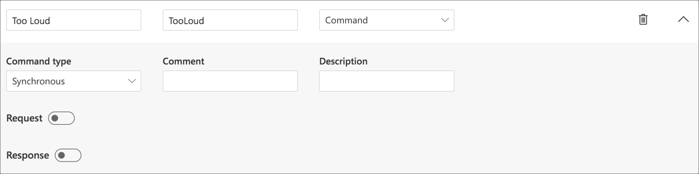

1. Save the interface, and publish the device template

1. Migrate the *Pi Environment Monitor* to the new *Environment Monitor v3* device template following the steps in the previous part. There is no need to migrate the simulated device over as this won't have an LED.

### Test the code

The code can be tested by manually calling the command from IoT Central.

1. From IoT Central, select the *Pi Environment Monitor* from the Devices

1. There will be a new tab called *Command*. This is created automatically whenever there is a command on a device template. Select this tab.

    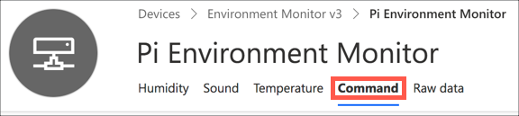

1. This tab shows the *Too Loud* command with a **Run** button to execute the command. Select the **Run** button.

    

1. You will see the result of this command depending on if you are using a Pi or a virtual device

    * If you are using a Raspberry Pi, you will see the LED light for 10 seconds, then turn off
    * If you are using a virtual IoT device, you will see the following appear in the console:

        ```output
        #########################
        Too Loud Command received
        #########################
        ```

## Call the command from the rule

IoT central commands can be called from webhooks - special URLs that you can make a request to to execute the command. Not everyone can call these commands - that would make IoT Central apps insecure. Instead to be able to call the command you need to be authorized, for example using an API token, a special key that allows you to call these commands.

### Create the API token

API tokens are created from IoT Central.

1. Select the **Administration** tab from the side bar menu

    

1. Select **API tokens** from the *Administration* menu

    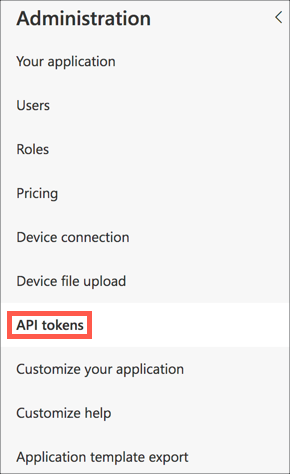

1. Select the **+ Generate token** button

    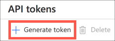

1. Name the token `CommandRunner` and set the  *Role* to `Operator`.

    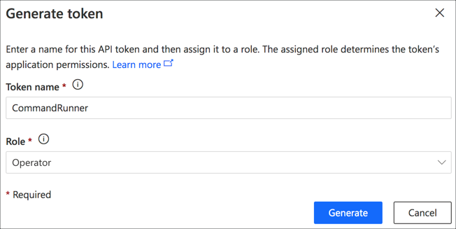

    Tokens have different roles that determine what they can do. The *Operator* role allows devices to be monitored and commands run, but devices and templates can't be changed. There are other roles that give more permissions. It's best practice to use the least privileged role possible.

1. Select the **Generate** button.

1. A dialog will popup showing the token. This is the **ONLY** time you will be able to see this token, so take a copy of it now and save it somewhere. If you lose this, you will need to create a new token.

    

### URL Encode the API token

The token is not URL encoded - that means it can't be passed as is to a web call as is. To fix it, do the following:

1. Paste the API token into a text editor, such as in a new document in VS Code

1. In the API token there will be 3 ampersands (`&` characters) before various parts - `&sig=`, `&skn=` and `&se=`. These `&` characters cannot be passed to a web call, so need to be changed.

1. Replace all `&` characters with `%26` - so `&sig=` becomes `%26sig=`, `&skn=` becomes `%26sig=`, and `&se=` becomes `%26se=`

1. There is also a space in the API - `SharedAccessSignature sr=`. This space needs to be replaced with `%20`, so the first part of the token should read `SharedAccessSignature%20sr=`

### Create the webhook

The rule can call a webhook when triggered. The webhook needs a URL to call - a web address that it will use to run the command. This needs to be built up using your IoT Central app details, as well as the API token.

The format of this URL is:

```output
https://<app_name>.azureiotcentral.com/api/preview/devices/pi-environment-monitor/components/EnvironmentMonitor_Environment/commands/TooLoud?access_token=<encoded_api_token>
```

1. To build the URL that you will use, take the above URL and replace the following:

    * Replace `<app_name>` with the name of your IoT Central app. You can get this from the URL that you use to access IoT central
    * Replace `<encoded_api_token>` with the API token copied earlier, with all the `&` characters replaced with `%26` and space replaced with `%20`

You can test this webhook using Postman, a free tool for testing REST APIs.

1. Download Postman from this link:

    [getpostman.com/downloads](http://getpostman.com/downloads)

    Once downloaded, install the app and launch it.

1. From Postman, select *File->New Tab*

1. In the *Untitled Request* tab, set the following:

    * Set the request type to `POST`
    * Enter the encoded command URL into the *Request URL* box
    * In the *Body* tab, set the type to `raw` and `JSON`
    * Set the body to be `{}`

1. Select the **Send** button

    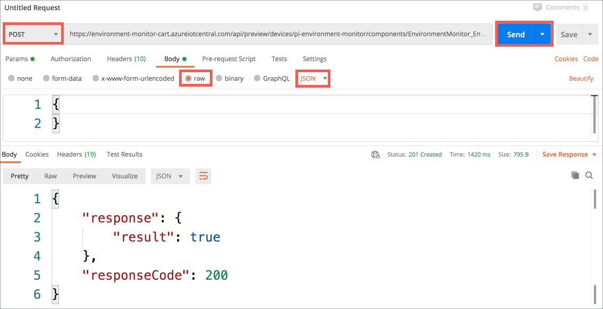

The request will run and you will see result in the *Body* tab of the response section.

```json
{
    "response": {
        "result": true
    },
    "responseCode": 200
}
```

You should also see the Too Loud command called in the output of the Python app, and either the LED light up for 10 seconds, or a message output to the console.

> If you see the following, then the Python app is not running:
>
> ```json
> {
>     "error": {
>         "code": "NotFound",
>         "message": "Could not connect to device in order to send command. You can contact support at https://aka.ms/iotcentral-support. Please include the following information. Request ID: tsbbfyb, Time: Fri, 21 Aug 2020 02:15:35 GMT."
>     }
> }
> ```

### Add the webhook to the rule

Once the webhook is tested, it can be added to a rule.

Once a rule has been created, the devices that is responds too cannot be changed, so you will need to delete the old rule, and create a new one.

1. Head to the *Rules* tab in the side bar menu, and select the *Sound Check* rule

    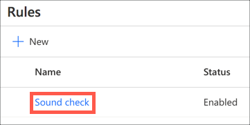

1. Select the **Delete** button

    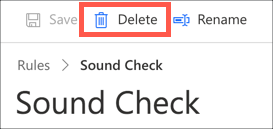

1. From the confirmation dialog, select **Delete**

    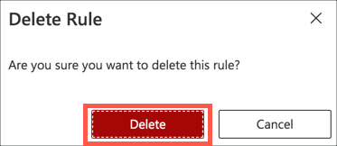

1. Create a new rule using the steps from the previous section. Name it `Sound Check`, ensure the `Environment Monitor v3` device template is selected, and the condition is set on the `Sound` telemetry value. There is no need to add an email action.

1. In the *Actions* section, select **+ Webhook**

    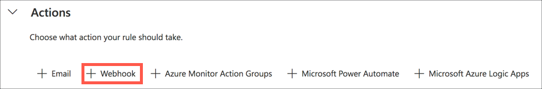

1. Name the webhook `Call Command`

1. Set the *Callback URL* to the webhook you tested earlier

    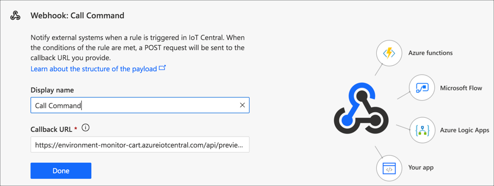

1. Select the **Done** button

You should see the web hook action for the rule.

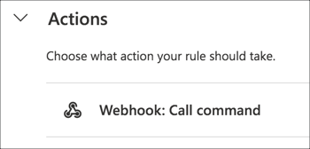

1. Select the **Save** button to save the rule.

### Test the rule

In the same way as earlier, make loud noise near the sound sensor. The LED will light up for 10 seconds if you are using a Pi, or you will see the command being called in the output.

## Next steps

In this step you created the IoT Central command and triggered it from a rule.

In the [next step](./anomaly-detection.md) you will perform more advanced analytics to detect anomalies in the data.
