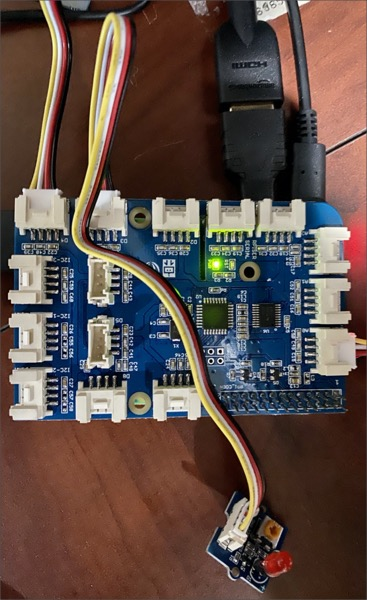

# Set up the Raspberry Pi to light an LED triggered by an IoT Central command

In the [previous step](./rules.md) you performed simple analytics and created an alert on the data using IoT Central rules.

In this step you will set up the Pi to listen for an IoT Central command, and when the command is received an LED will light for 10 seconds.

## IoT Central commands

IoT Central commands are instructions sent by IoT Central to command a device to do something. For example, if a sound level is reaching dangerous levels, IoT Central can send a command to a device.

The command will be set up and tested in a later step - it can't be tested until a device is able to listen for it. In this step, the Pi will be configured to listen for the command, and when received turn on an LED for 10 seconds.

The command will be called `TooLoud`.

## Connect the LED

The Grove Pi+ kit contains a number of different colored LEDs with sockets for them. Pick the color you prefer.

The LED needs to be mounted in the socket. LEDs need to be installed the correct way round - they are diodes through which electricity can only travel one way. Each LED has a flat side by the negative pin - it can be very subtle, so it might be easier to feel than to see.

1. Connect the LED into the socket, with the flat side by the negative hole.

1. Connect the LED via a cable to socket D3 on the Grove Pi+, next to the temperature humidity sensor.

1. The LED is connected to a variable resistor that can change the brightness of the LED. To ensure everything is working, it is best to rotate it to the central point to ensure it's not accidentally set to the lowest brightness.



## Program the Pi

The Pi needs some code changes to listen for the command, and be able to control the LED.

### Update the code to handle the Too Loud command

In this section you will be adding code to the Python file. If you haven't used Python before, be aware it is very specific about how the lines are indented, so make sure the code is indented the same as the code around it. You can find the full code in the [app.py](../code/pi/led/app.py) file in the [code/pi/led](../code/pi/led) folder to check your code against if you get errors.

1. Connect to the Pi using Visual Studio Code, open the `Environment Monitor` folder, and open the `app.py` file.

1. After the `import` statements, add another to import `MethodResponse` from the `azure.iot.device` Pip package, below the line importing from `azure.iot.device.aio`:

    ```python
    from azure.iot.device import MethodResponse
    ```

1. Head to after the `sound_sensor_port` is defined and the pin is set to output, and before the `get_telemetry` function is defined

1. Add the following code to set up the LED port number and configure it for output:

    ```python
    # Set the LED port to the digital port D3
    # and mark it as OUTPUT meaning data needs to be
    # written to it
    led_port = 3
    grovepi.pinMode(led_port, "OUTPUT")
    ```

1. Head to just before the `main_loop`

1. Add the following code before the `main_loop`:

    ```python
    # async code to light the LED, wait 10 seconds then
    # turn the LED off
    async def light_led():
        # Send a value of 1 to the digital port
        # This will turn the LED on
        grovepi.digitalWrite(led_port, 1)

        # Wait 10 seconds
        await asyncio.sleep(10)

        # Send a value of 0 to the digital port
        # This will turn the LED off
        grovepi.digitalWrite(led_port, 0)

    # Asynchronously wait for commands from IoT Central
    # If the TooLoud command is called, handle it
    async def command_listener(device_client):
        # Loop forever waiting for commands
        while True:
            # Wait for commands from IoT Central
            method_request = await device_client.receive_method_request("TooLoud")

            # Log that the command was received
            print("Too Loud Command handled")

            # Asynchronously light the LED
            # This will be run in the background, so the result can
            # be returned to IoT Central straight away, not 10 seconds later
            asyncio.gather(light_led())

            # IoT Central expects a response from a command, saying if the call
            # was successful or not, so send a success response
            payload = {"result": True}

            # Build the response
            method_response = MethodResponse.create_from_method_request(
                method_request, 200, payload
            )

            # Send the response to IoT Central
            await device_client.send_method_response(method_response)
    ```

    This code sets up a listener for the commands from IoT Central, and if the `TooLoud` command is received, it turns the LED on for 10 seconds, and sends a response to IoT Central to say the command was handled.

1. Head to after the `main_loop` function and before the `await main_loop()` call

1. Add the following code to start the command listener

    ```python
    # Start the command listener
    listeners = asyncio.gather(command_listener(device_client))
    ```

1. After the call to `await main_loop`, add the following code:

    ```python
    # Cancel listening
    listeners.cancel()
    ```

1. Save the file

1. Run the code from the VS Code terminal using the following command:

    ```sh
    python3 app.py
    ```

### Configure the code to run on startup

At the moment, this code will only run when you are connected to the Pi and run it via Python. This means as soon as VS Code disconnects, the code will no longer run. Most IoT devices will run code on startup, so that they are continuously sending data. You can configure the Pi to run the code on startup by adding an entry to the *crontab* - the set of instructions used by Cron. Cron is a tool that runs code at certain times, and can be configured to run the Pi code when the Pi is rebooted.

This is the last code change to make to the Pi, so now is a good time to make the Pi run this code on startup.

1. Run the following code to configure the CronTab:

    ```sh
    crontab -l > cron.tmp
    echo "@reboot sleep 30 && cd /home/pi/EnvironmentMonitor && /usr/bin/python3 /home/pi/EnvironmentMonitor/app.py" >> cron.tmp
    crontab cron.tmp
    rm cron.tmp
    ```

    This code writes a new entry that is run on reboot. First it sleeps for 30 seconds to ensure the Pi is fully running and connected to the internet, then it launches the app.py file using Python.

Test this out by rebooting the Pi. You should see data appearing in IoT Central 30 seconds after the Pi reboots.

> You can only read from the Grove Pi+ sensors from one app on the Pi at a time. This means that if you want to run this code manually, you will need to stop the code that was started by the reboot. You can do this with the following steps:
>
>    1. Run the following command to see all the Python processes running:
>
>        ```sh
>        ps -ef | grep -i python
>        ```
>
>    1. You will see an output something like this:
>
>       ```output
>       pi         476   432  0 15:08 ?        00:00:00 /bin/sh -c sleep 30 && cd /home/pi/EnvironmentMonitor && /usr/bin/python3 /home/pi/EnvironmentMonitor/app.py
>       pi        1012   476  1 15:09 ?        00:00:04 /usr/bin/python3 /home/pi/EnvironmentMonitor/app.py
>       pi        1229  1170  0 15:14 pts/0    00:00:00 grep --color=auto -i python
>       ```
>
>       If you are using the VS Code terminal you will seen an extra line for the PyLance extension running remotely.
>
>    1. The first line that starts `/bin/sh -c sleep 30` is the Cron job. This has 2 numbers at the start of the line, in this case 476 and 432. When you run this, these numbers will be different. The first number, 476 in this case, is the process group ID - an identifier for the cron job and all the tasks it ran, in this case running the app code through Python. You will see the same number as the second value for the `/usr/bin/python3 /home/pi/EnvironmentMonitor/app.py` line
>
>    1. Use the following command to terminate the Cron task and the Python process that is started:
>
>        ```sh
>        kill -SIGTERM -- -476
>        ```
>
>        Replace 476 with the process ID of your Cron job.
>
>        You can check if the job has been ended successfully by re-running the `ps` command.

## Next steps

In this step you set up the Pi to listen for an IoT Central command, and when the command was received light an LED for 10 seconds.

In the [next step](./rules-command.md) you will create the IoT Central command and trigger it from a rule.
