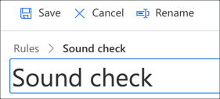
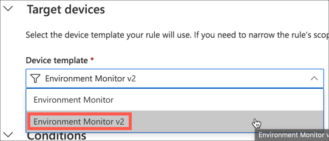
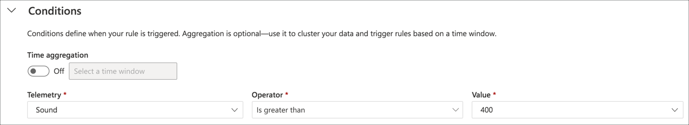
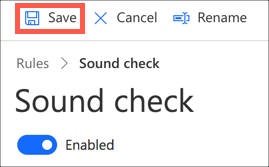
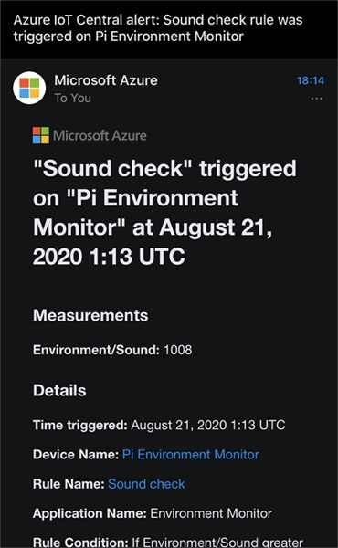

# Perform simple analytics and create an email alert on the data using rules

In the [previous step](./set-up-humidity-sound.md) you set up IoT Central and the Raspberry Pi to send humidity and sound data.

In this step you will perform simple analytics and create an email alert on the data using IoT Central rules.

## IoT Central rules

IoT Central can run rules - actions that are executed when a condition is met, such as a telemetry value exceeding a threshold. These rules can be based off individual values, or an aggregation over time.

The actions that can be run include sending emails, calling webhooks (Web addresses that you call to run a task, such as [sending a message to Microsoft Teams](https://docs.microsoft.com/microsoftteams/platform/webhooks-and-connectors/what-are-webhooks-and-connectors?WT.mc_id=academic-7372-jabenn)), or calling [Power Automate](https://flow.microsoft.com/?WT.mc_id=academic-7372-jabenn) or [Logic Apps](https://azure.microsoft.com/services/logic-apps/?WT.mc_id=academic-7372-jabenn).

The rule you will be creating will be an alert when the sound level breaks a threshold. This kind of setup can be used in the real world to monitor noise in factories or industry to ensure it doesn't exceed safe levels. The concept can also be used for things like temperature monitoring of machinery to ensure it doesn't overheat, or vibration monitoring to ensure a machine isn't breaking. In most situations you would either want an alert through a notification such as an email, or through direct control of a machine.

This part will cover sending an email alert. In a later step, you will enhance this rule to control the IoT device by lighting an LED, or showing a message on the console of the virtual IoT device.

## Create an IoT Central rule

### Create the rule

To create an IoT Central rule

1. From the IoT Central app, select the **Rules** tab from the side bar menu

    

1. Select the **+ New** button to create a new rule

    

1. Name the rule `Sound Check`

    

1. Drop down the **Device Template** box in the **Target Devices** section and select `Environment Monitor v2`

    

1. For the condition, select the `Sound` *Telemetry* value, the `Is greater than` *Operator*, and set the *Value* to something like 400

    

    This value needs to be higher than your ambient noise levels, so check the output of the app running on the Pi to see what your background noise level is, and increase or decrease this as necessary to be above the highest normal background noise. For example, if your background noise ranges from 250-350 then 400 is an ideal value.

    If you are using the virtual IoT device, set this to 700.

    To test this, you will need to increase the noise levels, so if you are getting values with additional noise such as music then turn this off to find the ideal value.

    > When typing the value into the *Value* box, you will need to press return to set the value, rather than just click out or tab to the next box

1. In the *Actions* section, select the **+ Email** button

    

1. Name the email action `Send email` and put your email address in the *To* box. Then select the **Done** button.

    

1. Select the **Save** button to save the rule

    

### Test the rule

To test the rule, the sound sensor needs to receive a higher value than expected.

1. Trigger the rule:

    * If you are using a Raspberry Pi:

        1. Find something that makes noise, for example [playing this video on your phone](https://youtu.be/dQw4w9WgXcQ) with the volume turned up.

        1. Position the noise close to the sound sensor with the Python app running on the Pi. Watch for a sound value over your threshold. Once the threshold is exceeded you can remove the sensor from the source of noise.

    * If you are using the virtual IoT device, press the space key to simulate a loud noise

1. Check your email for an alert. The Email will include the value that caused the rule to trigger. It may take a few minutes for the email to arrive.

    

## Next steps

In this step you performed simple analytics and created an alert on the data using IoT Central rules.

In the next step you will Set up an IoT device to listen for an IoT Central command. Select the relevant next step from the list below depending on if you have a Pi or want to set up a virtual IoT device.

* [Set up the command on a Raspberry Pi](./rules-pi-led.md)
* [Set up the command on a virtual device using your PC or Mac](./rules-virtual-led.md)
