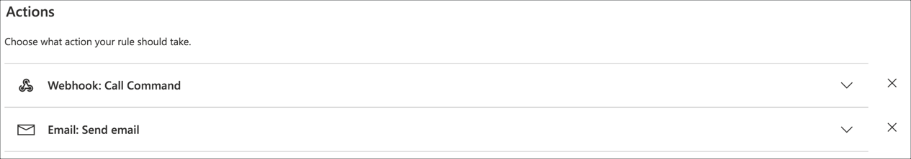

# Perform simple analytics and create an alert on the data using rules

In the [previous step](./set-up-humidity-sound.md) you set up IoT Central and the Raspberry Pi to send humidity and sound data.

In this step you will perform simple analytics and create an alert on the data using IoT Central rules.

## IoT Central rules

IoT Central can run rules - actions that are executed when a condition is met, such as a telemetry value exceeding a threshold. These rules can be based off individual values, or an aggregation over time.

The actions that can be run include sending emails, calling webhooks (Web addresses that you call to run a task, such as [sending a message to Microsoft Teams](https://docs.microsoft.com/microsoftteams/platform/webhooks-and-connectors/what-are-webhooks-and-connectors?WT.mc_id=iotcurriculum-github-jabenn)), or calling [Power Automate](https://flow.microsoft.com/?WT.mc_id=iotcurriculum-github-jabenn) or [Logic Apps](https://azure.microsoft.com/services/logic-apps/?WT.mc_id=iotcurriculum-github-jabenn).

The rule you will be creating will be an alert when the sound level breaks a threshold. This kind of setup can be used in the real world to monitor noise in factories or industry to ensure it doesn't exceed safe levels. The concept can also be used for things like temperature monitoring of machinery to ensure it doesn't overheat, or vibration monitoring to ensure a machine isn't breaking. In most situations you would either want an alert through a notification such as an email, or through direct control of a machine.

This part will use both, it covers creating a rule that will not only send an email, but will cause an LED to light up on the Pi using an IoT Central command, demonstrating how to control an IoT device from the cloud.

Rules are configured based on device groups, so before the rule can be created a new device template has to be created to contain the command that will control the LED on the Pi.

## Create a command

Commands are capabilities on an interface, so to add a command, a new version of the interface needs to be create on a new version of the device template.

1. Follow the steps in the previous part to create a new version of the device template. Make sure it is named `Environment Monitor v3`.

1. Create a new version of the interface

1. Add a new capability to the interface with the following settings:

    | Display Name | Name    | Capability Type | Command Type | Request | Response |
    | ------------ | ------- | --------------- | ------------ | ------- | -------- |
    | Too Loud     | TooLoud | Command         | Synchronous  | off     | off      |

    

1. Save the interface, and publish the device template

1. Migrate the *Pi Environment Monitor* to the new *Environment Monitor v3* device template following the steps in the previous part. There is no need to migrate the simulated device over as this won't have an LED.

## Create an IoT Central rule

### Create the rule

To create an IoT Central rule

1. From the IoT Central app, select the **Rules** tab from the side bar menu

    

1. Select the **+ New** button to create a new rule

    

1. Name the rule `Sound Check`

    

1. Drop down the **Device Template** box in the **Target Devices** section and select `Environment Monitor v3`

    

1. For the condition, select the `Sound` *Telemetry* value, the `Is greater than` *Operator*, and set the *Value* to something like 400

    

    This value needs to be higher than your ambient noise levels, so check the output of the app running on the Pi to see what your background noise level is, and increase or decrease this as necessary to be above the highest normal background noise. For example, if your background noise ranges from 250-350 then 400 is an ideal value.

    To test this, you will need to increase the noise levels, so if you are getting values with additional noise such as music then turn this off to find the ideal value.

    > When typing the value into the *Value* box, you will need to press return to set the value, rather than just click out or tab to the next box

1. In the *Actions* section, select the **+ Email** button

    

1. Name the email action `Send email` and put your email address in the *To* box. Then select the **Done** button.

    

1. Select the **Save** button to save the rule

    

### Test the rule

To test the rule, the sound sensor needs to receive a higher value than expected.

1. Find something that makes noise, for example [playing this video on your phone](https://youtu.be/dQw4w9WgXcQ) with the volume turned up.

1. Position the noise close to the sound sensor with the Python app running on the Pi. Watch for a sound value over your threshold. Once the threshold is exceeded you can remove the sensor from the source of noise.

1. Check your email for an alert. The Email will include the value that caused the rule to trigger. It may take a few minutes for the email to arrive.

    

## Connect the LED

The Grove Pi+ kit contains a number of different colored LEDs with sockets for them. Pick the color you prefer.

The LED needs to be mounted in the socket. LEDs need to be installed the correct way round - they are diodes through which electricity can only travel one way. Each LED has a flat side by the negative pin - it can be very subtle, so it might be easier to feel than to see.

1. Connect the LED into the socket, with the flat side by the negative hole.

1. Connect the LED via a cable to socket D3 on the Grove Pi+, next to the temperature humidity sensor.

1. The LED is connected to a variable resistor that can change the brightness of the LED. To ensure everything is working, it is best to rotate it to the central point to ensure it's not accidentally set to the lowest brightness.


## Program the Pi

The Pi needs some code changes to listen for the command, and be able to control the LED.

### Update the code to handle the Too Loud command

In this section you will be adding code to the Python file. If you haven't used Python before, be aware it is very specific about how the lines are indented, so make sure the code is indented the same as the code around it. You can find the full code in the [app.py](../code/led/app.py) file in the [code/sound-humidity](../code/led) folder to check your code against if you get errors.

1. Connect to the Pi using Visual Studio Code, open the `Environment Monitor` folder, and open the `app.py` file.

1. Head to line 5, after the `import` statements

1. Add the following code after this to import the code needed to handle commands

    ```python
    from azure.iot.device import MethodResponse
    ```

1. Head to line 24, after the `sound_sensor_port` is defined and the pin is set to output, and before the `get_telemetry` function is defined

1. Add the following code to set up the LED port number and configure it for output:

    ```python
    # Set the LED port to the digital port D3
    # and mark it as OUTPUT meaning data needs to be
    # written to it
    led_port = 3
    grovepi.pinMode(led_port, "OUTPUT")
    ```

1. Head to line 82, before the `main_loop`

1. Add the following code before the `main_loop`:

    ```python
    # async code to light the LED, wait 10 seconds then
    # turn the LED off
    async def light_led():
            # Send a value of 1 to the digital port
            # This will turn the LED on
            grovepi.digitalWrite(led_port, 1)

            # Wait 10 seconds
            await asyncio.sleep(10)

            # Send a value of 0 to the digital port
            # This will turn the LED off
            grovepi.digitalWrite(led_port, 0)

    # Asynchronously wait for commands from IoT Central
    # If the TooLoud command is called, handle it
    async def command_listener(device_client):
        # Loop forever waiting for commands
        while True:
            # Wait for commands from IoT Central
            method_request = await device_client.receive_method_request("TooLoud")

            # Log that the command was received
            print("Too Loud Command handled")

            # Asynchronously light the LED
            # This will be run in the background, so the result can
            # be returned to IoT Central straight away, not 10 seconds later
            asyncio.gather(light_led())

            # IoT Central expects a response from a command, saying if the call
            # was successful or not, so send a success response
            payload = {"result": True}

            # Build the response
            method_response = MethodResponse.create_from_method_request(
                method_request, 200, payload
            )

            # Send the response to IoT Central
            await device_client.send_method_response(method_response)
    ```

    This code sets up a listener for the commands from IoT Central, and if the `TooLoud` command is received, it turns the LED on for 10 seconds, and sends a response to IoT Central to say the command was handled.

1. Head to line 137, after the `main_loop` function and before the `await main_loop` call

1. Add the following code to start the command listener

    ```python
    # Start the command listener
    listeners = asyncio.gather(command_listener(device_client))
    ```

1. After the call to `await main_loop`, add the following code:

    ```python
    # Cancel listening
    listeners.cancel()
    ```

1. Save the file

1. Run the code from the VS Code terminal using the following command:

    ```sh
    python3 app.py
    ```

### Test the code

The code can be tested by manually calling the command from IoT Central.

1. From IoT Central, select the *Pi Environment Monitor* from the Devices

1. There will be a new tab called *Commands*. This is created automatically whenever there is a command on a device template. Select this tab.

    

1. This tab shows the *Too Loud* command with a **Run** button to execute the command. Select the **Run** button.

    

1. If you monitor the output from the Raspberry Pi, you will see this command being handled:

    ```output
    RegistrationStage(RequestAndResponseOperation): Op will transition into polling after interval 2.  Setting timer.
    Connecting
    Connected
    Telemetry: {"Temperature": 26.0, "Humidity": 40.0, "Sound": 269}
    Too Loud Command handled
    ```

1. You will also see the LED light up for 10 seconds, then turn off

### Configure the code to run on startup

At the moment, this code will only run when you are connected to the Pi and run it via Python. This means as soon as VS Code disconnects, the code will no longer run. Most IoT devices will run code on startup, so that they are continuously sending data. You can configure the Pi to run the code on startup by adding an entry to the *crontab* - the set of instructions used by Cron. Cron is a tool that runs code at certain times, and can be configured to run the Pi code when the Pi is rebooted.

This is the last code change to make to the Pi, so now is a good time to make the Pi run this code on startup.

1. Run the following code to configure the CronTab:

    ```sh
    crontab -l > cron.tmp
    echo "@reboot sleep 60 && cd /home/pi/EnvironmentMonitor && /usr/bin/python3 /home/pi/EnvironmentMonitor/app.py" >> cron.tmp
    crontab cron.tmp
    rm cron.tmp
    ```

    This code writes a new entry that is run on reboot. First it sleeps for 60 seconds to ensure the Pi is fully running and connected to the internet, then it launches the app.py file using the Python binary in the virtual environment.

Test this out by rebooting the Pi. You should see data appearing in IoT Central.

> You can only read from the Grove Pi+ sensors from one app on the Pi at a time. This means that if you want to run this code manually, you will need to terminate the process that was started by the reboot. You can do this with the following steps:
>
>    1. Run the following command to see all the Python processes running:
>
>        ```sh
>        ps -ef | grep -i python
>        ```
>
>    1. You will see an output something like this:
>
>       ```output
>       pi         476   432  0 15:08 ?        00:00:00 /bin/sh -c sleep 60 && cd /home/pi/EnvironmentMonitor && /usr/bin/python3 /home/pi/EnvironmentMonitor/app.py
>       pi        1012   476  1 15:09 ?        00:00:04 /usr/bin/python3 /home/pi/EnvironmentMonitor/app.py
>       pi        1229  1170  0 15:14 pts/0    00:00:00 grep --color=auto -i python
>       ```
>
>       If you are using the VS Code terminal you will seen an extra line for the PyLance extension running remotely.
>
>    1. The first line that starts `/bin/sh -c sleep 60` is the Cron job. This has 2 numbers at the start of the line, in this case 476 and 432. When you run this, these numbers will be different. The first number, 476 in this case, is the process group ID - an identifier for the cron job and all the tasks it ran, in this case running the app code through Python
>
>    1. Use the following command to terminate the Cron task and the Python process that is started:
>
>        ```sh
>        kill -SIGTERM -- -476
>        ```
>
>        Replace 476 with the process ID of your Cron job.
>
>        You can check if the job has been terminated successfully by re-running the `ps` command.

## Call the command from the rule

IoT central commands can be called from webhooks - special URLs that you can make a request to to execute the command. Not everyone can call these commands - that would make IoT Central apps insecure. Instead to be able to call the command you need to be authorized, for example using an API token, a special key that allows you to call these commands.

### Create the API token

API tokens are created from IoT Central.

1. Select the **Administration** tab from the side bar menu

    

1. Select **API tokens** from the *Administration* menu

    

1. Select the **+ Generate token** button

    

1. Name the token `CommandRunner` and set the  *Role* to `Builder`.

    

    Tokens have different roles that determine what they can do. The *Operator* role allows devices to be monitored and commands run, but devices and templates can't be changed. There are other roles that give more permissions. It's best practice to use the least privileged role possible.

1. Select the **Generate** button.

1. A dialog will popup showing the token. This is the **ONLY** time you will be able to see this token, so take a copy of it now and save it somewhere. If you lose this, you will need to create a new token.

    

### Create the webhook

The rule can call a webhook when triggered. The webhook needs a URL to call - a web address that it will use to run the command. This needs to be built up using your IoT Central app details, as well as the API token.

The format of this URL is:

```output
https://<app_name>.azureiotcentral.com/api/preview/devices/pi-environment-monitor/components/EnvironmentMonitor_Environment/commands/TooLoud?access_token=<api_token>
```

1. To build the URL that you will use, take the above URL and replace the following:

    * Replace `<app_name>` with the name of your IoT Central app. You can get this from the URL that you use to access IoT central
    * Replace `<api_token>` with the API token copied earlier

You can test this webhook using [Postman](https://www.postman.com/downloads/), an app to test web calls.

1. Create a new request in Postman

1. Set the type to *POST*

1. Paste in the webhook as the URL

1. Head to the *Body* tab, set the type as *Raw* and *JSON*, and set the content to:

    ```json
    {
    }
    ```

1. Select the **Send** button

    

You should see a response in Postman of:

```json
{
    "response": {
        "result": true
    },
    "responseCode": 200
}
```

You should also see the Too Loud command called in the output of the Python app, and the LED light up for 10 seconds. If you see the following, then the Python app is not running:

```json
{
    "error": {
        "code": "NotFound",
        "message": "Could not connect to device in order to send command. You can contact support at https://aka.ms/iotcentral-support. Please include the following information. Request ID: tsbbfyb, Time: Fri, 21 Aug 2020 02:15:35 GMT."
    }
}
```

### Add the webhook to the rule

Once the webhook is tested, it can be added to the rule.

1. Head to the *Rules* tab in the side bar menu, and select the *Sound Check* rule

    

1. In the *Actions* section, select **+ Webhook**

    

1. Name the webhook `Call Command`

1. Set the *Callback URL* to the webhook you tested earlier

    

1. Select the **Done** button

You should see 2 actions for the rule.



### Test the rule with the LED

In the same way as earlier, make loud noise near the sound sensor. You will not only get an email, but the LED will also light up for 10 seconds.

## Next steps

In this step you performed simple analytics and created an alert on the data using IoT Central rules.

In the [next step](./anomaly-detection.md) you will perform more advanced analytics to detect anomalies in the data.
