# Set up IoT Central and the Raspberry Pi to send humidity and sound data

In the previous step you either [set up a Raspberry Pi](./set-up-pi.md), or [set up a virtual IoT device](./set-up-virtual-pi.md) to send temperature data.

In this step you will set up IoT Central to receive humidity and sound data.

## Set up the new telemetry values in IoT Central

The *Environment Monitor* device template has an interface that can receive temperature telemetry values. This template needs to be changed to handle more values. Interfaces on device templates are immutable - that is they can't be changed, but templates support versioning, so you can add a new version to the template with a new interface version that can handle the new values.

### Version the device template

1. Open the IoT Central app

1. Select **Device Templates** from the side bar menu

    

1. Select the **Environment Monitor** device template from the list

    

1. Select the **Version** button to create a new version of the device template

    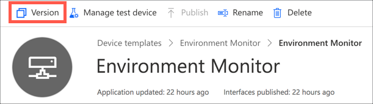

1. Leave the name of the new version as the default in the *New device template version* dialog, and select **Create**

    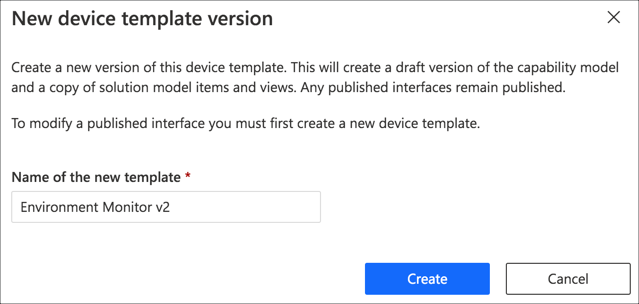

### Version the interface

To add new telemetry values, a new version of the interface needs to be created with the new capabilities.

1. Select the **Environment** interface from the sidebar

    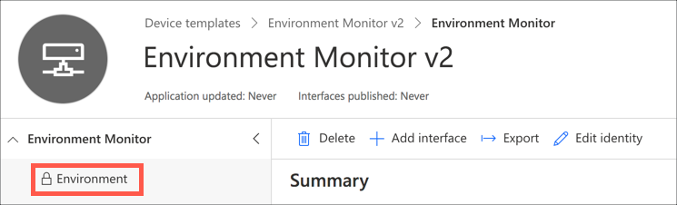

1. Select the **Version** button to create a new version of the interface

    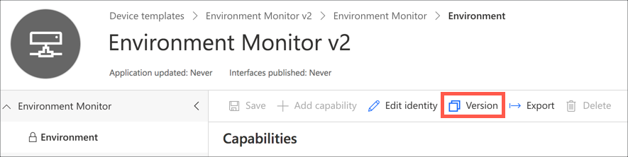

1. From the *New interface version* dialog, select **Create**

    

1. The new interface will be created with a single capability - *Temperature*. This is copied from the previous version of the interface, and is greyed out and read-only.

### Add the new capabilities

1. In the capabilities list, select **+ Add capability** to add a new capability

    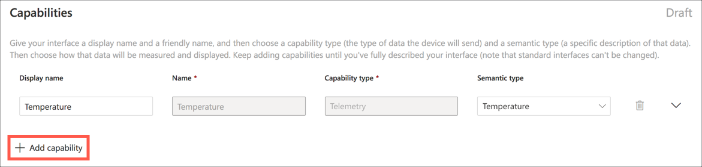

1. Set the following details for the new capability:

    | Display Name | Name     | Capability Type | Semantic Type | Schema | Unit |
    | ------------ | -------- | --------------- | ------------- | ------ | ---- |
    | Humidity     | Humidity | Telemetry       | Humidity      | Double | %    |

    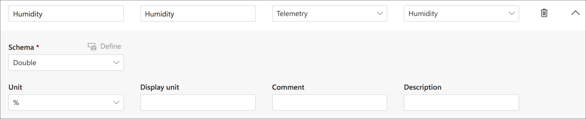

1. Repeat the above steps to add a new capability for sound:

    | Display Name | Name  | Capability Type | Semantic Type | Schema | Unit |
    | ------------ | ----- | --------------- | ------------- | ------ | ---- |
    | Sound        | Sound | Telemetry       | None          | Double | None |

    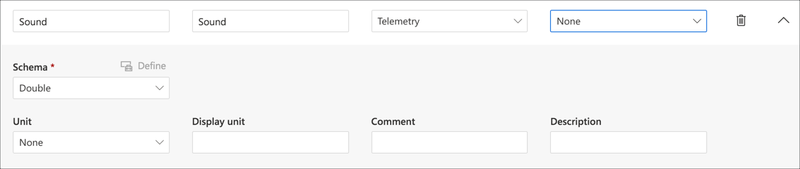

1. Select the **Save** button

    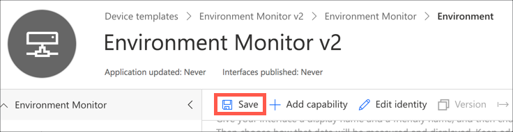

### Create new view

The current view for the device only shows Temperature, so to show humidity and sound, new views need to be created.

1. From the *Environment Monitor* device template, select **Views**

    

1. Select **Visualizing the device** to add a new view to visualize data from a device

    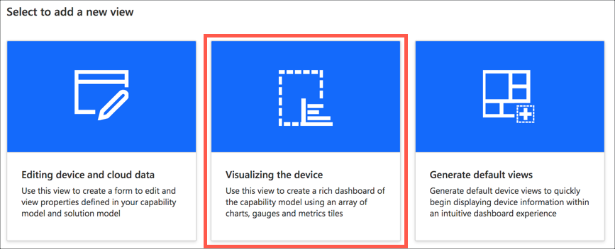

1. Name the view `Humidity`

    

1. Check **Humidity** in the *Telemetry* section, and select **Add tile**

    

1. Drag the bottom corner to resize the tile to the size you want

1. Select the cog button to adjust the properties for the tile

    

1. Change the *Display range* to be `Last 100 values`, and select the **Update** button

    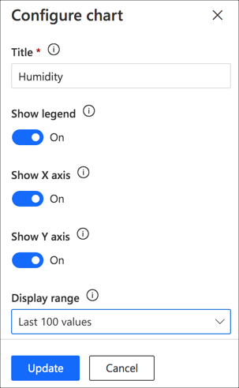

1. Select the **Save** button

    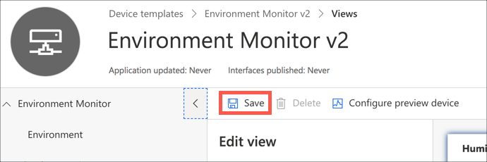

1. Repeat the above process to create a view for the Sound telemetry value

### Publish the template

Once the new device template version is complete, it needs to be published before it can be used by a device.

1. From the device template, select the **Publish button** on the top menu

    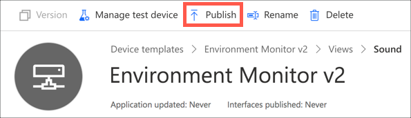

1. Select **Publish** from the *Publish this device template* dialog

    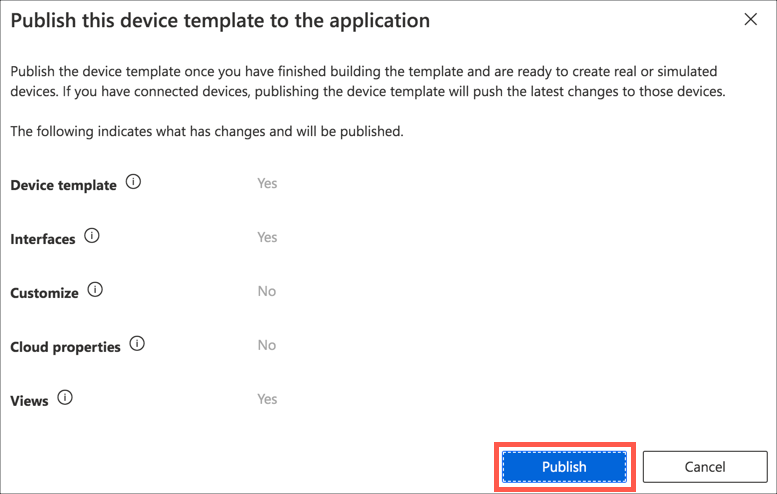

### Migrate the devices to the new template

When a new device template version is created, all devices using the old version remain using the old version - they are not automatically migrated as the hardware may not support the new version. To use the new version, existing devices have to be manually migrated.

1. Select the **Devices** tab from the side bar menu

1. Check the box next to the *Pi Environment monitor* and the *Simulated environment monitor* in the devices list

    

1. Select the **Migrate** button

    

1. Select `Environment Monitor v2` in the *Migrate* dialog, then select the *Migrate* button

    

1. A notification bar will pop up and show the progress, indicating when the devices have been migrated

    

You will now see the devices with the new device template. Selecting them will allow you to see the new views. The *Temperature* view will show the existing data, and the new *Humidity* and *Sound* views will show **Waiting for data** for the Pi as the Pi isn't sending this telemetry yet. After a few minutes you will see simulated data for the simulated device.

### Update the dashboard

The dashboard was configured to show the devices from the *All Devices* device group with the *Environment Monitor* device template, not the new *Environment Monitor v2* template. It needs to be configured to show data from this new template. This is done by updating the device group to include the devices with the new template.

1. Select the **Device groups** tab from the side bar menu

    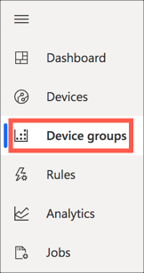

1. Select the *All Devices* device group

    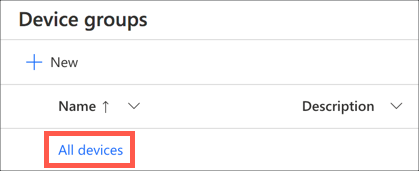

1. Currently the device group is set up to filter all devices that use the `Environment Monitor` template. This needs to be updated to the `v2` version of this template. Drop down the *Value* box in the *Scopes* section and select `Environment Monitor v2`

    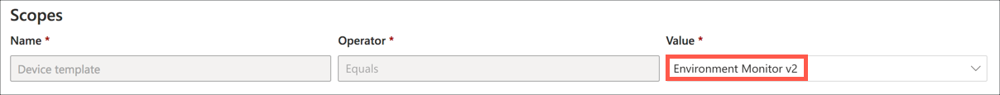

1. You can validate the devices that will be in this group by selecting the **Run query** button

    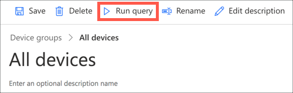

    When you run this, you will see all the simulated and physical device appear in the results list.

1. Save the changes by selecting the **Save** button.

    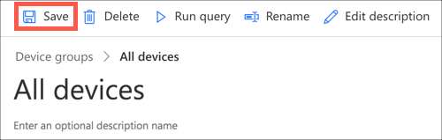

1. Select the **Dashboard** tab from the side bar menu

You should now see the dashboard showing the data from the simulated and physical devices - it was already configured with the two devices from the device group, so updating the device group will fix the dashboard.

### Add the new fields to the dashboard

The new humidity and sound values also need to be shown on the dashboard.

1. Select the **Dashboard** tab from the side bar menu

1. Select the **Edit** button from the top menu

    

1. From the **Edit dashboard** panel in the **Add a tile** section, drop down the *Device group* list, and select `Environment Monitor v2 - All devices`

    

1. Drop down the *Devices* list and select both devices

    

1. Check the `Humidity` telemetry value

    

1. Select the **Add tile** button

    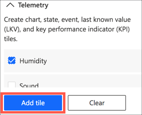

The humidity tile will be placed on the dashboard. Have a play with the tile size, position, and the tile properties available from the cog button. Configure the chart for the last 100 values to match the temperature tile.

Repeat the steps above for the sound telemetry value. If you prefer, you can also configure multiple telemetry values on the same chart, for example to see humidity and temperature values at the same time to look for correlations.

1. Once you have finished adjusting the dashboard, select the **Save** button

    

## Next steps

In this step you set up IoT Central to receive humidity and sound data.

In the next step you will set up this physical device and run code to connect and send humidity and sound data. Select the relevant next step from the list below depending on if you have a Pi or want to set up a virtual IoT device.

* [Set up a Raspberry Pi](./set-up-pi-humidity-sound.md)
* [Set up a virtual device using your PC or Mac](./set-up-virtual-humidity-sound.md)
