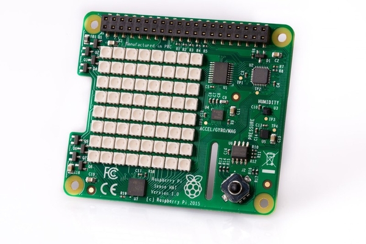
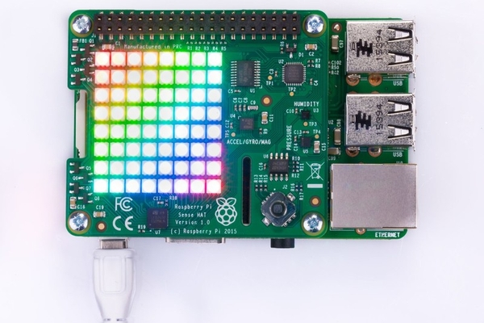

# Set up a Raspberry Pi with Sense HAT to send temperature data

In the [previous step](./add-pi-to-iot-central.md) you set up an IoT Central application using a pre-created template, and set up a simulated device.

In this step you will set up a Raspberry Pi to send temperature data.

## Raspberry Pi

The [Raspberry Pi](https://raspberrypi.org) is a low-priced, small form factor computer that can run a full version of Linux. It's popular with hobbyists and kids - it was originally designed to be a cheap computer for kids to learn to code on. It has the same standard USB and HDMI ports that a PC or Mac would have, as well as GPIO (General Purpose Input Output) pins that can be used to work with a wide array of external electronic components, devices, sensors, machinery and robotics. Raspberry Pi's have become one of the most popular general-purpose devices for IoT projects, used by millions of people every day.

Raspberry Pi's can run a wide range of programing languages. In this lab you will use Python, and program the Pi using Visual Studio Code (VS Code), an open-source developer text editor that can remotely program on a Pi from your PC or Mac. When connected to the Pi remotely from your PC or Mac you can write and debug code from your device, with the code running on the Pi. You will also get a terminal that runs on the Pi.

The temperature data will come from a temperature sensor embedded in the Sense HAT.

## Hardware requirements

You will need the following hardware:

* A Raspberry Pi 4
* A micro SD Card
* An SD card to USB converter that matches the USB ports on your device if your device doesn't have an SD card slot
* A Raspberry Pi 4 power supply (USB-C)
* A [Sense HAT](https://www.raspberrypi.org/products/sense-hat/)
* A keyboard, mouse and monitor
* A [micro-HDMI to HDMI adapter or cable](https://www.raspberrypi.org/products/micro-hdmi-to-standard-hdmi-a-cable/)

## Set up the Pi

1. Fit the Sense hat to the Raspberry Pi.





The Sense HAT features an 8x8 RGB LED matrix, a mini joystick and the following sensors:

* Gyroscope
* Accelerometer
* Magnetometer
* Temperature
* Humidity
* Barometric pressure

### Set up the software

1. Insert the SD card into your PC or laptop using an adapter if necessary

1. Using the [Raspberry Pi imager](https://www.raspberrypi.org/downloads/), image the SD card with the default Raspberry Pi OS image. You can find instructions on how to do this in the [Raspberry Pi installing images documentation](https://www.raspberrypi.org/documentation/installation/installing-images/).

1. Insert the SD card into the Pi

1. Connect the Pi to your keyboard, mouse and monitor. If you are using ethernet for internet access then connect the Pi to an ethernet cable connected to your network. Then connect it to the power supply.

    > If you don't have a keyboard, monitor and mouse available, you can set up your Pi for headless access - check out the [Microsoft Raspberry Pi headless setup docs](https://github.com/microsoft/rpi-resources/tree/master/headless-setup) for details on how to set this up.

1. Work through the setup wizard on the Pi:

    1. Set your country, language and timezone

    1. Change your password from the default - when a new Raspberry Pi is set up it creates an account with a username of `pi` and a password of `raspberry`, so set a new password

    1. Set up the screen if necessary

    1. If you want to use Wifi, select your wireless network and enter the password if needed.

        > If you are using enterprise security you may need to launch Chromium, the Pi's browser after selecting your wireless network to log in to your Wifi

    1. Update the Pis software

    1. Reboot the Pi

Once the Pi has rebooted, you will need to change the hostname. All newly setup Pis are configured with a hostname of `raspberrypi`, so if you have more than one Pi on your network you won't be able to distinguish between them by name unless you rename them. You will also need to enable SSH (Secure SHell) access so you can control the Pi later remotely from Visual Studio Code.

1. From the Raspberry Pi select the **Raspberry Pi** menu, then select **Preferences -> Raspberry Pi Configuration**

    

1. Change the value of the *Hostname* in the *General* tab to be something unique, such as by using your name

    

1. In the **Interfaces** tab, ensure **SSH** is set to *Enable*

    

1. Select the **OK** button

1. When prompted, select **Yes** to reboot the Pi

Once the Pi is rebooted, you will be able to connect to it remotely from Visual Studio Code.

## Connect to the Pi from Visual Studio Code

[Visual Studio Code](http://code.visualstudio.com?WT.mc_id=academic-7372-jabenn) is an open-source developer text editor that can be expanded with extensions to support multiple features or programming languages. It can also be used to remotely code on a Raspberry Pi from your PC or Mac via a remote development extension.

### Install the remote development extension

1. Install Visual Studio Code if you don't already have it installed

1. Launch Visual Studio Code

1. Select the **Extensions** tab from the side menu

    

1. Search for `Remote Development` and select the **Remote Development Pack**. Select the **Install** button to install this extension.

    

### Connect to your Raspberry Pi

1. From Visual Studio Code, launch the Command Palette. This is a pop-up menu that allows you to run actions from VS Code as well as any extensions installed.

    1. If you are using Windows or Linux, press `Ctrl+Shift+p`
    1. If you are using macOS, press `Command+Shift+p`

1. Type `Remote-SSH` and select *Remote-SSH: Connect to host...`

    

1. In the *Select configured Host* dialog, enter `pi@<hostname>.local` replacing `<hostname>` with the Hostname you entered when configuring the Pi. For example, if you set the Hostname to be `lab-pi-1`, then enter `pi@lab-pi-1.local`

1. If you are using Windows or Linux and you get any errors about the Hostname not being found, you will need to install additional software to enable ZeroConf networking (also referred to by Apple as Bonjour):

    1. If you are using Linux, install Avahi using the following command:

        ```sh
        sudo apt-get install avahi-daemon
        ```

    1. If you are using Windows, the easiest way to enable ZeroConf is to install [Bonjour Print Services for Windows](http://support.apple.com/kb/DL999). You can also install [iTunes for Windows](https://www.apple.com/itunes/download/) to get a newer version of the utility (which is not available standalone).

1. If you are using Windows, you may get asked to select the type of platform for the remote computer, with a choice of *Linux*, *Windows* or *macOS*. Select **Linux** as the Raspberry Pi OS is a variant of Linux.

    

1. The first time you connect you will need to confirm you want to connect to the specific device based off it's 'fingerprint'. Select **Connect**.

    

1. Enter the password for your Pi when prompted

Visual Studio Code will then connect to your Pi and install some dependencies on the Pi that it needs.

### Configure Python on the Pi

The Pi will be programmed using Python, so Visual Studio Code needs to have an extension installed to understand Python, and the Pi needs some additional libraries installed to work with the Grove Pi+.

1. From the Visual Studio Code window that is connected to the Pi, select the **Extensions** tab

1. Search for `PyLance` and select the **Install in SSH: hostname** button to install the PyLance Python extension on the Pi

    

    > This extension will just be installed on the Pi, not locally. The extensions you install on different remote devices are different to the ones you install locally

1. Once installed, you will need to reload the window, so select the **Reload required** button

    

Visual Studio Code will now be configured to run Python on the Pi.


### Pi 4/Pi 400 and above - Downgrade your Pi speed

If you are using a Raspberry Pi 4 or 400 you will run into problems with the Grove Pi+. It's not fully compatible with the speed of the newer Pis. The good news is you can 'underclock' the Pi to reduce it's speed slightly making the Pi+ work.

1. From the Visual Studio Code terminal connected to the Pi, run the following command to edit the boot configuration using the terminal based Nano editor:

    ```sh
    sudo nano /boot/config.txt
    ```

1. Look for a line containing `arm_freq=700`. The number may be higher than 700.

1. This line is most likely commented out by starting with a `#`. Remove the `#`.

1. Set the value to `600`

1. The final line should be:

    ```sh
    arm_freq=600
    ```

1. Press `Ctrl+x` to exit Nano. When asked if you want to save press `Y`, then press `return` to overwrite the original file.

1. Reboot the Pi using the following command:

    ```sh
    sudo reboot
    ```

Whilst the Pi is rebooting, VS Code will attempt to reconnect. It will reconnect when it can, and you many need to re-enter your password.

## Write the code

### Create a folder

1. From the VS Code Terminal, create a new folder for the Pi code called `EnvironmentMonitor`

    ```sh
    mkdir EnvironmentMonitor
    ```

1. Open this folder in VS Code by selecting **File -> Open...** then selecting the `EnvironmentMonitor` folder from the popup, then selecting the **OK** button

    

1. The window will reload opening the new folder. You may need to enter your password again.

### Install required packages

1. To send data to IoT Central, a Python package needs to be installed. To install this, run the following command on the Pi using the Terminal in VS Code:

    ```sh
    pip3 install azure-iot-device
    ```

    > All though it is good practice to use [Python virtual environments](https://docs.python.org/3/tutorial/venv.html), we will not be using them for this lab to reduce complexity as the Grove installer doesn't use virtual environments to install the Python packages needed.

1. The Python app will need to know the connection details for the IoT Central device. It's not good practice to add details such as these directly into your code, instead it is better to load them from environment variables. This can be done in Python using a Pip package that loads these values from a file called `.env`. Run the following command to install this package:

    ```sh
    pip3 install python-dotenv
    ```

    The `.env` files that the values are loaded from can then not be shared or checked into source code control, keeping your values secret.

### Write the app code

1. Create a new file called `app.py`. This is a Python file that will contain the code to send data to IoT Central.

    1. Select the **Explorer** tab from the side menu

        

    1. Select the **New File** button for the *Environment Monitor* folder

        

        > This button is only visible when the cursor is in the file explorer box

    1. Name the file `app.py`, then press return

        

1. Add the following code to this file. You can also find this code in the [app.py](../code/pi-sensehat/temperature/app.py) file in the [code/pi-sensehat/temperature](../code/pi-sensehat/temperature) folder.

    ```python
    import asyncio
    import json
    import os
    import random
    from dotenv import load_dotenv
    from azure.iot.device.aio import IoTHubDeviceClient, ProvisioningDeviceClient
    from sense_hat import SenseHat 
    sense = SenseHat()

    # The connection details from IoT Central for the device
    load_dotenv()
    id_scope = os.getenv("ID_SCOPE")
    primary_key = os.getenv("PRIMARY_KEY")
    device_id = "pi-environment-monitor"

    # Gets telemetry from SenseHat
    # Telemetry needs to be sent as JSON data
    async def get_telemetry() -> str:
        # Get temperature, rounded to 0 decimals
        temperature = round(sense.get_temperature())

        # Build a dictionary of data
        # The items in the dictionary need names that match the
        # telemetry values expected by IoT Central
        dict = {
            "Temperature" : temperature,  # The temperature value
        }

        # Convert the dictionary to JSON
        return json.dumps(dict)

    # The main function that runs the program in an async loop
    async def main():
        # Connect to IoT Central and request the connection details for the device
        provisioning_device_client = ProvisioningDeviceClient.create_from_symmetric_key(
            provisioning_host="global.azure-devices-provisioning.net",
            registration_id=device_id,
            id_scope=id_scope,
            symmetric_key=primary_key)
        registration_result = await provisioning_device_client.register()

        # Build the connection string - this is used to connect to IoT Central
        conn_str="HostName=" + registration_result.registration_state.assigned_hub + \
                    ";DeviceId=" + device_id + \
                    ";SharedAccessKey=" + primary_key

        # The client object is used to interact with Azure IoT Central.
        device_client = IoTHubDeviceClient.create_from_connection_string(conn_str)

        # Connect the client.
        print("Connecting")
        await device_client.connect()
        print("Connected")

        # async loop that sends the telemetry
        async def main_loop():
            while True:
                # Get the telemetry to send
                telemetry = await get_telemetry()
                print("Telemetry:", telemetry)

                # Send the telemetry to IoT Central
                await device_client.send_message(telemetry)

                # Wait for a minute so telemetry is not sent to often
                await asyncio.sleep(60)

        # Run the async main loop forever
        await main_loop()

        # Finally, disconnect
        await device_client.disconnect()

    # Start the program running
    asyncio.run(main())
    ```

    Read the comments in the file to see what the code does.

1. Save the file

    > VS Code has an auto save option if you don't want to have to keep saving files. Enable this by selecting *File -> Auto save*.

### Configure the environment file

1. Create another new file called `.env`, and add the following code:

    ```python
    ID_SCOPE=<Id scope>
    PRIMARY_KEY=<primary key>
    ```

1. Replace the values of `<Id scope>` and `<primary key>` with the ID Scope and Key values you copied from the device connection dialog in IoT Central. These values should not be in quotes. For example if your ID scope was `0ne0FF11FF0` and your key was `12345abcdeFGH567+890ZY=` then the `.env` file would read:

    ```python
    ID_SCOPE=0ne0FF11FF0
    PRIMARY_KEY=12345abcdeFGH567+890ZY=
    ```

1. Save the file

### Test the code

1. Run the code from the VS Code terminal using the following command:

    ```sh
    python3 app.py
    ```

1. The app will start up, connect to Azure IoT Central, then send temperature values:

    ```output
    pi@jim-iot-pi:~/EnvironmentMonitor $ python3 app.py
    RegistrationStage(RequestAndResponseOperation): Op will transition into polling after interval 2.  Setting timer.
    Connecting
    Connected
    Telemetry: {"Temperature": 24.0}
    Telemetry: {"Temperature": 25.0}
    Telemetry: {"Temperature": 24.0}
    Telemetry: {"Temperature": 24.0}
    ```

    Try warming the sensor using your finger, or cooling it with a fan to see changes in temperature.

1. From IoT Central, view the Temperature chart for the Pi device

    

1. The dashboard will now show temperature values from both the simulated device and the Pi using different colored lines to distinguish between the devices.

    

## Next steps

In this step you set up a Raspberry Pi to send temperature data.

In the [next step](./set-up-humidity-sound.md) you will add humidity and sound data to the telemetry.
