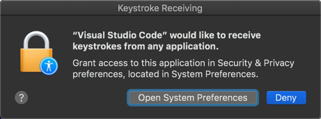

# Set up the virtual IoT device to send humidity and sound data

In the [previous step](./set-up-humidity-sound.md) you set up IoT Central to receive humidity and sound data.

In this step you will set up the virtual IoT device and run code to connect and send humidity and sound data.

## Add humidity and sound to the virtual Pi

In this section you will be adding code to the Python file. If you haven't used Python before, be aware it is very specific about how the lines are indented, so make sure the code is indented the same as the code around it. You can find the full code in the [app.py](../code/virtual-device/sound-humidity/app.py) file in the [code/virtual-device/sound-humidity](../code/virtual-device/sound-humidity) folder to check your code against if you get errors.

1. Open the `EnvironmentMonitor` folder in VS Code if it's not already open. Open the `app.py` file.

1. After the `import` statements, add another to import `keyboard` from the `pynput` Pip package, below the line importing from `azure.iot.device.aio`:

    ```python
    from pynput import keyboard
    ```

1. Delete the entire `get_telemetry` function, from the `def get_telemetry():` line, to the `return json.dumps(dict)` line

1. Add the following code in it's place:

    ```python
    # Use this to see if a high value for the sound should be sent
    # If this is True, a value of 1023 is sent, otherwise a random value
    # from 300-600 is sent
    report_high_sound = False

    # Gets telemetry
    # Telemetry needs to be sent as JSON data
    async def get_telemetry() -> str:
        global report_high_sound

        # Pick a random temperature
        temperature = random.randint(20, 40)

        # Pick a random humidity
        humidity = random.randint(0, 100)

        # If a high sound value is wanted, send 1023
        # otherwise pick a random sound level
        if report_high_sound:
            sound = 1023

            # Reset the report high sound flag, so next time
            # a normal sound level is reported
            report_high_sound = False
        else:
            sound = random.randint(300, 600)

        # Build a dictionary of data
        # The items in the dictionary need names that match the
        # telemetry values expected by IoT Central
        dict = {
            "Temperature" : temperature,  # The temperature value
            "Humidity" : humidity,        # The humidity value
            "Sound" : sound               # The sound value
        }

        # Convert the dictionary to JSON
        return json.dumps(dict)
    ```

    This new version of the `get_telemetry` has two important changes:

    * A random value from 0-100 is returned in the telemetry for the humidity
    * A random value from 300-600 is returned in the telemetry for the ambient sound levels unless the `report_high_sound` variable is set to `True`, in which case it sends a value of 1023, and sets `report_high_sound` back to false. This allows a single spike to be sent, and in later parts this spike will be detected.

1. In the `main` function, after the `main_loop` function is defined and before the `await main_loop()` line, add the following code making sure it is indented to the same level as the code around it:

    ```python
    # Event handler for a key being releases
    def on_release(key):
        global report_high_sound

        # If the key that was pressed and released is the space bar,
        # flag that next time a high sound value should be reported
        if key == keyboard.Key.space:
            print("Space pressed - will report high sound level next cycle")
            report_high_sound = True

    # Listen for keyboard key release events
    listener = keyboard.Listener(on_release=on_release)
    listener.start()
    ```

    This code listens for a key on the keyboard to be released after being pressed. If the key is the space bar, it will set the `report_high_sound` variable to `True`, meaning the next time telemetry is sent, a high value will be sent for the sound level.

1. Save the file

1. Run the code from the VS Code terminal using the following command:

    ```sh
    python app.py
    ```

1. The app will start up, connect to Azure IoT Central, then send temperature, humidity and sound values:

    ```output
    (.venv) C:\Users\jabenn\Desktop\EnvironmentMonitor>python app.py
    RegistrationStage(RequestAndResponseOperation): Op will transition into polling after interval 2.  Setting timer.
    Connecting
    Connected
    Telemetry: {"Temperature": 33, "Humidity": 78, "Sound": 491}
    Telemetry: {"Temperature": 35, "Humidity": 73, "Sound": 300}
    Space pressed - will report high sound level next cycle
    Telemetry: {"Temperature": 25, "Humidity": 40, "Sound": 1023}
    Telemetry: {"Temperature": 37, "Humidity": 96, "Sound": 440}
    ```

    The values will change randomly, and you will be able to see this in the output from running the code. Try pressing the space key to see a high sound value being sent.

1. If you are using a Mac running macOS Catalina or later, you may see a dialog pop up saying that Visual Studio Code is requesting to receive keystrokes from any application.

    

    If you see this, select the **Open System Preferences** button, click the lock to unlock the permissions, and check the box next to Visual Studio Code in the list of applications that have been granted *Input monitoring* permission. You will need to restart VS Code and relaunch the Python app after doing this.

## Next steps

In this step you set up the virtual IoT device to send humidity and sound data.

In the [next step](./rules.md) you will perform simple analytics and create alerts on the data using IoT Central rules.
