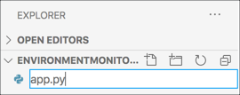
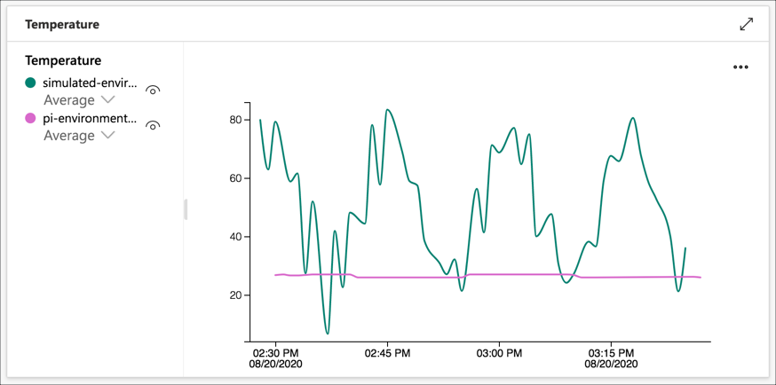

# Set up a virtual IoT device to send temperature data

In the [previous step](./add-pi-to-iot-central.md) you set up an IoT Central application using a pre-created template, and set up a simulated device.

In this step you will set up a virtual IoT device on your PC or Mac to send temperature data.

## Virtual IoT device

The Raspberry Pi option for this lab uses Python code running on a Raspberry Pi to read actual sensor data and send this to IoT Central.

This same code can also run on other devices that have Python installed, such as your PC or Mac. The only difference is that PCs and Macs don't normally have sensors installed, but this can be worked around by sending simulated data - random data that is similar to what is expected, just like the IoT Central simulated device you crested in the previous step.

## Install the required software

### Python

This device will be programmed in Python, so you will need Python installed.

* **Windows:**

    You can install Python from the [Windows Store](https://www.microsoft.com/p/python-38/9mssztt1n39l?activetab=pivot:overviewtab&WT.mc_id=academic-7372-jabenn)

* **macOS**

    You can install Python from the [Python Downloads page](https://www.python.org/downloads/).

    When Python is installed it will open a Finder window. Run the following scripts from inside that Finder window to set up certificates and add Python to your PATH:

    1. `Update Shell Profile.command`

    1. `Install Certificates.command`

* **Linux**

    Depending on your flavour of Linux, you may already have Python installed. If not, installation instructions and guides to check your install are available from [The Hitchhikers guide to Python](https://docs.python-guide.org/starting/install3/linux/).

### PyLance in Visual Studio Code

[Visual Studio Code](http://code.visualstudio.com?WT.mc_id=academic-7372-jabenn) is an open-source developer text editor that can be expanded with extensions to support multiple features or programming languages. It can also be used to code on a PC or Mac in Python with full debugging support and intellisense, via the [PyLance extension](https://devblogs.microsoft.com/python/announcing-pylance-fast-feature-rich-language-support-for-python-in-visual-studio-code/?WT.mc_id=academic-7372-jabenn).

1. Install Visual Studio Code if you don't already have it installed

1. Launch Visual Studio Code

1. Select the **Extensions** tab from the side menu

    

1. Search for `PyLance` and select the **Install** button to install the PyLance Python extension

    

1. Once installed, you will need to reload the window, so select the **Reload required** button

    

Visual Studio Code will now be configured to run Python.

## Write the code

### Create a folder

1. Create a folder on your PC or Mac called `EnvironmentMonitor` to hold the code

1. Open this folder in VS Code

    1. On a PC, select *File -> Open Folder...*, navigate to the new folder and select **Select Folder**
    1. On a Mac, select *File -> Open...*, navigate to the new folder and select **Open**

### Create a Python Virtual Environment

Python comes in various versions, and Python apps can use external code in packages installed via a tool called `pip`. This can lead to problems if different apps need different package versions, or different Python versions. To make it easier to avoid issues with package or Python versions, it is best practice to use *virtual environments*, self-contained folder trees that contain a Python installation for a particular version of Python, plus a number of additional packages.

1. When the new Visual Studio Code window is opened, the terminal should be opened by default. If not, open a new terminal by selecting *Terminal -> New Terminal*.

1. Create a new file inside the `EnvironmentMonitor` folder called `app.py`. This is the file that will contain the code for the device, and by creating it the Python extension in Visual Studio Code will be activated. Select the **New File** button in the *Explorer*.

   

1. Name the new file `app.py` and press return

   

1. The Python extension will activate, and you can see the progress in the status bar.

1. Create a new virtual environment called `.venv` using Python 3 by running the following command in the terminal

   ```sh
   python3 -m venv .venv
   ```

1. A dialog will pop up asking if you want to activate this virtual environment. Select **Yes**.

   

1. The existing terminal will not have the virtual environment activated. Close it by selecting the trash can button

   

1. Create a new terminal by selecting *Terminal -> New Terminal*. The terminal will load the virtual environment

   

### Create a requirements file

Pip packages can be installed one by one via the command line, but it's best practice to create a file that lists all the Pip packages needed by an application, so that they can all be installed at once. This file can also be checked in to source code control with your code allowing other developers to re-create your setup. This file is traditionally called `requirements.txt`.

1. Create a new file in the `EnvironmentMonitor` folder called `requirements.txt`

1. Add the following to this file. You can also find this code in the [requirements.txt](../code/virtual-device/temperature/requirements.txt) file in the [code/virtual-device/temperature](../code/virtual-device/temperature) folder.

    ```sh
    azure-iot-device
    python-dotenv
    pynput
    ```

    * `azure-iot-device` is the Pip package for connecting to Azure IoT services
    * `python-dotenv` is a Pip package that provides the ability to load secrets such as connection details from an file
    * `pynput` is a Pip package to detect key presses - this will be used in a later step to control sound levels

1. Save the file

    > VS Code has an auto save option if you don't want to have to keep saving files. Enable this by selecting *File -> Auto save*.

1. Install these packages by running the following command in the terminal:

    ```sh
    pip install -r requirements.txt
    ```

### Write the app code

1. Open the `app.py` file

1. Add the following code to this file. You can also find this code in the [app.py](../code/virtual-device/temperature/app.py) file in the [code/virtual-device/temperature](../code/virtual-device/temperature) folder.

    ```python
    import asyncio
    import json
    import os
    import random
    from dotenv import load_dotenv
    from azure.iot.device.aio import IoTHubDeviceClient, ProvisioningDeviceClient

    # The connection details from IoT Central for the device
    load_dotenv()
    id_scope = os.getenv("ID_SCOPE")
    primary_key = os.getenv("PRIMARY_KEY")
    device_id = "pi-environment-monitor"

    # Gets telemetry
    # Telemetry needs to be sent as JSON data
    async def get_telemetry() -> str:
        # Pick a random temperature from 20 to 40 degrees C
        temperature = random.randint(20, 40)

        # Build a dictionary of data
        # The items in the dictionary need names that match the
        # telemetry values expected by IoT Central
        dict = {
            "Temperature" : temperature,  # The temperature value
        }

        # Convert the dictionary to JSON
        return json.dumps(dict)

    # The main function that runs the program in an async loop
    async def main():
        # Connect to IoT Central and request the connection details for the device
        provisioning_device_client = ProvisioningDeviceClient.create_from_symmetric_key(
            provisioning_host="global.azure-devices-provisioning.net",
            registration_id=device_id,
            id_scope=id_scope,
            symmetric_key=primary_key)
        registration_result = await provisioning_device_client.register()

        # Build the connection string - this is used to connect to IoT Central
        conn_str="HostName=" + registration_result.registration_state.assigned_hub + \
                    ";DeviceId=" + device_id + \
                    ";SharedAccessKey=" + primary_key

        # The client object is used to interact with Azure IoT Central.
        device_client = IoTHubDeviceClient.create_from_connection_string(conn_str)

        # Connect the client.
        print("Connecting")
        await device_client.connect()
        print("Connected")

        # async loop that sends the telemetry
        async def main_loop():
            while True:
                # Get the telemetry to send
                telemetry = await get_telemetry()
                print("Telemetry:", telemetry)

                # Send the telemetry to IoT Central
                await device_client.send_message(telemetry)

                # Wait for a minute so telemetry is not sent to often
                await asyncio.sleep(60)

        # Run the async main loop forever
        await main_loop()

        # Finally, disconnect
        await device_client.disconnect()

    # Start the program running
    asyncio.run(main())
    ```

    Read the comments in the file to see what the code does.

1. Save the file

### Configure the environment file

1. Create another new file called `.env`, and add the following code:

    ```python
    ID_SCOPE=<Id scope>
    PRIMARY_KEY=<primary key>
    ```

1. Replace the values of `<Id scope>` and `<primary key>` with the ID Scope and Key values you copied from the device connection dialog in IoT Central. These values should not be in quotes. For example if your ID scope was `0ne0FF11FF0` and your key was `12345abcdeFGH567+890ZY=` then the `.env` file would read:

    ```python
    ID_SCOPE=0ne0FF11FF0
    PRIMARY_KEY=12345abcdeFGH567+890ZY=
    ```

1. Save the file

### Test the code

1. Run the code from the VS Code terminal using the following command:

    ```sh
    python app.py
    ```

1. The app will start up, connect to Azure IoT Central, then send random temperature values:

    ```output
    (.venv) C:\Users\jabenn\Desktop\EnvironmentMonitor>python app.py
    RegistrationStage(RequestAndResponseOperation): Op will transition into polling after interval 2.  Setting timer.
    Connecting
    Connected
    Telemetry: {"Temperature": 24.0}
    Telemetry: {"Temperature": 25.0}
    Telemetry: {"Temperature": 24.0}
    Telemetry: {"Temperature": 24.0}
    ```

1. From IoT Central, view the Temperature chart for the virtual Pi device. It may take a few minutes for data to appear.

    

1. The dashboard will now show temperature values from both the simulated device and the virtual Pi using different colored lines to distinguish between the devices.

    

## Next steps

In this step you set up a virtual IoT device to send temperature data.

In the [next step](./set-up-humidity-sound.md) you will add humidity and sound data to the telemetry.
