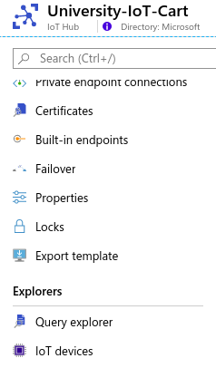
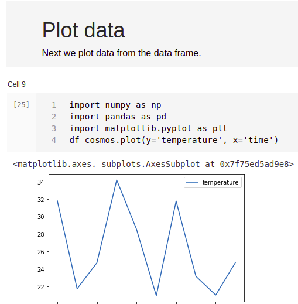

                                                                               


# Temperature Humidity Station

## Step-By-Step Tutorial 
## IoT Cart

# Purpose

This document will show you how to create an environmental monitor using a temperature and humidity sensor, Raspberry Pi, and Azure resources such as IoT Hub, Stream Analytics, and Cosmos DB.

# Azure Services Used 

1. IoT Hub
2. Stream Analytics
3. Cosmos DB


# Required Hardware

You will need:

1. Raspberry Pi 4


2. Breadboard:


3. Wire
4. 10K Ohm resistor (color code brown, black, orange, and gold)


5. DHT 22 Temperature Humidly Sensor:
  


# How to set up the hardware


    To make this you will need to connect the temperature sensor to the breadboard.  


1. Connect the 3.3 volt pin of the Raspberry Pi to the VCC pin of the sensor.
2. Connect the ground pin to the GND input of the sensor
3. Connect the GPIO 24 on the Raspberry Pi to the DAT input of the sensor.
4. Connect a 10k ohm resistor between the power and data connections.  


# Setting up the Cloud


## Set up IoT Hub

We are going to set up an IoT Hub with the default values.

**Step 1: **Set up the basics.  Chose a resource group, name of project and subscription.


Step 2: Size and Scale:

For this exercise we are going to use S1 of IoT Hub and have 1 unit of S1.  This will allow us to send 400,000 messages a day.


Step 3: Meta tags

Next, we are going to skip the tags section and go over to Create and Review.

Step 4: Review and create

The final step is to review then create the IoT Hub Resource.


Step 5: Getting a device key

After creating the IoT Hub you will need to get an individual device connection string.  To do this go into your ioT Hub and get the device key.  You can do this by clicking on devices in the side menu and selecting “IoT Devices”.





From here select Add Device.  

Next give your device a name and select Save.


From here select the device in the device list


And save the device connection string for later use.

Step 6: Create a consumer group.

A consumer group give you the ability to have a distributed system read from the same IoT Hub.  We will need a consumer group for Steam Analytics.


## Setting up Cosmos DB

Step 1: In the Azure portal create a new Cosmos DB.  Select Core(SQL) as the API, and enable notebooks.


Step 2: Create and Review

Select Create and Review.  Then select Create.

Step 3: Connect to your database

After you create the resource group you will need to create a collection to store the data.  Go to [https://cosmos.azure.com](https://cosmos.azure.com), login, select your subscription, and the Cosmos Account you just created.

Step 4: Create a Database and Collection

In the files for this project there are 2 iPython notebooks.  Go into the Notebooks of the repository and upload the 2 Notebooks.  Then run the notebook titled Pi_Environment-Monitor-Setup.ipynb by clicking on the Run command.  This notebook will create the database, collection, and user defined function.


## Stream Analytics Job

The next step is to create a Stream Analytics Job.  Stream Analytics is a distributed stream processing and aggregation service.  We will use it to put data from IoT Hub to Cosmos DB.

Step 1: Create the Stream Analytics Job

In the Azure Portal create a Stream Analytics Job.  From here give it a name, assign it to a resource group.


Step 2: Connect to IoT Hub

We are going to add IoT Hub as an input.  Do to this we will go to the inputs section in Stream Analytics and select the IoT Hub you created and the consumer group you created for that IoT Hub.  For this exercise we are going to ingest the uncompressed JSON telemetry messaging.


Step 3 Output to Cosmos DB

Next, we are going to add an output from Stream Analytics to Cosmos DB.  To do this click on output and add a new Cosmos DB output.  Select the database and collection you created in the previous step.  Leave Document id blank.


Step 4: Query

Next select the “Query” in the menu and in the query editor window put in the following query.

 ```sql
SELECT GetMetadataPropertyValue(IoTHub, '[IoTHub].[ConnectionDeviceId]') + cast( MONTH(EventEnqueuedUtcTime) as nvarchar(max)) + cast(Year(EventEnqueuedUtcTime) as nvarchar(max)) as partitionkey 
      , GetMetadataPropertyValue(IoTHub, '[IoTHub].[ConnectionDeviceId]') as deviceid 
      ,temperature 
      , humidity 
      , EventEnqueuedUtcTime as time 
      ,device_type 
INTO 
    cosmosdb 
FROM 
IoTHub  
WHERE device_type = 'pi_environment_monitor'</strong>
```

In the code we are creating a partition key so that Cosmos DB knows where to store the data.  Next, we are adding the device id, temperature, humidity, and time.

Next, select Save.

Step 5: Running the Job

After you have saved your query, go back to the “Overview” page and click Start.


# Getting Ready

Next, we are going to use the Raspberry Pi to write and execute the code.

Go into the Raspberry Pi.  If it has already been setup with a password the password is **#A!!8TCart**. If it has not been setup please use the password above when the Raspberry Pi ask you for a password.  

Next you will need to install the software on the Raspberry Pi to support the task we are doing.  In a terminal window type in the following commands


```sh
sudo apt update
sudo apt-get -y install pigpio wiringpi python-rpi.gpio python3-rpi.gpio rpi.gpio-common git python-gpiozero python-gpiozero-doc python3-gpiozero python-setuptools-git python3-setuptools-git python3-dev python3-pip
```


You will need to pip install the IoTHub device client along with the sensor libraries in a terminal window:


```
pip3 install azure-iot-device
pip3 install Adafruit_DHT 
```


Then you will need to open create a new directory in a command prompt
```sh
mkdir Environment_Monitor 
cd Environment_Monitor
```


# How to do it

Create a new file called telemetry.py.  Raspherry Pi has a code editor called Thorney you can use.

First import the libraries


```python
import time
import threading
from azure.iot.device import IoTHubDeviceClient, Message, MethodResponse
import Adafruit_DHT
import json
```


Next set the variables.  We got the device connection string in the section about creating a device in IoT Hub.


```python
_dht_pin = 24 # BCM24/BOARD18
_dht = Adafruit_DHT.DHT22
 
CONNECTION_STRING = ""
 
TEMPERATURE = 20.0
HUMIDITY = 60
INTERVAL = 1
readings = {'temperature':0,'humidity':0, 'device_type':'pi_environment_monitor'}
```


Next, we are going to get the readings from the sensors


```python
def getReadings():
    ( HUMIDITY, TEMPERATURE ) = Adafruit_DHT.read_retry( _dht, _dht_pin )
    readings['temperature'] = TEMPERATURE 
    readings['humidity'] = HUMIDITY 
    msg_txt_formatted = json.dumps(readings)
    message = Message(msg_txt_formatted)
    return(message)
```


Then we are going to have an infinate loop of getting readings and sending it to IoT Hub.


```python
def iothub_client_telemetry_run():
 
    try:
        client = IoTHubDeviceClient.create_from_connection_string(CONNECTION_STRING)
        print ( "IoT Hub device sending periodic messages, press Ctrl-C to exit" )
 
        while True:
            message = getReadings()
 
            # Send the message.
            print( "Sending message: {}".format(message) )
            client.send_message(message)
            print( "Message sent" )
            time.sleep(INTERVAL)

    except KeyboardInterrupt:
        print ( "IoTHubClient sample stopped" )
```


Finally, we are going to start our program


```python
if __name__ == '__main__': 
    print ( "Press Ctrl-C to exit" ) 
    iothub_client_telemetry_run()
```
You can find the code for this project listed in the appendix.

# Visualizing Data

In the files for this project there are 2 iPython notebooks.  Go into the Notebooks of the CosmsDB folder and upload the notebooks lables Environment-Visulizations.ipnyb.  This notbook will show how to query data using both SQL and display the data using charting libraries.





# How it works

The DHT 22 temperature and humidity sensor is powered by the Raspberry Pi.  The sensor is also connected to the Raspberry Pi through a General Purpose I/O (GPIO).  The Raspberry Pi reads the data coming from the sensor and sends it to IoTHub.


# Appendix

Project Code: 

IoT Hub: [Reference](https://docs.microsoft.com/en-us/azure/iot-hub/) and [Tutorial](https://iotschool.microsoft.com/en-us/iot/learning-paths/7zy2NeaeYwsoaCuIueeoSa)

Stream Analytics Job: [Reference](https://docs.microsoft.com/en-us/azure/stream-analytics/) and [Tutorial](https://iotschool.microsoft.com/en-us/iot/learning-paths/6qJe4ohYd2EsAEo6gw6C2G/ILFm6wfcKyeUy2Mk2iAE0?selectedItemId=2G4AQkOJVuAcmuaQiIQ0mm)

CosmosDB: [Reference](https://docs.microsoft.com/en-us/azure/cosmos-db/) and [Tutorial](https://iotschool.microsoft.com/en-us/iot/learning-paths/1z75cTRBNqEA2EigQoQKKe/27PKfzBeLuYCCy6qkA2MaQ) 
