# Set up IoT Central and the Raspberry Pi to send humidity and sound data

In the [previous step](./set-up-pi.md) you set up a Raspberry Pi to send temperature data.

In this step you will set up IoT Central and the Raspberry Pi to send humidity and sound data.

## Set up the new telemetry values in IoT Central

The *Environment Monitor* device template has an interface that can receive temperature telemetry values. This template needs to be changed to handle more values. Interfaces on device templates are immutable - that is they can't be changed, but templates support versioning, so you can add a new version to the template with a new interface version that can handle the new values.

### Version the device template

1. Open the IoT Central app

1. Select **Device Templates** from the side bar menu

    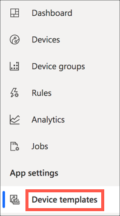

1. Select the **Environment Monitor** device template from the list

    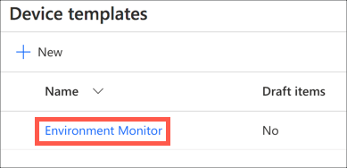

1. Select the **Version** button to create a new version of the device template

    

1. Leave the name of the new version as the default in the *New device template version* dialog, and select **Create**

    

### Version the interface

To add new telemetry values, a new version of the interface needs to be created with the new capabilities.

1. Select the **Environment** interface from the sidebar

    

1. Select the **Version** button to create a new version of the interface

    

1. From the *New interface version* dialog, select **Create**

    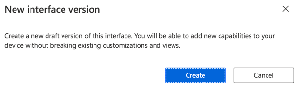

1. The new interface will be created with a single capability - *Temperature*. This is copied from the previous version of the interface, and is greyed out and read-only.

### Add the new capabilities

1. In the capabilities list, select **+ Add capability** to add a new capability

    

1. Set the following details for the new capability:

    | Display Name | Name     | Capability Type | Semantic Type | Schema | Unit |
    | ------------ | -------- | --------------- | ------------- | ------ | ---- |
    | Humidity     | Humidity | Telemetry       | Humidity      | Double | %    |

    

1. Repeat the above steps to add a new capability for sound:

    | Display Name | Name  | Capability Type | Semantic Type | Schema | Unit |
    | ------------ | ----- | --------------- | ------------- | ------ | ---- |
    | Sound        | Sound | Telemetry       | None          | Double | None |

    

1. Select the **Save** button

    

### Create new view

The current view for the device only shows Temperature, so to show humidity and sound, new views need to be created.

1. From the *Environment Monitor* device template, select **Views**

    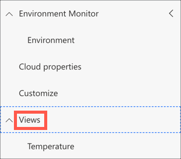

1. Select **Visualizing the device** to add a new view to visualize data from a device

    

1. Name the view `Humidity`

    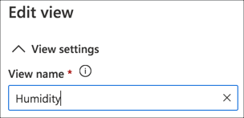

1. Check **Humidity** in the *Telemetry* section, and select **Add tile**

    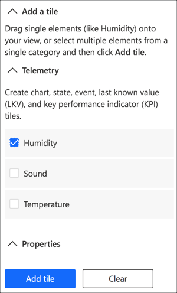

1. Drag the bottom corner to resize the tile to the size you want

1. Select the cog button to adjust the properties for the tile

    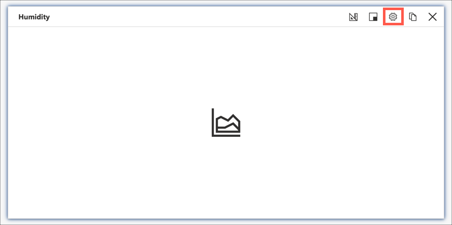

1. Change the *Display range* to be `Last 100 values`, and select the **Update** button

    

1. Select the **Save** button

    

1. Repeat the above process to create a view for the Sound telemetry value

### Publish the template

Once the new device template version is complete, it needs to be published before it can be used by a device.

1. From the device template, select the **Publish button** on the top menu

    

1. Select **Publish** from the *Publish this device template* dialog

    

### Migrate the Pi to the new template

When a new device template version is created, all devices using the old version remain using the old version - they are not automatically migrated as the hardware may not support the new version. To use the new version, existing devices have to be manually migrated.

1. Select the **Devices** tab from the side bar menu

1. Check the box next to the *Pi Environment monitor* and the *Simulated environment monitor* in the devices list

    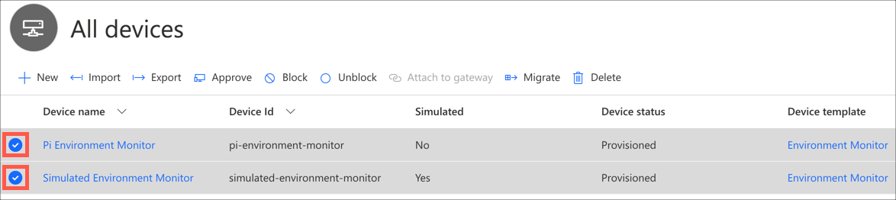

1. Select the **Migrate** button

    

1. Select `Environment Monitor v2` in the *Migrate* dialog, then select the *Migrate* button

    

1. A notification bar will pop up and show the progress, indicating when the devices have been migrated

    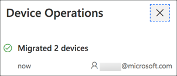

You will now see the devices with the new device template. Selecting them will allow you to see the new views. The *Temperature* view will show the existing data, and the new *Humidity* and *Sound* views will show **Waiting for data** as the Pi isn't sending this telemetry yet.

### Update the dashboard

The dashboard was configured to show the devices with the *Environment Monitor* device template, not the new *Environment Monitor v2* template. It needs to be configured to show data from this new template.

1. Select the **Dashboard** tab from the side bar menu

1. Select the **Edit** button from the top menu

    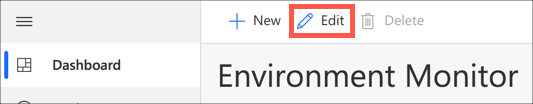

1. Select the properties cog from the Temperature tile

    

1. From the *Configure Chart* panel, drop down the *Device group* list, and select `Environment Monitor v2 - All devices`.

    

1. Drop down the *Devices* list, and check both devices.

    

1. When you change the devices, the telemetry type gets unselected, so check the box next to Temperature

    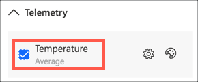

1. Select the **Update** button

    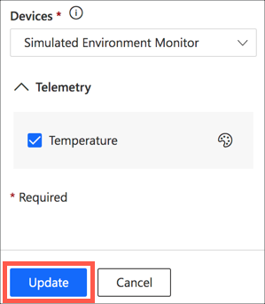

### Add the new fields to the dashboard

The new humidity and sound values also need to be shown on the dashboard.

1. From the **Edit dashboard** panel in the **Add a tile** section, drop down the *Device group* list, and select `Environment Monitor v2 - All devices`

    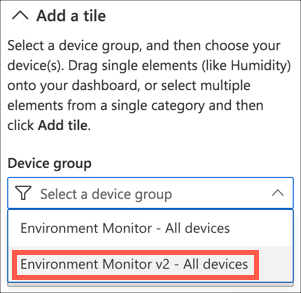

1. Drop down the *Devices* list and select both devices

    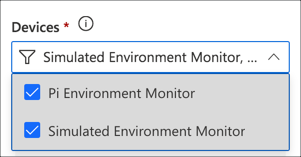

1. Check the `Humidity` telemetry value

    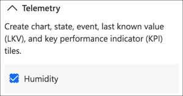

1. Select the **Add tile** button

    

The humidity tile will be placed on the dashboard. Have a play with the tile size, position, and the tile properties available from the cog button. Configure the chart for the last 100 values to match the temperature tile.


Repeat the steps above for the sound telemetry value. If you prefer, you can also configure multiple telemetry values on the same chart, for example to see humidity and temperature values at the same time to look for correlations.

1. Once you have finished adjusting the dashboard, select the **Save** button

    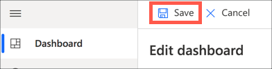

## Connect the sensors

The humidity data can be gathered from the existing sensor. The Grove Pi+ temperature humidity sensor can send values for both temperature and humidity in the same call.

Sound data can be gathered from the sound sensor. This sensor is essentially a microphone that detects ambient noise and sends a value from 0-1000 depending on the noise level, 1000 being the highest.

The sound sensor is an analog sensor, so needs to be connected to an analog port on the Grove Pi+.

1. Connect the sound sensor to a Grove cable

1. Connect the cable to port A0. This is on the same side as the Pi's SD card socket and is the opposite end from the HDMI port.

    

## Program the Pi

The Pi code needs to be changed to read the new values and send them to IoT Central.

### Update the code

1. Connect to the Pi using Visual Studio Code, open the `Environment Monitor` folder, and open the `app.py` file.

1. Head to line 16, after the `temperature_sensor_port` is defined and the pin is set to output, and before the `get_telemetry` function is defined

1. Add the following code to set up the sound sensor port number and configure it for input:

    ```python
    # Set the sound sensor port to the analog port A0
    # and mark it as INPUT meaning data needs to be
    # read from it
    sound_sensor_port = 0
    grovepi.pinMode(sound_sensor_port, "INPUT")
    ```

1. Head to the `get_telemetry` function and replace the code of this function with the following:

    ```python
    # Gets telemetry from the Grove sensors
    # Telemetry needs to be sent as JSON data
    async def get_telemetry() -> str:
        # The dht call returns the temperature and the humidity,
        # we only want the temperature, so ignore the humidity
        [temperature, humidity] = grovepi.dht(temperature_sensor_port, 0)

        # The temperature can come as 0, meaning you are reading
        # too fast, if so sleep for a second to ensure the next reading
        # is ready
        while (temperature == 0 or humidity == 0):
            [temperature, humidity] = grovepi.dht(temperature_sensor_port, 0)
            await asyncio.sleep(1)

        # Read the background noise level from an analog port
        sound = grovepi.analogRead(sound_sensor_port)

        # Build a dictionary of data
        # The items in the dictionary need names that match the
        # telemetry values expected by IoT Central
        dict = {
            "Temperature" : temperature,  # The temperature value
            "Humidity" : humidity,        # The humidity value
            "Sound" : sound               # The background noise value
        }

        # Convert the dictionary to JSON
        return json.dumps(dict)
    ```

    This code makes the following changes:

    * The humidity value is now used from the call to `grovepi.dht`, and is added to the telemetry dictionary
    * The sound value is read by reading the analog signal from the A0 port, and is added to the telemetry dictionary

    You can also find the full code in the [app.py](../code/all/app.py) file in the [code/all](../code/all) folder.

1. Save the file

1. Run the code from the VS Code terminal using the following command:

    ```sh
    python3 app.py
    ```

1. The app will start up, connect to Azure IoT Central, then send temperature, humidity and sound values:

    ```output
    pi@jim-iot-pi:~/EnvironmentMonitor $ python3 app.py
    RegistrationStage(RequestAndResponseOperation): Op will transition into polling after interval 2.  Setting timer.
    Connecting
    Connected
    Telemetry: {"Temperature": 27.0, "Humidity": 44.0, "Sound": 304}
    Telemetry: {"Temperature": 26.0, "Humidity": 45.0, "Sound": 326}
    Telemetry: {"Temperature": 26.0, "Humidity": 45.0, "Sound": 400}
    Telemetry: {"Temperature": 26.0, "Humidity": 45.0, "Sound": 361}
    ```

    Try adjusting sound levels near the sensor such as by playing music, and adjusting humidity level by breathing on the sensor, and see the values change

### Configure the code to run on startup

At the moment, this code will only run when you are connected to the Pi and run it via Python. This means as soon as VS Code disconnects, the code will no longer run. Most IoT devices will run code on startup, so that they are continuously sending data. You can configure the Pi to run the code on startup by adding an entry to the *crontab* - the set of instructions used by Cron. Cron is a tool that runs code at certain times, and can be configured to run the Pi code when the Pi is rebooted.

1. Run the following code to configure the CronTab:

    ```sh
    crontab -l > cron.tmp
    echo "@reboot sleep 60 && cd /home/pi/EnvironmentMonitor && /usr/bin/python3 /home/pi/EnvironmentMonitor/app.py" >> cron.tmp
    crontab cron.tmp
    rm cron.tmp
    ```

    This code writes a new entry that is run on reboot. First it sleeps for 60 seconds to ensure the Pi is fully running and connected to the internet, then it launches the app.py file using the Python binary in the virtual environment.

Test this out by rebooting the Pi. You should see data appearing in IoT Central.

> You can only read from the Grove Pi+ sensors from one app on the Pi at a time. This means that if you want to run this code manually, you will need to terminate the process that was started by the reboot. You can do this with the following steps:
>
>    1. Run the following command to see all the Python processes running:
>
>        ```sh
>        ps -ef | grep -i python
>        ```
>
>    1. You will see an output something like this:
>
>       ```output
>       pi         476   432  0 15:08 ?        00:00:00 /bin/sh -c sleep 60 && cd /home/pi/EnvironmentMonitor && /usr/bin/python3 /home/pi/EnvironmentMonitor/app.py
>       pi        1012   476  1 15:09 ?        00:00:04 /usr/bin/python3 /home/pi/EnvironmentMonitor/app.py
>       pi        1229  1170  0 15:14 pts/0    00:00:00 grep --color=auto -i python
>       ```
>
>       If you are using the VS Code terminal you will seen an extra line for the Pylance extension running remotely.
>
>    1. The first line that starts `/bin/sh -c sleep 60` is the Cron job. This has 2 numbers at the start of the line, in this case 476 and 432. When you run this, these numbers will be different. The first number, 476 in this case, is the process group ID - an identifier for the cron job and all the tasks it ran, in this case running the app code through Python
>
>    1. Use the following command to terminate the Cron task and the Python process that is started:
>
>        ```sh
>        kill -SIGTERM -- -476
>        ```
>
>        Replace 476 with the process ID of your Cron job.
>
>        You can check if the job has been terminated successfully by re-running the `ps` command.

## Next steps

In this step you set up IoT Central and the Raspberry Pi to send humidity and sound data. In the [next step](./rules.md) you will perform simple analytics and create alerts on the data using rules
