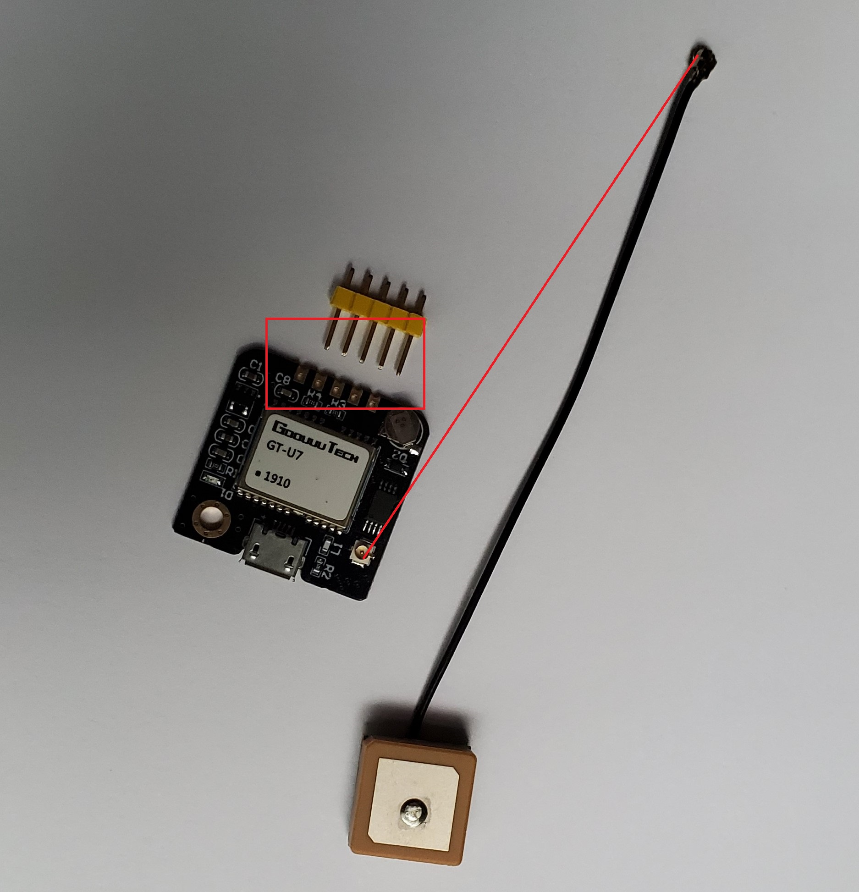

# Add the GPS sensor to Raspberry Pi

In the [previous step](./set-up-pi.md) you have set up the Raspberry Pi device.

In this step you will add the GPS sensor to Pi and run the python code that receives the GPS from the receiver and send the data to IoT hub.

## Steps

1. Assemble the [GPS sensor](https://www.amazon.com/Navigation-Positioning-Microcontroller-Compatible-Sensitivity/dp/B084MK8BS2)

put the 5 pins in as shown in the red box.
connect the antenna as shown in the red line.
1. Put the vcc to 2, ground to 6 tx and rx to 8 and 10
[Source](https://www.raspberrypi.org/documentation/usage/gpio/)
1. The GPS Module connected should look like following with a blinking red light when the satelite is available

1. Note that the GPS antenna should face the sky to get the GPS values

## Run the Python Code

1. Open Raspberry Pi
1. Open a terminal and install azure.iot-device package with the following code
```sh
    pip3 install azure.iot.device
```
1. Install [pynmea2 library](https://github.com/Knio/pynmea2) with the following code
```sh
    pip3 install pynmea2
```
1. Open the Python Editor (Default Thonny)
1. Click Load and openthe [raspberry-pi-gps-tracker.py](../code/client/raspberry-pi-gps-tracker.py) 
1. Update the [raspberry-pi-gps-tracker.py](../code/client/raspberry-pi-gps-tracker.py) with the device connection string you got in previous step when you have created the [Iot Hub](./set-up-iot-hub.md)

```python
# The device connection string to authenticate the device with your IoT hub.
CONNECTION_STRING = "<Device_Connection_String>"
```
1. Run raspberry-pi-gps-tracker.py

1. If everything is set up correctly you should see the GPS messages going to the IoT Hub


> If the GPS receiver is connected to the raspberry pi, a red led will light up

>Make sure that the GPS antenna is facing the open sky. If you are indoor then move the device outside the door so it can see the sky.

> When the GPS antenna is picking up the satellite signal the red LED light should blink. It can take a few minutes to start receiving the signal.

## Next steps

In this step you have set up GPS receiver to the pi and run the client side application.

In the [next step](./set-up-web-app.md) you will configure the server side code and run the Azure Map to show the current GPS location.