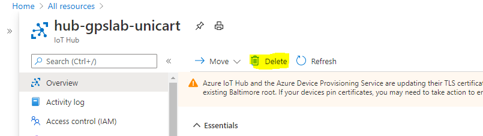
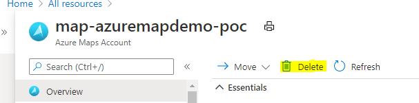

# Clean up you Azure resources

In the [previous step](./set-up-web-app.md) you run the python website to show the current location in Azure Maps using GPS sensor data.

In this step you will clean up your Azure resources.

## Clean up resources

Every Azure service you use either costs you money (either paid for or reduces your available credit for free subscriptions), or uses up one of your available free tier resources. It's good practice when you are finished with a resource to delete it - to either save money or to allow you to spin up new free tier resources.

### Delete the Azure IoT Hub

1. From the [Azure Portal](https://portal.azure.com/?WT.mc_id=iotcurriculum-github-jabenn), head to the [IoT Hub](./set-up-iot-hub.md) that you created earlier.

1. Click 'Delete' and confirm to delete the resource.
    

### Delete the Azure Maps

1. From the [Azure Portal](https://portal.azure.com/?WT.mc_id=iotcurriculum-github-jabenn), head to the [Azure Maps](./set-up-azure-maps.md) that you created earlier.

1. Click 'Delete' and confirm to delete the resource.
    

## Next steps

You have completed this lab to show current GPS location using a Raspberry Pi, GPS receiver and Azure Maps. You detected GPS location coordinates and sent this data to Azure IoT Hub, from where you visualized it on Azure Maps.

If you want to learn more about Azure IoT Services, then check out the following:

* [IoT learning paths on Microsoft Learn](https://docs.microsoft.com/learn/browse/?term=IOT&WT.mc_id=iotcurriculum-github-jabenn)
* [The IoT show on Channel9](https://channel9.msdn.com/Shows/Internet-of-Things-Show/?WT.mc_id=iotcurriculum-github-jabenn)

Once you have upskilled as an IoT developer, why not get certified with our AZ-220 Azure IoT Developer certification. Check out the details on our [certification page](https://docs.microsoft.com/learn/certifications/azure-iot-developer-specialty?WT.mc_id=iotcurriculum-github-jabenn)
