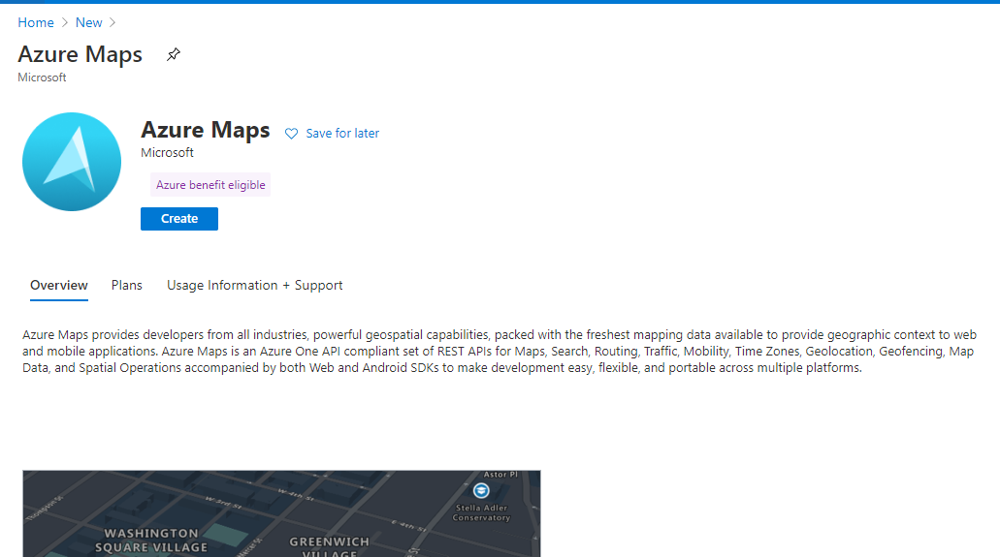

# Set Up Azure Map

In this step you will set up Azure Map.

## Steps

1. Go to [Azure portal]('https://portal.azure.com') and login to your subscription. 
2. Create a resource for Azure Maps  
3. Select Azure Map
4. Note down the Primary Key and in [application.js](../server/code/static/js/application.js) and replace <Azure_Map_Subscription_Key> with the primary key

    ```js
    //Initialize a map instance.
    map = new atlas.Map('myMap', {
       ...
        authOptions: {
            authType: 'subscriptionKey',
            subscriptionKey: '<Azure_Map_Subscription_Key>'
        }
    });
    ```
> If you want to learn more about Azure Map and samples, see [Azure Map Samples](https://azuremapscodesamples.azurewebsites.net/index.html?WT.mc_id=iotcurriculum-github-jabenn).

