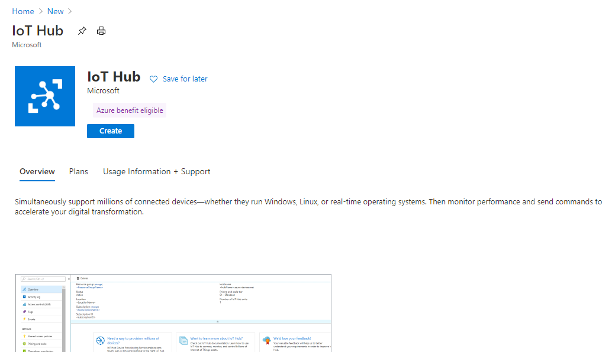
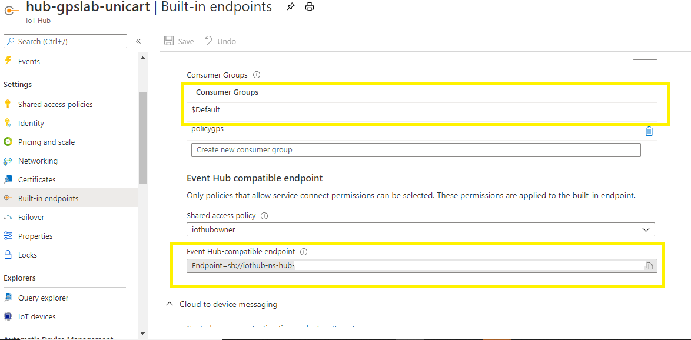
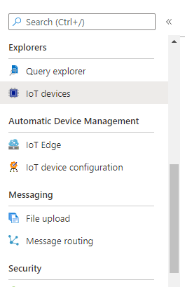
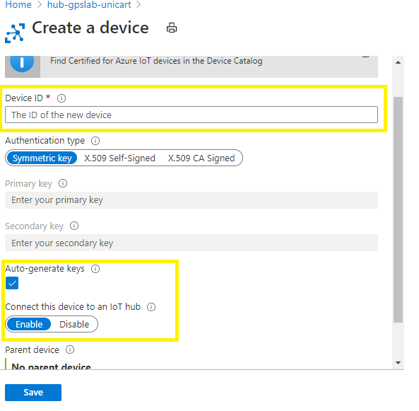
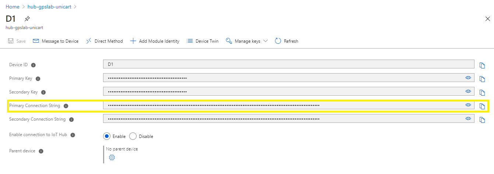

# Set Up IoT Hub
In the [previous step](./set-up-azure-maps.md) you set up an Azure Maps account in Microsoft Azure Portal.

In this step you will set up IoT Hub and add a device in it.

## Steps

1. Go to [Azure portal]('https://portal.azure.com') and login to your subscription. 
2. Create a resource for IoT Hub  
3. Once created note down the Event Hub Compatible Endppoint and Consumer Group

## Create a device

1. Go to the IoT hub you have created earlier
2. Go to IoT Devices and add new device

3. Enter a device Id. Leave the "Auto Generate Keys" checked.

4. Once created, note down the Primary Connection String.

## Next steps

In this step you have set up the IoT Hub and added a device in it.

In the [next step](./set-up-pi.md) you will set up the Raspberry Pi