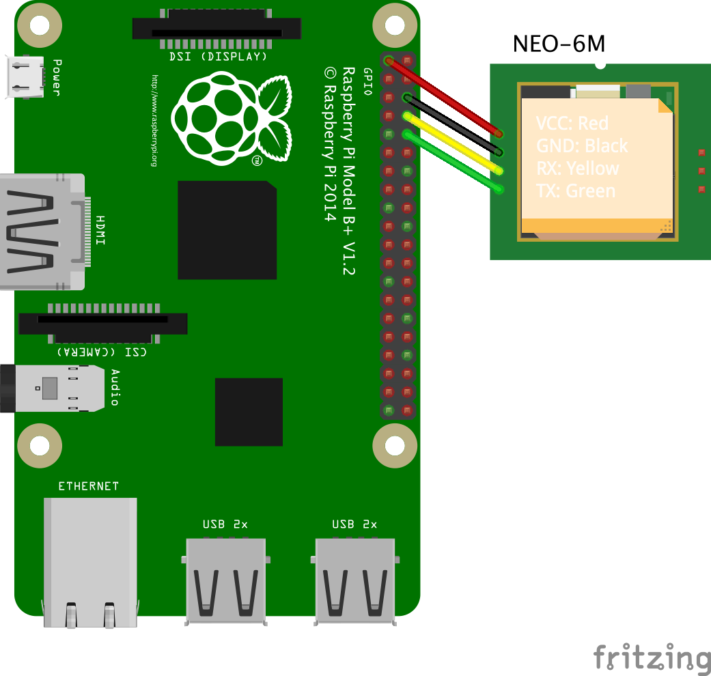

# Set up the Raspberry Pi

In the [previous step](./set-up-azure-services.md) you set up all the Azure services needed to complete this lab.

In this step you will set up the Raspberry Pi to receive GPS signals from the GPS receiver.

## Raspberry Pi

The [Raspberry Pi](https://raspberrypi.org) is a low-priced, small form factor computer that can run a full version of Linux. It's popular with hobbyists and kids - it was originally designed to be a cheap computer for kids to learn to code on. It has the same standard USB and HDMI ports that a PC or Mac would have, as well as GPIO (General Purpose Input Output) pins that can be used to work with a wide array of external electronic components, devices, sensors, machinery and robotics.

Raspberry Pi's can run a wide range of programing languages. In this lab you will use Python, and program the Pi using Visual Studio Code (VS Code), an open-source developer text editor that can program locally or remotely on a Pi from your PC or Mac. When connected to the Pi remotely from your PC or Mac you can write and debug code from your device, with the code running on the Pi. You will also get a terminal that runs on the Pi.

## Hardware requirements

You will need the following hardware:

* A Raspberry Pi 4
* A micro SD Card
* An SD card to USB converter that matches the USB ports on your device if your device doesn't have an SD card slot
* A Raspberry Pi 4 power supply (USB-C)
* A keyboard, mouse and monitor
* A [micro-HDMI to HDMI adapter or cable](https://www.raspberrypi.org/products/micro-hdmi-to-standard-hdmi-a-cable/)
* NEO-6M GPS Receiver Module with external antenna
* 4 female to female jumper cables

### Set up the software

1. Insert the SD card into your PC or laptop using an adapter if necessary

1. Using the [Raspberry Pi imager](https://www.raspberrypi.org/downloads/), image the SD card with the default Raspberry Pi OS image. You can find instructions on how to do this in the [Raspberry Pi installing images documentation](https://www.raspberrypi.org/documentation/installation/installing-images/).

1. Insert the SD card into the Pi

1. Connect the Pi to your keyboard, mouse and monitor. If you are using ethernet for internet access then connect the Pi to an ethernet cable connected to your network. Then connect it to the power supply.

    > If you don't have a keyboard, monitor and mouse available, you can set up your Pi for headless access - check out the [Microsoft Raspberry Pi headless setup docs](https://github.com/microsoft/rpi-resources/tree/master/headless-setup) for details on how to set this up.

1. Work through the setup wizard on the Pi:

    1. Set your country, language and timezone

    1. Change your password from the default - when a new Raspberry Pi is set up it creates an account with a username of `pi` and a password of `raspberry`, so set a new password

    1. Set up the screen if necessary

    1. If you want to use Wifi, select your wireless network and enter the password if needed.

        > If you are using enterprise security you may need to launch Chromium, the Pi's browser after selecting your wireless network to log in to your Wifi

    1. Update the Pis software

    1. Reboot the Pi

Once the Pi has rebooted, you will need to change the hostname. All newly setup Pis are configured with a hostname of `raspberrypi`, so if you have more than one Pi on your network you won't be able to distinguish between them by name unless you rename them. You will also need to enable SSH (Secure SHell) access so you can control the Pi later remotely from Visual Studio Code.

1. From the Raspberry Pi select the **Raspberry Pi** menu, then select **Preferences -> Raspberry Pi Configuration**

    

1. Change the value of the *Hostname* in the *General* tab to be something unique, such as `gps-pi`. THis is to avoid any conflicts on your network with any other Raspberry Pis that will default to a hostname of *raspberrypi*.

    

1. In the **Interfaces** tab, ensure **SSH** is set to *Enable*

    

1. Select the **OK** button

1. When prompted, select **Yes** to reboot the Pi

### Set up the hardware

The GPS receiver module needs to be connected to the Raspberry Pi. Depending on where/how you bought it you may need to solder on the headers.

1. Connect 4 female to female jumper cables to the following pins on the GPS receiver:

    * VCC
    * GND
    * RXD
    * TXD

1. Connect the antenna to the GPS receiver

1. Power off the Raspberry Pi

1. Connect the other end of the jumper cables to the GPIO pins on the Raspberry Pi:

    | GPS pin | Pi Pin |
    | :------ | :----- |
    |  VCC    | 1 (3V power) |
    |  GND    | 6 (GND) |
    |  RXD    | 8 (TXD) |
    |  TXD    | 10 (RXD) |

    > Note that TXD on the GPS connects to RXD on the Pi, and RXD on the GPS connects to TXD on the Pi. TXD is transmit, RXD is receive, so the transmit on the GPS is received by the receive on the Pi and vice versa.

    

    You can read more on the GPIO pins and see diagrams of the Pin numbers in the [Raspberry Pi GPIO documentation](https://www.raspberrypi.org/documentation/usage/gpio/).

1. Power the Pi back on

The LED on the GPS will light up whilst it tries to get a fix on the satellites. When it has a fix it will blink ever second. It may take a while the first time to get a fix. If you don't get a fix, try moving closer to a window.

## Configure and test the GPS receiver

Once the GPS receiver is connected, some software needs to be installed and the receiver needs to be tested to ensure everything is working properly.

### Configure the Pi to talk to the GPS receiver

The GPS receiver connects to the Pi using [UART](https://en.wikipedia.org/wiki/Universal_asynchronous_receiver-transmitter) to do serial communication. By default this is used as a serial port that is used to communicate externally, so this needs to be switched off so the GPS receiver can communicate over UART.

1. From the Pi, launch the terminal

1. The `cmdline.txt` file in the `boot` folder needs to be edited to remove the UART serial connection. Run the following command to edit this file:

    ```sh
    sudo nano /boot/cmdline.txt
    ```

1. Delete the contents of this file, and replace with the following:

    ```txt
    dwc_otg.lpm_enable=0 console=tty1 root=/dev/mmcblk0p2 rootfstype=ext4 elevator=deadline fsck.repair=yes rootwait quiet splash plymouth.ignore-serial-consol
    ```

1. Save and close the file by pressing `Ctrl+X`, then `Y` to confirm you want to save the file, and press enter to save using the same file name.

1. The `config.txt` file in the `boot` folder needs to be edited to configure a few more UART options. Run the following command to edit this file:

    ```sh
    sudo nano /boot/config.txt
    ```

1. Scroll to the bottom of the file and add the following to the end:

    ```txt
    dtparam=spi=on
    dtoverlay=pi3-disable-bt
    core_freq=250
    enable_uart=1
    force_turbo=1
    init_uart_baud=9600
    ```

1. Save and close the file by pressing `Ctrl+X`, then `Y` to confirm you want to save the file, and press enter to save using the same file name.

1. Reboot the Pi with the following command:

    ```sh
    sudo reboot
    ```

### Install the GPS receiver software

[GPSD](https://gpsd.io) is free GPS software you can use to get the data coming from the receiver.

1. From the terminal, install the GPSD software using the following command:

    ```sh
    sudo apt install gpsd gpsd-clients --yes
    ```

1. The GPS receiver will be connected on the port `/dev/ttyAMA0`, and will use a BAUD rate of 9600. Run the following command to configure the BAUD rate of this port:

    ```sh
    stty -F /dev/ttyAMA0 9600
    ```

1. To connect the device to the GPS software, first we need to configure the software. It can't be configured if it is running, so run the following command to stop it:

    ```sh
    sudo killall gpsd
    ```

1. Next run the following command to edit the GPS software configuration file:

    ```sh
    sudo nano /etc/default/gpsd
    ```

1. Edit the line that reads `DEVICES=""` to be the following:

    ```txt
    DEVICES="/dev/ttyAMA0"
    ```

1. Save and close the file by pressing `Ctrl+X`, then `Y` to confirm you want to save the file, and press enter to save using the same file name.

1. Run the following commands to restart the GPS software and launch it:

    ```sh
    sudo systemctl enable gpsd.socket
    sudo systemctl start gpsd.socket
    sudo cgps -s
    ```

1. After a few seconds you should see the GPS details:

    ```output
    ┌───────────────────────────────────────────┐┌─────────────────────────────────┐
    │    Time:       2020-10-29T01:37:44.000Z   ││PRN:   Elev:  Azim:  SNR:  Used: │
    │    Latitude:    49.79356336 N             ││   4    55    117    14      Y   │
    │    Longitude:  120.04410920 W             ││   7    51    260    22      Y   │
    │    Altitude:   155.842 m                  ││   9    83    298    22      Y   │
    │    Speed:      3.41 kph                   ││  16    44    061    23      Y   │
    │    Heading:    165.1 deg (true)           ││  27    16    102    17      Y   │
    │    Climb:      2.88 m/min                 ││   3    10    175    07      N   │
    │    Status:     3D FIX (44 secs)           ││                                 │
    │    Longitude Err:   +/- 16 m              ││                                 │
    │    Latitude Err:    +/- 32 m              ││                                 │
    │    Altitude Err:    +/- 60 m              ││                                 │
    │    Course Err:      n/a                   ││                                 │
    │    Speed Err:       +/- 6 kph             ││                                 │
    │    Time offset:     0.134                 ││                                 │
    │    Grid Square:     CN87xq                ││                                 │
    └───────────────────────────────────────────┘└─────────────────────────────────┘
    ```

## Next steps

In this step you set up the Raspberry Pi to receive GPS signals from the GPS receiver.

In the [next step](./write-pi-code.md) you will write code to gather GPS data and send it to your IoT Hub.
