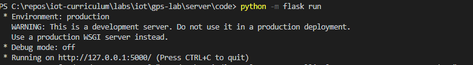
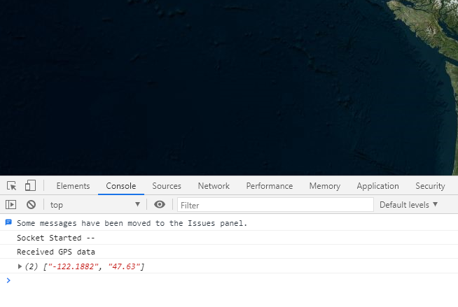

# Run the Web Appliction
In the [previous step](./add-gps-to-pi.md) you set up the GPS receiver with Raspberry Pi and run the code that sends the GPS data to IoT hub.

In this step you will run the web application.

## Steps

1. Open Visual Studio Code
1. Click Open Folder and select the [code](../server/code) folder
1. Set up the python virtual environment by following steps in [Setting Up Python with Visual Studio Code](https://code.visualstudio.com/docs/python/tutorial-flask) till **'Create and run a minimal Flask app'**
4.  Create a new file called .env inside code folder.
1. Open the .env file and add
```python
CONNECTION_STR = '<Iot_Hub_Connection_String>'
CONSUMER_GROUP_NAME = '<Consumer_Group_Name>'
```
1. Update The .env file.

Replace
    
```python
    <Iot_Hub_Connection_String>
```
with 'Event Hub Compatible Endppoint' in [Set up IoT Hub](./set-up-iot-hub.md)
and
```python
    <CONSUMER_GROUP_NAME>
```
with 'Consumer Group Name' in [Set up IoT Hub](./set-up-iot-hub.md)

1. Replace <Iot_Hub_Connection_String> from [Set up IoT Hub](./set-up-iot-hub.md)
1. Open a terminal in Visual Studio Code and make sure the current directory is [server/code](../server/code) folder
1. If not then go to File -> 'Add Folder to Workspace' and select the 'Code' folder.
1. All the installables are listed in [requirements.txt](../server/code/requirements.txt). Install the libraries by running the following commands in command prompt

    ```sh
    pip3 install -r requirements.txt
    ```
5. In the [Application.js](../server/code/static/js/application.js) file, change the **<Azure_Maps_Subscription_Key>** with the primary key that you got in [Set up Azure Maps](./set-up-azure-maps.md)
    ```js
    var mapSubscriptionKey = '<Azure_Maps_Subscription_Key>';
    ```
## Run the Python Code
1. Run the web application with the following command in the terminal
    ```sh
        python -m flask run
    ```
1. Note down the port. Normally it should be 5000. If not use that port number in next step.

1. Open a browser and open http://localhost:5000
1. Make sure that your Raspberry Pi and GPS sensor is connected and sending data
1. You should see a Azure Maps and a Pin specifying your GPS location.


## Troubleshoot
1. If you do not see any map loading please check the **Azure Maps subscription key** is correct.
1. If you do not see the GPS position in the map check that the .env file has right values
1. Open F12 and go to console to check if you see any error messages.
4. 

## Next steps

In this step you have run the web application and displayed the position received from the GPS receiver in the map.

In the [next step](./clean-up.md) you will clean up your resources.

