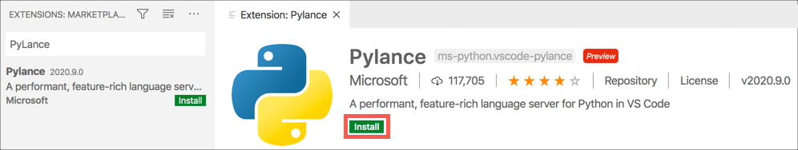
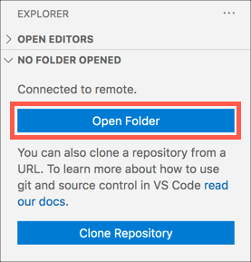
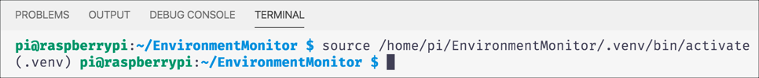

# Code the Raspberry Pi to send GPS data to IoT Hub

In the [previous step](./set-up-pi.md) you set up the Raspberry Pi to receive GPS signals from the GPS receiver.

In this step you will write code to gather GPS data and send it to your IoT Hub.

## Connect to the Pi

You will need a coding environment on the Pi that supports Python. The recommended ways are:

* **Visual Studio Code Remote Development** - run VS Code on a PC or Mac and connect remotely to the Pi. You can read how to do this in the [Microsoft Raspberry Pi resources](https://github.com/microsoft/rpi-resources/tree/master/remote-coding)
* **Visual Studio Code running on the Pi** - run VS Code on the Pi directly. From the Pi head to [code.visualstudio.com/#alt-downloads](https://code.visualstudio.com/#alt-downloads?WT.mc_id=academic-7372-jabenn), and download the ARM .deb package. Run this on the Pi to install VS Code.

All the steps in this lab assume you are using VS Code. If you want to use another editor, some steps may vary.

### PyLance in Visual Studio Code

Python support with full debugging support and intellisense, can be added to VS Code via the [PyLance extension](https://devblogs.microsoft.com/python/announcing-pylance-fast-feature-rich-language-support-for-python-in-visual-studio-code/?WT.mc_id=academic-7372-jabenn).

1. Install and launch Visual Studio Code on the Pi if you don't already have it installed, or connect to the Pi using the Remote SSH option.

1. Select the **Extensions** tab from the side menu

    

1. Search for `PyLance` and select the **Install** button to install the PyLance Python extension

    

    If you are using remote SSH to connect to the Pi remotely, you will need to select the **Install in SSH** button.

    

Visual Studio Code will now be configured to run Python.

## Write the code

Now you have VS code running, you can write the code for the Pi.

### Create a folder

1. Create a folder on your Pi called `GpsLab` to hold the code. You can do this from VS Code by running the following command in the terminal:

    ```sh
    mkdir GpsLab
    ```

    If the terminal is not visible, you can show it by selecting the *Terminal -> New Terminal* menu option.

1. Select the **Explorer** tab from the side menu

    

1. Select the **Open Folder** button

    

1. Navigate to the `GpsLab` folder and select **OK**.

### Create a Python Virtual Environment

Python comes in various versions, and Python apps can use external code in packages installed via a tool called `pip`. This can lead to problems if different apps need different package versions, or different Python versions. To make it easier to avoid issues with package or Python versions, it is best practice to use *virtual environments*, self-contained folder trees that contain a Python installation for a particular version of Python, plus a number of additional packages.

1. When the new Visual Studio Code window is opened, the terminal should be opened by default. If not, open a new terminal by selecting *Terminal -> New Terminal*.

1. Create a new file inside the `GpsLab` folder called `app.py`. This is the file that will contain the code for the device, and by creating it the Python extension in Visual Studio Code will be activated. Select the **New File** button in the *Explorer*.

   

1. Name the new file `app.py` and press return

   

1. The Python extension will activate, and you can see the progress in the status bar.

1. Create a new virtual environment called `.venv` using Python 3 by running the following command in the terminal

   ```sh
   python3 -m venv .venv
   ```

1. A dialog will pop up asking if you want to activate this virtual environment. Select **Yes**.

   

1. The existing terminal will not have the virtual environment activated. Close it by selecting the trash can button

   

1. Create a new terminal by selecting *Terminal -> New Terminal*. The terminal will load the virtual environment

   

### Install pip packages

Pip packages can be installed one by one via the command line, but it's best practice to create a file that lists all the Pip packages needed by an application, so that they can all be installed at once. This file can also be checked in to source code control with your code allowing other developers to re-create your setup. This file is traditionally called `requirements.txt`.

1. Create a new file in the `GpsLab` folder called `requirements.txt`

1. Add the following to this file. You can also find this code in the [requirements.txt](../code/pi/requirements.txt) file in the [code/pi](../code/pi) folder.

    ```sh
    azure-iot-device
    python-dotenv
    gps
    ```

    * `azure-iot-device` is the Pip package for connecting to Azure IoT services
    * `python-dotenv` is a Pip package that provides the ability to load secrets such as connection details from an file
    * `gps` is a Pip package that talks to GPSD to get the GPS values.

1. Save the file

    > VS Code has an auto save option if you don't want to have to keep saving files. Enable this by selecting *File -> Auto save*.

1. Install these packages by running the following command in the terminal:

    ```sh
    pip install -r requirements.txt
    ```

### Write the app code

1. Open the `app.py` file

1. Add the following code to this file. You can also find this code in the [app.py](../code/pi/app.py) file in the [code/pi](../code/pi) folder.

    ```python
    import asyncio
    import json
    import os
    from dotenv import load_dotenv
    from azure.iot.device.aio import IoTHubDeviceClient
    from azure.iot.device import Message
    from gps import *

    # Load the device connection string from an environment variable read from the .env file
    load_dotenv()
    connection_string = os.getenv("CONNECTION_STRING")

    # The main function that runs the program in an async loop
    async def main():
        # The client object is used to interact with your Azure IoT hub.
        device_client = IoTHubDeviceClient.create_from_connection_string(connection_string)

        # Connect the client.
        print("Connecting")
        await device_client.connect()
        print("Connected")

        # Connect to the GPSD daemon
        gpsd = gps(mode=WATCH_ENABLE|WATCH_NEWSTYLE) 

        # The main loop - loops forever reading GPS values and sending them to IoT Hub
        async def main_loop():
            while True:
                # Get the next value reported by the GPS device
                report = gpsd.next()

                # GPS values can have multiple types, such as:
                # TPV - Time, position, velocity giving the time signal, current position and current calculated velocity
                # SKY - the sky view of GPS satellite positions
                # GST - error ranges
                # Monitor for the TPV values to get the position. Sometimes this value can come without the properties if
                # the values aren't available yet, so ignore if the lat and lon are not set
                if report["class"] == "TPV" and hasattr(report, 'lat') and hasattr(report, 'lon'):
                    # Build the message with GPS location values.
                    message_body = {
                        "latitude": report.lat,
                        "longitude": report.lon
                    }

                    # Convert to an IoT Hub message
                    message = Message(json.dumps(message_body))

                    # Send the message.
                    print("Sending message:", message)
                    await device_client.send_message(message)
                    print("Message successfully sent")

                    # Wait for a minute so telemetry is not sent to often
                    # Only sleep after receiving TPV values so we don't waste
                    # time sleeping after other values that are ignored
                    await asyncio.sleep(60)

        # Run the async main loop forever
        await main_loop()

        # Finally, disconnect
        await device_client.disconnect()

    # Run the async main loop
    if __name__ == "__main__":
        asyncio.run(main())
    ```

1. Read the code and the comments to see what it does

### Configure the environment file

Rather than have secrets such as API keys hard coded, it is better to load them from environment variables. There is a pip package called `python-dotenv` that makes this easier by loading environment variables from a file called `.env`. This way you can create the `.env` file, add your API keys to it, and then not check this file into source code control to keep your keys safe.

> The standard `.gitignore` file that is used to ignore files when adding to Git for Python projects on GitHub already ignores .env files

1. Create another new file called `.env`, and add the following code:

    ```python
    CONNECTION_STRING=<IoT Hub connection string>
    ```

1. Replace `<IoT Hub connection string>` with the device connection string you copied when setting up IoT Hub in an earlier step.

    > This needs to be the device connection string, not the Event Hub compatible endpoint connection string.

1. Save the file

### Test the code

1. Run the code from the VS Code terminal using the following command:

    ```sh
    python app.py
    ```

    The code will connect to Azure IoT Hub, then start reading GPS coordinates every 60 seconds and sending them to Azure IoT Hub.

    ```output
    (.venv) pi@raspberrypi:~/GpsLab $ python app.py
    Connecting
    Connected
    Sending message: {"latitude": 47.642311, "longitude": -122.1391983}
    Message successfully sent
    ```

## Next steps

In this step you wrote write code to gather GPS data and send it to your IoT Hub.

In the [next step](./web-app.md) you will write a web application to visualize the GPS location on Azure Maps.
