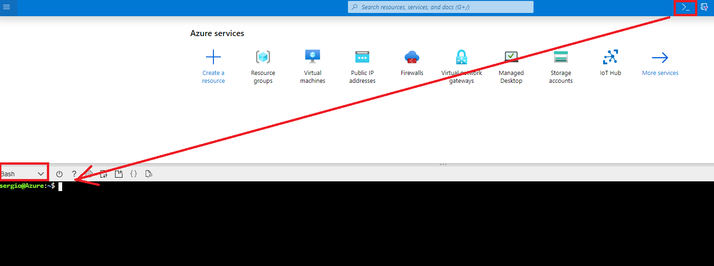
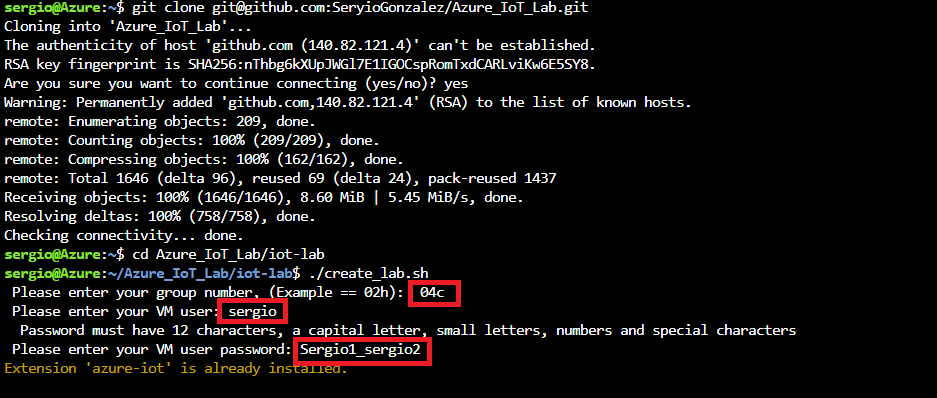
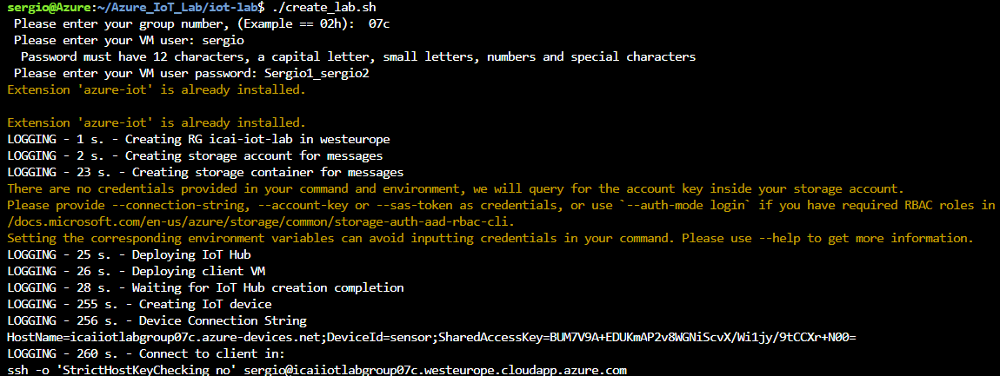

# Creation of original resources
In order to start with the second part of the lab, we need to create the environment. We will use an automation script and the Azure Portal CLI. For this open the CLI as highlighted in the following image.



Lauch the following command in order to copy the required script:

```
git clone https://github.com/SeryioGonzalez/Azure_IoT_Lab.git
cd Azure_IoT_Lab/iot-lab
./create_lab.sh
```
As shown below, the script will ask you for the parameters highlighted in red. PLEASE NOTE THAT IS A SAMPLE INPUT. **USE YOUR OWN VALUES**



Once the script has successfully finished the deployment, you can send traffic to IoT hub as explained in Module 2


At this point, this module is done. Go to the next module for continuing the lab.
[Go back to the main section](../README.md )
