# Creating a device VM
In this module we will create a virtual machine, simulating a device that connects to Azure IoT Hub.

The outcome of this module is creating the simulated device VM element in the intended architecture below. Added to the IoT Hub instance in the previous module, we get the following partial architecture
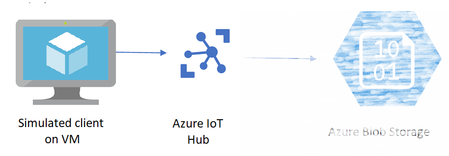

## Look for the Virtual Machine icon in the search area of the Azure portal
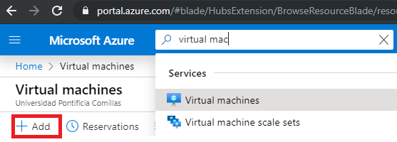

## Parameterize virtual machine instance resource
  1. Select your **Subscription**
  2. Use the previously created **Resource group**
  3. Name the VM **simulated-device**
  4. Select Region **(Europe) West Europe**
  5. Make sure under the **Image** field, **Ubuntu Server 18.04 LTS - Gen1** is selected
  6. Select the VM **Size** the value **B1s**, the one included in the free tier, priced at aprox. 7.36 euros per month.
  7. Select **Authentication type** the value **Password**. Optionally, if you are familiar with public/private keys and already have one, select **SSH public key**
  8. Put your **Username** and **Password**. If you had selected **SSH public key**, input your public key by selecting in **SSH public key source** the value **SSH public key**

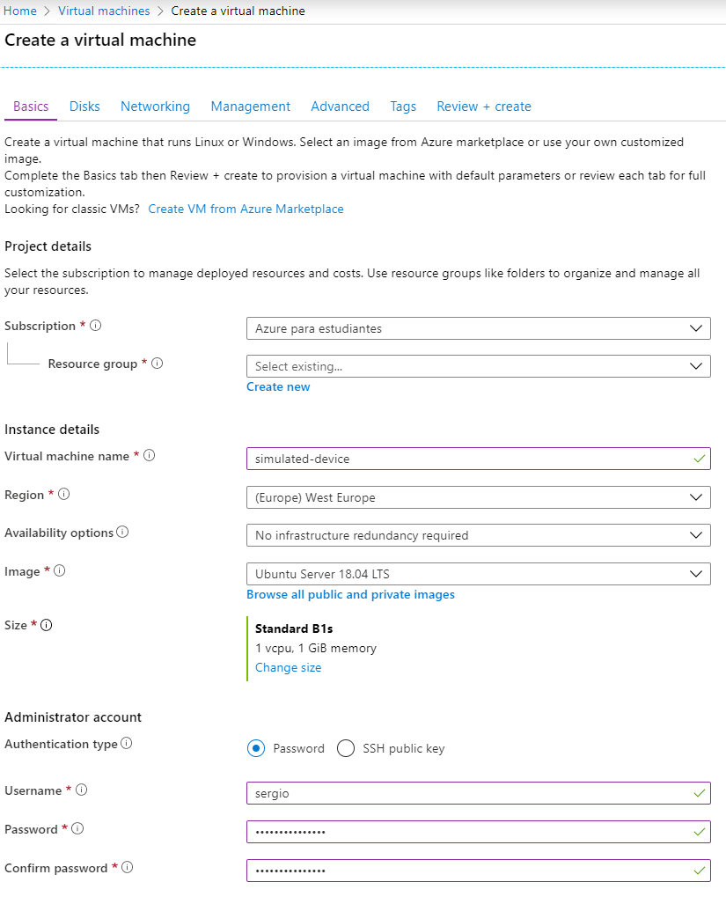

  9. Leave other default options and click **Next: Disks >**
 10. Leave default options and click **Next: Networking >**
 
## Configure networking
11. In the **Networking** tab, make sure:
    * **NIC network security group** is set to **Basic**
    * **Public inbound ports** is set to **Allow selected ports**
    * **Select inbound ports** is set to **SSH (22)**

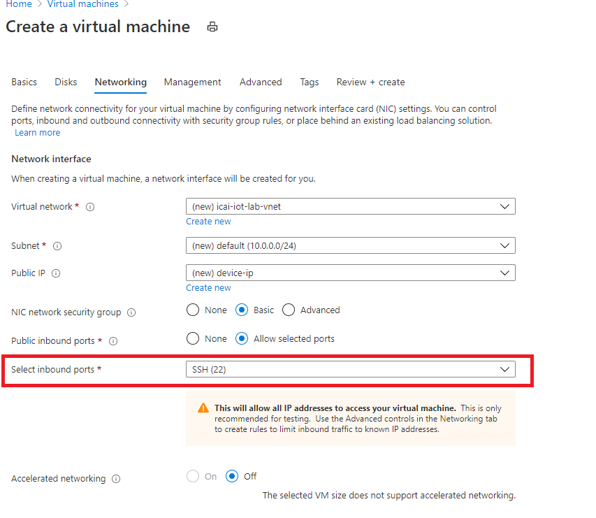

12. Click in **Review + create** in the bottom left corner 

## Validate the VM configuration before creation
Once the VM configuration is OK, the following green mark will show up, so the VM creation can be triggered. 
Click **Create** if you see **Validation passed**. It not, verify any missing parameters
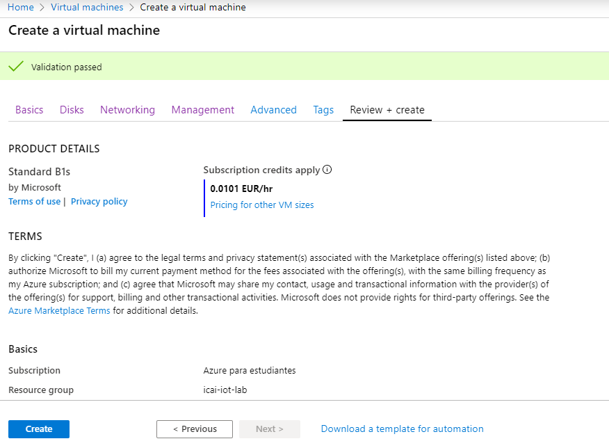

## VM is already created
After a few minutes, the VM should be running, as shown in the following snapshot
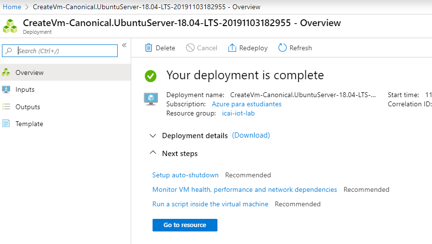

## Give the VM a name in the internet
At this point, your VM has a public IP, something like 12.2.33.34. We will assign it a **DNS name** <br/>
For this, go to the **Resource Group** hosting your VM resources and select the **Public IP Address**.

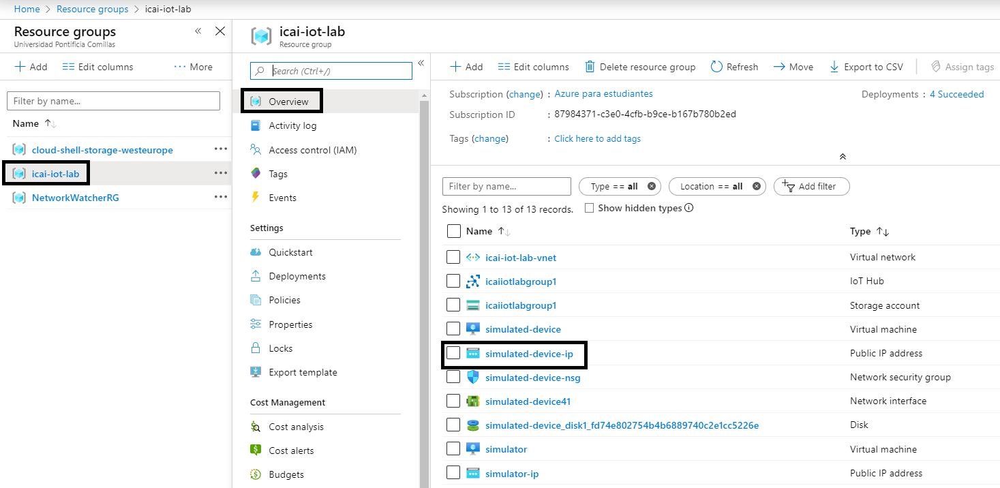

In the **Public IP Address**, under the **Configuration** blade, assign your group ID, for example **icaiiotlabgroup01h**, as shown in the image below

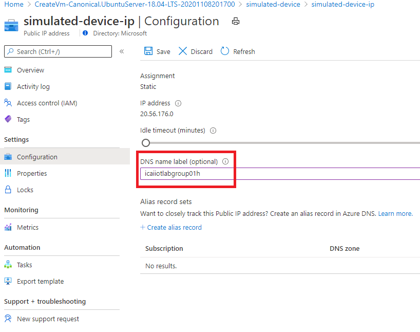

At this point, your VM IP has a global name **icaiiotlabgroup01h.westeurope.cloudapp.azure.com**.<br/>

## Get the SSH connection string
In the VM **Overview** blade, select **Connect** in the following menu. 
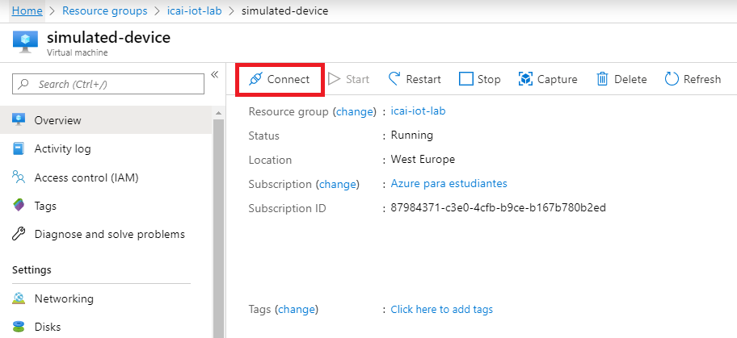

A menu like the one below will show up:
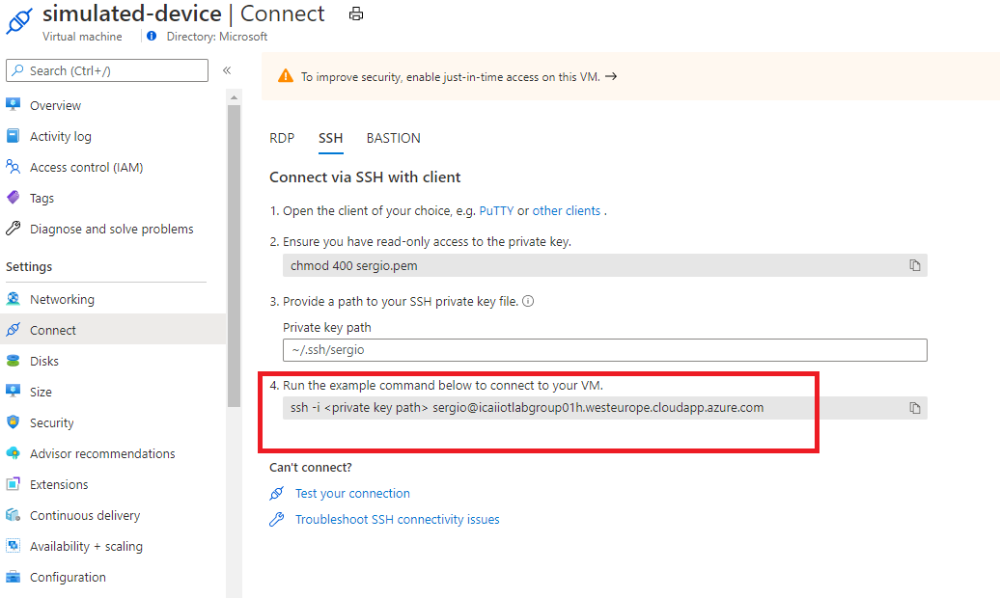
Select the ssh command and remove the ``` -i <private key path> ``` placeholder if you selected password authentication. <br/>
The SSH command will be something like: <br/>
```ssh  sergio@icaiiotlabgroup01h.westeurope.cloudapp.azure.com``` <br/>

## Connect to the VM via SSH
For connecting to the VM, you can use an SSH desktop client like Putty or use the [built-in bash console in the Azure portal](https://docs.microsoft.com/en-us/azure/cloud-shell/quickstart), as shown in the following picture:


Mind that if this is the first time you open the web console, you might get the following message. If this is the case, press **Create Storage** and continue.

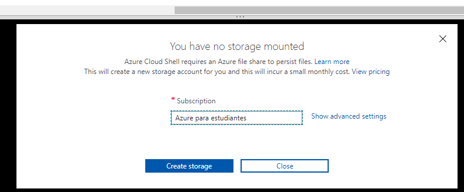

If you want to use a local SSH client, the following options are recommended based on your operating system:
* For Mac or Linux users, use the built-in console
* For Windows user, download Putty or activate the WSL.

When connecting to the VM, accept the VM public key by inputing **yes**, as shown below
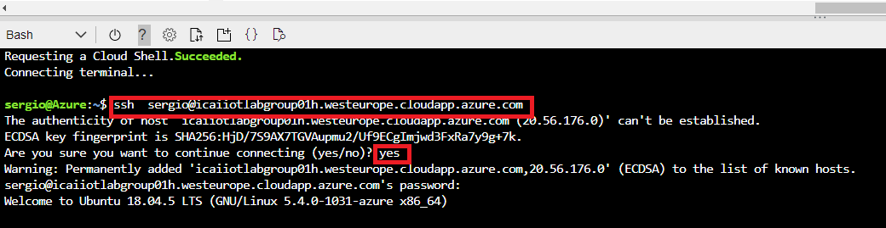

Once connected, a command promt like the following will show up:
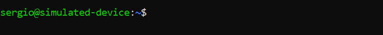

## Install required packages and repos
Execute the following commands. Try to make sense at what those commands do
```
sudo apt-get update -y
sudo apt install python3-pip -y
pip3 install azure-iot-device
git clone https://github.com/SeryioGonzalez/Azure_IoT_Lab.git
```
## Send data to Azure IoT Hub using the device connection string of Module 1
After downloading the repo, the python3 script for sending data to IoT Hub is located in the iot-client folder. <br/>
**Do not copy past the following command, it is an example. Change your connection string of your device you got in the previous module**. <br/>
Remember to put the connection string between quotes, otherwise the linux bash will interprete it

`sergio@simulated-device:~$ python3 Azure_IoT_Lab/iot-client/iot-hub-client.py `**`"HostName=icaiiotlabgroup01h.azure-devices.net;DeviceId=simulatedDevice;SharedAccessKey=7YouShouldNotCopyThisButPutYourValue"`**


## Verify the Azure IoT hub is receiving your messages
In order to see if Azure IoT Hub is receiving your messages, check the message counter in the Azure IoT hub module, as shown in the following snapshot highlighted in red.
You might need to scroll down the menu on the right hand side in purple. 
You can see, IoT Hub has received 3 messages.


At this point, this module is done. Go to the next module for continuing the lab and do something useful with this data
[Go back to the main section](../README.md )
