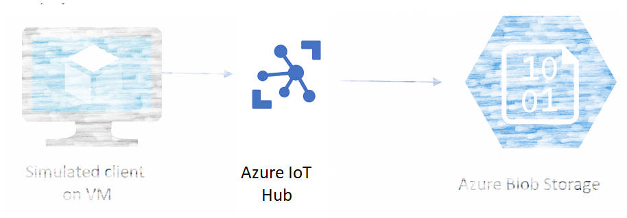
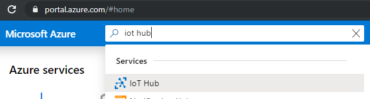
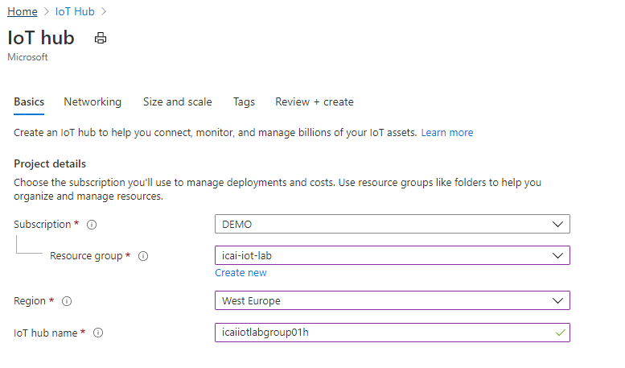
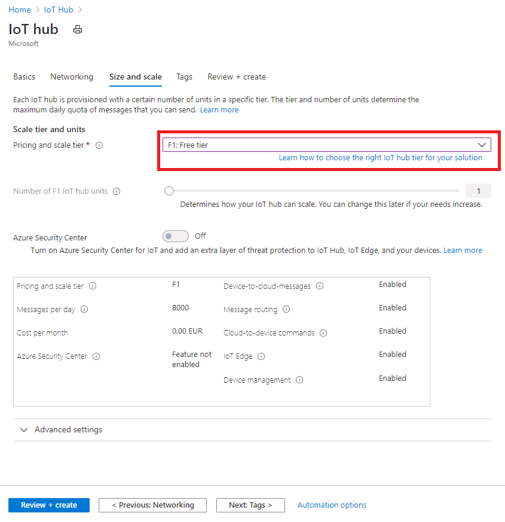
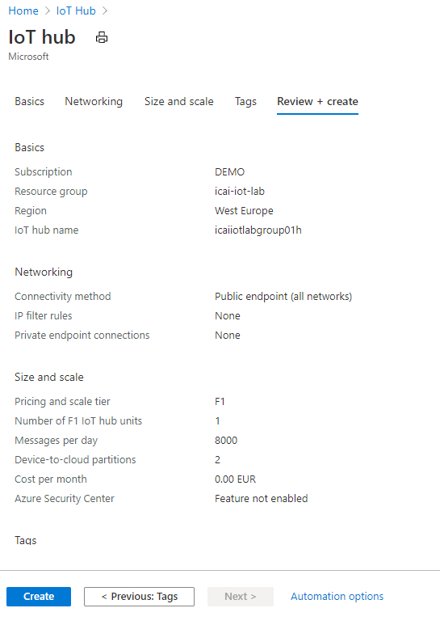
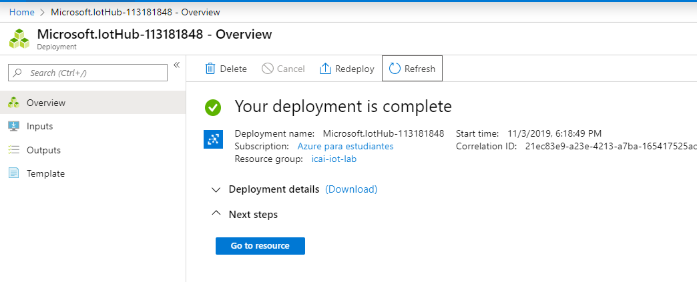
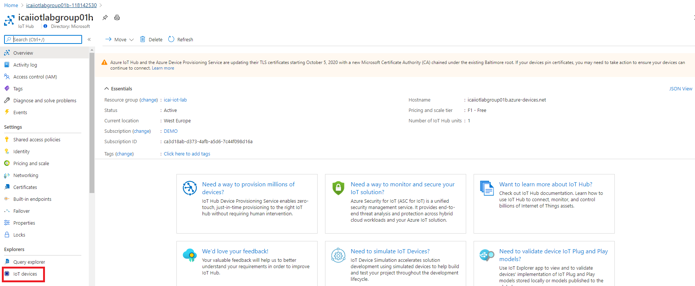
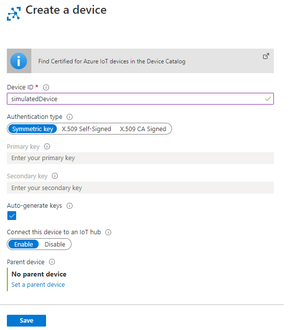
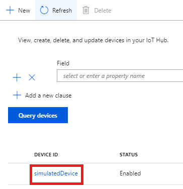
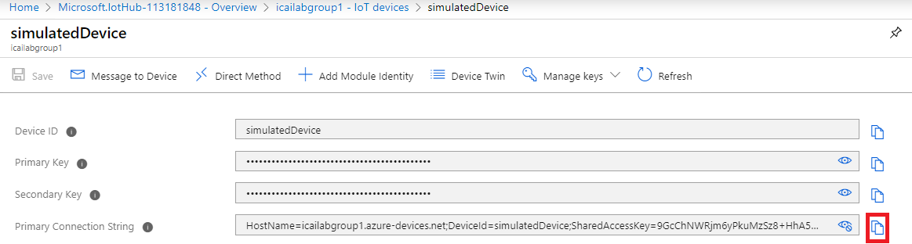

# Creating an IoT Hub and a simulated device
In this module we will create an Azure IoT Hub and configure a device.

The outcome of this module is creating the central Azure IoT Hub element in the intended architecture below



## Look for the Azure IoT Hub icon in the search area of the Azure portal


## Create an Azure IoT Hub instance

#### Parameterize Azure IoT Hub instance resource
1. Select your **Subscription** <br/> 
2. Create a **Resource Group**, for this project, name **icai-iot-lab** <br/>
3. Under **Region**, select **West Europe** <br/>
4. Name the Azure IoT Hub instance  **icaiiotlabgroupXY** <br/>
   * X is your group number in double digit<br/>
   * Y is a or b, where:
      * c == working at class <br/>
      * h == working from home  <br/>
   * Example, group 01 working from home: **icaiiotlabgroup*01h*** <br/>


5. Click in **Next: Networking >** and leave default options <br/> 
6. Click in **Next: Size and scale >** in order to set the proper service tier.<br/>

7. In the following diagram, remember to select **Free tier**


8. Select **Review + create** at the botton left highlighted in blue
9. After successful validation, click **Create** and wait for a few minutes for the creation process to complete


10. Once the creation process has completed, the following window will show up


11. Press **Go to Resource** in the previous image and a window like the following will show up



 At this state, the Azure IoT Hub module is created and ready to work. Next is to provision a device

## Create a device identity in Azure IoT hub
1. Click in **IoT Devices** in the icon highlighted in red in the previous diagram. A window like the one below will show up. <br/>
2. Click in **New**, as highlighted in red in the image below.


3. In the **Device ID** field, enter a name for your device. <br/>
Select the default options highlighted, such as **Symmetric key** and **Auto-generate keys** and click **Save**



4. Once created, click on the device just provisioned in order to get the device details, as highlighted in red below



5. Select the **Primary Connection String** and store this information for following modules. You can obtain this information by clicking in the icon highlighted in red in the following figure.
The connection string should be something like
```
HostName=icaiiotlabgroup01h.azure-devices.net;DeviceId=simulatedDevice;SharedAccessKey=yZaVeryLongKeyWithManyNumbers
```


After this point, your Azure IoT Hub instance is up and running and the device identity is created. Go to the next module for continuing the lab.
[Go back to the main section](../README.md )
