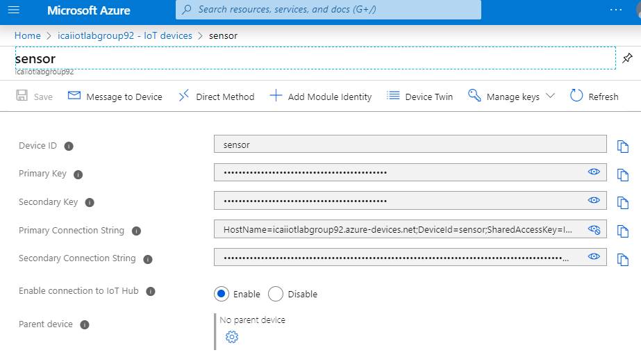
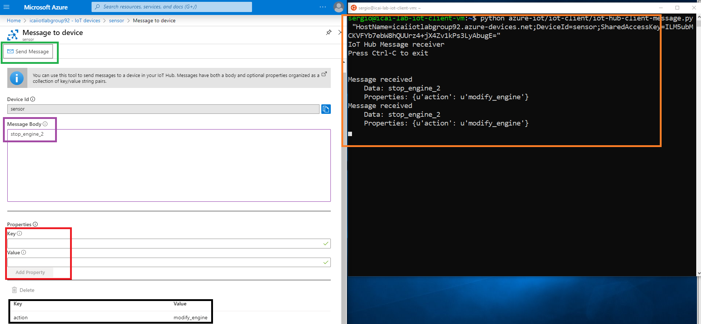

# Sending messages to the device 

One of the key aspects of IoT architectures is the capability of managing and signaling devices from a central platform.
In this lab we will send a manual message to a device and we will show an example piece of code that can react to downstream cloud to device messages. Extending this capability for more complex in-device behaviours would be the logical next step

### Run a python3 script for message reception

In order to get to the Azure Portal facility for sending a message to a device, navigate to the device menu, as shown in the following image and click in the **Message to Device** window in the device menu of Azure IoT Hub.



A new script has been added to the repo to be loaded in the simulated device.
As shown, below, we have run the following script in the simulated device:

```
python3 Azure_IoT_Lab/iot-client/iot-hub-client-message.py "YOUR_DEVICE_CONNECTION_STRING_NOT_THIS_TEXT_PLACEHOLDER"
```
We have composed the message shown below, where we have set the message body to a plain string **stop_engine_2**, as shown in purple. Additionally, we have added a custom property **action** equals **modify_engine**.
Click in **Send Message** as shown in green. The message should be pointed out in the client connection window as highlighted in orange.



### Review the script receiving messages

Take a look at the python3 [script](https://github.com/SeryioGonzalez/Azure_IoT_Lab/blob/master/iot-client/iot-hub-client-message.py) and analyze how bidirectional message communication works.
Note IoT hub will send whatever you indicate it to send. It is up to the device software knowing how to react to those messages. You need to define your own **Hub to Device messaging API** in this way.
