# Visualize Time Series Data with Azure Time Series Insights

Azure Time Series Insights is a fully managed analytics, storage, and visualization service for managing IoT-scale time-series data in the cloud. It provides massively scalable time-series data storage and enables you to explore and analyze billions of events streaming in from all over the world in seconds. Use Time Series Insights to store and manage terabytes of time-series data, explore and visualize billions of events simultaneously, conduct root-cause analysis, and to compare multiple sites and assets.

In this lab you will learn

* how to set up a Time Series Insights environment
* explore
* analyze time series data of your IoT solutions or connected things

## Create Time Series Insights

1. Select **Time Series Insights** in the resource explorer search box of the Azure portal.
2. Selecty the **Subscription** and **Resource Group** used in the lab
3. For **Environment name** select your group nickname **icaiiotlabgroupYX** as resource name. 
4. Select the **Location** to **West Europe**.
5. For **Tier** select **Gen2 (L1)**
6. In the field **Property name** input **iothub-connection-device-id**
7. Create a **Storage Account** using your group nickname and **tsi** at the end
8. Disable **Data Lake Storage Gen2** and **Warm store**
9. Click on **Next: Event Source >** for configuring the IoT Hub that will be sending data to this TSI instance

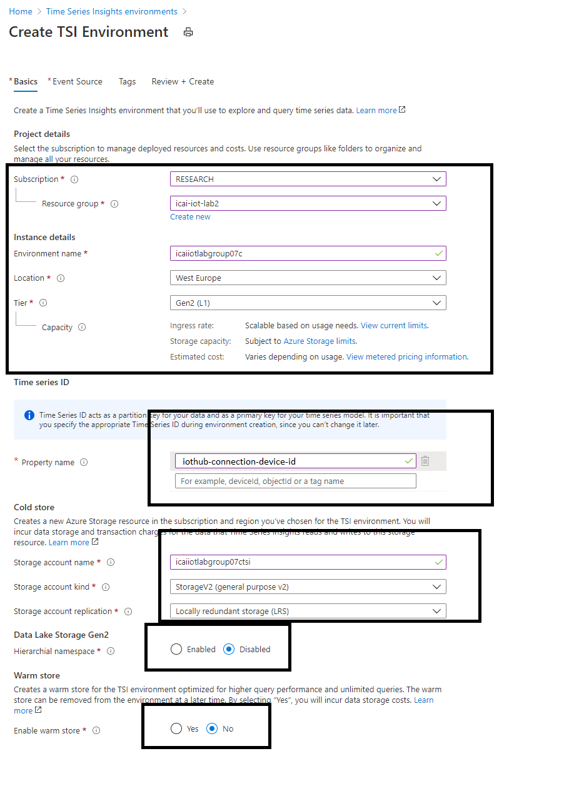

In the next blade, we are going to integrate the existing Azure IoT Hub: 

10. In **Create and event Source?** select **Yes**
11. Select **Source Type** to **IoT Hub** 
12. Give a sample name **iot-hub** 
13. Select your **Subscription** and your existing **IoT Hub name** 
14. Select **IoT Hub access policy name** to **iothubowner** 
15. Create a **New** instance of **IoT Hub consumer group** called **tsi**.
16. Click **Create**

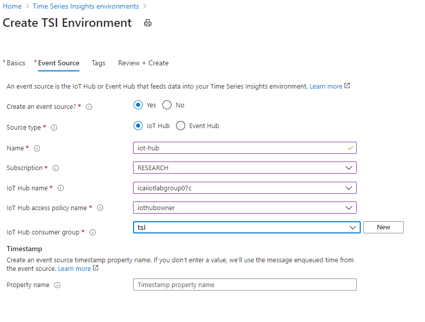

**You cannot see data yet** in Time Series Insights Explorer, since it connects by default to the built-in endpoint in Azure IoT Hub, which is sending nothing there. When we added a route in a previous lab for sending the sensor data to an storage account, the built-in endpoint gets disabled, as you can read in the following link.

[Routing behaviour with built-in endpoint in Azure IoT Hub](https://docs.microsoft.com/es-es/azure/iot-hub/iot-hub-devguide-messages-d2c#built-in-endpoint)

## Enable a Route in Azure IoT Hub to Events Built-in Endpoint

Navigate to the Azure IoT Hub instance created in previous modules. As you did in [module 4](https://github.com/SeryioGonzalez/Azure_IoT_Lab/blob/master/routing/README.md) of this lab with Azure Storage, we need to enable an extra Route to the built-in **events** endpoint, as shown in the following image.

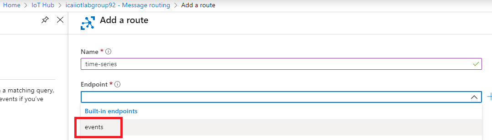

Once the Route has been created, it will be shown as in the following image.
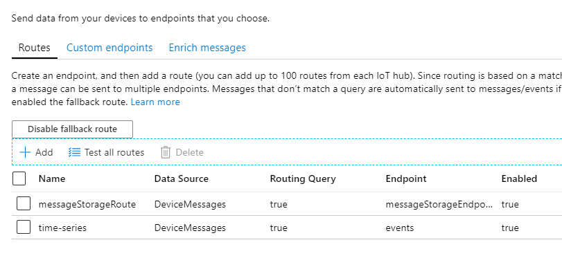

## Time Series Insights Explorer

Once this route has been created, you can go to the Azure Time Series Insights Explorer (AzTSIE). In the AzTSIE click in **Go to Environment** in the following image in order to see the explorer portal.

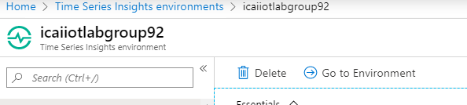

The AzTSIE allows correlating and visualazing data. For this, supposing you have sent traffic from the simulated device to Azure IoT Hub, implement a diagram like the one shown below.

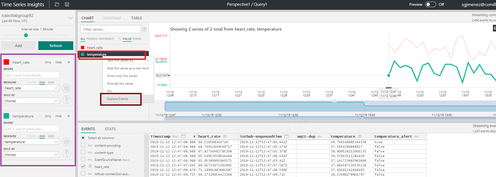

In purple in the left hand side, we can select which metrics we want to monitor. In the simulated device, we configure 2 metrics, **heart_rate** and **temperature**. We can add N additiona metrics by clicking the **Add**, right above the purple highlight square.
We can explore in detail the value of a given metric, by clicking **Explore Events**, as highlighted in brown above.

## Additional capabilities Time Series Insights Explorer

Examples are not related to this very experiment.

Create a perspective by clicking on the image shown below

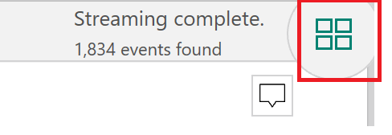

Click **+** to add a new query

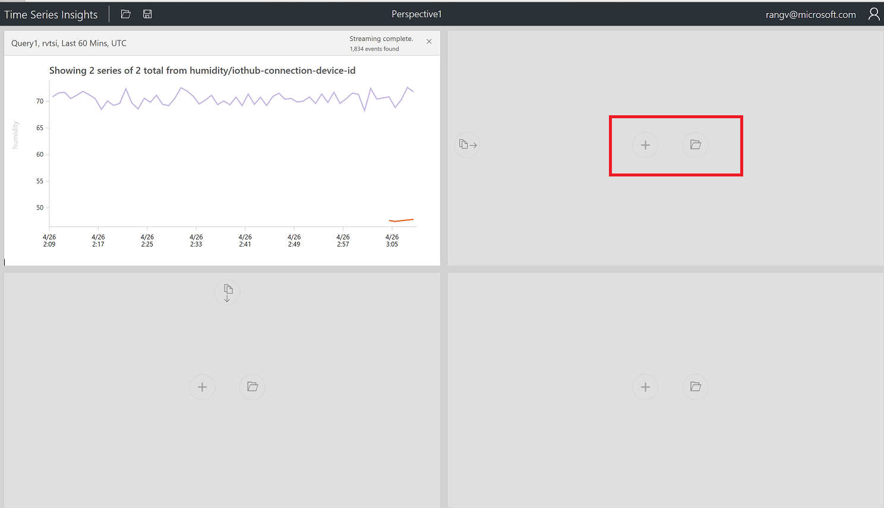

Select an additional visual.

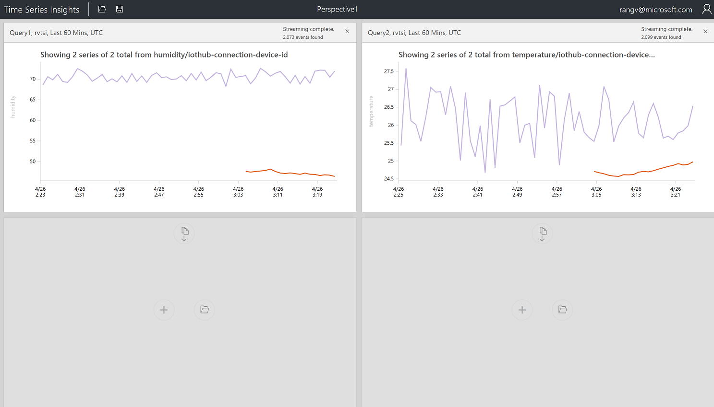

Create a chart by selecting a timeframe with drag feature

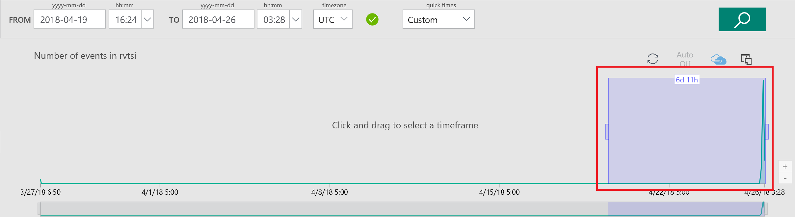

Create a Chart by adding a predicate

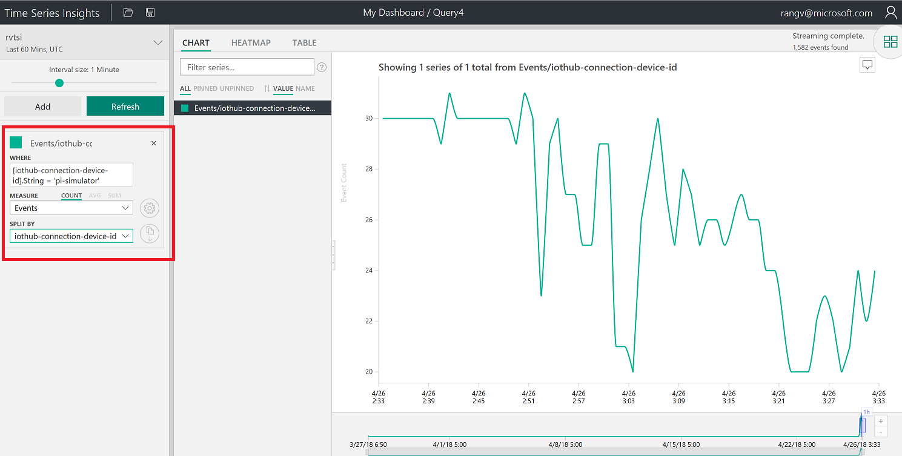

Perspective with 4 different charts and also changed Title

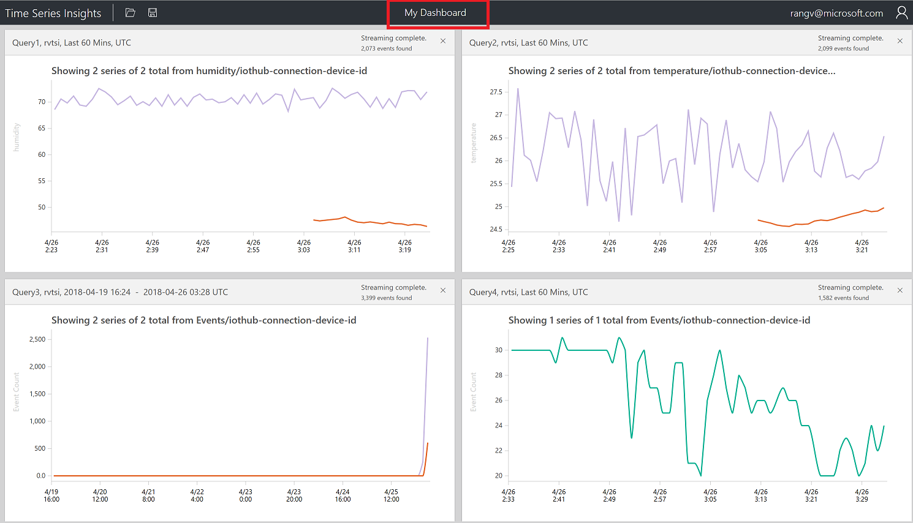

Click on Heatmap

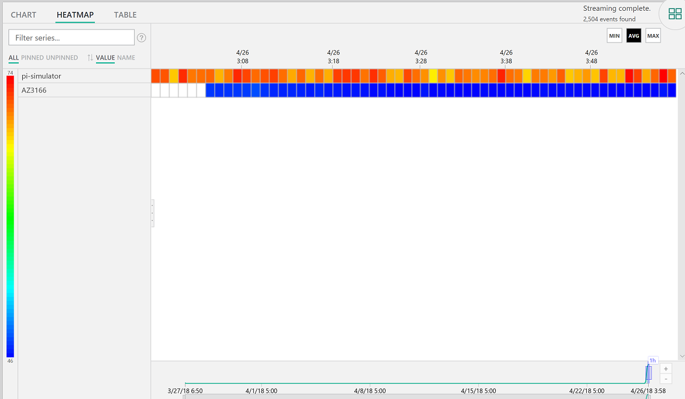

View data in a table

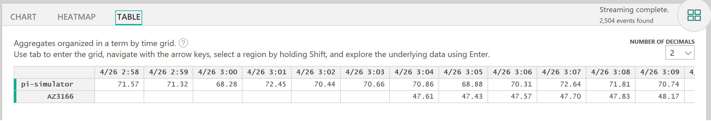

Go to the next module for continuing the lab.
[Go back to the main section](../README.md )
