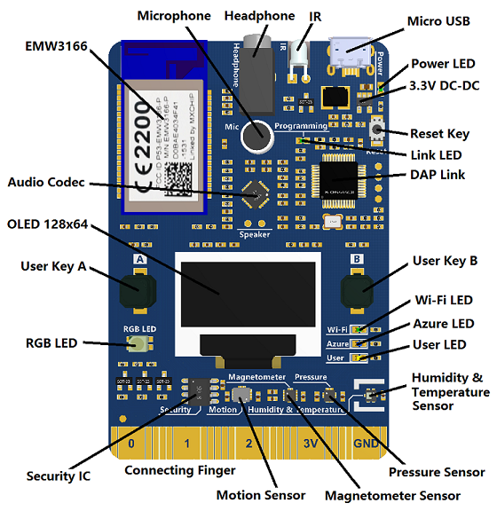

# MXChip Workshop

This workshop is a hands-on lab for getting started building a cloud connected IoT device using the [MXChip Iot DevKit prototyping board](https://microsoft.github.io/azure-iot-developer-kit/) and the [Azure IoT Hub](https://azure.microsoft.com/services/iot-hub/?WT.mc_id=academic-7372-jabenn).

The final project that will be created is an internet connected temperature sensor, with a warning light if the temperature is above a certain threshold. The temperature will be reported to Azure IoT Hub and stored in a [Cosmos DB collection](https://azure.microsoft.com/services/cosmos-db/?WT.mc_id=academic-7372-jabenn). This value can be retrieved via an API built using [Azure functions](https://azure.microsoft.com/services/functions/?WT.mc_id=academic-7372-jabenn). To control the LED, a threshold will be set using another Azure Function API, and this will sync to the device using a [device twin](https://docs.microsoft.com/azure/iot-hub/tutorial-device-twins/?WT.mc_id=academic-7372-jabenn).

| Author | [Jim Bennett](https://github.com/JimBobBennett) |
|:---|:---|
| Target platform   | <ul><li>MXChip</li></ul> |
| Hardware required | <ul><li>[MXChip](https://www.seeedstudio.com/AZ3166-IOT-Developer-Kit.html)</li><li>Micro-USB to USB cable (USB-A or USB-C depending on your computer)</li></ul> |
| Software required | <ul><li>[Visual Studio Code](http://code.visualstudio.com?WT.mc_id=academic-7372-jabenn)</li></ul> |
| Azure Services | <ul><li>[Azure IoT Hub](https://azure.microsoft.com/services/iot-hub/?WT.mc_id=academic-7372-jabenn)</li><li>[Azure Functions](https://azure.microsoft.com/services/functions/?WT.mc_id=academic-7372-jabenn)</li><li>[Azure Cosmos DB](https://azure.microsoft.com/services/cosmos-db/?WT.mc_id=academic-7372-jabenn)</li></ul> |
| Programming Language | <ul><li>C</li><li>C#</li></ul> |
| Prerequisites | You will need to be reasonably proficient at using a computer, including installing software and running commands from a command line or terminal.<br>These labs will use C#.<br>If you want to learn C#, check out these free resources:<br><ul><li>[C# 101 video series on Channel9](hhttps://channel9.msdn.com/Series/CSharp-101/?WT.mc_id=academic-7372-jabenn)</li><li>[Introduction to C# tutorials on Microsoft Docs](https://docs.microsoft.com/dotnet/csharp/tutorials/intro-to-csharp/?WT.mc_id=academic-7372-jabenn)</li></ul><br>You will also need an [Azure subscription](https://github.com/microsoft/iot-curriculum/tree/main/labs/iot/environment_monitor#azure-subscription)<br>If you are new to Azure, check out these free resources:<ul><li>[Azure Fundamentals learning path on Microsoft Learn](https://docs.microsoft.com/learn/paths/azure-fundamentals/?WT.mc_id=academic-7372-jabenn)</li></ul> |
| Date | November 2020 |
| Learning Objectives | <ul><li>Set up IoT Hub</li><li>Send IoT Data from a device to IoT Hub</li><li>Process data from IoT Hub using Azure Functions</li><li>Store data in Cosmos DB</li></ul> |
| Time to complete | 2 hours |

## What is the MXChip

The MXChip is an Arduino compatible prototyping board. It is an all-in-one board with a cortex-M micro-controller, WiFi, an array of sensors including temperature and pressure, LEDs, buttons, a screen, a microphone and headphone port. It is also designed to easily talk to  Azure IoT Hub.



## What is Azure IoT Hub

Azure IoT Hub is an Azure service that allows you to connect, monitor and manage IoT devices at scale, from a few to billions. IoT Hub is an open and flexible cloud platform as a service that supports open-source SDKs and multiple protocols.

You can read more at [azure.microsoft.com/services/iot-hub](https://azure.microsoft.com/services/iot-hub/?WT.mc_id=academic-7372-jabenn)

## Getting started

Before you can work through this lab, you will need some hardware, software and an Azure account.

This workshop has been tested on Windows 10 and macOS Mojave. It should also work on Ubuntu, but this [hasn't been validated yet](https://github.com/jimbobbennett/MXChip-Workshop/issues/1).

### Hardware

This workshop is based on the MXChip Iot DevKit, so you will need to purchase one of these boards. You can do so from:

* [Amazon](https://amzn.to/2CdVgB1)
* [DFRobot](https://www.dfrobot.com/product-1616.html)
* [Seeed](https://www.seeedstudio.com/AZ3166-IOT-Developer-Kit-p-2922.html)

### Software

You will need to install a few applications and tools to be able to program this board:

* [Visual Studio Code](https://code.visualstudio.com/Download/?WT.mc_id=academic-7372-jabenn)
* [Arduino IDE](https://www.arduino.cc/en/Main/Software) - **NOTE** On Windows DO NOT install using the Windows store, instead use the *Windows Installer, for Windows XP and up*.
* [.NET Core SDK](https://dotnet.microsoft.com/download)
* [Azure Functions Core Tools](https://docs.microsoft.com/azure/azure-functions/functions-run-local/?WT.mc_id=academic-7372-jabenn)
* You may need to install a USB driver or configure USB support to communicate with the MXChip.

  * Windows: Download and install the USB driver from [STMicro](http://www.st.com/en/development-tools/stsw-link009.html).

  * macOS: No driver is required for macOS.

  * Linux: Run the following in terminal and logout and login for the group change to take effect:

    ```bash
    # Copy the default rules. This grants permission to the group 'plugdev'
    sudo cp ~/.arduino15/packages/AZ3166/tools/openocd/0.10.0/linux/contrib/60-openocd.rules /etc/udev/rules.d/
    sudo udevadm control --reload-rules

    # Add yourself to the group 'plugdev'
    # Logout and log back in for the group to take effect
    sudo usermod -a -G plugdev $(whoami)
    ```

### Azure account

To use Azure IoT Hub you will need an Azure subscription. If you don't have a subscription you can sign up for free at [azure.microsoft.com/free/](https://azure.microsoft.com/free/?WT.mc_id=academic-7372-jabenn). You will need a credit card for verification purposes only, you will not be billed unless you decide to upgrade your account to a paid offering.

If you are a student aged 18 and up, or teacher and have an email address from an academic institution, you can sign up for the free Azure for Students offer at [azure.microsoft.com/free/students](https://azure.microsoft.com/free/students/?WT.mc_id=academic-7372-jabenn). This gives you the same services and credit as the free account, but you don't need a credit card.

At the time of writing the free account will give you US$200 of free credit to spend on what you like in the first 30 days ($100 for the student account), 12 months of free services, plus a load of services that have tiers that are always free.

For this workshop you can use the free tier of IoT Hub. If you already have an Azure account you can use this, using a free tier IoT Hub.

## The workshop

This workshop is implemented in both C and C#. The code running on the MXChip is in C, the code for the Azure Functions is in C#. The code does not have any error handling, it is intended to be as short as possible to help illustrate how to program the board as opposed to being production ready code.

### The steps

The steps for the workshop are in the [Steps](./Steps) folder.

1. [Configure the MXChip board](./Steps/ConfigureTheBoard.md)
2. [Configure Visual Studio Code](./Steps/ConfigureVSCode.md)
3. [Show the temperature](./Steps/ShowingTheTemperature.md)
4. [Send the temperature to Azure IoT Hub](./Steps/SendingTheTemperature.md)
5. [Store the temperature using Azure Functions and Cosmos DB](./Steps/StoreTheTemperature.md)
6. [Expose the temperature using Azure Functions](./Steps/ExposeTheTemperature.md)
7. [Configure the LED colour threshold using Device Twins](./Steps/ControlTheLEDThreshold.md)
8. [Clean up](./Steps/CleanUp.md)

### The code

You can find the code created in this workshop in the [Code](./Code) folder. This is provided for reference only, you don't need to use this sample code as everything you need to write is covered in the workshop.

* [Final](./Code/Final) - the final code you will create once you complete this workshop.

## Next steps

This workshop is only a taster to get started programming the MXChip board and connecting it to the cloud using Azure Functions and Device Twins.

### Extend the sample

#### Internet-connected fan

If you want to build more, check out [this sample](https://github.com/jimbobbennett/InternetConnectedFan) adding a fan to the set up, turning this on and off as well as controlling the LED when the temperature crosses the threshold.


### Try some more samples

There is a growing catalog of projects from both the Microsoft IoT teams and the community available at [microsoft.github.io/azure-iot-developer-kit/docs/projects/](https://microsoft.github.io/azure-iot-developer-kit/docs/projects/).
