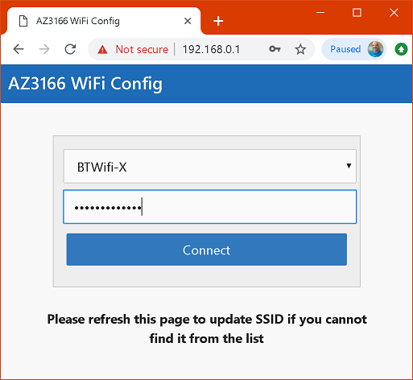

# Configure the MXChip board

Before the board can be used, it will need to be configured to be running the latest firmware and connected to WiFi.

## Plug in the board

Connect the MXChip board to your PC or Mac using the supplied USB cable. Wait a few seconds for the board to boot up.

## Upgrade the firmware

* Download the latest firmware from [aka.ms/devkit/prod/firmware/latest](https://aka.ms/devkit/prod/firmware/latest)
* The MXChip will be mounted as a removable drive. Locate it using Explorer/Finder.
* Drag the firmware `.bin` file to the removable drive. When the file has finished copying the board will automatically reboot and load the new firmware.

## Configure WiFi

The MXChip board has built in WiFi, and this needs to be configured to connect to your local WiFi.

* Put the board into WiFi configuration mode by holding button **B** and pressing and releasing the **Reset** button. Then release button **B**. The board will reboot into WiFI Configuration mode.
* The MXChip is now a WiFi router, and the SSID will be displayed on the screen. It will be something like `AZ-04786301b8e1`. Connect to this WiFi SSID, and open a web browser.
* Open the IP address shown on the display, for example `192.168.0.1`

* Select the SSID of the WiFi you want to connect to, enter the password if needed and click **Connect**. This SSID and password is stored in the EEPROM on the board.
* The board will reboot and try to connect. If WiFi connection is successful the board will display the current firmware version and the LEDs will flash.
* The board will no longer be publishing an SSID, so the WiFi connection you made to the board will be dropped. Reconnect your normal WiFi.

In this step you updated the firmware on the MXChip board, and configured the Wife. Now move on to the [next step](./ConfigureVSCode.md) where you will configure Visual Studio code ready for IoT development.