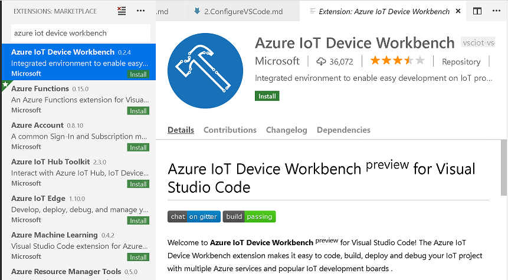
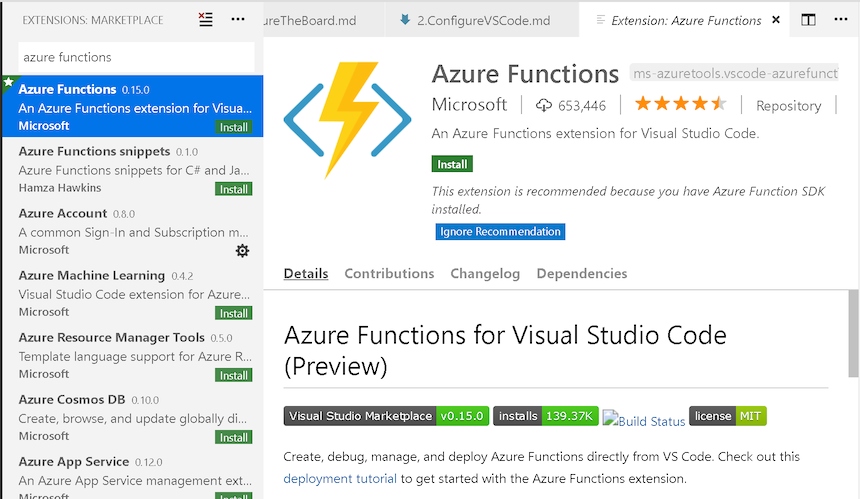
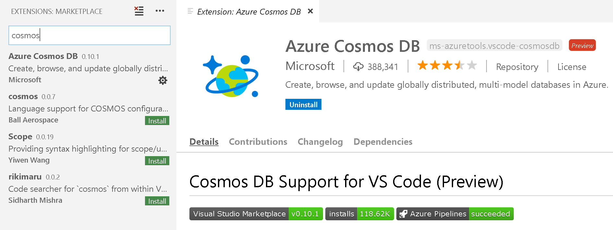
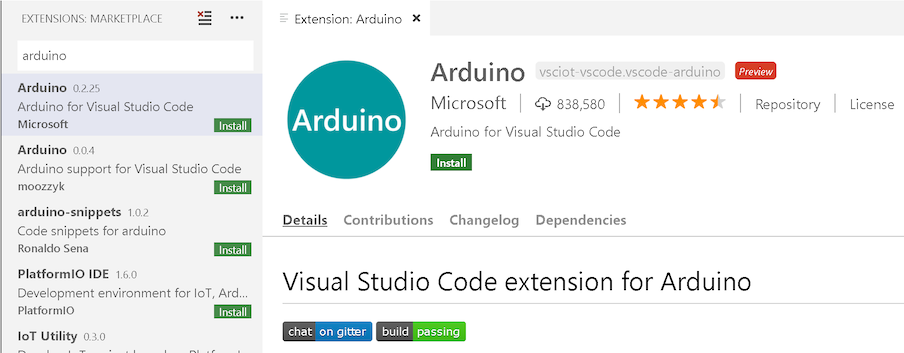
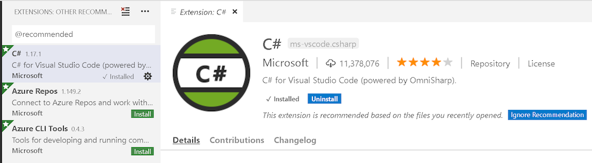
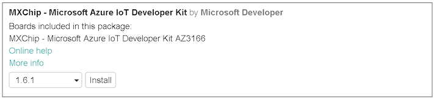

# Configure Visual Studio Code

In the [previous step](./ConfigureTheBoard.md) you configured the MXChip board. In this step you configure Visual Studio Code ready to work with the board.

Visual Studio Code can be used to code the MXChip, including pushing the compiled code to the board by automating the Arduino IDE. It can also be used to publish code to Azure and configure services.

## Install the IoT extension

Visual Studio Code has a wealth of extensions that provide different capabilities to the editor. There is one designed for IoT.

* Launch Visual Studio Code
* Select **Extensions** from the side bar
* Search for the *Azure IoT Device Workbench* extension and install it

  

* Search for the *Azure Functions* extension and install it.

  

* Search for the *Azure Cosmos DB* extension and install it.

  

  You will need to restart Visual Studio Code after installing this extension.

* Search for the *Arduino* extension and install it. Make sure to install the one from Microsoft as there is more than one extension called *Arduino*.

  

* Search for the *C#* extension and install it.

  

## Configure Visual Studio Code for IoT development

* Open the command palette
  * On Windows or Linux use Ctrl+Shift+P.
  * On macOS use Cmd+Shift+P
* Type `Preferences` and select *Preferences: Open Settings (JSON)*
* Add the following Arduino settings:
  * Windows

    ```JSON
    "arduino.path": "C:\\Program Files (x86)\\Arduino",
    "arduino.additionalUrls": "https://raw.githubusercontent.com/VSChina/azureiotdevkit_tools/master/package_azureboard_index.json"
    ```

  * macOS

    ```JSON
    "arduino.path": "/Applications",
    "arduino.additionalUrls": "https://raw.githubusercontent.com/VSChina/azureiotdevkit_tools/master/package_azureboard_index.json"
    ```

  * Linux

    ```JSON
    "arduino.path": "/home/{username}/Downloads/arduino-1.8.5",
    "arduino.additionalUrls": "https://raw.githubusercontent.com/VSChina/azureiotdevkit_tools/master/package_azureboard_index.json"
    ```

  > If you haven't edited JSON files before, these are comma separated entries of key value pairs, with keys separated from values with a colon. You will need to add a comma to the end of the line before the inserted settings.

* Open the command palette and select *Arduino: Board Manager*. Search for `MXChip` and install the latest version.

  

* Restart Visual Studio Code
* From the command palette select *Arduino: Board Config*. Select the *MXChip AZ3116* board.
* From the command palette select *Arduino: Select Serial Port".
  * On Windows, select *COM5 STMicroElectronics*
  * On macOS, select */dev/cu.usbmodem<xxxx>*

  > This option will only be available when you have a board plugged in. If you are working through these steps to set up for a workshop, then you won't be able to complete tis step as the option won't be available.

<hr>

In this step you installed a number of extension in Visual Studio Code for .NET, Azure Functions and IoT development, and configured it to talk to the MXChip board. Now move on to the [next step](./ShowingTheTemperature.md) where you will write your first piece of software to run on the MXChip board.