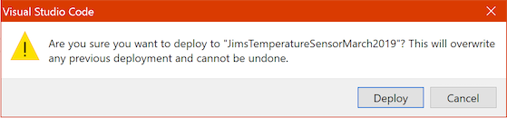

# Expose the temperature using Azure Functions

In the [previous step](./StoreTheTemperature.md) you wrote an Azure Function that was triggered by messages send from the MXChip, and stored the temperature values in Cosmos DB. In this step you will create another Azure Function to expose this data over a REST endpoint.

## Build a REST API

Azure Functions can be [triggered by HTTP requests](https://docs.microsoft.com/azure/azure-functions/functions-bindings-http-webhook/?WT.mc_id=academic-7372-jabenn), making them an ideal way to build a REST endpoint for your applications.

### Create the HTTP Trigger

* From Visual Studio Code, open the `IoTHubTrigger.cs` file from the `Functions` folder.
* Add three new `using` directives to the top of the file, below the other `using` directives.

  ```cs
  using Microsoft.Azure.WebJobs.Extensions.Http;
  using Microsoft.AspNetCore.Mvc;
  using Microsoft.AspNetCore.Http;
  ```

* Add a new `static` method to the `IoTHubTrigger1` class called `GetTemperature`.

  ```cs
  public static IActionResult GetTemperature(
    [HttpTrigger(AuthorizationLevel.Anonymous, "get", Route = "temperature/{devicename}")] HttpRequest req,
    ILogger log)
  {
  }
  ```

  The `HttpTrigger` attribute on the `HttpRequest` tells the functions runtime that this function should be triggered by an HTTP request. This request allows anonymous authorization, meaning anyone can call it. Security is outside the scope of this workshop, but you can read more on securing Azure Function apps in the [docs](https://docs.microsoft.com/azure/azure-functions/functions-bindings-http-webhook#trigger---usage?WT.mc_id=academic-7372-jabenn).

  This trigger only responds to GET requests, and is accessed by calling `https://<your URL>/api/temperature/<devicename>`, and this is defined in the `Route` parameter.

  The `{devicename}` is a wildcard parameter - it will handle any `GET` calls to `/temperature/<something>` and pass the last part of the URL around in a parameter called `{devicename}`, which will be used in additional bindings later in this step.
  
  For example, if your Azure Functions app was called `MyTemperatureSensor` and you wanted to get the temperature for a device called `MyDevice`, the URL would be `https://MyTemperatureSensor.azurewebsites.net/api/temperature/MyDevice`.

* Add a `FunctionName` attribute to this function to expose it to the functions runtime.

  ```cs
  [FunctionName("GetTemperature")]
  public static IActionResult GetTemperature(
    ...
  ```

* Add a `CosmosDB` binding to the function. Use the same collection details as for the IoT Hub trigger, but set the `Id` to be the `{devicename}`. Instead of being an output binding, this will make this parameter an input binding.

  ```cs
  public static IActionResult GetTemperature(
    [HttpTrigger(AuthorizationLevel.Anonymous, "get", Route = "temperature/{devicename}")] HttpRequest req,
    [CosmosDB(databaseName: "IoTData",
              collectionName: "Temperatures",
              ConnectionStringSetting = "cosmosDBConnectionString",
              Id = "{devicename}")] TemperatureItem temperatureItem,
    ILogger log)
    ...
  ```

  This binding will search for a document inside the Cosmos DB collection with an Id that matches the `{devicename}` parameter, essentially binding it to the REST resource from the URL. For example, if you issue a GET request to `https://MyTemperatureSensor.azurewebsites.net/api/temperature/MyDevice`, it will extract a document from the collection with the Id `MyDevice`. The parameter will then be that document.

* Inside the function return the document as an HTTP response.

  ```cs
  return new OkObjectResult(temperatureItem);
  ```

  `OkObjectResponse` returns the object as JSON as the body of a response with a status of 200.

### Deploy the HTTP trigger

* From the Visual Studio Code command palette, select *Azure IoT Device Workbench: Deploy to Azure...*
* The palette will show you are deploying the Azure Functions app, so press enter to continue
* The deployment will begin. You will be asked if you want to overwrite the existing deployment, so click **Deploy**.
  
  

  The function app will be deployed, and this should take a few seconds.

* From Visual Studio Code, select the *Azure* tab.

* Expand the *FUNCTIONS* section.

* Expand your subscription.

* Right-click on the function app you created earlier and select *Restart*.

## Test the API

* From a web browser, open `https://<your URL>/api/temperature/<devicename>` where `<your URL>` is the URL of your Azure Function app and `<devicename>` is the name you gave your IoT device. You can find the URL of the Azure Function app from the *Overview* page and it will be in the format `<your function app name>.azurewebsites.net`. If you need to double check the IoT Device name, you can get it from the document in the Cosmos DB collection.
* The output will be a JSON document containing the temperature and threshold:

  ```json
  {
    "id":"JimsDevice1",
    "type":"Latest",
    "temperature":26.0,
    "threshold":25.0
  }
  ```

<hr>

The full code for the new Azure Function is below:

```cs
[FunctionName("GetTemperature")]
public static IActionResult GetTemperature(
  [HttpTrigger(AuthorizationLevel.Anonymous, "get", Route = "temperature/{devicename}")] HttpRequest req,
  [CosmosDB(databaseName: "IoTData",
            collectionName: "Temperatures",
            ConnectionStringSetting = "cosmosDBConnectionString",
            Id = "{devicename}")] TemperatureItem temperatureItem,
  ILogger log)
{
  return new OkObjectResult(temperatureItem);
}
```

<hr>

In this step you added an Azure Function REST API to expose the temperature data. Now move on to the [next step](./ControlTheLEDThreshold.md) where you will configure the LED colour threshold using Device Twins.